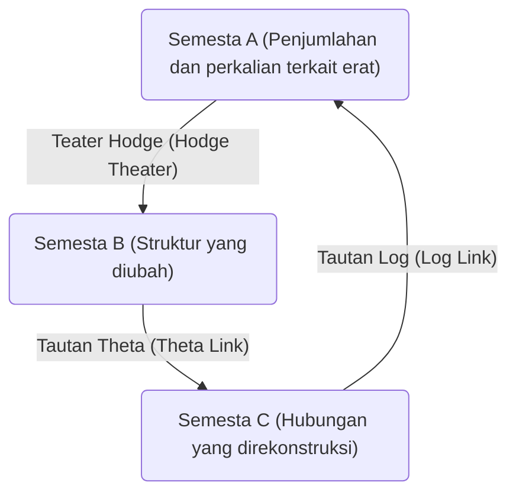
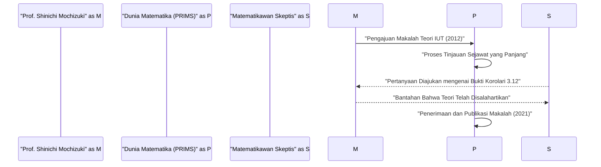

# Pendahuluan: Apa itu [Konjektur ABC](https://kenji.blog/p/abc-conjecture/)?

Di bidang teori bilangan, ada banyak masalah yang belum terpecahkan, tetapi di antaranya yang paling dianggap penting adalah **[Konjektur ABC](https://kenji.blog/p/abc-conjecture/)** (ABC Conjecture). Konjektur ini dirumuskan secara independen oleh Joseph Oesterlé dan David Masser pada tahun 1985.

[Konjektur ABC](https://kenji.blog/p/abc-conjecture/) mengisyaratkan hubungan yang mendalam antara penjumlahan dan perkalian (faktorisasi prima) dari bilangan bulat. Secara sekilas, konjektur ini menyatakan sifat menakjubkan yang tersembunyi di balik persamaan sederhana $a + b = c$.

## Definisi Ketat dari [Konjektur ABC](https://kenji.blog/p/abc-conjecture/)

Pertimbangkan pasangan bilangan bulat positif koprima $(a, b, c)$ yang memenuhi $a + b = c$. Di sini, **radikal** (radical) dari bilangan bulat $n$ didefinisikan sebagai $\text{radikal}(n)$. Ini adalah produk dari faktor prima yang berbeda dari $n$.

$$ \text{radikal}(n) = \prod_{p | n} p $$

[Konjektur ABC](https://kenji.blog/p/abc-conjecture/) mengklaim bahwa, untuk setiap $\epsilon > 0$, hanya ada sejumlah terhingga dari pasangan bilangan bulat positif koprima $(a, b, c)$ yang memenuhi hal berikut:

$$ c > \text{radikal}(abc)^{1 + \epsilon} $$

Ketidaksamaan ini berarti bahwa jika $a$ dan $b$ memiliki banyak faktor prima yang kecil, jumlahnya, $c$, biasanya memiliki faktor prima yang besar (yaitu, $\text{radikal}(c)$ menjadi besar). Ini menunjukkan bahwa dua operasi paling dasar dalam matematika, penjumlahan dan perkalian, saling membatasi dengan kuat.

# Kemunculan Teori Teichmüller Antar-Semesta (Teori IUT)

Pembuktian [Konjektur ABC](https://kenji.blog/p/abc-conjecture/) telah membingungkan para matematikawan selama bertahun-tahun, tetapi pada tahun 2012, Profesor Shinichi Mochizuki dari Universitas Kyoto menerbitkan bukti dari konjektur ini menggunakan kerangka matematika yang sama sekali baru yang disebut **Teori Teichmüller Antar-Semesta** (Inter-Universal Teichmüller Theory, disingkat Teori IUT).

Teori IUT secara mendasar merekonstruksi kerangka matematika konvensional (teori himpunan dan geometri aljabar standar), dan karena kompleksitas dan kebaruannya, teori ini memberikan kejutan besar bagi dunia matematika.

## Inti dari Teori IUT: Komunikasi Antar-Semesta

Gagasan paling inovatif dari Teori IUT adalah konsep mentransmisikan informasi antara **semesta matematika** (mathematical universes) yang berbeda. Dalam matematika biasa, semuanya terjadi di dalam satu semesta yang tetap (sebuah sistem aksioma atau model teori himpunan), tetapi Profesor Mochizuki memisahkan struktur penjumlahan dan perkalian, serta menempatkan masing-masing ke dalam semesta yang berbeda.

Gambar di atas secara sederhana menunjukkan konsep transmisi informasi antara semesta yang berbeda dalam Teori IUT. Saat membandingkan dan mentransmisikan struktur antar semesta yang berbeda, muncul semacam "distorsi" atau "ketidakpastian". Teori IUT menyediakan kerangka kerja yang megah untuk secara presisi mengevaluasi dan mengkuantifikasi ketidakpastian ini.

### Frobenioid dan Teater Hodge

Konsep-konsep penting yang menyusun Teori IUT meliputi **Frobenioid** (Frobenioid) dan **Teater Hodge** (Hodge Theater). Ini adalah mekanisme untuk menyandikan informasi teoretis bilangan secara geometris melalui tindakan grup Galois absolut dan grup fundamental dari lapangan bilangan.

$$ \Theta \text{-link} : \mathcal{F}^{\circledast} \xrightarrow{\sim} \mathcal{F}^{\odot} $$

Tautan theta ($\Theta$-link) berperan mentransmisikan informasi monodromi spesifik (informasi mengenai nilai fungsi theta) di antara Teater Hodge yang berbeda. Tidak seperti struktur teoretis cincin konvensional (isomorfisme yang mempertahankan baik penjumlahan maupun perkalian), tautan ini secara parsial mempertahankan hanya struktur perkalian sambil secara sengaja "menghancurkan" lalu merekonstruksi struktur penjumlahan.

# Konsekuensi Mengejutkan dari [Konjektur ABC](https://kenji.blog/p/abc-conjecture/)

Jika [Konjektur ABC](https://kenji.blog/p/abc-conjecture/) terbukti sepenuhnya (oleh Teori IUT atau metode lainnya), banyak teorema penting dalam teori bilangan akan segera diturunkan. Mari kita bandingkan ini dengan **Konjektur Mordell** (sekarang dikenal sebagai Teorema Faltings) dan **[Teorema Terakhir Fermat](https://kenji.blog/p/fermats-last-theorem/)**.

## Aplikasi pada [Teorema Terakhir Fermat](https://kenji.blog/p/fermats-last-theorem/)

[Teorema Terakhir Fermat](https://kenji.blog/p/fermats-last-theorem/) menyatakan bahwa tidak ada pasangan bilangan bulat positif $(x, y, z)$ yang memenuhi $x^n + y^n = z^n$ untuk $n \ge 3$. Itu dibuktikan oleh [Andrew Wiles](https://kenji.blog/p/wiles/) pada tahun 1995, tetapi menggunakan matematika yang sangat maju dan kompleks.

Jika kita mengasumsikan [Konjektur ABC](https://kenji.blog/p/abc-conjecture/) benar, secara mengejutkan, [Teorema Terakhir Fermat](https://kenji.blog/p/fermats-last-theorem/) (setidaknya untuk $n$ yang cukup besar) dapat dibuktikan hanya dalam beberapa baris.

Misalkan $x^n + y^n = z^n$ dan $(x, y, z)$ adalah koprima. Menerapkan [Konjektur ABC](https://kenji.blog/p/abc-conjecture/) ke $a=x^n$, $b=y^n$, $c=z^n$,

$$ z^n < \text{radikal}(x^n y^n z^n)^{1+\epsilon} = \text{radikal}(xyz)^{1+\epsilon} \le (xyz)^{1+\epsilon} < (z^3)^{1+\epsilon} $$

Jika $\epsilon$ diambil cukup kecil, dan ketika $n$ lebih besar dari $3(1+\epsilon)$ (yaitu, sekitar $n \ge 4$), ketidaksamaan ini menyebabkan kontradiksi. Oleh karena itu, kita dapat segera melihat bahwa tidak ada solusi ketika $n$ besar. Dengan cara ini, [Konjektur ABC](https://kenji.blog/p/abc-conjecture/) bertindak sebagai **kunci master** (master key) yang kuat dalam teori bilangan.

# Penerimaan dan Perdebatan Teori IUT di Dunia Matematika

Sejak publikasi makalah tersebut pada tahun 2012, Teori IUT telah menjadi subjek perdebatan sengit di dunia matematika. Alasan utamanya adalah bahwa konsep dan notasi baru yang digunakan untuk membangun teori tersebut sangat banyak sehingga bahkan bagi para pakar matematika yang ada, dibutuhkan waktu bertahun-tahun untuk memahaminya.

Beberapa matematikawan terkemuka (seperti Peter Scholze dan Jakob Stix) menyatakan keprihatinan bahwa ada lompatan di bagian inti dari teori tersebut (terutama dalam bukti "Korolari 3.12"). Di sisi lain, Profesor Mochizuki dan para peneliti di sekitarnya berpendapat bahwa kritik ini didasarkan pada kesalahpahaman karena mencoba menafsirkan paradigma fundamental Teori IUT (perbandingan struktur lintas semesta) dalam kerangka kerja konvensional.

Pada tahun 2021, makalah Profesor Mochizuki secara resmi diterbitkan di jurnal khusus "PRIMS" yang diterbitkan oleh Lembaga Penelitian Ilmu Matematika Universitas Kyoto (RIMS). Namun, konsensus lengkap dari seluruh komunitas matematika belum tercapai, dan dialog seputar teori ini masih berlanjut hari ini.

# Kesimpulan dan Prospek Masa Depan

[Konjektur ABC](https://kenji.blog/p/abc-conjecture/) dan Teori Teichmüller Antar-Semesta adalah salah satu drama terbesar dalam matematika abad ke-21. Kedalaman tak terduga dari konsep paling sederhana yang dipelajari di sekolah dasar, penjumlahan dan perkalian, kini menguji batas-batas kecerdasan manusia.

Apakah Teori IUT akan benar-benar membuka cakrawala baru dalam matematika, atau akankah itu memerlukan revisi lebih lanjut? Akan memakan banyak waktu dan penelitian dari generasi baru matematikawan sebelum kesimpulan akhir dicapai. Namun, visi yang diajukan oleh teori ini, yaitu **menghubungkan semesta matematika yang berbeda**, tidak diragukan lagi akan terus memberikan inspirasi besar bagi perkembangan matematika di masa depan.
