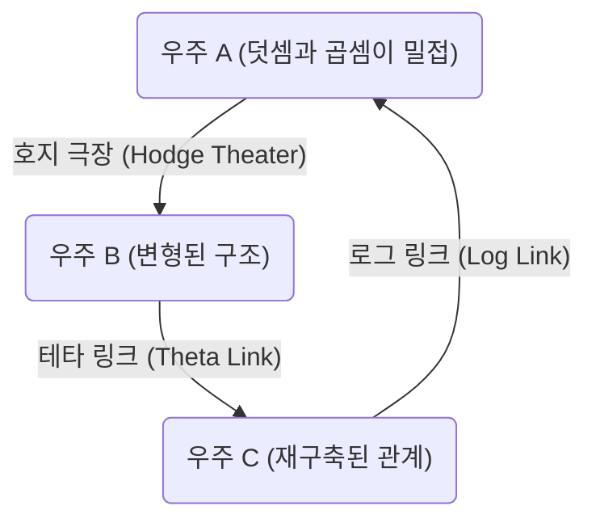
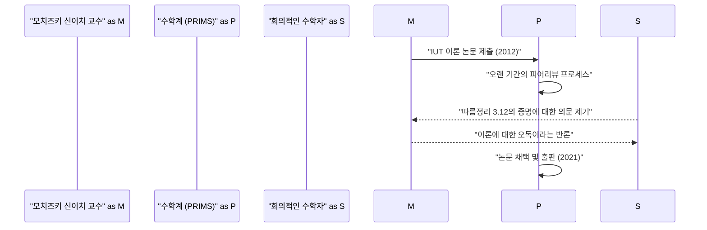

# 서론: ABC 추측이란 무엇인가?

정수론 분야에 있어서 미해결 문제는 많이 존재하지만, 그 중에서도 특히 중요시되어 온 것이 **ABC 추측** (ABC Conjecture)입니다. 이 추측은 1985년에 조제프 외스테를레(Joseph Oesterlé)와 데이비드 매서(David Masser)에 의해 독립적으로 공식화되었습니다.

ABC 추측은 정수의 덧셈과 곱셈(소인수분해) 사이의 깊은 관계성을 시사하는 것입니다. 언뜻 보기에 단순한 방정식 $a + b = c$ 에 숨겨진, 놀라운 성질에 대해 서술하고 있습니다.

## ABC 추측의 엄밀한 정의

서로소인 양의 정수 쌍 $(a, b, c)$ 로 $a + b = c$ 를 만족하는 것을 생각합니다. 여기서 정수 $n$ 의 **근기** (radical)를 $\text{근기}(n)$ 으로 정의합니다. 이것은 $n$ 의 서로 다른 소인수의 곱입니다.

$$ \text{근기}(n) = \prod_{p | n} p $$

ABC 추측은 임의의 $\epsilon > 0$ 에 대하여, 다음을 만족하는 서로소인 양의 정수 쌍 $(a, b, c)$ 는 유한개 밖에 존재하지 않는다는 주장입니다.

$$ c > \text{근기}(abc)^{1 + \epsilon} $$

이 부등식은 $a$ 와 $b$ 가 많은 작은 소인수를 가질 경우, 그들의 합인 $c$ 는 통상적으로 큰 소인수를 가진다(즉 $\text{근기}(c)$ 가 커진다)는 것을 의미하고 있습니다. 덧셈과 곱셈이라는 수학의 가장 기본적인 두 가지 연산이 서로 강하게 제약하고 있다는 것을 보여주는 것입니다.

# 우주 간 타이히뮐러 이론(IUT 이론)의 등장

ABC 추측의 증명은 오랜 세월 동안 수학자들을 괴롭혀 왔습니다만, 2012년 교토 대학의 모치즈키 신이치 교수가 **우주 간 타이히뮐러 이론** (Inter-Universal Teichmüller Theory, 약칭 IUT 이론)이라는 전혀 새로운 수학적 틀을 이용하여 이 추측의 증명을 발표했습니다.

IUT 이론은 기존의 수학적 틀(집합론이나 표준적인 대수기하학)을 근본부터 재구축하는 것으로, 그 난해함과 참신함으로 인해 수학계에 큰 충격을 주었습니다.

## IUT 이론의 핵심: 우주 간의 통신

IUT 이론의 가장 혁신적인 아이디어는 서로 다른 **수학적 우주** (mathematical universes) 사이에서 정보를 전달한다는 개념입니다. 통상적인 수학에서는 모든 것이 하나의 고정된 우주(공리계나 집합론의 모델) 안에서 이루어지지만, 모치즈키 교수는 덧셈과 곱셈의 구조를 분리하고 각각을 다른 우주에 배치했습니다.

위의 그림은 IUT 이론에 있어서 서로 다른 우주 간의 정보 전달 개념을 단순화하여 보여줍니다. 서로 다른 우주 간에 구조를 비교하고 전달할 때, 일종의 "왜곡"이나 "불확정성"이 발생합니다. IUT 이론은 이 불확정성을 정밀하게 평가하고 정량화하기 위한 장대한 틀을 제공합니다.

### 프로베니오이드와 호지 극장

IUT 이론을 구성하는 중요한 개념으로 **프로베니오이드** (Frobenioid)와 **호지 극장** (Hodge Theater)이 있습니다. 이것들은 대수체의 절대 갈루아 군이나 기본군의 작용을 통해 정수론적인 정보를 기하학적으로 인코딩하는 구조입니다.

$$ \Theta \text{-링크} : \mathcal{F}^{\circledast} \xrightarrow{\sim} \mathcal{F}^{\odot} $$

테타 링크($\Theta$-link)는 서로 다른 호지 극장 사이에서 특정한 모노드로미 정보(테타 함수의 값에 관한 정보)를 전달하는 역할을 수행합니다. 이 링크는 기존의 환론적인 구조(덧셈과 곱셈을 모두 보존하는 동형사상)와는 달리, 곱셈 구조만을 부분적으로 보존하면서 덧셈 구조를 의도적으로 "파괴"하고, 그리고 재구축합니다.

# ABC 추측으로부터 얻어지는 경이로운 귀결

만약 ABC 추측이 (IUT 이론에 의해서든, 다른 방법에 의해서든) 완전히 증명될 경우, 정수론에 있어서 수많은 중요한 정리들이 단번에 도출되게 됩니다. 이것을 **모델 추측** (현재는 팔팅스의 정리로 알려짐)이나 **페르마의 마지막 정리** 등과 비교해 봅시다.

## 페르마의 마지막 정리로의 응용

페르마의 마지막 정리는 $n \ge 3$ 일 때, $x^n + y^n = z^n$ 을 만족하는 양의 정수 쌍 $(x, y, z)$ 는 존재하지 않는다는 것입니다. 앤드루 와일즈에 의해 1995년에 증명되었지만, 매우 고도화되고 복잡한 수학이 사용되었습니다.

만약 ABC 추측이 옳다고 가정하면, 놀랍게도 페르마의 마지막 정리(적어도 $n$ 이 충분히 큰 경우)는 단 몇 줄만으로 증명될 수 있습니다.

$x^n + y^n = z^n$ 이라 하고, $(x, y, z)$ 가 서로소라고 가정합니다. ABC 추측을 $a=x^n$, $b=y^n$, $c=z^n$ 에 적용하면,

$$ z^n < \text{근기}(x^n y^n z^n)^{1+\epsilon} = \text{근기}(xyz)^{1+\epsilon} \le (xyz)^{1+\epsilon} < (z^3)^{1+\epsilon} $$

$\epsilon$ 을 충분히 작게 취하면, $n$ 이 $3(1+\epsilon)$ 보다 큰 경우 (즉 $n \ge 4$ 정도), 이 부등식은 모순을 도출합니다. 따라서 $n$ 이 큰 경우에는 해가 존재하지 않는다는 것을 즉시 알 수 있습니다. 이와 같이 ABC 추측은 정수론의 강력한 **마스터키** (master key)로서 기능하는 것입니다.

# IUT 이론의 수학계에서의 수용과 논쟁

2012년 논문 발표 이후, IUT 이론은 수학계에서 격렬한 논쟁의 표적이 되고 있습니다. 그 주된 이유는 이론 구축에 사용된 새로운 개념이나 기호가 매우 방대하여, 기존의 수학 전문가라 하더라도 이해하는 데 수년의 세월이 필요하기 때문입니다.

일부 저명한 수학자(피터 숄체나 제이콥 스틱스 등)는 이론의 핵심이 되는 부분(특히 "따름정리 3.12"의 증명)에 논리적 비약이 있다는 우려를 표명했습니다. 한편, 모치즈키 교수와 그 주변의 연구자들은 이러한 비판이 IUT 이론의 근본적인 패러다임(우주를 초월한 구조의 비교)을 기존의 틀에서 해석하려고 한 데서 비롯된 오해라고 반론하고 있습니다.

2021년, 모치즈키 교수의 논문은 교토 대학 수리해석연구소(RIMS)가 발행하는 전문지 "PRIMS"에 정식으로 게재되었습니다. 그러나 수학계 전체로서의 완전한 합의에는 이르지 못했으며, 이 이론을 둘러싼 대화는 현재도 계속되고 있습니다.

# 결론과 미래를 향한 전망

ABC 추측과 우주 간 타이히뮐러 이론은 21세기 수학에 있어서 최대의 드라마 중 하나입니다. 덧셈과 곱셈이라는 초등학생 때 배우는 가장 단순한 개념의 헤아릴 수 없는 깊이가 지금 바로 인류 지능의 한계를 시험하고 있습니다.

IUT 이론이 진정으로 새로운 수학의 지평을 여는 것인지, 아니면 추가적인 수정이 필요한 것인지. 그 최종적인 결론이 나오기까지는 아직 많은 시간과 새로운 세대의 수학자들에 의한 연구가 필요할 것입니다. 그러나 이 이론이 제기한 **서로 다른 수학적 우주를 연결한다** 는 비전은 틀림없이 향후 수학의 발전에 큰 영감을 계속해서 줄 것입니다.
