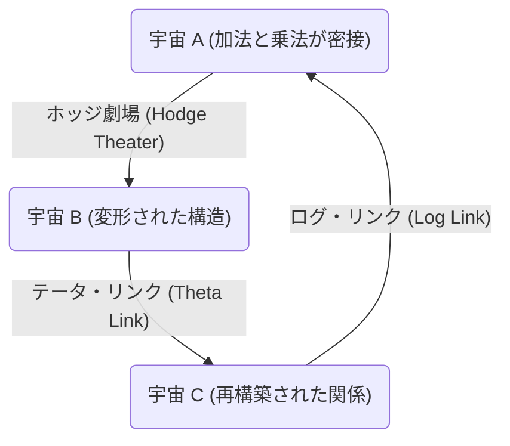
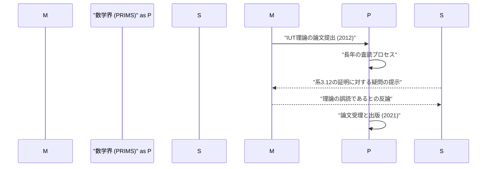

# 序論：[ABC予想](https://kenji.blog/p/abc-conjecture/)とは何か？

数論の分野において、未解決問題は数多く存在しますが、その中でも特に重要視されてきたのが **[ABC予想](https://kenji.blog/p/abc-conjecture/)** （ABC Conjecture）です。この予想は、1985年にジョゼフ・オステルレ（Joseph Oesterlé）とデイヴィッド・マッサー（David Masser）によって独立に定式化されました。

[ABC予想](https://kenji.blog/p/abc-conjecture/)は、整数の加法と乗法（素因数分解）の間の深い関係性を示唆するものです。一見すると単純な方程式 $a + b = c$ に隠された、驚くべき性質について述べています。

## [ABC予想](https://kenji.blog/p/abc-conjecture/)の厳密な定義

互いに素な正の整数の組 $(a, b, c)$ で、$a + b = c$ を満たすものを考えます。ここで、整数 $n$ の **根基** （radical）を $\text{rad}(n)$ と定義します。これは $n$ の互いに異なる素因数の積です。

$$ \text{rad}(n) = \prod_{p | n} p $$

[ABC予想](https://kenji.blog/p/abc-conjecture/)は、任意の $\epsilon > 0$ に対して、次を満たす互いに素な正の整数の組 $(a, b, c)$ は有限個しか存在しない、という主張です。

$$ c > \text{rad}(abc)^{1 + \epsilon} $$

この不等式は、 $a$ と $b$ が多くの小さな素因数を持つ場合、それらの和である $c$ は通常、大きな素因数を持つ（つまり $\text{rad}(c)$ が大きくなる）ことを意味しています。加法と乗法という、数学の最も基本的な二つの演算が、互いに強く制約し合っていることを示しているのです。

# 宇宙際タイヒミュラー理論（IUT理論）の登場

[ABC予想](https://kenji.blog/p/abc-conjecture/)の証明は長年にわたり数学者たちを悩ませてきましたが、2012年、京都大学の望月新一教授が **宇宙際タイヒミュラー理論** （Inter-Universal Teichmüller Theory、略称IUT理論）という全く新しい数学的枠組みを用いて、この予想の証明を発表しました。

IUT理論は、従来の数学の枠組み（集合論や標準的な代数幾何学）を根本から再構築するものであり、その難解さと斬新さから、数学界に大きな衝撃を与えました。

## IUT理論の核心：宇宙間の通信

IUT理論の最も革新的なアイデアは、異なる **数学的宇宙** （mathematical universes）の間で情報を伝達するという概念です。通常の数学では、すべてが一つの固定された宇宙（公理系や集合論のモデル）の中で行われますが、望月教授は、加法と乗法の構造を分離し、それぞれを異なる宇宙に配置しました。

上記の図は、IUT理論における異なる宇宙間の情報伝達の概念を単純化して示しています。異なる宇宙間で構造を比較・伝達する際、ある種の「歪み」や「不確定性」が生じます。IUT理論は、この不確定性を精密に評価・定量化するための壮大な枠組みを提供します。

### フロベニオイドとホッジ劇場

IUT理論を構成する重要な概念として **フロベニオイド** （Frobenioid）や **ホッジ劇場** （Hodge Theater）があります。これらは、数体の絶対[ガロア](https://kenji.blog/p/galois/)群や基本群の作用を通じて、数論的な情報を幾何学的にエンコードする仕組みです。

$$ \Theta \text{-link} : \mathcal{F}^{\circledast} \xrightarrow{\sim} \mathcal{F}^{\odot} $$

テータ・リンク（$\Theta$-link）は、異なるホッジ劇場の間で、特定のモノドロミー情報（テータ関数の値に関する情報）を伝達する役割を果たします。このリンクは、従来の環論的な構造（加法と乗法の両方を保つ同型写像）とは異なり、乗法構造のみを部分的に保ちつつ、加法構造を意図的に「破壊」し、そして再構築します。

# [ABC予想](https://kenji.blog/p/abc-conjecture/)から得られる驚異的な帰結

もし[ABC予想](https://kenji.blog/p/abc-conjecture/)が（IUT理論によって、あるいは他の方法で）完全に証明された場合、数論における数多くの重要な定理が一挙に導かれることになります。これを **モルデル予想** （現在は[ファルティングス](https://kenji.blog/p/faltings/)の定理として知られる）や **[フェルマーの最終定理](https://kenji.blog/p/fermats-last-theorem/)** などと比較してみましょう。

## [フェルマーの最終定理](https://kenji.blog/p/fermats-last-theorem/)への応用

[フェルマーの最終定理](https://kenji.blog/p/fermats-last-theorem/)は、$n \ge 3$ のとき、$x^n + y^n = z^n$ を満たす正の整数の組 $(x, y, z)$ は存在しないというものです。[アンドリュー・ワイルズ](https://kenji.blog/p/wiles/)によって1995年に証明されましたが、非常に高度で複雑な数学が用いられました。

もし[ABC予想](https://kenji.blog/p/abc-conjecture/)が正しいと仮定すると、驚くべきことに、[フェルマーの最終定理](https://kenji.blog/p/fermats-last-theorem/)（少なくとも $n$ が十分に大きい場合）は、わずか数行で証明できてしまいます。

$x^n + y^n = z^n$ とし、$(x, y, z)$ が互いに素であるとします。[ABC予想](https://kenji.blog/p/abc-conjecture/)を $a=x^n$, $b=y^n$, $c=z^n$ に適用すると、

$$ z^n < \text{rad}(x^n y^n z^n)^{1+\epsilon} = \text{rad}(xyz)^{1+\epsilon} \le (xyz)^{1+\epsilon} < (z^3)^{1+\epsilon} $$

$\epsilon$ を十分に小さく取ると、$n$ が $3(1+\epsilon)$ より大きい場合（つまり $n \ge 4$ 程度）、この不等式は矛盾を導きます。したがって、$n$ が大きい場合には解が存在しないことが直ちに分かります。このように、[ABC予想](https://kenji.blog/p/abc-conjecture/)は数論の強力な **マスターキー** （master key）として機能するのです。

# IUT理論の数学界における受容と議論

2012年の論文発表以来、IUT理論は数学界で激しい議論の的となっています。その主な理由は、理論の構築に用いられた新しい概念や記法が非常に膨大で、既存の数学の専門家であっても理解に数年の歳月を要するためです。

一部の著名な数学者（ピーター・ショルツやジェイコブ・スティックスなど）は、理論の核となる部分（特に「系3.12」の証明）に飛躍があるとの懸念を表明しました。一方で、望月教授やその周辺の研究者たちは、これらの批判はIUT理論の根本的なパラダイム（宇宙を越えた構造の比較）を従来の枠組みで解釈しようとしたことによる誤解であると反論しています。

2021年、望月教授の論文は京都大学数理解析研究所（RIMS）が発行する専門誌「PRIMS」に正式に掲載されました。しかし、数学界全体としての完全なコンセンサスには至っておらず、この理論をめぐる対話は現在も続いています。

# 結論と未来への展望

[ABC予想](https://kenji.blog/p/abc-conjecture/)と宇宙際タイヒミュラー理論は、21世紀の数学における最大のドラマの一つです。加法と乗法という、小学生で習う最も単純な概念の底知れぬ深さが、今まさに人類の知能の限界を試しています。

IUT理論が真に新しい数学の地平を切り拓くものなのか、それともさらなる修正が必要なのか。その最終的な結論が出るまでには、まだ多くの時間と、新しい世代の数学者たちによる研究が必要となるでしょう。しかし、この理論が提起した **異なる数学的宇宙を繋ぐ** というビジョンは、間違いなく今後の数学の発展に大きなインスピレーションを与え続けるはずです。
