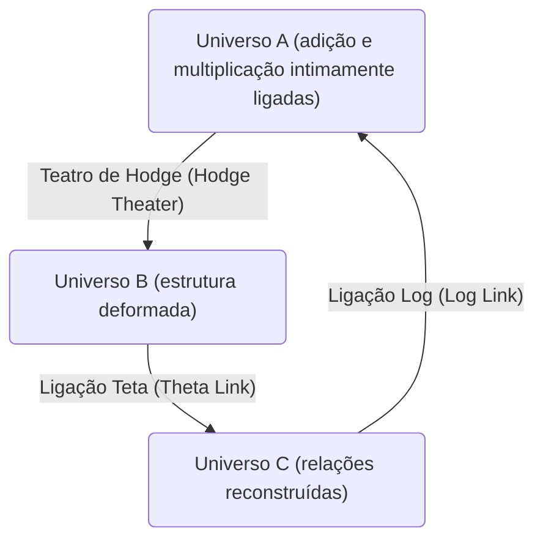
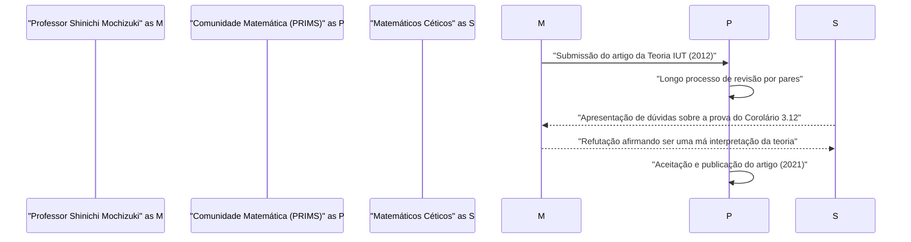

# Introdução: O que é a [Conjectura ABC](https://kenji.blog/pt/p/abc-conjecture/)?

No campo da teoria dos números, existem muitos problemas não resolvidos, mas entre eles, a **[Conjectura ABC](https://kenji.blog/pt/p/abc-conjecture/)** (ABC Conjecture) tem sido considerada especialmente importante. Esta conjectura foi formulada independentemente em 1985 por Joseph Oesterlé e David Masser.

A [Conjectura ABC](https://kenji.blog/pt/p/abc-conjecture/) sugere uma relação profunda entre a adição e a multiplicação (fatoração em números primos) de números inteiros. Ela descreve as propriedades surpreendentes escondidas na equação aparentemente simples $a + b = c$.

## Definição rigorosa da [Conjectura ABC](https://kenji.blog/pt/p/abc-conjecture/)

Considere um conjunto de inteiros positivos coprimos $(a, b, c)$ que satisfaçam $a + b = c$. Aqui, definimos o **radical** (radical) de um inteiro $n$ como $\text{radical}(n)$. Este é o produto de fatores primos distintos de $n$.

$$ \text{radical}(n) = \prod_{p | n} p $$

A [Conjectura ABC](https://kenji.blog/pt/p/abc-conjecture/) afirma que para qualquer $\epsilon > 0$, existe apenas um número finito de conjuntos de inteiros positivos coprimos $(a, b, c)$ que satisfaçam a seguinte condição:

$$ c > \text{radical}(abc)^{1 + \epsilon} $$

Esta desigualdade significa que se $a$ e $b$ possuem muitos fatores primos pequenos, a sua soma $c$ geralmente possuirá grandes fatores primos (ou seja, $\text{radical}(c)$ será grande). Ela demonstra que as duas operações mais fundamentais da matemática, adição e multiplicação, estão fortemente restritas uma pela outra.

# O Surgimento da Teoria de Teichmüller Inter-Universal (Teoria IUT)

A prova da [Conjectura ABC](https://kenji.blog/pt/p/abc-conjecture/) tem intrigado matemáticos por muitos anos, mas em 2012, o Professor Shinichi Mochizuki da Universidade de Kyoto anunciou uma prova desta conjectura usando uma estrutura matemática inteiramente nova chamada **Teoria de Teichmüller Inter-Universal** (Inter-Universal Teichmüller Theory, abreviada como Teoria IUT).

A Teoria IUT reconstrói fundamentalmente a estrutura matemática convencional (teoria dos conjuntos e geometria algébrica padrão), e seu nível de dificuldade e originalidade causaram um grande impacto na comunidade matemática.

## O Núcleo da Teoria IUT: Comunicação Inter-Universal

A ideia mais inovadora da Teoria IUT é o conceito de transmissão de informações entre diferentes **universos matemáticos** (mathematical universes). Na matemática normal, tudo é feito dentro de um único universo fixo (um sistema axiomático ou modelo da teoria dos conjuntos), mas o Professor Mochizuki separou as estruturas de adição e multiplicação e as colocou em universos diferentes.

O diagrama acima ilustra de forma simplificada o conceito de transmissão de informações entre diferentes universos na Teoria IUT. Ao comparar e transmitir estruturas entre universos diferentes, ocorre um certo tipo de "distorção" ou "incerteza". A Teoria IUT fornece uma estrutura grandiosa para avaliar e quantificar com precisão essa incerteza.

### Frobenioide e Teatro de Hodge

Conceitos importantes que compõem a Teoria IUT incluem **Frobenioide** (Frobenioid) e o **Teatro de Hodge** (Hodge Theater). Estes são mecanismos para codificar geometricamente informações na teoria dos números através das ações de grupos de Galois absolutos e grupos fundamentais de corpos de números.

$$ \Theta \text{-link} : \mathcal{F}^{\circledast} \xrightarrow{\sim} \mathcal{F}^{\odot} $$

A Ligação Teta ($\Theta$-link) desempenha o papel de transmitir informações específicas de monodromia (informações sobre os valores de funções teta) entre diferentes Teatros de Hodge. Ao contrário da estrutura convencional da teoria dos anéis (isomorfismos que preservam tanto a adição quanto a multiplicação), esta ligação preserva apenas parcialmente a estrutura multiplicativa enquanto destrói intencionalmente a estrutura aditiva para, em seguida, reconstruí-la.

# Consequências Surpreendentes da [Conjectura ABC](https://kenji.blog/pt/p/abc-conjecture/)

Se a [Conjectura ABC](https://kenji.blog/pt/p/abc-conjecture/) for completamente provada (pela Teoria IUT ou por outros métodos), um grande número de teoremas importantes na teoria dos números será derivado de uma só vez. Vamos comparar isso com a **Conjectura de Mordell** (agora conhecida como Teorema de Faltings) e o **Último Teorema de Fermat** .

## Aplicação ao Último Teorema de Fermat

[O Último Teorema de Fermat](https://kenji.blog/pt/p/fermats-last-theorem/) afirma que para $n \ge 3$, não existe um conjunto de inteiros positivos $(x, y, z)$ que satisfaça $x^n + y^n = z^n$. Ele foi provado por [Andrew Wiles](https://kenji.blog/pt/p/wiles/) em 1995, mas uma matemática extremamente avançada e complexa foi utilizada.

Se assumirmos que a [Conjectura ABC](https://kenji.blog/pt/p/abc-conjecture/) é verdadeira, surpreendentemente, o Último Teorema de Fermat (pelo menos para $n$ suficientemente grande) pode ser provado em apenas algumas linhas.

Seja $x^n + y^n = z^n$, e suponha que $(x, y, z)$ são coprimos. Aplicando a [Conjectura ABC](https://kenji.blog/pt/p/abc-conjecture/) para $a=x^n$, $b=y^n$, $c=z^n$,

$$ z^n < \text{radical}(x^n y^n z^n)^{1+\epsilon} = \text{radical}(xyz)^{1+\epsilon} \le (xyz)^{1+\epsilon} < (z^3)^{1+\epsilon} $$

Se tomarmos um $\epsilon$ suficientemente pequeno, quando $n$ é maior que $3(1+\epsilon)$ (ou seja, cerca de $n \ge 4$), esta desigualdade leva a uma contradição. Portanto, torna-se imediatamente claro que não há soluções quando $n$ é grande. Desta forma, a [Conjectura ABC](https://kenji.blog/pt/p/abc-conjecture/) funciona como uma poderosa **chave mestra** (master key) na teoria dos números.

# Recepção e Debate da Teoria IUT na Comunidade Matemática

Desde a publicação do artigo em 2012, a Teoria IUT tem sido objeto de intenso debate na comunidade matemática. A principal razão é que os novos conceitos e notações usados para construir a teoria são tão extensos que até mesmo especialistas em matemática existentes levam anos para compreendê-los.

Alguns matemáticos proeminentes (como Peter Scholze e Jakob Stix) expressaram preocupações de que haja um salto na parte central da teoria (especialmente na prova do "Corolário 3.12"). Por outro lado, o Professor Mochizuki e pesquisadores próximos a ele argumentam que essas críticas são mal-entendidos causados pela tentativa de interpretar o paradigma fundamental da Teoria IUT (a comparação de estruturas através de universos) dentro de uma estrutura convencional.

Em 2021, o artigo do Professor Mochizuki foi formalmente publicado na "PRIMS", uma revista especializada publicada pelo Instituto de Pesquisa em Ciências Matemáticas (RIMS) da Universidade de Kyoto. No entanto, um consenso completo dentro de toda a comunidade matemática não foi alcançado, e o diálogo sobre esta teoria ainda está em andamento.

# Conclusão e Perspectivas Futuras

A [Conjectura ABC](https://kenji.blog/pt/p/abc-conjecture/) e a Teoria de Teichmüller Inter-Universal são um dos maiores dramas da matemática do século XXI. A profundidade insondável dos conceitos mais simples aprendidos no ensino fundamental, a adição e a multiplicação, está agora mesmo testando os limites da inteligência humana.

Resta saber se a Teoria IUT abrirá verdadeiramente novos horizontes na matemática ou se necessitará de modificações adicionais. Levará muito tempo e pesquisa por uma nova geração de matemáticos até que uma conclusão final seja alcançada. No entanto, a visão de **conectar diferentes universos matemáticos** proposta por esta teoria continuará, sem dúvida, a ser uma grande inspiração para o desenvolvimento futuro da matemática.
