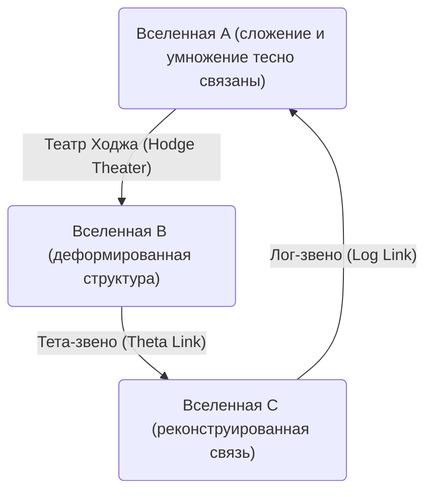
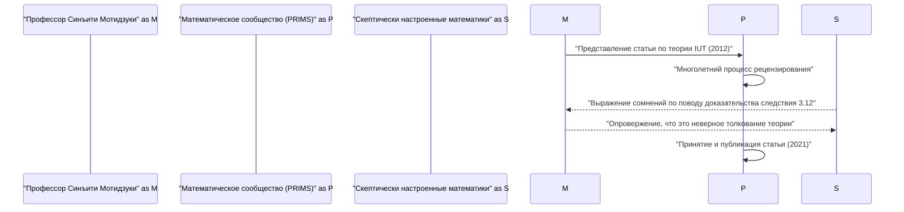

# Введение: Что такое [ABC-гипотеза](https://kenji.blog/p/abc-conjecture/)?

В области теории чисел существует множество нерешенных проблем, но среди них особенно важной считается ** [ABC-гипотеза](https://kenji.blog/p/abc-conjecture/) ** (ABC Conjecture). Эта гипотеза была независимо сформулирована Джозефом Остерле (Joseph Oesterlé) и Дэвидом Массером (David Masser) в 1985 году.

[ABC-гипотеза](https://kenji.blog/p/abc-conjecture/) предполагает наличие глубокой связи между сложением и умножением (разложением на простые множители) целых чисел. На первый взгляд она описывает удивительные свойства, скрытые в простом уравнении $a + b = c$.

## Строгое определение ABC-гипотезы

Рассмотрим тройку взаимно простых положительных целых чисел $(a, b, c)$, удовлетворяющих условию $a + b = c$. Здесь ** радикал ** (radical) целого числа $n$ определяется как $\text{rad}(n)$. Это произведение различных простых множителей числа $n$.

$$ \text{rad}(n) = \prod_{p | n} p $$

[ABC-гипотеза](https://kenji.blog/p/abc-conjecture/) утверждает, что для любого $\epsilon > 0$ существует лишь конечное число троек взаимно простых положительных целых чисел $(a, b, c)$, удовлетворяющих следующему неравенству:

$$ c > \text{rad}(abc)^{1 + \epsilon} $$

Это неравенство означает, что если $a$ и $b$ имеют много небольших простых множителей, то их сумма $c$ обычно имеет большие простые множители (то есть $\text{rad}(c)$ становится большим). Это показывает, что сложение и умножение — две самые фундаментальные операции в математике — сильно ограничивают друг друга.

# Появление интер-универсальной теории Тейхмюллера (теории IUT)

Доказательство ABC-гипотезы на протяжении многих лет ставило математиков в тупик, но в 2012 году профессор Киотского университета Синъити Мотидзуки опубликовал доказательство этой гипотезы, используя совершенно новую математическую концепцию под названием ** Интер-универсальная теория Тейхмюллера ** (Inter-Universal Teichmüller Theory, сокращенно теория IUT).

Теория IUT фундаментально реконструирует традиционные математические концепции (теорию множеств и стандартную алгебраическую геометрию), и благодаря своей сложности и новаторству она вызвала огромный шок в математическом сообществе.

## Суть теории IUT: Межвселенская коммуникация

Самой инновационной идеей теории IUT является концепция передачи информации между различными ** математическими вселенными ** (mathematical universes). В обычной математике всё происходит внутри одной фиксированной вселенной (системы аксиом или модели теории множеств), но профессор Мотидзуки разделил структуры сложения и умножения и поместил их в разные вселенные.

Приведенная выше диаграмма упрощенно показывает концепцию передачи информации между различными вселенными в теории IUT. При сравнении и передаче структур между различными вселенными возникает своего рода "искажение" или "неопределенность". Теория IUT предоставляет грандиозную структуру для точной оценки и количественного измерения этой неопределенности.

### Фробениоиды и Театры Ходжа

Важными понятиями, составляющими теорию IUT, являются ** Фробениоид ** (Frobenioid) и ** Театр Ходжа ** (Hodge Theater). Это механизмы для геометрического кодирования теоретико-числовой информации через действие абсолютных групп Галуа и фундаментальных групп числовых полей.

$$ \Theta \text{-звено} : \mathcal{F}^{\circledast} \xrightarrow{\sim} \mathcal{F}^{\odot} $$

Тета-звено ($\Theta$-звено) играет роль передачи определенной информации о монодромии (информации о значениях тета-функции) между различными театрами Ходжа. Это звено, в отличие от традиционных кольцевых структур (изоморфизмов, сохраняющих как сложение, так и умножение), намеренно "разрушает" структуру сложения, сохраняя при этом только мультипликативную структуру частично, а затем реконструирует ее.

# Поразительные следствия, вытекающие из ABC-гипотезы

Если бы [ABC-гипотеза](https://kenji.blog/p/abc-conjecture/) была полностью доказана (с помощью теории IUT или иным способом), это немедленно привело бы к доказательству многих важных теорем в теории чисел. Давайте сравним это с ** гипотезой Морделла ** (в настоящее время известной как теорема Фалтингса) или ** Великой теоремой Ферма **.

## Применение к Великой теореме Ферма

[Великая теорема Ферма](https://kenji.blog/p/fermats-last-theorem/) утверждает, что при $n \ge 3$ не существует троек положительных целых чисел $(x, y, z)$, удовлетворяющих уравнению $x^n + y^n = z^n$. Она была доказана [Эндрю Уайлс](https://kenji.blog/p/wiles/)ом в 1995 году, но для этого использовалась чрезвычайно продвинутая и сложная математика.

Если предположить, что [ABC-гипотеза](https://kenji.blog/p/abc-conjecture/) верна, то удивительным образом [Великая теорема Ферма](https://kenji.blog/p/fermats-last-theorem/) (по крайней мере для достаточно больших $n$) может быть доказана всего в нескольких строках.

Пусть $x^n + y^n = z^n$ и пусть $(x, y, z)$ взаимно просты. Применяя ABC-гипотезу к $a=x^n$, $b=y^n$, $c=z^n$, получаем:

$$ z^n < \text{rad}(x^n y^n z^n)^{1+\epsilon} = \text{rad}(xyz)^{1+\epsilon} \le (xyz)^{1+\epsilon} < (z^3)^{1+\epsilon} $$

Если выбрать $\epsilon$ достаточно малым, то при $n$ большем $3(1+\epsilon)$ (то есть примерно при $n \ge 4$), это неравенство приводит к противоречию. Следовательно, сразу становится ясно, что при больших $n$ решений не существует. Таким образом, [ABC-гипотеза](https://kenji.blog/p/abc-conjecture/) действует как мощный ** универсальный ключ ** (master key) в теории чисел.

# Принятие и обсуждение теории IUT в математическом сообществе

С момента публикации статьи в 2012 году теория IUT стала предметом бурных дискуссий в математическом сообществе. Основная причина заключается в том, что новые концепции и обозначения, используемые для построения теории, настолько обширны, что даже существующим экспертам в математике требуются годы для их понимания.

Некоторые известные математики (такие как Петер Шольце и Джейкоб Стикс) выразили обеспокоенность тем, что в ключевой части теории (особенно в доказательстве "Следствия 3.12") есть логический скачок. С другой стороны, профессор Мотидзуки и исследователи из его окружения возражают, что эти критические замечания основаны на неправильном понимании, возникшем из-за попытки интерпретировать фундаментальную парадигму теории IUT (сравнение структур между вселенными) в рамках традиционных концепций.

В 2021 году статья профессора Мотидзуки была официально опубликована в специализированном журнале "PRIMS", издаваемом Научно-исследовательским институтом математических наук Киотского университета (RIMS). Однако полного консенсуса в математическом сообществе в целом достигнуто не было, и диалог вокруг этой теории продолжается и по сей день.

# Заключение и перспективы на будущее

[ABC-гипотеза](https://kenji.blog/p/abc-conjecture/) и интер-универсальная теория Тейхмюллера — одна из величайших драм в математике 21-го века. Бездонная глубина самых простых концепций сложения и умножения, которые мы изучаем в начальной школе, прямо сейчас испытывает пределы человеческого интеллекта.

Открывает ли теория IUT поистине новые горизонты в математике, или же она нуждается в дальнейших корректировках? До того, как будет сделан окончательный вывод, потребуется еще много времени и исследований нового поколения математиков. Однако видение ** объединения различных математических вселенных **, предложенное этой теорией, несомненно, продолжит служить огромным источником вдохновения для развития математики в будущем.
