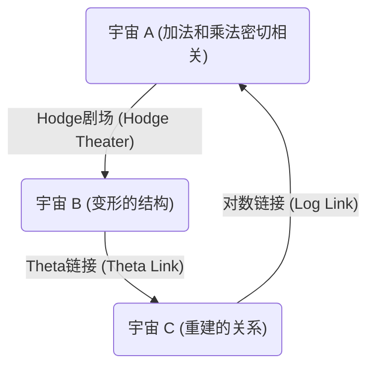
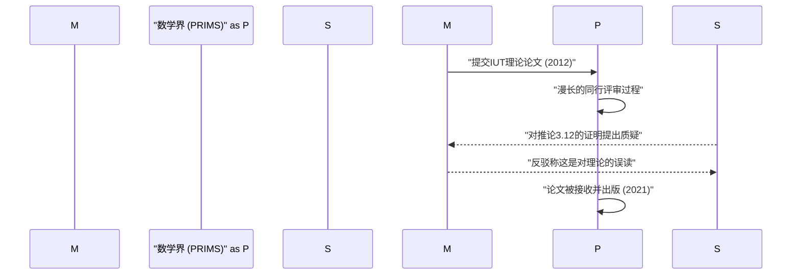

# 导言：什么是[ABC猜想](https://kenji.blog/zh-cn/p/abc-conjecture/)？

在数论领域，存在着许多未解决的问题，其中最受重视的便是 **[ABC猜想](https://kenji.blog/zh-cn/p/abc-conjecture/)** （ABC Conjecture）。这个猜想于1985年由约瑟夫·奥斯特莱（Joseph Oesterlé）和大卫·马瑟（David Masser）独立提出。

[ABC猜想](https://kenji.blog/zh-cn/p/abc-conjecture/)暗示了整数的加法和乘法（质因数分解）之间存在着深刻的联系。它描述了看似简单的等式 $a + b = c$ 背后隐藏的令人惊叹的性质。

## [ABC猜想](https://kenji.blog/zh-cn/p/abc-conjecture/)的严格定义

考虑互质的正整数对 $(a, b, c)$ ，满足 $a + b = c$ 。这里，我们将整数 $n$ 的 **根基** （radical）定义为 $\text{根基}(n)$ 。这是 $n$ 的不同质因数的乘积。

$$ \text{根基}(n) = \prod_{p | n} p $$

[ABC猜想](https://kenji.blog/zh-cn/p/abc-conjecture/)主张，对于任意的 $\epsilon > 0$ ，满足以下条件的互质正整数对 $(a, b, c)$ 只有有限个。

$$ c > \text{根基}(abc)^{1 + \epsilon} $$

这个不等式意味着，如果 $a$ 和 $b$ 拥有许多小的质因数，那么它们的和 $c$ 通常会拥有大的质因数（即 $\text{根基}(c)$ 会变大）。这表明，加法和乘法这两个数学中最基本的运算，相互之间存在着强烈的制约关系。

# 宇宙际Teichmüller理论（IUT理论）的登场

长期以来，[ABC猜想](https://kenji.blog/zh-cn/p/abc-conjecture/)的证明一直困扰着数学家们，但在2012年，京都大学的望月新一教授利用名为 **宇宙际Teichmüller理论** （Inter-Universal Teichmüller Theory，简称IUT理论）的全新数学框架，发表了该猜想的证明。

IUT理论从根本上重构了传统的数学框架（集合论和标准的代数几何学），其晦涩难懂和新颖性给数学界带来了巨大的冲击。

## IUT理论的核心：宇宙间的通信

IUT理论最具创新性的思想是，在不同的 **数学宇宙** （mathematical universes）之间传递信息的概念。在常规数学中，一切都在一个固定的宇宙（公理系统或集合论模型）中进行，但望月教授将加法和乘法的结构分离开来，并将它们分别置于不同的宇宙中。

上图简化展示了IUT理论中不同宇宙间信息传递的概念。在比较和传递不同宇宙间的结构时，会产生某种“扭曲”或“不确定性”。IUT理论为精确评估和量化这种不确定性提供了一个宏大的框架。

### 弗罗贝尼奥伊德与Hodge剧场

构成IUT理论的重要概念包括 **弗罗贝尼奥伊德** （Frobenioid）和 **Hodge剧场** （Hodge Theater）。它们通过数域的绝对伽罗瓦群和基本群的作用，将数论信息进行几何编码。

$$ \Theta \text{-链接} : \mathcal{F}^{\circledast} \xrightarrow{\sim} \mathcal{F}^{\odot} $$

Theta链接（$\Theta$-link）在不同的Hodge剧场之间发挥着传递特定单值群信息（关于Theta函数值的信息）的作用。与传统的环论结构（保持加法和乘法的同构映射）不同，这种链接仅部分地保持乘法结构，同时故意“破坏”并随后重建加法结构。

# [ABC猜想](https://kenji.blog/zh-cn/p/abc-conjecture/)得出的惊人结论

如果[ABC猜想](https://kenji.blog/zh-cn/p/abc-conjecture/)（通过IUT理论或其他方法）被完全证明，数论中许多重要的定理将迎刃而解。让我们将其与 **莫德尔猜想** （现在被称为法尔廷斯定理）或 **[费马大定理](https://kenji.blog/zh-cn/p/fermats-last-theorem/)** 等进行比较。

## 在[费马大定理](https://kenji.blog/zh-cn/p/fermats-last-theorem/)中的应用

[费马大定理](https://kenji.blog/zh-cn/p/fermats-last-theorem/)指出，当 $n \ge 3$ 时，不存在满足 $x^n + y^n = z^n$ 的正整数对 $(x, y, z)$ 。[安德鲁·怀尔斯](https://kenji.blog/zh-cn/p/wiles/)在1995年证明了该定理，但使用了非常高深和复杂的数学。

如果假设[ABC猜想](https://kenji.blog/zh-cn/p/abc-conjecture/)是正确的，令人惊奇的是，[费马大定理](https://kenji.blog/zh-cn/p/fermats-last-theorem/)（至少在 $n$ 足够大时）只需寥寥数行即可证明。

设 $x^n + y^n = z^n$ ，并假设 $(x, y, z)$ 互质。将[ABC猜想](https://kenji.blog/zh-cn/p/abc-conjecture/)应用于 $a=x^n$, $b=y^n$, $c=z^n$ ，得：

$$ z^n < \text{根基}(x^n y^n z^n)^{1+\epsilon} = \text{根基}(xyz)^{1+\epsilon} \le (xyz)^{1+\epsilon} < (z^3)^{1+\epsilon} $$

取足够小的 $\epsilon$ ，当 $n$ 大于 $3(1+\epsilon)$ 时（即 $n \ge 4$ 左右），该不等式会导致矛盾。因此，可以立即得知当 $n$ 较大时不存在解。就这样，[ABC猜想](https://kenji.blog/zh-cn/p/abc-conjecture/)发挥着数论中强大的 **万能钥匙** （master key）的作用。

# IUT理论在数学界的接受度与争议

自2012年论文发表以来，IUT理论一直是数学界激烈争论的焦点。其主要原因是，构建该理论所使用的新概念和符号极其庞大，即使是现有的数学专家也需要数年时间才能理解。

一些著名的数学家（如彼得·舒尔茨和雅各布·斯蒂克斯）表达了他们的担忧，认为该理论的核心部分（特别是“推论3.12”的证明）存在逻辑跳跃。另一方面，望月教授及其周围的研究人员反驳说，这些批评源于试图用传统框架来解释IUT理论的基本范式（跨越宇宙的结构比较）而产生的误解。

2021年，望月教授的论文正式发表在京都大学数理解析研究所（RIMS）发行的专业期刊《PRIMS》上。然而，整个数学界尚未达成完全的共识，围绕该理论的对话至今仍在继续。

# 结论与未来展望

[ABC猜想](https://kenji.blog/zh-cn/p/abc-conjecture/)与宇宙际Teichmüller理论是21世纪数学界最伟大的戏剧之一。加法和乘法，这两个我们在小学就学过的最简单的概念，其深不可测的内涵正在考验着人类智能的极限。

IUT理论究竟是开辟了真正全新的数学天地，还是需要进一步的修正？在得出最终结论之前，仍需要大量时间以及新一代数学家们的持续研究。然而，该理论所提出的 **连接不同的数学宇宙** 的愿景，无疑将继续为未来数学的发展提供巨大的灵感。
