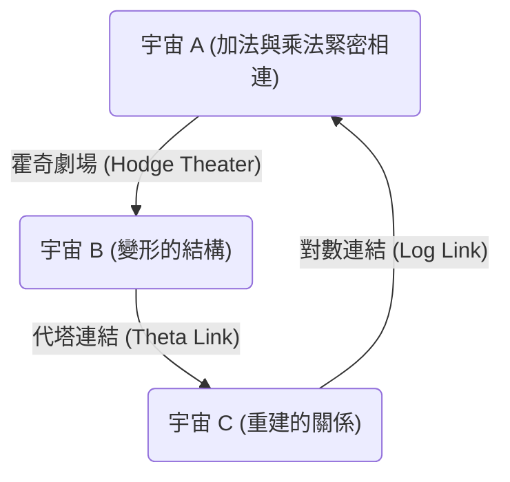
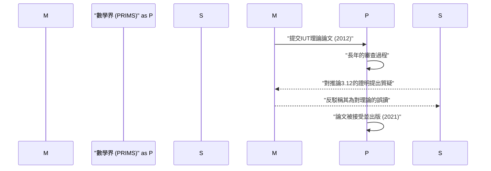

# 序論：什麼是[ABC猜想](https://kenji.blog/zh-tw/p/abc-conjecture/)？

在數論領域中，存在著許多未解之謎，其中備受重視的便是 **[ABC猜想](https://kenji.blog/zh-tw/p/abc-conjecture/)** （ABC Conjecture）。這個猜想於1985年由喬瑟夫·奧斯達利（Joseph Oesterlé）與大衛·馬瑟（David Masser）獨立提出。

[ABC猜想](https://kenji.blog/zh-tw/p/abc-conjecture/)暗示了整數的加法與乘法（質因數分解）之間存在著深刻的關聯。它描述了乍看之下非常簡單的方程式 $a + b = c$ 背後所隱藏的驚人性質。

## [ABC猜想](https://kenji.blog/zh-tw/p/abc-conjecture/)的嚴格定義

考慮互質的正整數組 $(a, b, c)$ ，並滿足 $a + b = c$ 。在此，我們將整數 $n$ 的 **根基** （radical）定義為 $\text{rad}(n)$ 。這是 $n$ 的所有相異質因數的乘積。

$$ \text{rad}(n) = \prod_{p | n} p $$

[ABC猜想](https://kenji.blog/zh-tw/p/abc-conjecture/)主張，對於任意的 $\epsilon > 0$ ，滿足以下不等式的互質正整數組 $(a, b, c)$ 只有有限多個。

$$ c > \text{rad}(abc)^{1 + \epsilon} $$

這個不等式意味著，如果 $a$ 與 $b$ 擁有許多微小的質因數，那麼它們的和 $c$ 通常會擁有巨大的質因數（也就是 $\text{rad}(c)$ 會變大）。這顯示出加法與乘法這兩個數學中最基本的運算，正互相強烈地制約著彼此。

# 宇宙際泰希米勒理論（IUT理論）的登場

長久以來，[ABC猜想](https://kenji.blog/zh-tw/p/abc-conjecture/)的證明一直困擾著數學家們。然而在2012年，京都大學的望月新一教授發表了使用名為 **宇宙際泰希米勒理論** （Inter-Universal Teichmüller Theory，簡稱IUT理論）這個全新數學框架來證明該猜想的論文。

IUT理論從根本上重建了傳統數學的框架（集合論與標準的代數幾何學），其深奧與嶄新之處為數學界帶來了巨大的衝擊。

## IUT理論的核心：宇宙間的通訊

IUT理論最具革命性的概念，是在不同的 **數學宇宙** （mathematical universes）之間傳遞資訊的想法。在一般的數學中，一切都在一個固定的宇宙（公理系統或集合論的模型）中進行，但是望月教授將加法與乘法的結構分離，並將它們分別配置到不同的宇宙中。

上圖簡化並展示了IUT理論中，不同宇宙間資訊傳遞的概念。當在不同宇宙間比較並傳遞結構時，會產生某種「扭曲」或「不確定性」。IUT理論為精確評估與量化這種不確定性，提供了一個宏大的框架。

### 弗羅貝尼奧伊德與霍奇劇場

構成IUT理論的重要概念包含 **弗羅貝尼奧伊德** （Frobenioid）與 **霍奇劇場** （Hodge Theater）。這些是透過數體的絕對伽羅瓦群或基本群的作用，將數論資訊進行幾何學編碼的機制。

$$ \Theta \text{-連結} : \mathcal{F}^{\circledast} \xrightarrow{\sim} \mathcal{F}^{\odot} $$

代塔連結（$\Theta$-link）負責在不同的霍奇劇場之間，傳遞特定的單值群資訊（關於代塔函數值的資訊）。這個連結與傳統的環論結構（同時保持加法與乘法的同構映射）不同，它僅局部保留了乘法結構，同時刻意「破壞」加法結構，然後再進行重建。

# 由[ABC猜想](https://kenji.blog/zh-tw/p/abc-conjecture/)得出的驚人推論

如果[ABC猜想](https://kenji.blog/zh-tw/p/abc-conjecture/)（透過IUT理論或其他方法）被完全證明，那麼數論中許多重要的定理將會被一口氣推導出來。我們可以將其與 **莫德爾猜想** （現被稱為法爾廷斯定理）或 **[費馬最後定理](https://kenji.blog/zh-tw/p/fermats-last-theorem/)** 等進行比較。

## 在[費馬最後定理](https://kenji.blog/zh-tw/p/fermats-last-theorem/)的應用

[費馬最後定理](https://kenji.blog/zh-tw/p/fermats-last-theorem/)指出，當 $n \ge 3$ 時，不存在滿足 $x^n + y^n = z^n$ 的正整數組 $(x, y, z)$ 。這在1995年由[安德魯·懷爾斯](https://kenji.blog/zh-tw/p/wiles/)證明，但其中使用了非常高深且複雜的數學。

如果我們假設[ABC猜想](https://kenji.blog/zh-tw/p/abc-conjecture/)是正確的，令人驚訝的是，[費馬最後定理](https://kenji.blog/zh-tw/p/fermats-last-theorem/)（至少當 $n$ 足夠大時）只需要短短幾行就能證明出來。

令 $x^n + y^n = z^n$ ，並假設 $(x, y, z)$ 互質。將[ABC猜想](https://kenji.blog/zh-tw/p/abc-conjecture/)應用於 $a=x^n$, $b=y^n$, $c=z^n$ ，可得：

$$ z^n < \text{rad}(x^n y^n z^n)^{1+\epsilon} = \text{rad}(xyz)^{1+\epsilon} \le (xyz)^{1+\epsilon} < (z^3)^{1+\epsilon} $$

如果我們取足夠小的 $\epsilon$ ，當 $n$ 大於 $3(1+\epsilon)$ （也就是大約 $n \ge 4$ ）時，這個不等式就會導出矛盾。因此，我們可以立刻得知當 $n$ 很大時不存在解。如此一來，[ABC猜想](https://kenji.blog/zh-tw/p/abc-conjecture/)便發揮了作為數論強大 **萬能鑰匙** （master key）的作用。

# IUT理論在數學界的接受度與爭議

自2012年論文發表以來，IUT理論在數學界引起了激烈的爭論。主要原因是構建該理論所使用的新概念與符號非常龐大，即使是現有的數學專家也需要花費數年時間才能理解。

一些著名數學家（例如彼得·朔爾策與雅各布·斯蒂克斯）表達了對理論核心部分（特別是「推論3.12」的證明）存在邏輯跳躍的擔憂。另一方面，望月教授及其周邊的研究人員反駁說，這些批評是因為試圖用傳統框架來解釋IUT理論的根本典範（跨越宇宙的結構比較）而產生的誤解。

2021年，望月教授的論文正式發表於京都大學數理解析研究所（RIMS）發行的專業期刊「PRIMS」上。然而，整個數學界尚未達成完全的共識，關於這個理論的對話至今仍在繼續。

# 結論與未來展望

[ABC猜想](https://kenji.blog/zh-tw/p/abc-conjecture/)與宇宙際泰希米勒理論是21世紀數學中最大的戲劇之一。加法與乘法這兩個我們在小學學到的最簡單概念，其深不可測的深度，如今正考驗著人類智慧的極限。

IUT理論究竟是否真正開闢了新的數學領域，還是需要進一步的修正？在得出最終結論之前，可能還需要很多時間以及新一代數學家們的研究。然而，該理論所提出的 **連結不同數學宇宙** 的願景，毫無疑問將繼續為未來的數學發展帶來巨大的靈感。
