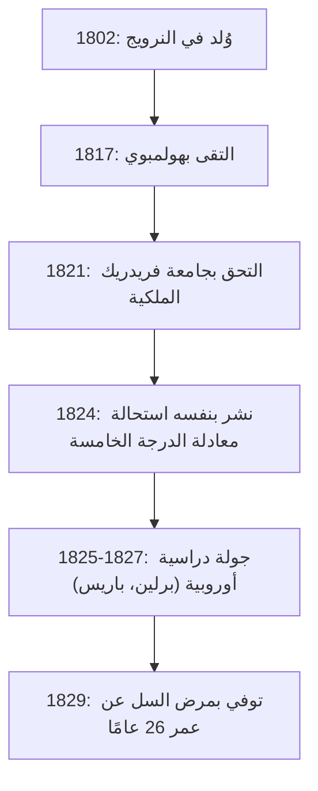
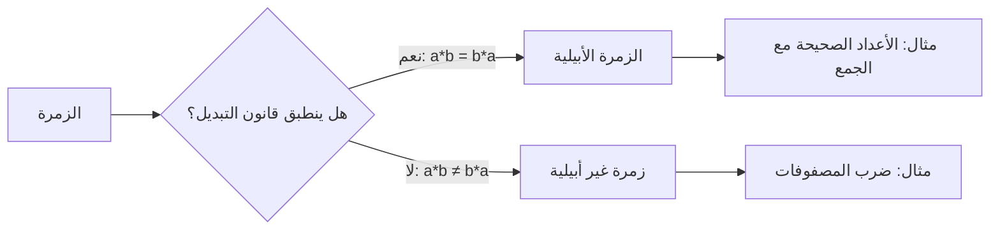

# 1. مقدمة: العبقري الشاب أبيل

في تاريخ الرياضيات، هناك عدد قليل من العباقرة الذين وافتهم المنية في سن مبكرة ولكنهم تركوا تأثيرًا حاسمًا على الأجيال القادمة. ومن بينهم، يبرز النرويجي **[نيلز هنريك أبيل](https://kenji.blog/ar/p/abel/) ([Niels Henrik Abel](https://kenji.blog/ar/p/abel/))**، إلى جانب [إيفاريست جالوا](https://kenji.blog/ar/p/galois/)، كواحد من أشهر العباقرة المأساويين. في حياته القصيرة التي لم تتجاوز 26 عامًا، أثبت أنه "لا يوجد حل جبري عام لمعادلات الدرجة الخامسة أو أعلى"، وهي مشكلة كانت تؤرق علماء الرياضيات لقرون.

في هذا المقال، سنتعمق في حياة أبيل، التي دفعه فيها شغفه بالرياضيات رغم الفقر والمرض، وفي إنجازاته الضخمة مثل "الزمر الأبيلية" و"التكاملات الأبيلية".

# 2. حياة أبيل: الفقر وازدهار الموهبة

## 2.1 طفولته المبكرة ولقاء معلمه هولمبوي

ولد [نيلز هنريك أبيل](https://kenji.blog/ar/p/abel/) في 5 أغسطس 1802 في قرية فينوي النرويجية الصغيرة، كابن لقس. كانت النرويج في ذلك الوقت فقيرة اقتصاديًا، ولم تكن عائلة أبيل استثناءً.

تغير مصيره بشكل كبير عندما التحق بمدرسة الكاتدرائية في أوسلو عام 1817 والتقى بمعلم الرياضيات، **بيرنت مايكل هولمبوي (Bernt Michael Holmboe)**. أدرك هولمبوي على الفور موهبة أبيل الاستثنائية وعلمه رياضيات متقدمة على مستوى الجامعة. من خلال التهام أعمال أساتذة مثل أويلر، ولاغرانج، ولابلاس، استوعب أبيل بسرعة الرياضيات المتطورة.

## 2.2 وفاة والده وعبء ثقيل

في عام 1820، عندما كان أبيل في الثامنة عشرة من عمره، توفي والده. كان والده قد عمق الصراعات السياسية وتوفي تاركًا وراءه ديونًا ثقيلة. ونتيجة لذلك، اضطر أبيل إلى تحمل المسؤولية الثقيلة المتمثلة في إعالة والدته وإخوته الستة. على الرغم من الفقر المدقع، وبدعم من معلمه هولمبوي وأصدقائه، التحق بجامعة فريدريك الملكية (الآن جامعة أوسلو) في عام 1821.

# 3. استحالة صيغة معادلة الدرجة الخامسة

كان أول إنجاز عظيم لأبيل يتعلق بالمعادلات الجبرية. كانت المعادلات التربيعية لها صيغة حل معروفة منذ العصور القديمة، وتم اكتشاف صيغ المعادلات التكعيبية والرباعية في إيطاليا في القرن السادس عشر. ومع ذلك، لم يتمكن أحد من العثور على صيغة عامة لمعادلة الدرجة الخامسة لما يقرب من 300 عام بعد ذلك.

في البداية، اعتقد أبيل أنه اكتشف صيغة معادلة الدرجة الخامسة وكتب ورقة بحثية. ومع ذلك، خلال عملية مراجعة الأقران من قبل هولمبوي وآخرين، أدرك خطأه. بعد ذلك، توصل إلى الفكرة المعاكسة: "هل يمكن ألا يكون هناك صيغة عامة باستخدام العمليات الحسابية الأساسية الأربع والجذور فقط لمعادلات الدرجة الخامسة وما فوق؟"

أخيرًا، في عام 1824، أثبت هذه الحقيقة تمامًا. يُعرف هذا اليوم باسم **مبرهنة أبيل-روفيني** (حيث كان عالم الرياضيات الإيطالي باولو روفيني قد نشر مسبقًا برهانًا غير مكتمل).

$$ a x^5 + b x^4 + c x^3 + d x^2 + e x + f = 0 \quad (\text{الشكل العام لمعادلة الدرجة الخامسة}) $$

من المستحيل بشكل عام التعبير عن جذور هذه المعادلة في عدد محدود من الحدود باستخدام $a, b, c, d, e, f$، والعمليات الحسابية الأربع، والجذور فقط.

# 4. رحلة إلى أوروبا ولقاء كريل

في عام 1825، حصل أبيل على منحة دراسية من الحكومة النرويجية وأتيحت له الفرصة للدراسة في أوروبا القارية. كان هدفه هو زيارة باريس، مركز الرياضيات في ذلك الوقت، وغوتينغن، حيث كان يقيم عالم الرياضيات العظيم كارل فريدريش غاوس.

أرسل أبيل ورقته البحثية إلى غاوس، لكن غاوس تجاهلها دون حتى قراءتها. تخلّى أبيل عن أمله في مقابلة غاوس وتوجه إلى برلين.

في برلين، التقى بـ **أغسطس ليوبولد كريل (August Leopold Crelle)**، وهو مهندس مدني وعشيق شغوف بالرياضيات. أُعجب كريل بموهبة أبيل، وأطلق أول مجلة رياضيات متخصصة في العالم، *Journal für die reine und angewandte Mathematik* (المعروفة باسم مجلة كريل). ساهم أبيل بعدة أوراق بحثية في عددها الافتتاحي، مما جعل اسمه معروفًا في المجتمع الرياضي الأوروبي.

# 5. الانتكاسة في باريس وإهمال كوشي

في عام 1826، وصل أبيل إلى باريس. هنا قدم ورقة بحثية إلى الأكاديمية الفرنسية للعلوم حول "نظرية واسعة بشأن الدوال المتسامية"، والتي يمكن اعتبارها تحفته الفنية. احتوت هذه الورقة على محتوى رائد سيعرف لاحقًا باسم **مبرهنة أبيل**.

ومع ذلك، ضربه سوء الحظ مرة أخرى. أضاع عالم الرياضيات العظيم **أوغستين-لوي كوشي ([Augustin-Louis Cauchy](https://kenji.blog/ar/p/cauchy/))**، الذي تم تعيينه لمراجعتها، ورقة أبيل في كومة من الوثائق في غرفته ولم يراجعها أبدًا.

مدفوعًا باليأس ونقص الأموال والمرض التدريجي للسل، أُجبر أبيل على مغادرة باريس.

# 6. العودة إلى الوطن ونهاية مأساوية

في عام 1827، كان الفقر المدقع ينتظر أبيل عند عودته إلى النرويج. نظرًا لعدم قدرته على العثور على منصب أكاديمي دائم، كان يكتب أوراقًا بحثية بشكل محموم في الوقت القليل المتبقي له.

في 6 أبريل 1829، وبحضور خطيبته وأصدقائه، وافته المنية في سن 26 عامًا.

ومن المفارقات المأساوية أنه بعد يومين فقط من وفاته، وصلت رسالة من كريل. ذكرت الرسالة أنه **تم تأمين منصب أستاذ رياضيات في جامعة برلين لأبيل**. بحلول الوقت الذي تلقت فيه موهبته التقدير الذي تستحقه، كان الأوان قد فات.

# 7. إرث أبيل الرياضي

لقد تجذرت الإنجازات التي تركها أبيل في جميع مجالات الرياضيات الحديثة.

## 7.1 الزمرة الأبيلية

في الجبر المجرد، تعد "الزمرة" واحدة من أكثر الهياكل أساسية وأهمية. من بين الزمر، تسمى تلك التي لا تتغير نتيجتها حتى إذا تم تبديل ترتيب العمليات **الزمر الأبيلية**.

بحكم التعريف، تسمى الزمرة $G$ زمرة أبيلية إذا كان قانون التبديل التالي ينطبق على أي عناصر $a, b$ في $G$:

$$ a * b = b * a \quad (\text{قانون التبديل}) $$

## 7.2 التكاملات الأبيلية والدوال الأبيلية

موضوع مذكرة باريس لأبيل، **التكامل الأبيلي**، هو تعميم للتكاملات التي تتضمن دوال جبرية. بعد وفاته، طور جاكوبي وآخرون هذه النظرية، ونمت لتصبح نظريات رائعة مثل **المتنوعات الأبيلية** في الهندسة الجبرية.

## 7.3 مبرهنة حد أبيل

كما ترك أبيل بصمة مهمة في مجال التحليل. إنها نظرية تتعلق بتقارب المتسلسلات اللانهائية.

$$ \lim_{x \to 1^-} \sum_{n=0}^{\infty} a_n x^n = \sum_{n=0}^{\infty} a_n \quad (\text{إذا كانت السلسلة على الجانب الأيمن متقاربة}) $$

لا تزال هذه النظرية تستخدم بشكل متكرر اليوم في نظريات مثل الامتداد التحليلي والتوسع التقاربي.

# 8. الخاتمة

كانت حياة [نيلز هنريك أبيل](https://kenji.blog/ar/p/abel/) متوافقة حقًا مع كلمة "مأساة". ومع ذلك، فإن الشغف الذي صبه في الرياضيات والنظريات العديدة التي أنتجها لن تتلاشى أبدًا. لا تزال النظريات التي تركها وراءه توفر إلهامًا جديدًا لعلماء الرياضيات حتى يومنا هذا.
