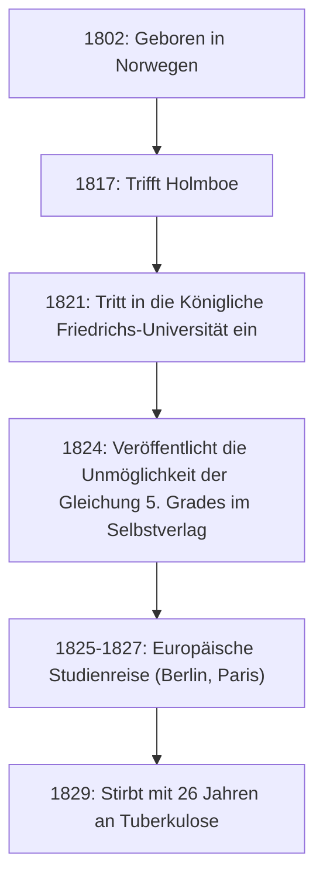

# 1. Einführung: Das junge Genie Abel

In der Geschichte der Mathematik gibt es einige Genies, die in jungen Jahren verstorben sind, aber einen entscheidenden Einfluss auf zukünftige Generationen hinterlassen haben. Unter ihnen ragt der norwegische Mathematiker **[Niels Henrik Abel](https://kenji.blog/de/p/abel/)** neben [Évariste Galois](https://kenji.blog/de/p/galois/) als eines der berühmtesten tragischen Genies heraus. In seinem kurzen Leben von nur 26 Jahren bewies er, dass „es keine allgemeine algebraische Lösung für Gleichungen fünften oder höheren Grades gibt“, ein Problem, das Mathematiker seit Jahrhunderten geplagt hatte.

In diesem Artikel werden wir uns mit Abels Leben befassen, das trotz Armut und Krankheit von seiner Leidenschaft für die Mathematik angetrieben wurde, und mit seinen monumentalen Errungenschaften wie „Abelschen Gruppen“ und „Abelschen Integralen“.

# 2. Abels Leben: Armut und das Erblühen des Talents

## 2.1 Frühe Kindheit und das Treffen mit seinem Mentor Holmboe

[Niels Henrik Abel](https://kenji.blog/de/p/abel/) wurde am 5. August 1802 in dem kleinen norwegischen Dorf Finnøy als Sohn eines Pastors geboren. Norwegen war zu dieser Zeit wirtschaftlich verarmt, und Abels Familie bildete da keine Ausnahme.

Sein Schicksal änderte sich maßgeblich, als er 1817 in die Kathedralschule in Oslo eintrat und seinen Mathematiklehrer **Bernt Michael Holmboe** traf. Holmboe erkannte sofort Abels außergewöhnliches Talent und lehrte ihn fortgeschrittene Mathematik auf Universitätsniveau. Durch das Verschlingen der Werke von Meistern wie Euler, Lagrange und Laplace nahm Abel schnell modernste Mathematik auf.

## 2.2 Der Tod seines Vaters und eine schwere Last

Im Jahr 1820, als Abel 18 Jahre alt war, verstarb sein Vater. Sein Vater hatte politische Konflikte verschärft und starb mit hohen Schulden. Infolgedessen musste Abel die schwere Verantwortung übernehmen, seine Mutter und sechs Geschwister zu ernähren. Trotz extremer Armut trat er mit Unterstützung seines Mentors Holmboe und seiner Freunde 1821 in die Königliche Friedrichs-Universität (heute Universität Oslo) ein.

# 3. Die Unmöglichkeit der Lösungsformel für Gleichungen fünften Grades

Abels erste große Errungenschaft bezog sich auf algebraische Gleichungen. Für quadratische Gleichungen war seit der Antike eine Lösungsformel bekannt, und Formeln für Gleichungen dritten und vierten Grades wurden im Italien des 16. Jahrhunderts entdeckt. Danach konnte jedoch fast 300 Jahre lang niemand eine allgemeine Formel für die Gleichung fünften Grades finden.

Zunächst dachte Abel, er hätte die Formel für die Gleichung fünften Grades entdeckt, und schrieb eine Arbeit. Während des Peer-Review-Prozesses durch Holmboe und andere erkannte er jedoch seinen Fehler. Daraufhin kam er auf die gegenteilige Idee: „Könnte es sein, dass es für Gleichungen vom Grad fünf und höher keine allgemeine Formel gibt, die nur die vier Grundrechenarten und Wurzeln verwendet?“

Schließlich, im Jahr 1824, bewies er diese Tatsache vollständig. Heute ist dies als **Satz von Abel-Ruffini** bekannt (da der italienische Mathematiker Paolo Ruffini zuvor einen unvollständigen Beweis veröffentlicht hatte).

$$ a x^5 + b x^4 + c x^3 + d x^2 + e x + f = 0 \quad (\text{Allgemeine Form der Gleichung fünften Grades}) $$

Es ist allgemein unmöglich, die Wurzeln dieser Gleichung in einer endlichen Anzahl von Termen auszudrücken, die nur $a, b, c, d, e, f$, die vier Grundrechenarten und Wurzeln verwenden.

# 4. Reise nach Europa und Treffen mit Crelle

Im Jahr 1825 erhielt Abel ein Stipendium der norwegischen Regierung und hatte die Möglichkeit, auf dem europäischen Festland zu studieren. Sein Ziel war es, Paris, das damalige Zentrum der Mathematik, und Göttingen zu besuchen, wo der große Mathematiker [Carl Friedrich Gauss](https://kenji.blog/de/p/gauss/) lebte.

Abel schickte seine Arbeit an Gauss, aber Gauss ignorierte sie, ohne sie überhaupt zu lesen. Da er die Hoffnung aufgab, Gauss zu treffen, reiste Abel nach Berlin.

In Berlin lernte er **August Leopold Crelle** kennen, einen Bauingenieur und leidenschaftlichen Mathematik-Enthusiasten. Beeindruckt von Abels Talent, startete Crelle die weltweit erste spezialisierte Mathematikzeitschrift, *Journal für die reine und angewandte Mathematik* (allgemein bekannt als Crelles Journal). Abel trug mit mehreren Arbeiten zur Erstausgabe bei und machte seinen Namen in der europäischen mathematischen Gemeinschaft bekannt.

# 5. Rückschlag in Paris und Cauchys Nachlässigkeit

1826 kam Abel in Paris an. Hier reichte er der Französischen Akademie der Wissenschaften eine Arbeit über ein „Umfassendes Theorem über transzendente Funktionen“ ein, die als sein Meisterwerk angesehen werden könnte. Diese Arbeit enthielt bahnbrechende Inhalte, die später als **Abelsches Theorem** bekannt wurden.

Das Unglück schlug jedoch erneut zu. Der große Mathematiker **[Augustin-Louis Cauchy](https://kenji.blog/de/p/cauchy/)**, der mit der Überprüfung beauftragt wurde, verlegte Abels Arbeit in einem Stapel von Dokumenten in seinem Zimmer und überprüfte sie nie.

Getrieben von Verzweiflung, Geldmangel und der fortschreitenden Tuberkulose, war Abel gezwungen, Paris zu verlassen.

# 6. Rückkehr in die Heimat und tragisches Ende

Im Jahr 1827 erwartete Abel bei seiner Rückkehr nach Norwegen extreme Armut. Da er keine feste akademische Position finden konnte, schrieb er in der kurzen Zeit, die ihm noch blieb, verzweifelt an weiteren Arbeiten.

Am 6. April 1829 verstarb Abel im Beisein seiner Verlobten und seiner Freunde im jungen Alter von 26 Jahren.

Tragischerweise traf nur zwei Tage nach seinem Tod ein Brief von Crelle ein. Darin stand, dass **für Abel eine Mathematikprofessur an der Universität Berlin gesichert worden war**. Bis sein Talent die verdiente Anerkennung fand, war es bereits zu spät.

# 7. Abels mathematisches Erbe

Die Errungenschaften, die Abel hinterließ, haben in allen Bereichen der modernen Mathematik Wurzeln geschlagen.

## 7.1 Abelsche Gruppe

In der abstrakten Algebra ist eine der grundlegendsten und wichtigsten Strukturen die „Gruppe“. Unter den Gruppen werden diejenigen, bei denen sich das Ergebnis nicht ändert, auch wenn die Reihenfolge der Operationen vertauscht wird, **Abelsche Gruppen** genannt.

Per Definition wird eine Gruppe $G$ als Abelsche Gruppe bezeichnet, wenn das folgende Kommutativgesetz für alle Elemente $a, b$ in $G$ gilt:

$$ a * b = b * a \quad (\text{Kommutativgesetz}) $$

## 7.2 Abelsche Integrale und Abelsche Funktionen

Das Thema von Abels Pariser Abhandlung, das **Abelsche Integral**, ist eine Verallgemeinerung von Integralen, die algebraische Funktionen beinhalten. Nach seinem Tod wurde diese Theorie von Jacobi und anderen weiterentwickelt und wuchs zu großartigen Theorien wie den **Abelschen Varietäten** in der algebraischen Geometrie heran.

## 7.3 Abelscher Grenzwertsatz

Abel hinterließ auch im Bereich der Analysis bedeutende Spuren. Es ist ein Satz bezüglich der Konvergenz unendlicher Reihen.

$$ \lim_{x \to 1^-} \sum_{n=0}^{\infty} a_n x^n = \sum_{n=0}^{\infty} a_n \quad (\text{wenn die Reihe auf der rechten Seite konvergiert}) $$

Dieser Satz wird noch heute häufig in Theorien wie der analytischen Fortsetzung und der asymptotischen Entwicklung verwendet.

# 8. Fazit

[Niels Henrik Abel](https://kenji.blog/de/p/abel/)s Leben passte wirklich zu dem Wort „Tragödie“. Die Leidenschaft, die er in die Mathematik steckte, und die zahlreichen Theoreme, die er hervorbrachte, werden jedoch niemals verblassen. Die von ihm hinterlassenen Theorien inspirieren Mathematiker bis zum heutigen Tag.
