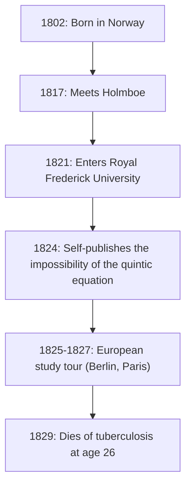
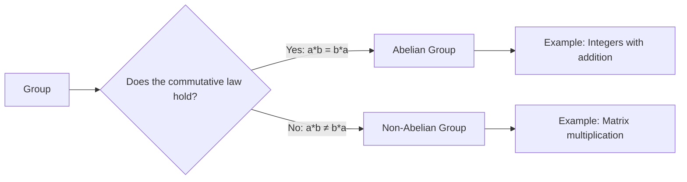

# 1. Introduction: The Young Genius [Abel](https://kenji.blog/en/p/abel/)

In the history of mathematics, there are a few geniuses who passed away at a young age but left a decisive impact on future generations. Among them, the Norwegian-born **[Niels Henrik Abel](https://kenji.blog/en/p/abel/)** stands alongside [Évariste Galois](https://kenji.blog/en/p/galois/) as one of the most famous tragic geniuses. In his short life of only 26 years, he proved that "there is no general algebraic solution for equations of degree five or higher," a problem that had plagued mathematicians for centuries.

In this article, we will delve into [Abel](https://kenji.blog/en/p/abel/)'s life, driven by his passion for mathematics despite poverty and illness, and his monumental achievements such as "Abelian groups" and "[Abel](https://kenji.blog/en/p/abel/)ian integrals."

# 2. [Abel](https://kenji.blog/en/p/abel/)'s Life: Poverty and the Blooming of Talent

## 2.1 Early Childhood and Meeting His Mentor Holmboe

[Niels Henrik Abel](https://kenji.blog/en/p/abel/) was born on August 5, 1802, in the small Norwegian village of Finnøy, as the son of a pastor. Norway at the time was economically impoverished, and [Abel](https://kenji.blog/en/p/abel/)'s family was no exception.

His destiny changed significantly when he entered the Cathedral School in Oslo in 1817 and met his mathematics teacher, **Bernt Michael Holmboe**. Holmboe immediately recognized [Abel](https://kenji.blog/en/p/abel/)'s extraordinary talent and taught him university-level advanced mathematics. By devouring the works of masters like Euler, Lagrange, and Laplace, [Abel](https://kenji.blog/en/p/abel/) quickly absorbed cutting-edge mathematics.

## 2.2 The Death of His Father and a Heavy Burden

In 1820, when [Abel](https://kenji.blog/en/p/abel/) was 18, his father passed away. His father had deepened political conflicts and died leaving behind heavy debts. As a result, [Abel](https://kenji.blog/en/p/abel/) had to bear the heavy responsibility of supporting his mother and six siblings. Despite extreme poverty, with the support of his mentor Holmboe and friends, he entered the Royal Frederick University (now the University of Oslo) in 1821.

# 3. The Impossibility of the Quintic Equation Formula

[Abel](https://kenji.blog/en/p/abel/)'s first great achievement was related to algebraic equations. Quadratic equations have had a known solution formula since ancient times, and formulas for cubic and quartic equations were discovered in 16th-century Italy. However, no one could find a general formula for the quintic equation for nearly 300 years after that.

Initially, [Abel](https://kenji.blog/en/p/abel/) thought he had discovered the formula for the quintic equation and wrote a paper. However, during the peer-review process by Holmboe and others, he realized his mistake. Subsequently, he arrived at the opposite idea: "Could it be that there is no general formula using only the four basic arithmetic operations and radicals for equations of degree five and above?"

Finally, in 1824, he completely proved this fact. Today, this is known as the **[Abel](https://kenji.blog/en/p/abel/)-Ruffini theorem** (since the Italian mathematician Paolo Ruffini had previously published an incomplete proof).

$$ a x^5 + b x^4 + c x^3 + d x^2 + e x + f = 0 \quad (\text{General form of the quintic equation}) $$

It is generally impossible to express the roots of this equation in a finite number of terms using only $a, b, c, d, e, f$, the four arithmetic operations, and radicals.

# 4. Journey to Europe and Meeting Crelle

In 1825, [Abel](https://kenji.blog/en/p/abel/) obtained a scholarship from the Norwegian government and had the opportunity to study in continental Europe. His goal was to visit Paris, the center of mathematics at the time, and Göttingen, where the great mathematician [Carl Friedrich Gauss](https://kenji.blog/en/p/gauss/) resided.

[Abel](https://kenji.blog/en/p/abel/) sent his paper to Gauss, but Gauss ignored it without even reading it. Giving up on meeting Gauss, [Abel](https://kenji.blog/en/p/abel/) headed to Berlin.

In Berlin, he met **August Leopold Crelle**, a civil engineer and passionate mathematics enthusiast. Impressed by [Abel](https://kenji.blog/en/p/abel/)'s talent, Crelle launched the world's first specialized mathematics journal, *Journal für die reine und angewandte Mathematik* (commonly known as Crelle's Journal). [Abel](https://kenji.blog/en/p/abel/) contributed multiple papers to its inaugural issue, making his name known in the European mathematical community.

# 5. Setback in Paris and [Cauchy](https://kenji.blog/en/p/cauchy/)'s Neglect

In 1826, [Abel](https://kenji.blog/en/p/abel/) arrived in Paris. Here he submitted a paper to the French Academy of Sciences on a "Broad theorem concerning transcendental functions," which could be considered his masterpiece. This paper contained groundbreaking content that would later be known as **[Abel](https://kenji.blog/en/p/abel/)'s theorem**.

However, misfortune struck again. The great mathematician **[Augustin-Louis Cauchy](https://kenji.blog/en/p/cauchy/)**, who was assigned to review it, misplaced [Abel](https://kenji.blog/en/p/abel/)'s paper in a pile of documents in his room and never reviewed it.

Driven out by despair, lack of funds, and the creeping disease of tuberculosis, [Abel](https://kenji.blog/en/p/abel/) was forced to leave Paris.

# 6. Return Home and Tragic End

In 1827, extreme poverty awaited [Abel](https://kenji.blog/en/p/abel/) upon his return to Norway. Unable to find a permanent academic position, he wrote papers frantically in the little time he had left.

On April 6, 1829, watched over by his fiancée and friends, [Abel](https://kenji.blog/en/p/abel/) passed away at the young age of 26.

Tragically, just two days after his death, a letter arrived from Crelle. It stated that **a mathematics professorship at the University of Berlin had been secured for [Abel](https://kenji.blog/en/p/abel/)**. By the time his talent received its rightful recognition, it was already too late.

# 7. [Abel](https://kenji.blog/en/p/abel/)'s Mathematical Legacy

The achievements [Abel](https://kenji.blog/en/p/abel/) left behind have taken root in all areas of modern mathematics.

## 7.1 [Abel](https://kenji.blog/en/p/abel/)ian Group

In abstract algebra, one of the most fundamental and important structures is the "Group". Among groups, those in which the result does not change even if the order of operations is swapped are called **[Abel](https://kenji.blog/en/p/abel/)ian groups**.

By definition, a group $G$ is called an [Abel](https://kenji.blog/en/p/abel/)ian group if the following commutative law holds for any elements $a, b$ in $G$:

$$ a * b = b * a \quad (\text{Commutative law}) $$

## 7.2 [Abel](https://kenji.blog/en/p/abel/)ian Integrals and [Abel](https://kenji.blog/en/p/abel/)ian Functions

The subject of [Abel](https://kenji.blog/en/p/abel/)'s Paris memoir, the **Abelian integral**, is a generalization of integrals involving algebraic functions. After his death, this theory was developed by Jacobi and others, growing into magnificent theories such as **[Abel](https://kenji.blog/en/p/abel/)ian varieties** in algebraic geometry.

## 7.3 [Abel](https://kenji.blog/en/p/abel/)'s Limit Theorem

[Abel](https://kenji.blog/en/p/abel/) also left a significant mark in the field of analysis. It is a theorem regarding the convergence of infinite series.

$$ \lim_{x \to 1^-} \sum_{n=0}^{\infty} a_n x^n = \sum_{n=0}^{\infty} a_n \quad (\text{if the series on the right side converges}) $$

This theorem is still frequently used today in theories such as analytic continuation and asymptotic expansion.

# 8. Conclusion

[Niels Henrik Abel](https://kenji.blog/en/p/abel/)'s life was truly fitting of the word "tragedy." However, the passion he poured into mathematics and the numerous theorems he produced will never fade. The theories he left behind continue to provide new inspiration to mathematicians to this day.
