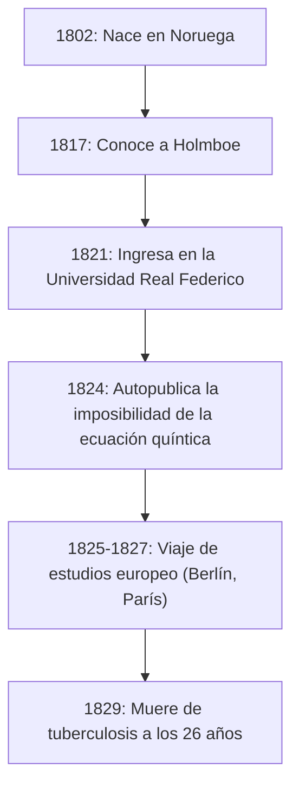
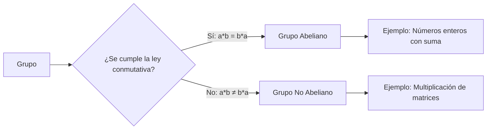

# 1. Introducción: El Joven Genio Abel

En la historia de las matemáticas, existen algunos genios que fallecieron a una edad temprana pero dejaron un impacto decisivo en las generaciones futuras. Entre ellos, el noruego **Niels Henrik Abel** destaca, junto a Évariste Galois, como uno de los genios trágicos más famosos. En su corta vida de solo 26 años, demostró que "no existe una solución algebraica general para ecuaciones de grado cinco o superior", un problema que había atormentado a los matemáticos durante siglos.

En este artículo, profundizaremos en la vida de Abel, impulsada por su pasión por las matemáticas a pesar de la pobreza y la enfermedad, y en sus logros monumentales como los "grupos abelianos" y las "integrales abelianas".

# 2. La Vida de Abel: Pobreza y el Florecimiento del Talento

## 2.1 Primera Infancia y el Encuentro con su Mentor Holmboe

Niels Henrik Abel nació el 5 de agosto de 1802 en el pequeño pueblo noruego de Finnøy, como hijo de un pastor. Noruega en ese momento estaba económicamente empobrecida, y la familia de Abel no era una excepción.

Su destino cambió significativamente cuando ingresó en la Escuela Catedralicia de Oslo en 1817 y conoció a su profesor de matemáticas, **Bernt Michael Holmboe**. Holmboe reconoció inmediatamente el extraordinario talento de Abel y le enseñó matemáticas avanzadas de nivel universitario. Devorando las obras de maestros como Euler, Lagrange y Laplace, Abel absorbió rápidamente las matemáticas de vanguardia.

## 2.2 La Muerte de su Padre y una Pesada Carga

En 1820, cuando Abel tenía 18 años, su padre falleció. Su padre había profundizado en los conflictos políticos y murió dejando tras de sí grandes deudas. Como resultado, Abel tuvo que asumir la pesada responsabilidad de mantener a su madre y a sus seis hermanos. A pesar de la extrema pobreza, con el apoyo de su mentor Holmboe y sus amigos, ingresó en la Universidad Real Federico (hoy Universidad de Oslo) en 1821.

# 3. La Imposibilidad de la Fórmula de la Ecuación Quíntica

El primer gran logro de Abel estuvo relacionado con las ecuaciones algebraicas. Las ecuaciones cuadráticas han tenido una fórmula de solución conocida desde la antigüedad, y las fórmulas para ecuaciones cúbicas y cuárticas fueron descubiertas en la Italia del siglo XVI. Sin embargo, nadie pudo encontrar una fórmula general para la ecuación quíntica durante casi 300 años después de eso.

Inicialmente, Abel pensó que había descubierto la fórmula para la ecuación quíntica y escribió un artículo. Sin embargo, durante el proceso de revisión por pares por parte de Holmboe y otros, se dio cuenta de su error. Posteriormente, llegó a la idea opuesta: "¿Podría ser que no exista una fórmula general usando solo las cuatro operaciones aritméticas básicas y radicales para ecuaciones de grado cinco y superior?"

Finalmente, en 1824, demostró completamente este hecho. Hoy en día, esto se conoce como el **teorema de Abel-Ruffini** (ya que el matemático italiano Paolo Ruffini había publicado previamente una prueba incompleta).

$$ a x^5 + b x^4 + c x^3 + d x^2 + e x + f = 0 \quad (\text{Forma general de la ecuación quíntica}) $$

Generalmente es imposible expresar las raíces de esta ecuación en un número finito de términos usando solo $a, b, c, d, e, f$, las cuatro operaciones aritméticas y los radicales.

# 4. Viaje a Europa y el Encuentro con Crelle

En 1825, Abel obtuvo una beca del gobierno noruego y tuvo la oportunidad de estudiar en Europa continental. Su objetivo era visitar París, el centro de las matemáticas en ese momento, y Gotinga, donde residía el gran matemático Carl Friedrich Gauss.

Abel envió su artículo a Gauss, pero Gauss lo ignoró sin siquiera leerlo. Renunciando a conocer a Gauss, Abel se dirigió a Berlín.

En Berlín, conoció a **August Leopold Crelle**, un ingeniero civil y apasionado entusiasta de las matemáticas. Impresionado por el talento de Abel, Crelle lanzó la primera revista de matemáticas especializada del mundo, *Journal für die reine und angewandte Mathematik* (comúnmente conocida como la Revista de Crelle). Abel contribuyó con múltiples artículos a su número inaugural, dando a conocer su nombre en la comunidad matemática europea.

# 5. Revés en París y la Negligencia de Cauchy

En 1826, Abel llegó a París. Aquí presentó un artículo a la Academia de Ciencias de Francia sobre un "Teorema amplio sobre funciones trascendentes", que podría considerarse su obra maestra. Este artículo contenía contenido innovador que más tarde se conocería como el **teorema de Abel**.

Sin embargo, la desgracia golpeó de nuevo. El gran matemático **Augustin-Louis Cauchy**, que fue asignado para revisarlo, traspapeló el artículo de Abel en una pila de documentos en su habitación y nunca lo revisó.

Expulsado por la desesperación, la falta de fondos y la enfermedad progresiva de la tuberculosis, Abel se vio obligado a abandonar París.

# 6. Regreso a Casa y un Final Trágico

En 1827, una pobreza extrema esperaba a Abel a su regreso a Noruega. Incapaz de encontrar un puesto académico permanente, escribió artículos frenéticamente en el poco tiempo que le quedaba.

El 6 de abril de 1829, velado por su prometida y amigos, Abel falleció a la joven edad de 26 años.

Trágicamente, apenas dos días después de su muerte, llegó una carta de Crelle. Afirmaba que **se había asegurado una cátedra de matemáticas en la Universidad de Berlín para Abel**. Para cuando su talento recibió su merecido reconocimiento, ya era demasiado tarde.

# 7. El Legado Matemático de Abel

Los logros que Abel dejó atrás han arraigado en todas las áreas de las matemáticas modernas.

## 7.1 Grupo Abeliano

En el álgebra abstracta, una de las estructuras más fundamentales e importantes es el "Grupo". Entre los grupos, aquellos en los que el resultado no cambia incluso si se invierte el orden de las operaciones se denominan **grupos abelianos**.

Por definición, un grupo $G$ se denomina grupo abeliano si la siguiente ley conmutativa se cumple para cualquier elemento $a, b$ en $G$:

$$ a * b = b * a \quad (\text{Ley conmutativa}) $$

## 7.2 Integrales Abelianas y Funciones Abelianas

El tema de la memoria de París de Abel, la **integral abeliana**, es una generalización de las integrales que involucran funciones algebraicas. Después de su muerte, esta teoría fue desarrollada por Jacobi y otros, creciendo en teorías magníficas como las **variedades abelianas** en geometría algebraica.

## 7.3 Teorema del Límite de Abel

Abel también dejó una huella significativa en el campo del análisis. Es un teorema con respecto a la convergencia de series infinitas.

$$ \lim_{x \to 1^-} \sum_{n=0}^{\infty} a_n x^n = \sum_{n=0}^{\infty} a_n \quad (\text{si la serie del lado derecho converge}) $$

Este teorema todavía se usa con frecuencia hoy en día en teorías como la continuación analítica y la expansión asintótica.

# 8. Conclusión

La vida de Niels Henrik Abel encaja verdaderamente con la palabra "tragedia". Sin embargo, la pasión que vertió en las matemáticas y los numerosos teoremas que produjo nunca se desvanecerán. Las teorías que dejó atrás continúan proporcionando nueva inspiración a los matemáticos hasta el día de hoy.
