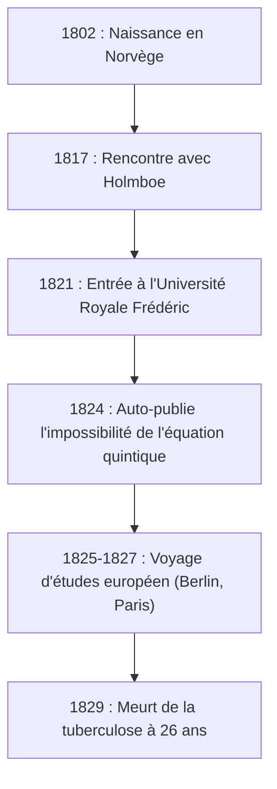
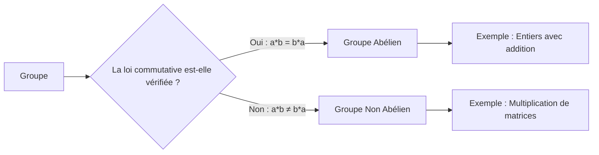

# 1. Introduction : Le Jeune Génie Abel

Dans l'histoire des mathématiques, il y a quelques génies qui sont décédés à un jeune âge mais qui ont laissé un impact décisif sur les générations futures. Parmi eux, le Norvégien **[Niels Henrik Abel](https://kenji.blog/fr/p/abel/)** se distingue, aux côtés d'[Évariste Galois](https://kenji.blog/fr/p/galois/), comme l'un des génies tragiques les plus célèbres. Au cours de sa courte vie de seulement 26 ans, il a prouvé qu'« il n'existe pas de solution algébrique générale pour les équations de degré cinq ou supérieur », un problème qui tourmentait les mathématiciens depuis des siècles.

Dans cet article, nous plongerons dans la vie d'Abel, propulsée par sa passion pour les mathématiques malgré la pauvreté et la maladie, et dans ses réalisations monumentales telles que les « groupes abéliens » et les « intégrales abéliennes ».

# 2. La Vie d'Abel : La Pauvreté et l'Éclosion du Talent

## 2.1 Petite Enfance et Rencontre avec son Mentor Holmboe

[Niels Henrik Abel](https://kenji.blog/fr/p/abel/) est né le 5 août 1802 dans le petit village norvégien de Finnøy, en tant que fils de pasteur. La Norvège de l'époque était économiquement appauvrie, et la famille d'Abel ne faisait pas exception.

Son destin a radicalement changé lorsqu'il est entré à l'École Cathédrale d'Oslo en 1817 et a rencontré son professeur de mathématiques, **Bernt Michael Holmboe**. Holmboe a immédiatement reconnu le talent extraordinaire d'Abel et lui a enseigné des mathématiques avancées de niveau universitaire. En dévorant les œuvres de maîtres tels qu'Euler, Lagrange et Laplace, Abel a rapidement absorbé les mathématiques de pointe.

## 2.2 La Mort de son Père et un Lourd Fardeau

En 1820, alors qu'Abel avait 18 ans, son père est décédé. Son père avait aggravé les conflits politiques et est mort en laissant de lourdes dettes. Par conséquent, Abel a dû assumer la lourde responsabilité de subvenir aux besoins de sa mère et de ses six frères et sœurs. Malgré une pauvreté extrême, avec le soutien de son mentor Holmboe et de ses amis, il est entré à l'Université Royale Frédéric (aujourd'hui Université d'Oslo) en 1821.

# 3. L'Impossibilité de la Formule de l'Équation Quintique

La première grande réalisation d'Abel était liée aux équations algébriques. Les équations quadratiques ont une formule de solution connue depuis l'Antiquité, et les formules pour les équations cubiques et quartiques ont été découvertes dans l'Italie du XVIe siècle. Cependant, personne n'avait pu trouver de formule générale pour l'équation quintique pendant près de 300 ans après cela.

Initialement, Abel pensait avoir découvert la formule de l'équation quintique et a rédigé un article. Cependant, lors du processus d'évaluation par les pairs par Holmboe et d'autres, il a réalisé son erreur. Par la suite, il en est venu à l'idée opposée : « Se pourrait-il qu'il n'y ait pas de formule générale n'utilisant que les quatre opérations arithmétiques fondamentales et les radicaux pour les équations de degré cinq et supérieur ? »

Enfin, en 1824, il a complètement prouvé ce fait. Aujourd'hui, on l'appelle le **théorème d'Abel-Ruffini** (puisque le mathématicien italien Paolo Ruffini avait précédemment publié une preuve incomplète).

$$ a x^5 + b x^4 + c x^3 + d x^2 + e x + f = 0 \quad (\text{Forme générale de l'équation quintique}) $$

Il est généralement impossible d'exprimer les racines de cette équation en un nombre fini de termes en n'utilisant que $a, b, c, d, e, f$, les quatre opérations arithmétiques et les radicaux.

# 4. Voyage en Europe et Rencontre avec Crelle

En 1825, Abel a obtenu une bourse du gouvernement norvégien et a eu l'opportunité d'étudier en Europe continentale. Son objectif était de visiter Paris, le centre des mathématiques à l'époque, et Göttingen, où résidait le grand mathématicien [Carl Friedrich Gauss](https://kenji.blog/fr/p/gauss/).

Abel a envoyé son article à Gauss, mais Gauss l'a ignoré sans même le lire. Renonçant à rencontrer Gauss, Abel s'est dirigé vers Berlin.

À Berlin, il a rencontré **August Leopold Crelle**, un ingénieur civil et un passionné de mathématiques. Impressionné par le talent d'Abel, Crelle a lancé la première revue spécialisée de mathématiques au monde, *Journal für die reine und angewandte Mathematik* (communément appelée le Journal de Crelle). Abel a contribué par de nombreux articles à son numéro inaugural, faisant connaître son nom dans la communauté mathématique européenne.

# 5. Revers à Paris et la Négligence de Cauchy

En 1826, Abel arriva à Paris. Ici, il a soumis un article à l'Académie des Sciences de France sur un « Théorème étendu sur les fonctions transcendantes », qui pourrait être considéré comme son chef-d'œuvre. Cet article contenait un contenu révolutionnaire qui sera plus tard connu sous le nom de **théorème d'Abel**.

Cependant, le malheur a encore frappé. Le grand mathématicien **[Augustin-Louis Cauchy](https://kenji.blog/fr/p/cauchy/)**, chargé de l'examiner, a égaré l'article d'Abel dans une pile de documents dans sa chambre et ne l'a jamais examiné.

Poussé par le désespoir, le manque de fonds et la maladie progressive de la tuberculose, Abel a été contraint de quitter Paris.

# 6. Retour au Pays et Fin Tragique

En 1827, une pauvreté extrême attendait Abel à son retour en Norvège. Incapable de trouver un poste universitaire permanent, il écrivait des articles frénétiquement dans le peu de temps qui lui restait.

Le 6 avril 1829, veillé par sa fiancée et ses amis, Abel s'est éteint à l'âge de 26 ans.

Tragiquement, deux jours seulement après sa mort, une lettre de Crelle arriva. Elle indiquait qu'**un poste de professeur de mathématiques à l'Université de Berlin avait été obtenu pour Abel**. Au moment où son talent a reçu la reconnaissance qui lui était due, il était déjà trop tard.

# 7. L'Héritage Mathématique d'Abel

Les réalisations laissées par Abel ont pris racine dans tous les domaines des mathématiques modernes.

## 7.1 Groupe Abélien

En algèbre abstraite, l'une des structures les plus fondamentales et les plus importantes est le « Groupe ». Parmi les groupes, ceux dont le résultat ne change pas même si l'ordre des opérations est inversé sont appelés **groupes abéliens**.

Par définition, un groupe $G$ est appelé un groupe abélien si la loi commutative suivante est vérifiée pour tous éléments $a, b$ dans $G$ :

$$ a * b = b * a \quad (\text{Loi commutative}) $$

## 7.2 Intégrales Abéliennes et Fonctions Abéliennes

Le sujet de la mémoire de Paris d'Abel, l'**intégrale abélienne**, est une généralisation des intégrales impliquant des fonctions algébriques. Après sa mort, cette théorie a été développée par Jacobi et d'autres, devenant de magnifiques théories telles que les **variétés abéliennes** en géométrie algébrique.

## 7.3 Théorème de la Limite d'Abel

Abel a également laissé une marque significative dans le domaine de l'analyse. C'est un théorème concernant la convergence des séries infinies.

$$ \lim_{x \to 1^-} \sum_{n=0}^{\infty} a_n x^n = \sum_{n=0}^{\infty} a_n \quad (\text{si la série du côté droit converge}) $$

Ce théorème est encore fréquemment utilisé aujourd'hui dans des théories telles que le prolongement analytique et le développement asymptotique.

# 8. Conclusion

La vie de [Niels Henrik Abel](https://kenji.blog/fr/p/abel/) correspond vraiment au mot « tragédie ». Cependant, la passion qu'il a insufflée aux mathématiques et les nombreux théorèmes qu'il a produits ne s'effaceront jamais. Les théories qu'il a laissées continuent de fournir une nouvelle inspiration aux mathématiciens jusqu'à ce jour.
