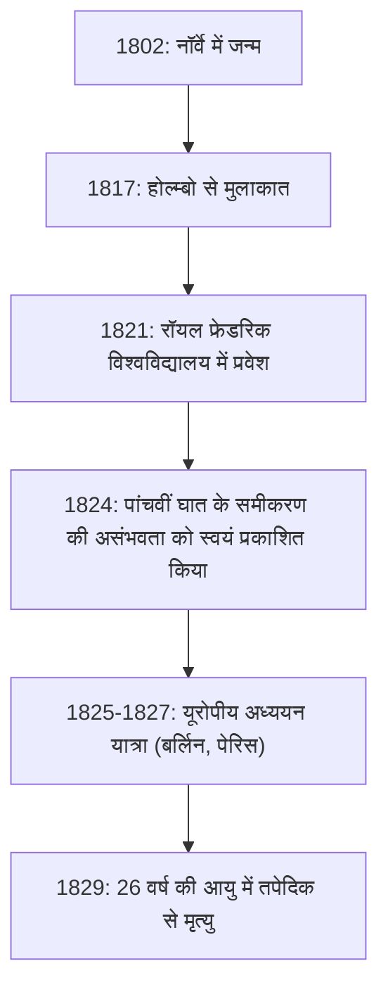
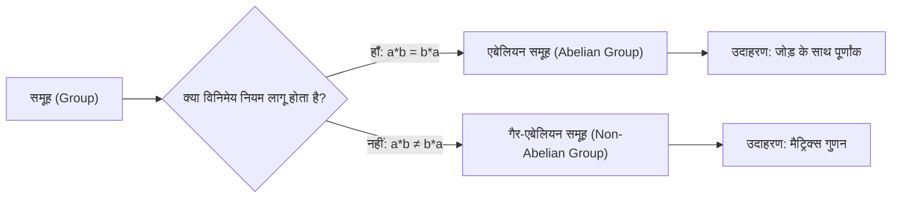

# 1. परिचय: युवा प्रतिभाशाली एबेल

गणित के इतिहास में, कुछ ऐसे प्रतिभाशाली लोग हुए हैं जिनका कम उम्र में ही निधन हो गया लेकिन उन्होंने आने वाली पीढ़ियों पर एक निर्णायक प्रभाव छोड़ा। उनमें से, नॉर्वे में जन्मे **[नील्स हेनरिक एबेल](https://kenji.blog/hi/p/abel/) ([Niels Henrik Abel](https://kenji.blog/hi/p/abel/))**, इवारिस्त गैलवा के साथ, सबसे प्रसिद्ध दुखद प्रतिभाशाली लोगों में से एक के रूप में जाने जाते हैं। केवल 26 वर्ष के अपने छोटे से जीवन में, उन्होंने साबित किया कि "पांचवीं या उच्च घात के समीकरणों के लिए कोई सामान्य बीजगणितीय समाधान नहीं है," एक ऐसी समस्या जिसने सदियों से गणितज्ञों को परेशान किया था।

इस लेख में, हम एबेल के जीवन के बारे में जानेंगे, जो गरीबी और बीमारी के बावजूद गणित के प्रति उनके जुनून से प्रेरित था, और "एबेलियन समूह" और "एबेलियन इंटीग्रल" जैसी उनकी स्मारकीय उपलब्धियों के बारे में जानेंगे।

# 2. एबेल का जीवन: गरीबी और प्रतिभा का खिलना

## 2.1 प्रारंभिक बचपन और अपने गुरु होल्म्बो से मुलाकात

[नील्स हेनरिक एबेल](https://kenji.blog/hi/p/abel/) का जन्म 5 अगस्त 1802 को नॉर्वे के छोटे से गाँव फिनोय में एक पादरी के बेटे के रूप में हुआ था। उस समय नॉर्वे आर्थिक रूप से गरीब था, और एबेल का परिवार भी इसका अपवाद नहीं था।

उनकी नियति काफी हद तक बदल गई जब उन्होंने 1817 में ओस्लो के कैथेड्रल स्कूल में प्रवेश लिया और अपने गणित शिक्षक, **बर्न्ट माइकल होल्म्बो (Bernt Michael Holmboe)** से मिले। होल्म्बो ने तुरंत एबेल की असाधारण प्रतिभा को पहचान लिया और उन्हें विश्वविद्यालय स्तर की उन्नत गणित सिखाई। यूलर, लैग्रेंज और लाप्लास जैसे दिग्गजों के कार्यों का अध्ययन करके, एबेल ने जल्दी ही अत्याधुनिक गणित को आत्मसात कर लिया।

## 2.2 उनके पिता की मृत्यु और एक भारी बोझ

1820 में, जब एबेल 18 वर्ष के थे, उनके पिता का निधन हो गया। उनके पिता ने राजनीतिक संघर्षों को गहरा कर दिया था और भारी कर्ज छोड़कर मर गए थे। परिणामस्वरूप, एबेल को अपनी माँ और छह भाई-बहनों का भरण-पोषण करने की भारी ज़िम्मेदारी उठानी पड़ी। अत्यधिक गरीबी के बावजूद, अपने गुरु होल्म्बो और दोस्तों के समर्थन से, उन्होंने 1821 में रॉयल फ्रेडरिक विश्वविद्यालय (अब ओस्लो विश्वविद्यालय) में प्रवेश लिया।

# 3. पांचवीं घात के समीकरण के सूत्र की असंभवता

एबेल की पहली महान उपलब्धि बीजगणितीय समीकरणों से संबंधित थी। द्विघात समीकरणों के लिए प्राचीन काल से ही एक समाधान सूत्र ज्ञात था, और 16वीं शताब्दी के इटली में त्रिघात और चतुर्थ घात के समीकरणों के सूत्र खोजे गए थे। हालाँकि, उसके बाद लगभग 300 वर्षों तक कोई भी पांचवीं घात के समीकरण के लिए एक सामान्य सूत्र नहीं खोज सका।

शुरुआत में, एबेल को लगा कि उन्होंने पांचवीं घात के समीकरण का सूत्र खोज लिया है और उन्होंने एक शोध पत्र लिखा। हालाँकि, होल्म्बो और अन्य लोगों द्वारा सहकर्मी समीक्षा प्रक्रिया के दौरान, उन्हें अपनी गलती का एहसास हुआ। बाद में, वे विपरीत विचार पर पहुँचे: "क्या ऐसा हो सकता है कि पांचवीं और उससे अधिक घात के समीकरणों के लिए केवल चार बुनियादी अंकगणितीय संक्रियाओं और मूल (radicals) का उपयोग करने वाला कोई सामान्य सूत्र न हो?"

अंततः, 1824 में, उन्होंने इस तथ्य को पूरी तरह से साबित कर दिया। आज, इसे **एबेल-रुफिनी प्रमेय ([Abel](https://kenji.blog/hi/p/abel/)-Ruffini theorem)** के रूप में जाना जाता है (चूंकि इतालवी गणितज्ञ पाओलो रुफिनी ने पहले एक अधूरा प्रमाण प्रकाशित किया था)।

$$ a x^5 + b x^4 + c x^3 + d x^2 + e x + f = 0 \quad (\text{पांचवीं घात के समीकरण का सामान्य रूप}) $$

इस समीकरण के मूलों को केवल $a, b, c, d, e, f$, चार अंकगणितीय संक्रियाओं और मूलों (radicals) का उपयोग करके पदों की एक सीमित संख्या में व्यक्त करना आमतौर पर असंभव है।

# 4. यूरोप की यात्रा और क्रेले से मुलाकात

1825 में, एबेल को नॉर्वेजियन सरकार से छात्रवृत्ति मिली और उन्हें महाद्वीपीय यूरोप में अध्ययन करने का अवसर मिला। उनका लक्ष्य उस समय गणित के केंद्र पेरिस और गोटिंगेन का दौरा करना था, जहाँ महान गणितज्ञ [कार्ल फ्रेडरिक गॉस](https://kenji.blog/hi/p/gauss/) रहते थे।

एबेल ने अपना शोध पत्र गॉस को भेजा, लेकिन गॉस ने बिना पढ़े ही इसे नजरअंदाज कर दिया। गॉस से मिलने की उम्मीद छोड़ कर, एबेल बर्लिन चले गए।

बर्लिन में, उनकी मुलाकात **अगस्त लियोपोल्ड क्रेले (August Leopold Crelle)** से हुई, जो एक सिविल इंजीनियर और गणित के प्रति उत्साही थे। एबेल की प्रतिभा से प्रभावित होकर, क्रेले ने दुनिया की पहली विशेष गणित पत्रिका, *Journal für die reine und angewandte Mathematik* (आमतौर पर क्रेले की पत्रिका के रूप में जानी जाती है) शुरू की। एबेल ने इसके उद्घाटन अंक में कई शोध पत्र दिए, जिससे उनका नाम यूरोपीय गणितीय समुदाय में जाना जाने लगा।

# 5. पेरिस में झटका और कॉची की लापरवाही

1826 में, एबेल पेरिस पहुँचे। यहाँ उन्होंने "पारलौकिक कार्यों से संबंधित एक व्यापक प्रमेय" पर फ्रेंच एकेडमी ऑफ साइंसेज को एक शोध पत्र प्रस्तुत किया, जिसे उनकी उत्कृष्ट कृति माना जा सकता है। इस शोध पत्र में अभूतपूर्व सामग्री थी जिसे बाद में **एबेल के प्रमेय ([Abel](https://kenji.blog/hi/p/abel/)'s theorem)** के रूप में जाना जाने लगा।

हालाँकि, दुर्भाग्य ने फिर दस्तक दी। महान गणितज्ञ **ऑगस्टिन-लुई कॉची ([Augustin-Louis Cauchy](https://kenji.blog/hi/p/cauchy/))**, जिन्हें इसकी समीक्षा करने का काम सौंपा गया था, ने एबेल के शोध पत्र को अपने कमरे में दस्तावेजों के ढेर में खो दिया और कभी इसकी समीक्षा नहीं की।

निराशा, धन की कमी और तपेदिक की बढ़ती बीमारी से प्रेरित होकर, एबेल को पेरिस छोड़ने के लिए मजबूर होना पड़ा।

# 6. घर वापसी और दुखद अंत

1827 में, नॉर्वे लौटने पर एबेल का अत्यधिक गरीबी से सामना हुआ। एक स्थायी शैक्षणिक पद खोजने में असमर्थ, उन्होंने अपने पास बचे थोड़े से समय में पागलों की तरह शोध पत्र लिखे।

6 अप्रैल 1829 को, अपनी मंगेतर और दोस्तों की उपस्थिति में, 26 साल की कम उम्र में एबेल का निधन हो गया।

दुखद बात यह है कि उनकी मृत्यु के ठीक दो दिन बाद, क्रेले का एक पत्र आया। इसमें कहा गया था कि **बर्लिन विश्वविद्यालय में गणित के प्रोफेसर का पद एबेल के लिए सुरक्षित कर लिया गया था**। जब तक उनकी प्रतिभा को वह पहचान मिली जिसके वह हकदार थे, तब तक बहुत देर हो चुकी थी।

# 7. एबेल की गणितीय विरासत

एबेल द्वारा छोड़ी गई उपलब्धियों ने आधुनिक गणित के सभी क्षेत्रों में जड़ें जमा ली हैं।

## 7.1 एबेलियन समूह ([Abel](https://kenji.blog/hi/p/abel/)ian Group)

अमूर्त बीजगणित में, सबसे बुनियादी और महत्वपूर्ण संरचनाओं में से एक "समूह (Group)" है। समूहों के बीच, जिनके परिणाम संचालन के क्रम को बदलने पर भी नहीं बदलते हैं, उन्हें **एबेलियन समूह ([Abel](https://kenji.blog/hi/p/abel/)ian groups)** कहा जाता है।

परिभाषा के अनुसार, एक समूह $G$ को एबेलियन समूह कहा जाता है यदि $G$ में किन्हीं तत्वों $a, b$ के लिए निम्नलिखित विनिमेय नियम (commutative law) लागू होता है:

$$ a * b = b * a \quad (\text{विनिमेय नियम}) $$

## 7.2 एबेलियन इंटीग्रल्स और एबेलियन फ़ंक्शंस

एबेल के पेरिस संस्मरण का विषय, **एबेलियन इंटीग्रल ([Abel](https://kenji.blog/hi/p/abel/)ian integral)**, बीजगणितीय कार्यों से जुड़े इंटीग्रल का सामान्यीकरण है। उनकी मृत्यु के बाद, यह सिद्धांत जैकोबी और अन्य लोगों द्वारा विकसित किया गया, जो बीजीय ज्यामिति में **एबेलियन वैरायटीज़ ([Abel](https://kenji.blog/hi/p/abel/)ian varieties)** जैसे शानदार सिद्धांतों में विकसित हुआ।

## 7.3 एबेल का सीमा प्रमेय ([Abel](https://kenji.blog/hi/p/abel/)'s limit theorem)

एबेल ने विश्लेषण के क्षेत्र में भी एक महत्वपूर्ण छाप छोड़ी। यह अनंत श्रृंखला के अभिसरण से संबंधित एक प्रमेय है।

$$ \lim_{x \to 1^-} \sum_{n=0}^{\infty} a_n x^n = \sum_{n=0}^{\infty} a_n \quad (\text{यदि दाईं ओर की श्रृंखला अभिसरित होती है}) $$

यह प्रमेय आज भी अक्सर विश्लेषणात्मक निरंतरता और स्पर्शोन्मुख विस्तार जैसे सिद्धांतों में उपयोग किया जाता है।

# 8. निष्कर्ष

[नील्स हेनरिक एबेल](https://kenji.blog/hi/p/abel/) का जीवन वास्तव में "त्रासदी" शब्द के अनुकूल था। हालाँकि, उन्होंने गणित में जो जुनून डाला और जो कई प्रमेय उन्होंने तैयार किए, वे कभी फीके नहीं पड़ेंगे। उनके द्वारा छोड़े गए सिद्धांत आज तक गणितज्ञों को नई प्रेरणा प्रदान करते हैं।
