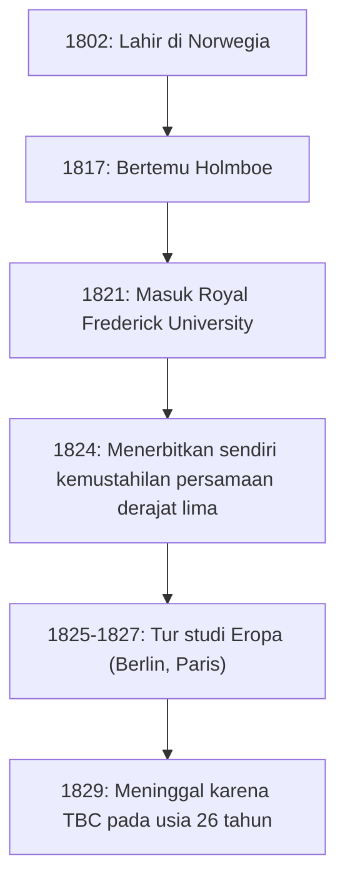
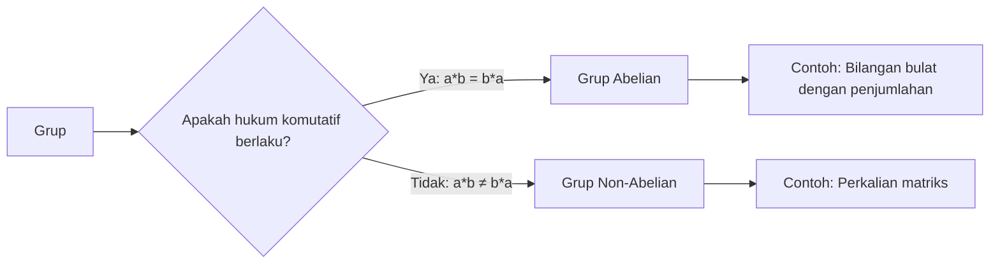

# 1. Pendahuluan: Jenius Muda Abel

Dalam sejarah matematika, ada beberapa jenius yang meninggal di usia muda namun meninggalkan dampak yang menentukan bagi generasi mendatang. Di antara mereka, **Niels Henrik Abel** kelahiran Norwegia menonjol, bersama Évariste Galois, sebagai salah satu jenius tragis yang paling terkenal. Dalam hidupnya yang singkat, hanya 26 tahun, ia membuktikan bahwa "tidak ada solusi aljabar umum untuk persamaan derajat lima atau lebih tinggi", sebuah masalah yang telah mengganggu para matematikawan selama berabad-abad.

Dalam artikel ini, kita akan mempelajari kehidupan Abel, yang didorong oleh hasratnya terhadap matematika terlepas dari kemiskinan dan penyakit, serta pencapaian monumentalnya seperti "Grup Abelian" dan "Integral Abelian".

# 2. Kehidupan Abel: Kemiskinan dan Mekarnya Bakat

## 2.1 Masa Kecil dan Pertemuan dengan Mentornya Holmboe

Niels Henrik Abel lahir pada 5 Agustus 1802, di desa kecil Finnøy, Norwegia, sebagai putra seorang pendeta. Norwegia pada saat itu miskin secara ekonomi, dan keluarga Abel tidak terkecuali.

Takdirnya berubah secara signifikan ketika ia memasuki Sekolah Katedral di Oslo pada tahun 1817 dan bertemu dengan guru matematikanya, **Bernt Michael Holmboe**. Holmboe segera mengenali bakat luar biasa Abel dan mengajarinya matematika tingkat lanjut setingkat universitas. Dengan melahap karya-karya master seperti Euler, Lagrange, dan Laplace, Abel dengan cepat menyerap matematika mutakhir.

## 2.2 Kematian Ayahnya dan Beban Berat

Pada tahun 1820, saat Abel berusia 18 tahun, ayahnya meninggal dunia. Ayahnya telah memperdalam konflik politik dan meninggal dengan meninggalkan banyak hutang. Akibatnya, Abel harus memikul tanggung jawab berat untuk menghidupi ibu dan enam saudara kandungnya. Meskipun berada dalam kemiskinan ekstrem, dengan dukungan mentornya Holmboe dan teman-temannya, ia masuk Royal Frederick University (kini University of Oslo) pada tahun 1821.

# 3. Kemustahilan Rumus Persamaan Derajat Lima

Pencapaian besar pertama Abel berkaitan dengan persamaan aljabar. Persamaan kuadrat telah memiliki rumus penyelesaian yang diketahui sejak zaman kuno, dan rumus untuk persamaan pangkat tiga dan pangkat empat ditemukan di Italia pada abad ke-16. Namun, tidak ada yang bisa menemukan rumus umum untuk persamaan derajat lima (kuintik) selama hampir 300 tahun setelahnya.

Awalnya, Abel mengira dia telah menemukan rumus persamaan derajat lima dan menulis sebuah makalah. Namun, selama proses tinjauan sejawat oleh Holmboe dan lainnya, dia menyadari kesalahannya. Selanjutnya, ia sampai pada gagasan yang berlawanan: "Mungkinkah tidak ada rumus umum yang hanya menggunakan empat operasi aritmatika dasar dan akar untuk persamaan berderajat lima dan lebih tinggi?"

Akhirnya, pada tahun 1824, dia membuktikan fakta ini sepenuhnya. Saat ini, hal tersebut dikenal sebagai **Teorema Abel-Ruffini** (karena matematikawan Italia Paolo Ruffini sebelumnya telah menerbitkan bukti yang tidak lengkap).

$$ a x^5 + b x^4 + c x^3 + d x^2 + e x + f = 0 \quad (\text{Bentuk umum persamaan derajat lima}) $$

Secara umum tidak mungkin menyatakan akar-akar persamaan ini dalam jumlah suku yang berhingga menggunakan hanya $a, b, c, d, e, f$, empat operasi aritmatika, dan akar.

# 4. Perjalanan ke Eropa dan Pertemuan dengan Crelle

Pada tahun 1825, Abel memperoleh beasiswa dari pemerintah Norwegia dan memiliki kesempatan untuk belajar di benua Eropa. Tujuannya adalah mengunjungi Paris, pusat matematika saat itu, dan Göttingen, tempat tinggal matematikawan hebat Carl Friedrich Gauss.

Abel mengirimkan makalahnya ke Gauss, tetapi Gauss mengabaikannya tanpa membacanya. Menyerah untuk bertemu Gauss, Abel menuju ke Berlin.

Di Berlin, dia bertemu **August Leopold Crelle**, seorang insinyur sipil dan penggemar berat matematika. Terkesan dengan bakat Abel, Crelle meluncurkan jurnal matematika khusus pertama di dunia, *Journal für die reine und angewandte Mathematik* (umumnya dikenal sebagai Jurnal Crelle). Abel menyumbangkan banyak makalah pada edisi perdananya, membuat namanya dikenal di komunitas matematika Eropa.

# 5. Kemunduran di Paris dan Kelalaian Cauchy

Pada tahun 1826, Abel tiba di Paris. Di sini dia menyerahkan sebuah makalah kepada Akademi Ilmu Pengetahuan Prancis tentang "Teorema luas mengenai fungsi transenden", yang dapat dianggap sebagai mahakaryanya. Makalah ini berisi konten terobosan yang kemudian dikenal sebagai **Teorema Abel**.

Namun, kemalangan kembali melanda. Matematikawan hebat **Augustin-Louis Cauchy**, yang ditugaskan untuk meninjaunya, salah meletakkan makalah Abel di tumpukan dokumen di kamarnya dan tidak pernah meninjaunya.

Terdorong oleh keputusasaan, kekurangan dana, dan penyakit tuberkulosis yang semakin parah, Abel terpaksa meninggalkan Paris.

# 6. Pulang ke Rumah dan Akhir yang Tragis

Pada tahun 1827, kemiskinan ekstrem menanti Abel setibanya di Norwegia. Karena tidak dapat menemukan posisi akademis permanen, dia menulis makalah dengan panik di sisa waktu yang dimilikinya.

Pada tanggal 6 April 1829, diawasi oleh tunangan dan teman-temannya, Abel meninggal dunia di usia muda 26 tahun.

Tragisnya, hanya dua hari setelah kematiannya, sepucuk surat tiba dari Crelle. Surat itu menyatakan bahwa **posisi profesor matematika di Universitas Berlin telah diamankan untuk Abel**. Pada saat bakatnya menerima pengakuan yang selayaknya, semuanya sudah terlambat.

# 7. Warisan Matematika Abel

Pencapaian yang ditinggalkan Abel telah mengakar di semua bidang matematika modern.

## 7.1 Grup Abelian

Dalam aljabar abstrak, salah satu struktur yang paling mendasar dan penting adalah "Grup". Di antara grup-grup tersebut, grup yang hasilnya tidak berubah meskipun urutan operasinya ditukar disebut **Grup Abelian**.

Berdasarkan definisi, suatu grup $G$ disebut grup Abelian jika hukum komutatif berikut berlaku untuk setiap elemen $a, b$ di $G$:

$$ a * b = b * a \quad (\text{Hukum komutatif}) $$

## 7.2 Integral Abelian dan Fungsi Abelian

Subjek memoar Paris Abel, **Integral Abelian**, adalah perumuman integral yang melibatkan fungsi aljabar. Setelah kematiannya, teori ini dikembangkan oleh Jacobi dan lainnya, berkembang menjadi teori-teori luar biasa seperti **Varietas Abelian** dalam geometri aljabar.

## 7.3 Teorema Limit Abel

Abel juga meninggalkan jejak penting dalam bidang analisis. Ini adalah teorema mengenai konvergensi deret tak terhingga.

$$ \lim_{x \to 1^-} \sum_{n=0}^{\infty} a_n x^n = \sum_{n=0}^{\infty} a_n \quad (\text{jika deret di ruas kanan konvergen}) $$

Teorema ini masih sering digunakan sampai sekarang dalam teori-teori seperti kelanjutan analitik dan ekspansi asimtotik.

# 8. Kesimpulan

Kehidupan Niels Henrik Abel benar-benar cocok dengan kata "tragedi". Namun, hasrat yang dia curahkan ke dalam matematika dan banyak teorema yang dia hasilkan tidak akan pernah pudar. Teori-teori yang ditinggalkannya terus memberikan inspirasi baru bagi para matematikawan hingga saat ini.
