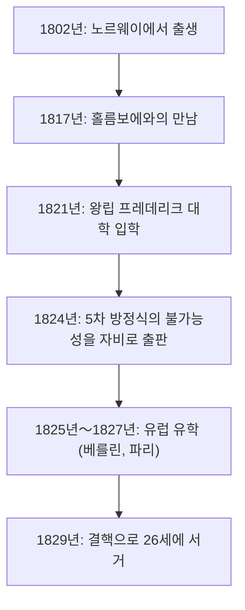
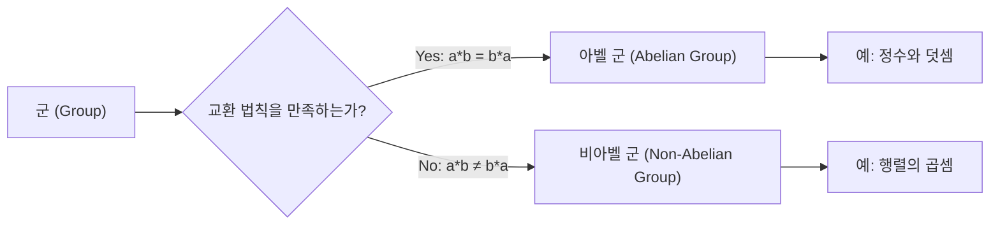

# 1. 서론: 요절한 천재 아벨

수학의 역사에는 젊은 나이에 생을 마감했지만, 후대 수학계에 결정적인 영향을 미친 천재들이 몇 명 있습니다. 그중에서도 노르웨이 출신의 **[닐스 헨리크 아벨](https://kenji.blog/ko/p/abel/) ([Niels Henrik Abel](https://kenji.blog/ko/p/abel/))** 은 에바리스트 갈루아와 함께 가장 유명한 비운의 천재로 꼽힙니다. 그는 불과 26세라는 짧은 생애 동안, 수 세기에 걸쳐 수학자들을 괴롭혀 온 "5차 이상의 대수 방정식에는 일반적인 근의 공식이 존재하지 않는다"는 사실을 증명했습니다.

본 기사에서는 빈곤과 질병에 시달리면서도 수학에 대한 열정을 불태웠던 아벨의 생애와 그가 남긴 "아벨 군", "아벨 적분" 등의 중요한 수학적 업적에 대해 자세히 살펴보겠습니다.

# 2. 아벨의 생애: 빈곤과 재능의 만개

## 2.1 유년기와 은사 홀름보에와의 만남

[닐스 헨리크 아벨](https://kenji.blog/ko/p/abel/)은 1802년 8월 5일, 노르웨이의 작은 마을 핀뇌위에서 목사의 아들로 태어났습니다. 당시 노르웨이는 경제적으로 궁핍했고, 아벨의 가정 또한 예외는 아니었습니다.

그의 운명이 크게 바뀐 것은 1817년 오슬로의 주교좌 학교에 입학하여 수학 교사 **베른트 미카엘 홀름보에 (Bernt Michael Holmboe)** 와 만난 것이었습니다. 홀름보에는 아벨의 뛰어난 수학적 재능을 단번에 알아보고, 그에게 대학 수준의 고등 수학을 가르쳤습니다. 오일러나 라그랑주, 라플라스와 같은 거장들의 저서를 탐독한 아벨은 순식간에 최첨단 수학을 흡수해 나갔습니다.

## 2.2 아버지의 죽음과 짊어진 중압감

1820년, 아벨이 18세 되던 해에 아버지가 세상을 떠납니다. 아버지는 정치적으로도 대립을 겪었으며, 거액의 빚을 남기고 세상을 떠났습니다. 이로 인해 아벨은 어머니와 6명의 형제를 부양해야 한다는 무거운 책임을 짊어지게 됩니다. 극심한 빈곤 속에서도 그는 은사 홀름보에와 친구들의 원조를 받으며 1821년 왕립 프레데리크 대학(현재의 오슬로 대학)에 입학했습니다.

# 3. 5차 방정식의 근의 공식의 불가능성

아벨의 첫 번째 위대한 업적은 대수 방정식에 관한 것이었습니다. 2차 방정식에는 고대부터 알려진 근의 공식이 있었고, 3차 및 4차 방정식의 근의 공식은 16세기 이탈리아에서 발견되었습니다. 그러나 5차 방정식의 근의 공식은 그 이후 거의 300년 동안 아무도 찾지 못했습니다.

아벨은 처음에 자신이 5차 방정식의 근의 공식을 발견했다고 생각하여 논문을 작성했습니다. 그러나 홀름보에 등의 심사 과정에서 자신의 오류를 깨닫게 됩니다. 그 후 그는 역발상을 하게 됩니다. "5차 이상의 방정식에는 사칙연산과 거듭제곱근만을 이용한 일반적인 근의 공식이 존재하지 않는 것은 아닐까?"

마침내 1824년, 그는 이 사실을 완전히 증명했습니다. 이것은 오늘날 **아벨-루피니 정리 (Abel-Ruffini theorem)** 라고 불립니다 (이탈리아의 수학자 파올로 루피니가 이전에 불완전한 증명을 발표했기 때문입니다).

$$ a x^5 + b x^4 + c x^3 + d x^2 + e x + f = 0 \quad (\text{5차 방정식의 일반형}) $$

이 방정식의 해를 $a, b, c, d, e, f$ 와 사칙연산, 그리고 거듭제곱근만을 이용하여 유한 번으로 나타내는 것은 일반적으로 불가능합니다.

# 4. 유럽 여행과 크렐레와의 만남

1825년, 아벨은 노르웨이 정부로부터 장학금을 받아 유럽 대륙으로 유학할 기회를 얻었습니다. 그의 목적지는 당시 수학의 중심지였던 파리와 위대한 수학자 칼 프리드리히 가우스가 있는 괴팅겐이었습니다.

가우스에게 자신의 논문을 보냈던 아벨이었지만, 가우스는 그 논문을 읽지도 않고 방치해 버렸습니다. 면담을 단념한 아벨은 베를린으로 향합니다.

베를린에서 그는 토목 기사이자 수학의 열렬한 애호가였던 **아우구스트 레오폴트 크렐레 (August Leopold Crelle)** 와 만납니다. 크렐레는 아벨의 재능에 감명받아 세계 최초의 수학 전문 학술지인 『순수 및 응용 수학 학술지(통칭: 크렐레지)』를 창간했습니다. 아벨은 이 잡지의 창간호에 여러 편의 논문을 기고하며 유럽 수학계에 그 이름을 알리게 됩니다.

# 5. 파리에서의 좌절과 코시의 태만

1826년, 아벨은 파리에 도착합니다. 이곳에서 그는 자신의 최고 걸작이라고도 할 수 있는 "초월 함수에 관한 광범위한 정리"에 대한 논문을 프랑스 과학 아카데미에 제출했습니다. 이 논문은 나중에 **아벨의 정리 (Abel's theorem)** 로 알려지게 될 획기적인 내용을 포함하고 있었습니다.

그러나 여기서도 불운이 그를 덮칩니다. 심사를 맡았던 대수학자 **[오귀스탱 루이 코시](https://kenji.blog/ko/p/cauchy/) ([Augustin-Louis Cauchy](https://kenji.blog/ko/p/cauchy/))** 는 아벨의 논문을 자신의 방에 있는 서류 더미 속에 섞어버렸고, 끝내 심사하지 않았습니다.

실의와 자금난, 그리고 서서히 다가오는 결핵의 병마로 인해 아벨은 파리를 떠날 수밖에 없었습니다.

# 6. 귀국과 비극적인 최후

1827년, 귀국한 아벨을 기다리고 있었던 것은 다시 찾아온 극심한 빈곤이었습니다. 대학에서 정규직을 찾지 못한 채, 그는 남은 얼마 안 되는 시간 동안 미친 듯이 논문을 계속 썼습니다.

1829년 4월 6일, 아벨은 약혼녀와 친구들이 지켜보는 가운데 26세라는 젊은 나이에 세상을 떠났습니다.

비극적이게도 그의 죽음으로부터 불과 이틀 뒤, 크렐레로부터 편지가 도착합니다. 그곳에는 **베를린 대학교의 수학 교수직이 아벨을 위해 마련되었다** 는 내용이 적혀 있었습니다. 그의 재능이 정당한 평가를 받았을 때는 이미 너무 늦어버렸던 것입니다.

# 7. 아벨의 수학적 유산

아벨이 남긴 업적은 현대 수학의 모든 분야에 뿌리내리고 있습니다.

## 7.1 아벨 군 (Abelian Group)

추상 대수학에서 가장 기본적이고 중요한 구조 중 하나가 '군 (Group)'입니다. 군 중에서도 연산의 순서를 바꾸어도 결과가 변하지 않는 것을 **아벨 군 (Abelian group)** 이라고 부릅니다.

정의하자면, 군 $G$ 의 임의의 원소 $a, b$ 에 대해 다음의 교환 법칙이 성립할 때 그 군을 아벨 군이라고 합니다.

$$ a * b = b * a \quad (\text{교환 법칙}) $$

## 7.2 아벨 적분과 아벨 함수

아벨의 파리 논문의 주제였던 **아벨 적분 (Abelian integral)** 은 대수 함수를 포함하는 적분의 일반화입니다. 그의 사후에 야코비 등에 의해 이 이론은 발전하여, 대수 기하학에서의 **아벨 다양체 (Abelian variety)** 등 장대한 이론으로 성장했습니다.

## 7.3 아벨의 연속성 정리 (Abel's limit theorem)

해석학 분야에서도 아벨은 중요한 발자취를 남겼습니다. 무한 급수의 수렴에 관한 정리입니다.

$$ \lim_{x \to 1^-} \sum_{n=0}^{\infty} a_n x^n = \sum_{n=0}^{\infty} a_n \quad (\text{우변의 급수가 수렴하는 경우}) $$

이 정리는 해석적 연속이나 점근 전개 등의 이론에서 오늘날에도 빈번하게 사용되고 있습니다.

# 8. 결론

[닐스 헨리크 아벨](https://kenji.blog/ko/p/abel/)의 생애는 그야말로 '비극'이라는 단어가 어울리는 것이었습니다. 그러나 그가 수학에 쏟았던 열정과 수많은 정리들은 결코 퇴색되지 않을 것입니다. 그가 남긴 이론들은 지금도 여전히 수학자들에게 새로운 영감을 불어넣어 주고 있습니다.
