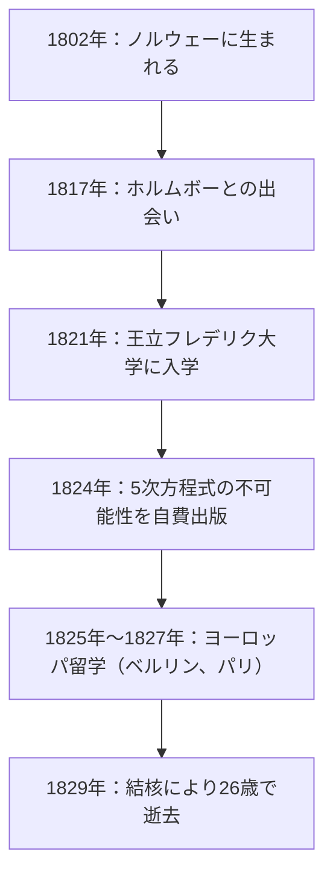
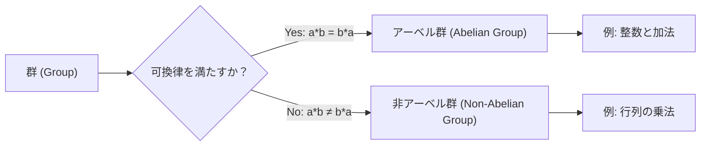

# 1. はじめに：早世の天才[アーベル](https://kenji.blog/p/abel/)

数学の歴史において、若くして命を散らしながらも、後の数学界に決定的な影響を与えた天才が何人か存在します。その中でも、ノルウェー出身の **[ニールス・ヘンリック・アーベル](https://kenji.blog/p/abel/) (Niels Henrik Abel)** は、[エヴァリスト・ガロア](https://kenji.blog/p/galois/)と並んで最も有名な悲劇の天才と言えるでしょう。彼はわずか26歳という短い生涯の中で、数世紀にわたって数学者たちを悩ませてきた「5次以上の代数方程式には一般的な解の公式が存在しない」という事実を証明しました。

本記事では、貧困と病に苦しみながらも数学への情熱を燃やし続けた[アーベル](https://kenji.blog/p/abel/)の生涯と、彼が遺した「アーベル群」や「[アーベル](https://kenji.blog/p/abel/)積分」などの重要な数学的業績について、詳しく解説していきます。

# 2. [アーベル](https://kenji.blog/p/abel/)の生涯：貧困と才能の開花

## 2.1 幼少期と恩師ホルムボーとの出会い

[ニールス・ヘンリック・アーベル](https://kenji.blog/p/abel/)は、1802年8月5日、ノルウェーの小さな村フィンドーで、牧師の息子として生まれました。当時のノルウェーは経済的に困窮しており、[アーベル](https://kenji.blog/p/abel/)の家庭も例外ではありませんでした。

彼の運命が大きく変わったのは、1817年にオスロのカテドラル・スクールに入学し、数学教師 **ベルント・ミカエル・ホルムボー (Bernt Michael Holmboe)** と出会ったことでした。ホルムボーは[アーベル](https://kenji.blog/p/abel/)の並外れた数学的才能をすぐに見抜き、彼に大学レベルの高度な数学を教え込みました。オイラーやラグランジュ、ラプラスといった巨匠たちの著作を読み漁った[アーベル](https://kenji.blog/p/abel/)は、瞬く間に最先端の数学を吸収していきました。

## 2.2 父親の死と背負わされた重圧

1820年、[アーベル](https://kenji.blog/p/abel/)が18歳のとき、父親が亡くなります。父親は政治的にも対立を深め、多額の借金を残してこの世を去りました。これにより、[アーベル](https://kenji.blog/p/abel/)は母親と6人の兄弟を養うという重い責任を背負うことになります。極貧の中、彼は恩師ホルムボーや友人たちの援助を受けながら、1821年に王立フレデリク大学（現在のオスロ大学）に入学しました。

# 3. 5次方程式の解の公式の不可能性

[アーベル](https://kenji.blog/p/abel/)の最初の偉大な業績は、代数方程式に関するものでした。2次方程式には古代から知られる解の公式があり、3次および4次方程式の解の公式は16世紀のイタリアで発見されていました。しかし、5次方程式の解の公式は、それ以降300年近くにわたり、誰も見つけることができませんでした。

[アーベル](https://kenji.blog/p/abel/)は当初、自身が5次方程式の解の公式を発見したと考え、論文を作成しました。しかし、ホルムボーらによる査読の過程で自らの誤りに気づきます。その後、彼は逆の発想に至りました。「5次以上の方程式には、四則演算と冪根だけを用いた一般的な解の公式は存在しないのではないか？」

ついに1824年、彼はこの事実を完全に証明しました。これは今日 **[アーベル](https://kenji.blog/p/abel/)＝ルフィニの定理 ([Abel](https://kenji.blog/p/abel/)-Ruffini theorem)** と呼ばれています（イタリアの数学者パオロ・ルフィニが以前に不完全な証明を発表していたためです）。

$$ a x^5 + b x^4 + c x^3 + d x^2 + e x + f = 0 \quad (\text{5次方程式の一般形}) $$

この方程式の解を、$a, b, c, d, e, f$ と四則演算、および冪根のみを用いて有限回で表すことは、一般的には不可能です。

# 4. ヨーロッパへの旅とクレレとの出会い

1825年、[アーベル](https://kenji.blog/p/abel/)はノルウェー政府から奨学金を得て、ヨーロッパ大陸へ留学する機会を得ました。彼の目的は、当時の数学の中心地であったパリと、偉大な数学者カール・フリードリヒ・[ガウス](https://kenji.blog/p/gauss/)がいるゲッティンゲンを訪れることでした。

[ガウス](https://kenji.blog/p/gauss/)に自身の論文を送ったアーベルでしたが、ガウスはその論文を読むことなく放置してしまいました。面会を諦めた[アーベル](https://kenji.blog/p/abel/)はベルリンへ向かいます。

ベルリンで彼は、土木技師であり数学の熱心な愛好家であった **アウグスト・レオポルド・クレレ (August Leopold Crelle)** と出会います。クレレは[アーベル](https://kenji.blog/p/abel/)の才能に感銘を受け、世界初の数学専門学術誌である『純粋・応用数学誌（通称：クレレ誌）』を創刊しました。[アーベル](https://kenji.blog/p/abel/)はこの雑誌の創刊号に複数の論文を寄稿し、ヨーロッパの数学界にその名を知らしめることになります。

# 5. パリでの挫折と[コーシー](https://kenji.blog/p/cauchy/)の怠慢

1826年、[アーベル](https://kenji.blog/p/abel/)はパリに到着します。ここで彼は、自身の最高傑作とも言える「超越関数に関する広範な定理」についての論文をフランス科学アカデミーに提出しました。この論文は、後に **アーベルの定理 ([Abel](https://kenji.blog/p/abel/)'s theorem)** として知られることになる画期的な内容を含んでいました。

しかし、ここでも不運が彼を襲います。審査を任された大数学者 **[オーギュスタン＝ルイ・コーシー](https://kenji.blog/p/cauchy/) (Augustin-Louis Cauchy)** は、[アーベル](https://kenji.blog/p/abel/)の論文を自室の書類の山に紛れ込ませてしまい、審査を行いませんでした。

失意と資金難、そして徐々に忍び寄る結核の病魔により、[アーベル](https://kenji.blog/p/abel/)はパリを離れることを余儀なくされました。

# 6. 帰国と悲劇的な最期

1827年、帰国した[アーベル](https://kenji.blog/p/abel/)を待っていたのは、再びの極貧生活でした。大学での定職は見つからず、彼は残されたわずかな時間で狂ったように論文を書き続けました。

1829年4月6日、[アーベル](https://kenji.blog/p/abel/)は婚約者と友人に看取られながら、26歳という若さでこの世を去りました。

悲劇的なことに、彼の死からわずか2日後、クレレからの手紙が届きます。そこには、 **ベルリン大学の数学教授のポストが[アーベル](https://kenji.blog/p/abel/)のために用意された** ことが記されていました。彼の才能が正当な評価を得たときには、すでに遅すぎたのです。

# 7. [アーベル](https://kenji.blog/p/abel/)の数学的遺産

[アーベル](https://kenji.blog/p/abel/)が残した業績は、現代数学のあらゆる分野に根付いています。

## 7.1 [アーベル](https://kenji.blog/p/abel/)群 ([Abel](https://kenji.blog/p/abel/)ian Group)

抽象代数学において、最も基本的かつ重要な構造の一つが「群 (Group)」です。群の中でも、演算の順序を入れ替えても結果が変わらないものを **[アーベル](https://kenji.blog/p/abel/)群 ([Abel](https://kenji.blog/p/abel/)ian group)** と呼びます。

定義としては、群 $G$ の任意の要素 $a, b$ について、以下の可換律が成り立つとき、その群を[アーベル](https://kenji.blog/p/abel/)群と呼びます。

$$ a * b = b * a \quad (\text{可換律}) $$

## 7.2 [アーベル](https://kenji.blog/p/abel/)積分と[アーベル](https://kenji.blog/p/abel/)関数

[アーベル](https://kenji.blog/p/abel/)のパリ論文の主題であった **アーベル積分 (Abelian integral)** は、代数関数を含む積分の一般化です。彼の死後、ヤコビらによってこの理論は発展し、代数幾何学における **アーベル多様体 ([Abel](https://kenji.blog/p/abel/)ian variety)** などの壮大な理論へと成長しました。

## 7.3 [アーベル](https://kenji.blog/p/abel/)の連続性定理 ([Abel](https://kenji.blog/p/abel/)'s limit theorem)

解析学の分野でも、[アーベル](https://kenji.blog/p/abel/)は重要な足跡を残しました。無限級数の収束に関する定理です。

$$ \lim_{x \to 1^-} \sum_{n=0}^{\infty} a_n x^n = \sum_{n=0}^{\infty} a_n \quad (\text{右辺の級数が収束する場合}) $$

この定理は、解析接続や漸近展開などの理論で今日でも頻繁に用いられています。

# 8. おわりに

[ニールス・ヘンリック・アーベル](https://kenji.blog/p/abel/)の生涯は、まさに「悲劇」という言葉がふさわしいものでした。しかし、彼が数学に注いだ情熱と数々の定理は、決して色褪せることはありません。彼の残した理論は、今もなお数学者たちに新たなインスピレーションを与え続けています。
