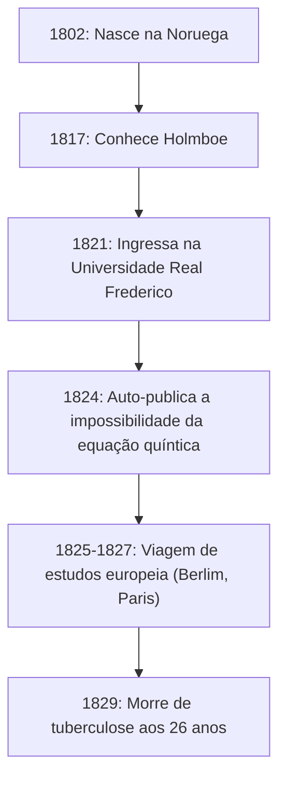
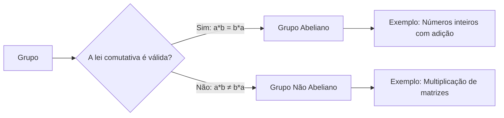

# 1. Introdução: O Jovem Gênio [Abel](https://kenji.blog/pt/p/abel/)

Na história da matemática, existem alguns gênios que faleceram precocemente, mas que deixaram um impacto decisivo nas gerações futuras. Entre eles, o norueguês **[Niels Henrik Abel](https://kenji.blog/pt/p/abel/)** destaca-se, juntamente com [Évariste Galois](https://kenji.blog/pt/p/galois/), como um dos gênios trágicos mais famosos. Na sua curta vida de apenas 26 anos, ele provou que "não existe uma solução algébrica geral para equações de grau cinco ou superior", um problema que atormentava os matemáticos há séculos.

Neste artigo, aprofundaremos na vida de [Abel](https://kenji.blog/pt/p/abel/), impulsionada por sua paixão pela matemática apesar da pobreza e da doença, e nas suas realizações monumentais, como os "grupos abelianos" e as "integrais abelianas".

# 2. A Vida de [Abel](https://kenji.blog/pt/p/abel/): Pobreza e o Florescimento do Talento

## 2.1 Primeira Infância e o Encontro com o seu Mentor Holmboe

[Niels Henrik Abel](https://kenji.blog/pt/p/abel/) nasceu a 5 de agosto de 1802, na pequena vila norueguesa de Finnøy, filho de um pastor. A Noruega, na época, estava economicamente empobrecida, e a família de [Abel](https://kenji.blog/pt/p/abel/) não era exceção.

O seu destino mudou significativamente quando ingressou na Escola da Catedral de Oslo em 1817 e conheceu o seu professor de matemática, **Bernt Michael Holmboe**. Holmboe reconheceu imediatamente o extraordinário talento de [Abel](https://kenji.blog/pt/p/abel/) e ensinou-lhe matemática avançada de nível universitário. Devorando as obras de mestres como Euler, Lagrange e Laplace, [Abel](https://kenji.blog/pt/p/abel/) absorveu rapidamente a matemática de ponta.

## 2.2 A Morte do seu Pai e um Fardo Pesado

Em 1820, quando [Abel](https://kenji.blog/pt/p/abel/) tinha 18 anos, o seu pai faleceu. O seu pai tinha agravado os conflitos políticos e morreu deixando para trás pesadas dívidas. Como resultado, [Abel](https://kenji.blog/pt/p/abel/) teve de assumir a pesada responsabilidade de sustentar a sua mãe e seis irmãos. Apesar da extrema pobreza, com o apoio do seu mentor Holmboe e de amigos, ingressou na Universidade Real Frederico (hoje Universidade de Oslo) em 1821.

# 3. A Impossibilidade da Fórmula da Equação Quíntica

A primeira grande realização de [Abel](https://kenji.blog/pt/p/abel/) esteve relacionada com as equações algébricas. As equações quadráticas têm uma fórmula de solução conhecida desde a antiguidade, e as fórmulas para as equações cúbicas e quárticas foram descobertas na Itália do século XVI. No entanto, ninguém conseguiu encontrar uma fórmula geral para a equação quíntica durante quase 300 anos depois disso.

Inicialmente, [Abel](https://kenji.blog/pt/p/abel/) pensou que tinha descoberto a fórmula para a equação quíntica e escreveu um artigo. No entanto, durante o processo de revisão por pares por parte de Holmboe e outros, ele percebeu o seu erro. Subsequentemente, chegou à ideia oposta: "Será que não existe uma fórmula geral utilizando apenas as quatro operações aritméticas fundamentais e radicais para equações de grau cinco e superior?"

Finalmente, em 1824, ele provou completamente este facto. Hoje, isto é conhecido como o **teorema de [Abel](https://kenji.blog/pt/p/abel/)-Ruffini** (uma vez que o matemático italiano Paolo Ruffini havia publicado anteriormente uma prova incompleta).

$$ a x^5 + b x^4 + c x^3 + d x^2 + e x + f = 0 \quad (\text{Forma geral da equação quíntica}) $$

É geralmente impossível expressar as raízes desta equação num número finito de termos utilizando apenas $a, b, c, d, e, f$, as quatro operações aritméticas e os radicais.

# 4. Viagem à Europa e o Encontro com Crelle

Em 1825, [Abel](https://kenji.blog/pt/p/abel/) obteve uma bolsa do governo norueguês e teve a oportunidade de estudar na Europa continental. O seu objetivo era visitar Paris, o centro da matemática na época, e Göttingen, onde residia o grande matemático [Carl Friedrich Gauss](https://kenji.blog/pt/p/gauss/).

[Abel](https://kenji.blog/pt/p/abel/) enviou o seu artigo para Gauss, mas Gauss ignorou-o sem sequer o ler. Desistindo de conhecer Gauss, [Abel](https://kenji.blog/pt/p/abel/) dirigiu-se para Berlim.

Em Berlim, conheceu **August Leopold Crelle**, um engenheiro civil e apaixonado entusiasta da matemática. Impressionado com o talento de [Abel](https://kenji.blog/pt/p/abel/), Crelle lançou a primeira revista especializada em matemática do mundo, *Journal für die reine und angewandte Mathematik* (comumente conhecida como Jornal de Crelle). [Abel](https://kenji.blog/pt/p/abel/) contribuiu com vários artigos para o seu número inaugural, dando a conhecer o seu nome na comunidade matemática europeia.

# 5. Revés em Paris e a Negligência de [Cauchy](https://kenji.blog/pt/p/cauchy/)

Em 1826, [Abel](https://kenji.blog/pt/p/abel/) chegou a Paris. Aqui, ele submeteu um artigo à Academia Francesa de Ciências sobre um "Amplo teorema sobre funções transcendentes", que poderia ser considerado a sua obra-prima. Este artigo continha um conteúdo inovador que mais tarde seria conhecido como o **teorema de [Abel](https://kenji.blog/pt/p/abel/)**.

No entanto, a tragédia atacou novamente. O grande matemático **[Augustin-Louis Cauchy](https://kenji.blog/pt/p/cauchy/)**, encarregado de o rever, perdeu o artigo de [Abel](https://kenji.blog/pt/p/abel/) numa pilha de documentos no seu quarto e nunca o reviu.

Movido pelo desespero, pela falta de fundos e pela doença progressiva da tuberculose, [Abel](https://kenji.blog/pt/p/abel/) foi forçado a deixar Paris.

# 6. Regresso a Casa e um Fim Trágico

Em 1827, a pobreza extrema aguardava [Abel](https://kenji.blog/pt/p/abel/) no seu regresso à Noruega. Incapaz de encontrar um cargo académico permanente, ele escreveu artigos freneticamente no pouco tempo que lhe restava.

A 6 de abril de 1829, assistido pela sua noiva e pelos seus amigos, [Abel](https://kenji.blog/pt/p/abel/) faleceu na jovem idade de 26 anos.

Tragicamente, apenas dois dias após a sua morte, chegou uma carta de Crelle. Afirmava que **um cargo de professor de matemática na Universidade de Berlim havia sido garantido para [Abel](https://kenji.blog/pt/p/abel/)**. Quando o seu talento recebeu o merecido reconhecimento, já era tarde demais.

# 7. O Legado Matemático de [Abel](https://kenji.blog/pt/p/abel/)

As realizações que [Abel](https://kenji.blog/pt/p/abel/) deixou para trás enraizaram-se em todas as áreas da matemática moderna.

## 7.1 Grupo [Abel](https://kenji.blog/pt/p/abel/)iano

Na álgebra abstrata, uma das estruturas mais fundamentais e importantes é o "Grupo". Entre os grupos, aqueles em que o resultado não muda mesmo que a ordem das operações seja invertida são chamados de **grupos abelianos**.

Por definição, um grupo $G$ é chamado de grupo abeliano se a seguinte lei comutativa for válida para quaisquer elementos $a, b$ em $G$:

$$ a * b = b * a \quad (\text{Lei comutativa}) $$

## 7.2 Integrais [Abel](https://kenji.blog/pt/p/abel/)ianas e Funções [Abel](https://kenji.blog/pt/p/abel/)ianas

O tema da memória de Paris de [Abel](https://kenji.blog/pt/p/abel/), a **integral abeliana**, é uma generalização das integrais envolvendo funções algébricas. Após a sua morte, esta teoria foi desenvolvida por [Jacobi](https://kenji.blog/pt/p/jacobi/) e outros, crescendo em teorias magníficas como as **variedades abelianas** na geometria algébrica.

## 7.3 Teorema do Limite de [Abel](https://kenji.blog/pt/p/abel/)

[Abel](https://kenji.blog/pt/p/abel/) também deixou uma marca significativa no campo da análise. É um teorema referente à convergência de séries infinitas.

$$ \lim_{x \to 1^-} \sum_{n=0}^{\infty} a_n x^n = \sum_{n=0}^{\infty} a_n \quad (\text{se a série do lado direito convergir}) $$

Este teorema ainda é frequentemente utilizado hoje em dia em teorias como o prolongamento analítico e a expansão assintótica.

# 8. Conclusão

A vida de [Niels Henrik Abel](https://kenji.blog/pt/p/abel/) enquadra-se perfeitamente na palavra "tragédia". No entanto, a paixão que ele depositou na matemática e os numerosos teoremas que produziu nunca desaparecerão. As teorias que deixou para trás continuam a fornecer nova inspiração aos matemáticos até hoje.
