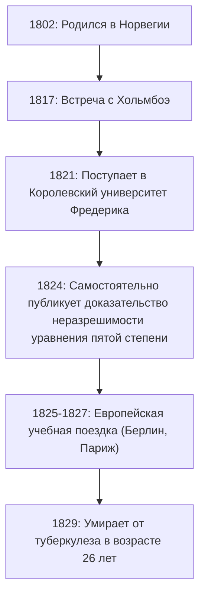
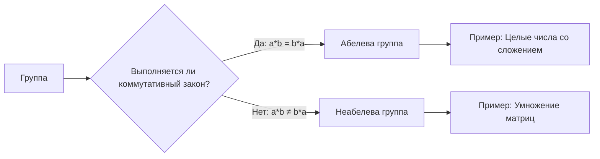

# 1. Введение: Молодой гений Абель

В истории математики есть несколько гениев, которые ушли из жизни в молодом возрасте, но оказали решающее влияние на будущие поколения. Среди них норвежский математик **[Нильс Хенрик Абель](https://kenji.blog/p/abel/) ([Niels Henrik Abel](https://kenji.blog/p/abel/))** выделяется наряду с Эваристом Галуа как один из самых известных трагических гениев. За свою короткую жизнь (всего 26 лет) он доказал, что «не существует общего алгебраического решения для уравнений пятой или более высокой степени», — проблема, которая мучила математиков на протяжении веков.

В этой статье мы углубимся в жизнь Абеля, движимую его страстью к математике, несмотря на бедность и болезнь, и в его монументальные достижения, такие как «абелевы группы» и «абелевы интегралы».

# 2. Жизнь Абеля: Бедность и расцвет таланта

## 2.1 Раннее детство и встреча со своим наставником Хольмбоэ

[Нильс Хенрик Абель](https://kenji.blog/p/abel/) родился 5 августа 1802 года в небольшой норвежской деревне Финнёй в семье пастора. В то время Норвегия была экономически бедной страной, и семья Абеля не была исключением.

Его судьба кардинально изменилась, когда он поступил в Кафедральную школу в Осло в 1817 году и встретил своего учителя математики **Бернта Михаэля Хольмбоэ (Bernt Michael Holmboe)**. Хольмбоэ сразу же распознал выдающийся талант Абеля и начал обучать его высшей математике университетского уровня. Пожирая труды таких мастеров, как Эйлер, Лагранж и Лаплас, Абель быстро усваивал передовую математику.

## 2.2 Смерть отца и тяжелое бремя

В 1820 году, когда Абелю было 18 лет, скончался его отец. Его отец углубился в политические конфликты и умер, оставив после себя большие долги. В результате Абелю пришлось взять на себя тяжелую ответственность по содержанию матери и шестерых братьев и сестер. Несмотря на крайнюю бедность, при поддержке своего наставника Хольмбоэ и друзей, он поступил в Королевский университет Фредерика (ныне Университет Осло) в 1821 году.

# 3. Невозможность формулы для уравнения пятой степени

Первое великое достижение Абеля было связано с алгебраическими уравнениями. Для квадратных уравнений формула корней была известна с древних времен, а формулы для кубических уравнений и уравнений четвертой степени были открыты в Италии в 16 веке. Однако никто не мог найти общую формулу для уравнения пятой степени на протяжении почти 300 лет после этого.

Первоначально Абель думал, что открыл формулу для уравнения пятой степени, и написал статью. Однако в процессе рецензирования Хольмбоэ и другими математиками он осознал свою ошибку. Впоследствии он пришел к противоположной идее: «А что, если не существует общей формулы, использующей только четыре основных арифметических действия и радикалы для уравнений пятой степени и выше?»

Наконец, в 1824 году он полностью доказал этот факт. Сегодня это известно как **теорема Абеля-Руффини** (поскольку итальянский математик Паоло Руффини ранее опубликовал неполное доказательство).

$$ a x^5 + b x^4 + c x^3 + d x^2 + e x + f = 0 \quad (\text{Общий вид уравнения пятой степени}) $$

В общем случае невозможно выразить корни этого уравнения в виде конечного числа членов, используя только $a, b, c, d, e, f$, четыре арифметических действия и радикалы.

# 4. Путешествие в Европу и встреча с Крелле

В 1825 году Абель получил стипендию от норвежского правительства и возможность учиться в континентальной Европе. Его целью было посетить Париж, центр математики того времени, и Гёттинген, где жил великий математик [Карл Фридрих Гаусс](https://kenji.blog/p/gauss/).

Абель отправил свою статью Гауссу, но Гаусс проигнорировал ее, даже не прочитав. Оставив надежду встретиться с Гауссом, Абель направился в Берлин.

В Берлине он встретил **Августа Леопольда Крелле (August Leopold Crelle)**, инженера-строителя и страстного энтузиаста математики. Впечатленный талантом Абеля, Крелле запустил первый в мире специализированный математический журнал *Journal für die reine und angewandte Mathematik* (широко известный как «Журнал Крелле»). Абель опубликовал несколько статей в его первом выпуске, сделав свое имя известным в европейском математическом сообществе.

# 5. Неудача в Париже и пренебрежение Коши

В 1826 году Абель прибыл в Париж. Здесь он представил Французской академии наук статью под названием «Обширная теорема о трансцендентных функциях», которую можно было бы считать его шедевром. Эта статья содержала новаторский материал, который позже станет известен как **теорема Абеля**.

Однако несчастье снова настигло его. Великий математик **[Огюстен Луи Коши](https://kenji.blog/p/cauchy/) ([Augustin-Louis Cauchy](https://kenji.blog/p/cauchy/))**, которому было поручено рецензирование, потерял статью Абеля в куче документов в своей комнате и так и не рассмотрел ее.

Гоняемый отчаянием, нехваткой средств и прогрессирующим туберкулезом, Абель был вынужден покинуть Париж.

# 6. Возвращение домой и трагический конец

В 1827 году по возвращении в Норвегию Абеля ждала крайняя нищета. Не сумев найти постоянную академическую должность, он лихорадочно писал статьи в то немногое время, которое ему оставалось.

6 апреля 1829 года, в окружении своей невесты и друзей, Абель скончался в молодом возрасте 26 лет.

Трагично, что всего через два дня после его смерти пришло письмо от Крелле. В нем говорилось, что **для Абеля была обеспечена должность профессора математики в Берлинском университете**. К тому времени, когда его талант получил заслуженное признание, было уже слишком поздно.

# 7. Математическое наследие Абеля

Достижения, которые Абель оставил после себя, укоренились во всех областях современной математики.

## 7.1 Абелева группа

В абстрактной алгебре одной из самых фундаментальных и важных структур является «Группа». Среди групп те, в которых результат не меняется даже при изменении порядка операций, называются **абелевыми группами**.

По определению, группа $G$ называется абелевой группой, если для любых элементов $a, b$ в $G$ выполняется следующий коммутативный закон:

$$ a * b = b * a \quad (\text{Коммутативный закон}) $$

## 7.2 Абелевы интегралы и абелевы функции

Тема парижского мемуара Абеля, **абелев интеграл**, является обобщением интегралов, включающих алгебраические функции. После его смерти эта теория была развита Якоби и другими, перерастая в великолепные теории, такие как **абелевы многообразия** в алгебраической геометрии.

## 7.3 Теорема Абеля

Абель также оставил значительный след в области анализа. Это теорема о сходимости бесконечных рядов.

$$ \lim_{x \to 1^-} \sum_{n=0}^{\infty} a_n x^n = \sum_{n=0}^{\infty} a_n \quad (\text{если ряд в правой части сходится}) $$

Эта теорема по-прежнему часто используется сегодня в таких теориях, как аналитическое продолжение и асимптотическое разложение.

# 8. Заключение

Жизнь Нильса Хенрика Абеля действительно соответствует слову «трагедия». Однако страсть, которую он вложил в математику, и многочисленные теоремы, которые он создал, никогда не угаснут. Теории, которые он оставил после себя, продолжают давать новое вдохновение математикам и по сей день.
