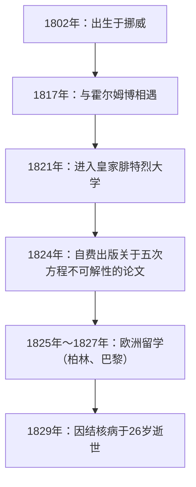
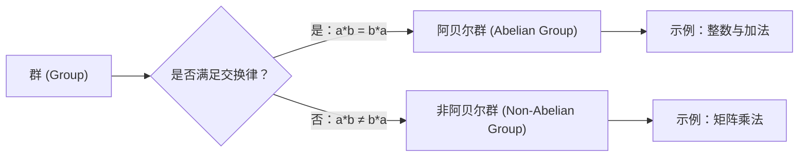

# 1. 引言：英年早逝的天才阿贝尔

在数学史上，有几位天才虽然在年纪轻轻时就离世，却对后世的数学界产生了决定性的影响。其中，挪威出生的 **尼尔斯·亨里克·阿贝尔 (Niels Henrik Abel)** 与埃瓦里斯特·伽罗瓦并列，可以说是最著名的悲剧天才之一。在他短短26年的生命中，他证明了“五次及以上的代数方程不存在一般的求根公式”，解决了一个困扰数学家们几个世纪的难题。

在本文中，我们将深入探讨阿贝尔在贫困和疾病的折磨下依然对数学保持着燃烧般热情的生平，以及他留下的“阿贝尔群”、“阿贝尔积分”等重要数学成就。

# 2. 阿贝尔的生平：贫困与才华的绽放

## 2.1 童年与恩师霍尔姆博的相遇

尼尔斯·亨里克·阿贝尔于1802年8月5日出生在挪威的一个小村庄芬岛，父亲是一位牧师。当时的挪威经济贫困，阿贝尔的家庭也不例外。

1817年，他进入奥斯陆的天主教学校，并遇到了数学教师 **贝恩特·米凯尔·霍尔姆博（Bernt Michael Holmboe）** ，这极大地改变了他的命运。霍尔姆博一眼就看出了阿贝尔非凡的数学天赋，并教给他大学水平的高等数学。阿贝尔如饥似渴地阅读了欧拉、拉格朗日、拉普拉斯等大师的著作，迅速吸收了最前沿的数学知识。

## 2.2 父亲的去世与沉重的负担

1820年，在阿贝尔18岁时，他的父亲去世了。他的父亲在政治上也卷入了冲突，并在留下巨额债务后离世。因此，阿贝尔不得不承担起抚养母亲和六个兄弟姐妹的重任。在极度贫困中，他在恩师霍尔姆博和朋友们的资助下，于1821年进入皇家腓特烈大学（现奥斯陆大学）学习。

# 3. 五次方程求根公式的不可解性

阿贝尔的第一个伟大成就是在代数方程领域。二次方程的求根公式自古就被熟知，三次和四次方程的求根公式在16世纪的意大利被发现。然而，在此后的近300年里，没有人能够找到五次方程的求根公式。

起初，阿贝尔以为自己发现了五次方程的求根公式并写成了一篇论文。但在霍尔姆博等人的同行评审过程中，他意识到了自己的错误。随后，他得出了相反的想法：“是否五次及以上的方程，根本不存在只使用四则运算和根号的一般求根公式？”

终于在1824年，他彻底证明了这一事实。今天这被称为 **阿贝尔-鲁菲尼定理 (Abel-Ruffini theorem)** （因为意大利数学家保罗·鲁菲尼曾发表过一个不完整的证明）。

$$ a x^5 + b x^4 + c x^3 + d x^2 + e x + f = 0 \quad (\text{五次方程的一般形式}) $$

通常情况下，是不可能仅仅使用 $a, b, c, d, e, f$ 以及四则运算和根号，通过有限次运算来表示这个方程的解的。

# 4. 欧洲之行与克雷尔的相遇

1825年，阿贝尔获得了挪威政府的奖学金，得到了前往欧洲大陆留学的机会。他的目的是访问当时的数学中心巴黎，以及伟大数学家卡尔·弗里德里希·高斯所在的哥廷根。

阿贝尔将自己的论文寄给了高斯，但高斯甚至没有读过就将其搁置一旁。放弃了与高斯会面的阿贝尔前往了柏林。

在柏林，他与土木工程师、热情的数学爱好者 **奥古斯特·利奥波德·克雷尔 (August Leopold Crelle)** 相遇。克雷尔对阿贝尔的才华印象深刻，创办了世界上第一本专门的数学学术期刊《纯粹与应用数学杂志》（俗称：克雷尔杂志）。阿贝尔在该杂志的创刊号上发表了多篇论文，使他的名字开始在欧洲数学界广为人知。

# 5. 在巴黎的挫折与柯西的怠慢

1826年，阿贝尔抵达巴黎。在这里，他向法国科学院提交了一篇关于“超越函数的广泛定理”的论文，这可以说是他的最高杰作。这篇论文包含了后来被称为 **阿贝尔定理 (Abel's theorem)** 的突破性内容。

然而，厄运再次降临。伟大的数学家 **奥古斯丁-路易·柯西 (Augustin-Louis Cauchy)** 被指派去审查，但他将阿贝尔的论文混入了他房间里的文件堆中，并未进行审查。

在绝望、资金短缺以及结核病逐渐侵袭的逼迫下，阿贝尔被迫离开了巴黎。

# 6. 回国与悲剧的结局

1827年，等待回国的阿贝尔的是再次陷入的极度贫困。由于无法在大学找到正式职位，他在所剩无几的时间里疯狂地继续写论文。

1829年4月6日，在未婚妻和朋友的看护下，阿贝尔以26岁的英年早逝。

悲剧的是，就在他死后仅仅两天，克雷尔的信寄到了。信中写道： **柏林大学的数学教授职位已经为阿贝尔保留** 。当他的才华终于得到公正评价时，一切都已经太迟了。

# 7. 阿贝尔的数学遗产

阿贝尔留下的成就已经在现代数学的各个领域生根发芽。

## 7.1 阿贝尔群 (Abelian Group)

在抽象代数中，最基本且重要的结构之一是“群 (Group)”。在群中，即使交换运算顺序结果也不变的群称为 **阿贝尔群 (Abelian group)** 。

根据定义，对于群 $G$ 中的任意元素 $a, b$，如果满足以下的交换律，则该群被称为阿贝尔群：

$$ a * b = b * a \quad (\text{交换律}) $$

## 7.2 阿贝尔积分与阿贝尔函数

阿贝尔的巴黎论文的主题 **阿贝尔积分 (Abelian integral)** ，是包含代数函数的积分的推广。在他死后，雅可比等人发展了这一理论，并成长为代数几何中的 **阿贝尔簇 (Abelian variety)** 等宏大理论。

## 7.3 阿贝尔极限定理 (Abel's limit theorem)

在分析学领域，阿贝尔也留下了重要的足迹。这是一个关于无穷级数收敛的定理。

$$ \lim_{x \to 1^-} \sum_{n=0}^{\infty} a_n x^n = \sum_{n=0}^{\infty} a_n \quad (\text{如果右侧的级数收敛}) $$

这一定理在今天的解析延拓和渐近展开等理论中仍被频繁使用。

# 8. 结语

尼尔斯·亨里克·阿贝尔的一生，确实符合“悲剧”这个词汇。然而，他倾注在数学上的热情和由此产生的众多定理，却永远不会褪色。他留下的理论，至今仍在不断给数学家们带来新的灵感。
