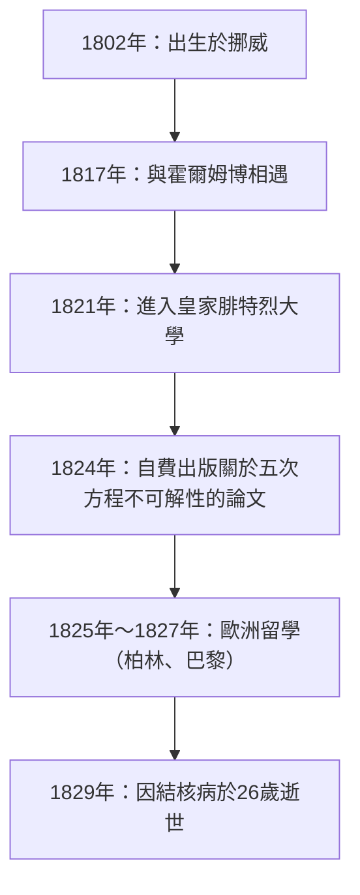
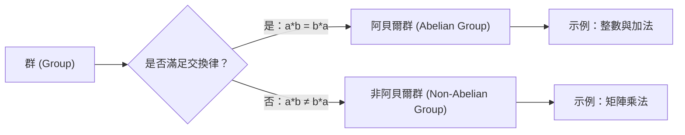

# 1. 引言：英年早逝的天才阿貝爾

在數學史上，有幾位天才雖然在年紀輕輕時就離世，卻對後世的數學界產生了決定性的影響。其中，挪威出生的 **[尼爾斯·亨里克·阿貝爾](https://kenji.blog/zh-tw/p/abel/) (Niels Henrik Abel)** 與[埃瓦里斯特·伽羅瓦](https://kenji.blog/zh-tw/p/galois/)並列，可以說是最著名的悲劇天才之一。在他短短26年的生命中，他證明了「五次及以上的代數方程不存在一般的求根公式」，解決了一個困擾數學家們幾個世紀的難題。

在本文中，我們將深入探討阿貝爾在貧困和疾病的折磨下依然對數學保持著燃燒般熱情的生平，以及他留下的「阿貝爾群」、「阿貝爾積分」等重要數學成就。

# 2. 阿貝爾的生平：貧困與才華的綻放

## 2.1 童年與恩師霍爾姆博的相遇

[尼爾斯·亨里克·阿貝爾](https://kenji.blog/zh-tw/p/abel/)於1802年8月5日出生在挪威的一個小村莊芬島，父親是一位牧師。當時的挪威經濟貧困，阿貝爾的家庭也不例外。

1817年，他進入奧斯陸的天主教學校，並遇到了數學教師 **貝恩特·米凱爾·霍爾姆博（Bernt Michael Holmboe）** ，這極大地改變了他的命運。霍爾姆博一眼就看出了阿貝爾非凡的數學天賦，並教給他大學水平的高等數學。阿貝爾如飢似渴地閱讀了歐拉、拉格朗日、拉普拉斯等大師的著作，迅速吸收了最前沿的數學知識。

## 2.2 父親的去世與沉重的負擔

1820年，在阿貝爾18歲時，他的父親去世了。他的父親在政治上也捲入了衝突，並在留下巨額債務後離世。因此，阿貝爾不得不承擔起撫養母親和六個兄弟姐妹的重任。在極度貧困中，他在恩師霍爾姆博和朋友們的資助下，於1821年進入皇家腓特烈大學（現奧斯陸大學）學習。

# 3. 五次方程求根公式的不可解性

阿貝爾的第一個偉大成就是在代數方程領域。二次方程的求根公式自古就被熟知，三次和四次方程的求根公式在16世紀的意大利被發現。然而，在此後的近300年裡，沒有人能夠找到五次方程的求根公式。

起初，阿貝爾以為自己發現了五次方程的求根公式並寫成了一篇論文。但在霍爾姆博等人的同行評審過程中，他意識到了自己的錯誤。隨後，他得出了相反的想法：「是否五次及以上的方程，根本不存在只使用四則運算和根號的一般求根公式？」

終於在1824年，他徹底證明了這一事實。今天這被稱為 **阿貝爾-魯菲尼定理 ([Abel](https://kenji.blog/zh-tw/p/abel/)-Ruffini theorem)** （因為意大利數學家保羅·魯菲尼曾發表過一個不完整的證明）。

$$ a x^5 + b x^4 + c x^3 + d x^2 + e x + f = 0 \quad (\text{五次方程的一般形式}) $$

通常情況下，是不可能僅僅使用 $a, b, c, d, e, f$ 以及四則運算和根號，通過有限次運算來表示這個方程的解的。

# 4. 歐洲之行與克雷爾的相遇

1825年，阿貝爾獲得了挪威政府的獎學金，得到了前往歐洲大陸留學的機會。他的目的是訪問當時的數學中心巴黎，以及偉大數學家[卡爾·弗里德里希·高斯](https://kenji.blog/zh-tw/p/gauss/)所在的哥廷根。

阿貝爾將自己的論文寄給了高斯，但高斯甚至沒有讀過就將其擱置一旁。放棄了與高斯會面的阿貝爾前往了柏林。

在柏林，他與土木工程師、熱情的數學愛好者 **奧古斯特·利奧波德·克雷爾 (August Leopold Crelle)** 相遇。克雷爾對阿貝爾的才華印象深刻，創辦了世界上第一本專門的數學學術期刊《純粹與應用數學雜誌》（俗稱：克雷爾雜誌）。阿貝爾在該雜誌的創刊號上發表了多篇論文，使他的名字開始在歐洲數學界廣為人知。

# 5. 在巴黎的挫折與柯西的怠慢

1826年，阿貝爾抵達巴黎。在這裡，他向法國科學院提交了一篇關於「超越函數的廣泛定理」的論文，這可以說是他的最高傑作。這篇論文包含了後來被稱為 **阿貝爾定理 ([Abel](https://kenji.blog/zh-tw/p/abel/)'s theorem)** 的突破性內容。

然而，厄運再次降臨。偉大的數學家 **[奧古斯丁-路易·柯西](https://kenji.blog/zh-tw/p/cauchy/) ([Augustin-Louis Cauchy](https://kenji.blog/zh-tw/p/cauchy/))** 被指派去審查，但他將阿貝爾的論文混入了他房間裡的文件堆中，並未進行審查。

在絕望、資金短缺以及結核病逐漸侵襲的逼迫下，阿貝爾被迫離開了巴黎。

# 6. 回國與悲劇的結局

1827年，等待回國的阿貝爾的是再次陷入的極度貧困。由於無法在大學找到正式職位，他在所剩無幾的時間裡瘋狂地繼續寫論文。

1829年4月6日，在未婚妻和朋友的看護下，阿貝爾以26歲的英年早逝。

悲劇的是，就在他死後僅僅兩天，克雷爾的信寄到了。信中寫道： **柏林大學的數學教授職位已經為阿貝爾保留** 。當他的才華終於得到公正評價時，一切都已經太遲了。

# 7. 阿貝爾的數學遺產

阿貝爾留下的成就已經在現代數學的各個領域生根發芽。

## 7.1 阿貝爾群 ([Abel](https://kenji.blog/zh-tw/p/abel/)ian Group)

在抽象代數中，最基本且重要的結構之一是「群 (Group)」。在群中，即使交換運算順序結果也不變的群稱為 **阿貝爾群 ([Abel](https://kenji.blog/zh-tw/p/abel/)ian group)** 。

根據定義，對於群 $G$ 中的任意元素 $a, b$，如果滿足以下的交換律，則該群被稱為阿貝爾群：

$$ a * b = b * a \quad (\text{交換律}) $$

## 7.2 阿貝爾積分與阿貝爾函數

阿貝爾的巴黎論文的主題 **阿貝爾積分 ([Abel](https://kenji.blog/zh-tw/p/abel/)ian integral)** ，是包含代數函數的積分的推廣。在他死後，雅可比等人發展了這一理論，並成長為代數幾何中的 **阿貝爾簇 ([Abel](https://kenji.blog/zh-tw/p/abel/)ian variety)** 等宏大理論。

## 7.3 阿貝爾極限定理 ([Abel](https://kenji.blog/zh-tw/p/abel/)'s limit theorem)

在分析學領域，阿貝爾也留下了重要的足跡。這是一個關於無窮級數收斂的定理。

$$ \lim_{x \to 1^-} \sum_{n=0}^{\infty} a_n x^n = \sum_{n=0}^{\infty} a_n \quad (\text{如果右側的級數收斂}) $$

這一定理在今天的解析延拓和漸近展開等理論中仍被頻繁使用。

# 8. 結語

[尼爾斯·亨里克·阿貝爾](https://kenji.blog/zh-tw/p/abel/)的一生，確實符合「悲劇」這個詞彙。然而，他傾注在數學上的熱情和由此產生的眾多定理，卻永遠不會褪色。他留下的理論，至今仍在不斷給數學家們帶來新的靈感。
