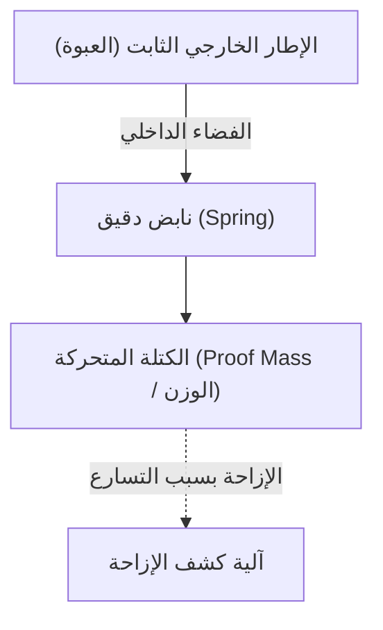

# العالم المجهري المذهل لمستشعرات التسارع

في الحياة المعاصرة، أصبح من الصعب تخيل قضاء يوم واحد دون هاتف ذكي. إذا أملت الشاشة أفقيًا، يصبح الفيديو في وضع ملء الشاشة، ويقوم تلقائيًا بحساب خطواتك، وفي الألعاب، يمكنك التحكم في الشخصيات بمجرد إمالة الجهاز. وراء هذه الميزات المريحة يكمن مكون إلكتروني صغير يُسمى "مستشعر التسارع" (Accelerometer).

في هذا المقال، سنشرح بالتفصيل القوانين الفيزيائية التي يعتمد عليها مستشعر التسارع، والهياكل الدقيقة (MEMS) التي يستخدمها لالتقاط حركاتنا.

## ما هو التسارع؟ أساسيات الفيزياء

لفهم كيفية عمل مستشعر التسارع، يجب علينا أولاً أن نفهم بدقة الكمية الفيزيائية المسماة "التسارع". كما توضح معادلة نيوتن للحركة $F = ma$ (القوة = الكتلة × التسارع)، عندما تُطبق قوة على جسم ما، يتولد التسارع.

مستشعر التسارع يقوم بحساب التسارع بشكل غير مباشر من خلال قياس "القوة المؤثرة على الجسم (قوة القصور الذاتي)".

### الجاذبية هي أيضًا نوع من التسارع

طالما نحن على وجه الأرض، فإننا نتعرض دائمًا لتسارع الجاذبية (1G) نحو الأسفل بحوالي $9.8 \, \mathrm{m/s^2}$. مستشعر التسارع الموجود في الهاتف الذكي الساكن يستشعر باستمرار هذه الجاذبية.
عندما يميل الهاتف الذكي، يتم حساب كيف يتوزع متجه الجاذبية 1G هذا عبر المحاور الثلاثة X و Y و Z للمستشعر، مما يسمح بتحديد "ميل" الجهاز بدقة.

## ثورة تقنية MEMS (الأنظمة الكهروميكانيكية الصغرى)

في الماضي، كانت مستشعرات التسارع كبيرة جدًا وباهظة الثمن، ولم يكن من الممكن تثبيتها إلا في أنظمة الملاحة بالقصور الذاتي للصواريخ والطائرات. ومع ذلك، مع تقدم تكنولوجيا تصنيع أشباه الموصلات منذ الثمانينيات، ولدت تقنية "MEMS (Micro Electro Mechanical Systems)".

باستخدام تقنية MEMS، أصبح من الممكن دمج "الهياكل الميكانيكية (النوابض والأوزان)" الصغيرة جدًا و"الدوائر الإلكترونية" معًا على شريحة سيليكون. تحتوي مستشعرات التسارع في الهواتف الذكية الحالية على هياكل ميكانيكية أدق من سمك شعرة الإنسان، محفورة داخل شريحة تبلغ مساحتها بضعة ملليمترات مربعة.

## الهياكل الدقيقة داخل المستشعر: الأوزان والنوابض

إذا بسّطنا البنية الداخلية لمستشعر التسارع MEMS، فستكون وفقًا للنموذج التالي.

عندما يتحرك الجهاز الذي يحتوي على المستشعر (مثل الهاتف الذكي)، يتحرك الإطار الخارجي الثابت معه. ومع ذلك، يحاول "الوزن (الكتلة المتحركة)" الداخلي البقاء في مكانه بسبب قانون القصور الذاتي. ونتيجة لذلك، يتمدد أو ينكمش "النابض" الذي يدعم الوزن، ويتغير موقع الوزن بالنسبة للإطار الخارجي (الإزاحة).

يتم قياس التسارع عن طريق قراءة هذا "الانحراف الدقيق" كإشارة كهربائية.

## آلية تحويل الإزاحة إلى إشارة كهربائية

في مستشعر التسارع MEMS، هناك طريقتان رئيسيتان لتحويل الانحراف الدقيق (الإزاحة) للوزن إلى إشارة كهربائية.

### 1. الطريقة السعوية (Capacitive)

الطريقة السعوية هي الأكثر استخدامًا حاليًا في الهواتف الذكية والأجهزة الاستهلاكية.

في هذه الطريقة، يتم ترتيب أقطاب كهربائية صغيرة تشبه أسنان المشط بشكل متبادل على كل من الإطار الثابت والوزن المتحرك. الفجوة (Gap) بين هذين القطبين تعمل كمكثف (Capacitor).

عند تطبيق التسارع وتحرك الوزن، تتغير المسافة بين الأقطاب الكهربائية. نظرًا لأن السعة الكهربائية (C) للمكثف تتناسب عكسيًا مع المسافة بين الأقطاب، فإن تغيير المسافة يؤدي إلى تغيير السعة. يتم تضخيم هذا التغيير الدقيق للغاية في السعة بواسطة دائرة معالجة مخصصة مدمجة (ASIC) وإخراجه كإشارة رقمية (على سبيل المثال، بروتوكولات الاتصال مثل I2C أو SPI).

تتميز هذه الطريقة بمقاومتها لتغيرات درجة الحرارة واستهلاكها المنخفض جدًا للطاقة، مما يجعلها مثالية للأجهزة المحمولة التي تعمل بالبطاريات.

### 2. طريقة المقاومة الانضغاطية (Piezoresistive)

طريقة المقاومة الانضغاطية هي طريقة لقراءة الإزاحة كتغير في قيمة المقاومة. يتم وضع مواد لها تأثير المقاومة الانضغاطية (ظاهرة تتغير فيها المقاومة الكهربائية عند تشوه المادة بسبب تطبيق قوة) (بشكل رئيسي السيليكون المطعم) على العارضة (جزء النابض) التي تدعم الوزن المتحرك.

عندما يتحرك الوزن بسبب التسارع وتنحني العارضة، تتغير قيمة المقاومة للمقاوم الانضغاطي بسبب هذا التشوه. يتم الكشف عن ذلك باستخدام دائرة جسر ويتستون (Wheatstone bridge) أو ما شابه، وقراءته كتغير في الجهد.

غالبًا ما تُستخدم هذه الطريقة في التطبيقات التي تتطلب قياسًا لحظيًا للصدمات الكبيرة جدًا (G العالية)، مثل الدمى المستخدمة في اختبارات التصادم أو وسائد الهواء في السيارات.

## تطبيقات مستشعرات التسارع في المجتمع الحديث

مستشعرات التسارع ليست نشطة فقط في الهواتف الذكية، بل في كل جانب من جوانب المجتمع.

1. **أنظمة الوسائد الهوائية في السيارات**: تكتشف التسارع السلبي المفاجئ (التباطؤ) في لحظة اصطدام السيارة وتفتح الوسادة الهوائية بدقة تصل إلى بضعة أجزاء من الألف من الثانية. نظرًا لأن حياة الإنسان على المحك هنا، فإن الموثوقية العالية جدًا مطلوبة.
2. **أجهزة التحكم في الألعاب وسماعات الواقع الافتراضي**: من خلال دمجها مع مستشعرات الجيروسكوب (مستشعر السرعة الزاوية)، يتم تتبع الحركات ثلاثية الأبعاد في الفضاء بدقة.
3. **الطائرات بدون طيار (UAV)**: من خلال المراقبة المستمرة لميل الطائرة وإجراء تعديلات دقيقة على خرج المحرك، يتم تحقيق تحكم مستقر للتحليق في الهواء بشكل ثابت (التحويم).
4. **أجهزة الرعاية الصحية**: تُستخدم الساعات الذكية وأجهزة تتبع اللياقة البدنية لحساب الخطوات واكتشاف التقلب أثناء النوم. في الآونة الأخيرة، تطورت أيضًا كتقنية لإنقاذ الأرواح، مثل ميزة اكتشاف "السقوط" لكبار السن وإجراء مكالمات الطوارئ.

## الخلاصة

وراء قدرة الهواتف الذكية التي بين أيدينا على معرفة "كيفية ميلانها"، يكمن تبلور الميكانيكا النيوتونية، وتكنولوجيا المعالجة الدقيقة لأشباه الموصلات (MEMS)، ودوائر التحويل التناظرية-الرقمية المتقدمة.
النوابض والأوزان الدقيقة التي تتأرجح في العالم المجهري تدعم حياتنا الرقمية اليوم. إن حقيقة أن مثل هذه المستشعرات المتقدمة يمكن إنتاجها بكميات كبيرة بتكلفة منخفضة ووصولها إلى أيدي الناس في جميع أنحاء العالم بفضل التقدم التكنولوجي، هي بحق معجزة من معجزات الهندسة الحديثة.
