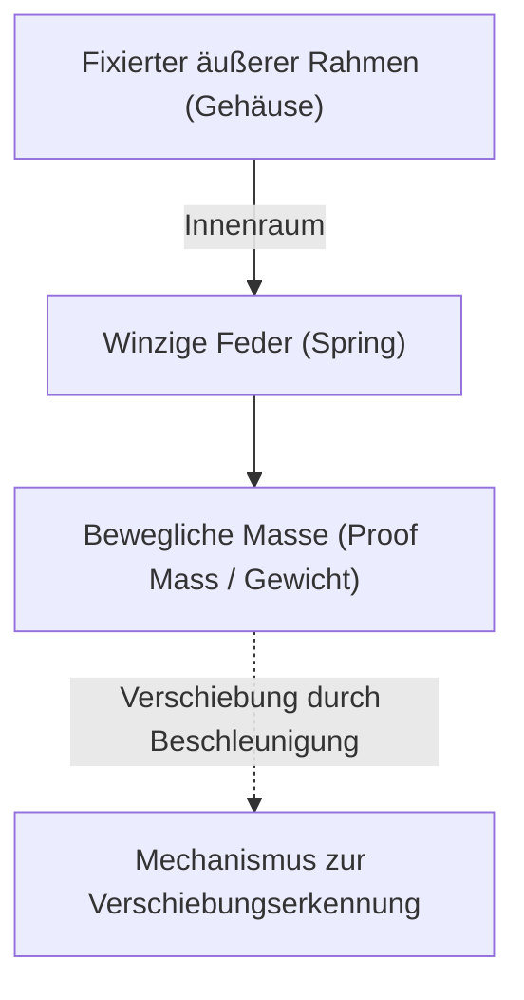

# Die erstaunliche Mikrowelt der Beschleunigungssensoren

Im modernen Leben ist es kaum noch vorstellbar, einen Tag ohne Smartphone zu verbringen. Neigt man den Bildschirm zur Seite, wird das Video im Vollbildmodus angezeigt, Schritte werden automatisch gezählt und in Spielen lassen sich Charaktere durch bloßes Neigen des Geräts steuern. Hinter all diesen praktischen Funktionen verbirgt sich ein kleines elektronisches Bauteil namens "Beschleunigungssensor" (Accelerometer).

In diesem Artikel wird im Detail erklärt, auf welchen physikalischen Gesetzen dieser Beschleunigungssensor basiert und welche Mikrostrukturen (MEMS) verwendet werden, um unsere Bewegungen zu erfassen.

## Was ist Beschleunigung? Grundlagen der Physik

Um die Funktionsweise des Beschleunigungssensors zu verstehen, muss man zunächst die physikalische Größe "Beschleunigung" genau verstehen. Wie das Newtonsche Bewegungsgesetz $F = ma$ (Kraft = Masse × Beschleunigung) zeigt, entsteht eine Beschleunigung, wenn eine Kraft auf einen Körper ausgeübt wird.

Der Beschleunigungssensor berechnet die Beschleunigung indirekt, indem er genau diese "auf den Körper ausgeübte Kraft (Trägheitskraft)" misst.

### Auch die Schwerkraft ist eine Art der Beschleunigung

Solange wir uns auf der Erde befinden, sind wir stets einer nach unten gerichteten Erdbeschleunigung (1G) von etwa $9.8 \, \mathrm{m/s^2}$ ausgesetzt. Der Beschleunigungssensor in einem ruhenden Smartphone erfasst diese Schwerkraft ebenfalls ständig.

Wenn das Smartphone geneigt wird, lässt sich die genaue "Neigung" des Geräts berechnen, indem ermittelt wird, wie sich dieser 1G-Schwerevektor auf die drei Achsen (X, Y, Z) des Sensors verteilt.

## Die Revolution der MEMS-Technologie (Mikroelektromechanische Systeme)

Frühere Beschleunigungssensoren waren sehr groß und teuer und konnten nur in Trägheitsnavigationssystemen von Raketen oder Flugzeugen eingesetzt werden. Dank der Fortschritte in der Halbleiterfertigungstechnologie seit den 1980er Jahren entstand jedoch die "MEMS (Micro Electro Mechanical Systems)"-Technologie.

Mithilfe der MEMS-Technologie wurde es möglich, winzige "mechanische Strukturen (Federn und Gewichte)" und "elektronische Schaltungen" auf einem Siliziumwafer zu integrieren. Die Beschleunigungssensoren in heutigen Smartphones haben mechanische Strukturen, die feiner als ein menschliches Haar sind und in einen wenige Quadratmillimeter großen Chip geätzt wurden.

## Die Mikrostruktur im Inneren des Sensors: Gewicht und Feder

Wenn man die innere Struktur eines MEMS-Beschleunigungssensors vereinfacht betrachtet, ergibt sich folgendes Modell:

Wenn sich das Gerät mit dem Sensor (z. B. ein Smartphone) bewegt, bewegt sich der fixierte äußere Rahmen mit. Die innere "bewegliche Masse (Gewicht)" versucht jedoch aufgrund des Trägheitsgesetzes an Ort und Stelle zu bleiben. Infolgedessen dehnt sich die "Feder", die das Gewicht stützt, oder zieht sich zusammen, und die Position des Gewichts verschiebt sich relativ zum äußeren Rahmen (Verschiebung).

Indem diese "winzige Verschiebung" als elektrisches Signal ausgelesen wird, wird die Beschleunigung gemessen.

## Der Mechanismus zur Umwandlung von Verschiebung in ein elektrisches Signal

Bei MEMS-Beschleunigungssensoren gibt es hauptsächlich zwei Methoden, um die winzige Verschiebung des Gewichts in ein elektrisches Signal umzuwandeln.

### 1. Kapazitives Verfahren (Capacitive)

Das kapazitive Verfahren wird heute am häufigsten in Smartphones und Konsumgütern eingesetzt.

Bei diesem Verfahren sind sowohl am festen Rahmen als auch am beweglichen Gewicht winzige, kammförmige Elektroden abwechselnd angeordnet. Der Spalt zwischen diesen beiden Elektroden wirkt als Kondensator (Kapazität).

Wenn eine Beschleunigung auftritt und sich das Gewicht bewegt, ändert sich der Abstand zwischen den Elektroden. Da die Kapazität (C) eines Kondensators umgekehrt proportional zum Abstand zwischen den Elektroden ist, ändert eine Abstandsänderung die Kapazität. Diese extrem kleine Kapazitätsänderung wird von einem integrierten, dedizierten Verarbeitungsschaltkreis (ASIC) verstärkt und als digitales Signal (z. B. über Kommunikationsprotokolle wie I2C oder SPI) ausgegeben.

Es zeichnet sich durch seine Unempfindlichkeit gegenüber Temperaturschwankungen und einen sehr geringen Stromverbrauch aus und ist damit ideal für batteriebetriebene mobile Geräte.

### 2. Piezoresistives Verfahren (Piezoresistive)

Das piezoresistive Verfahren misst die Verschiebung als eine Änderung des Widerstandswerts. Auf dem Balken (dem Federteil), der das bewegliche Gewicht stützt, wird ein Material mit piezoresistivem Effekt (ein Phänomen, bei dem sich der elektrische Widerstand ändert, wenn es durch Krafteinwirkung verformt wird) - meist dotiertes Silizium - platziert.

Wenn sich das Gewicht aufgrund von Beschleunigung bewegt und sich der Balken verbiegt, ändert sich der Widerstandswert des Piezowiderstands durch diese Dehnung. Dies wird durch eine Wheatstone-Brückenschaltung oder Ähnliches erkannt und als Spannungsänderung ausgelesen.

Dieses Verfahren wird häufig in Anwendungen eingesetzt, bei denen sehr starke Stöße (hohe G-Kräfte) sofort gemessen werden müssen, beispielsweise bei Crashtest-Dummys oder Airbags in Autos.

## Anwendungen von Beschleunigungssensoren in der modernen Gesellschaft

Beschleunigungssensoren werden nicht nur in Smartphones, sondern in allen Bereichen der Gesellschaft eingesetzt.

1. **Airbagsysteme in Autos**: Sie erkennen die plötzliche negative Beschleunigung (Verzögerung) im Moment einer Autokollision und lösen den Airbag mit einer Präzision im Millisekundenbereich aus. Da es hier um Menschenleben geht, ist eine extrem hohe Zuverlässigkeit erforderlich.
2. **Gamecontroller und VR-Headsets**: In Kombination mit Gyrosensoren (Winkelgeschwindigkeitssensoren) ermöglichen sie ein präzises Tracking dreidimensionaler Bewegungen im Raum.
3. **Drohnen (UAV)**: Durch ständige Überwachung der Neigung des Fluggeräts und Feinabstimmung der Motorleistung wird eine stabile Steuerung erreicht, die ein exaktes Stillstehen in der Luft (Schwebeflug) ermöglicht.
4. **Gesundheitsgeräte**: Smartwatches und Fitness-Tracker verwenden sie, um Schritte zu zählen oder das Umdrehen im Schlaf zu erkennen. In jüngerer Zeit haben sie sich zu lebensrettenden Technologien entwickelt, etwa mit Funktionen, die einen "Sturz" bei älteren Menschen erkennen und einen Notruf absetzen.

## Fazit

Hinter der Fähigkeit des Smartphones in unserer Hand zu wissen, "wie es geneigt ist", verbirgt sich die Kristallisation der Newtonschen Mechanik, der Halbleiter-Mikrofertigungstechnologie (MEMS) und hochmoderner Analog-Digital-Wandlerschaltungen.

Winzige Federn und Gewichte, die in der Mikrowelt schwingen, unterstützen auch heute noch unser digitales Leben. Es ist wahrlich ein Wunder der modernen Technik, dass solch hochentwickelte Sensoren dank technologischer Fortschritte günstig in großen Mengen produziert werden und in die Hände von Menschen auf der ganzen Welt gelangen.
