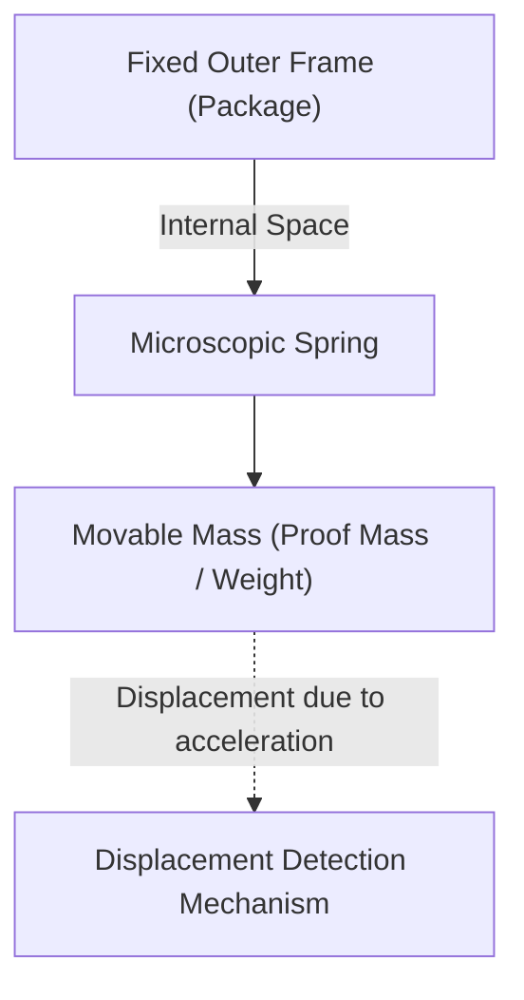

# The Amazing Microscopic World of Accelerometers

In modern life, it's hard to imagine spending a day without a smartphone. Tilt the screen sideways, and videos go full-screen; it automatically counts your steps, and in games, you can control characters just by tilting the device. Behind these convenient features hides a tiny electronic component called an "Accelerometer."

In this article, we will explain in detail the physical laws this accelerometer is based on, and the micro-structures (MEMS) it uses to capture our movements.

## What is Acceleration? Basics of Physics

To understand how an accelerometer works, we must first accurately understand the physical quantity called "acceleration." As shown by Newton's equation of motion $F = ma$ (Force = Mass × Acceleration), acceleration occurs when a force is applied to an object.

The accelerometer indirectly calculates acceleration by measuring exactly this "force applied to an object (inertial force)."

### Gravity is Also a Type of Acceleration

As long as we are on Earth, we are constantly subjected to a downward gravitational acceleration (1G) of about $9.8 \, \mathrm{m/s^2}$. The accelerometer inside a resting smartphone also constantly senses this gravity.
When the smartphone tilts, by calculating how this 1G gravity vector is distributed across the sensor's 3 axes (X, Y, Z), it can accurately determine the device's "tilt."

## The Revolution of MEMS (Micro Electro Mechanical Systems) Technology

Accelerometers of the past were very large and expensive, only installed in things like inertial navigation systems of rockets and aircraft. However, with the advancement of semiconductor manufacturing technology since the 1980s, "MEMS (Micro Electro Mechanical Systems)" technology was born.

Using MEMS technology, it became possible to integrate microscopic "mechanical structures (springs and weights)" and "electronic circuits" onto a silicon wafer. The accelerometer in current smartphones has mechanical structures finer than a human hair engraved inside a chip just a few millimeters square.

## Micro-structure Inside the Sensor: Weights and Springs

Simplifying the internal structure of a MEMS accelerometer gives a model like the following.

When the device carrying the sensor (like a smartphone) moves, the fixed outer frame moves with it. However, the internal "weight (movable mass)" tries to stay in place due to the law of inertia. As a result, the "spring" supporting the weight expands and contracts, causing the position of the weight to shift relatively to the outer frame (displacement).

By reading this "microscopic shift" as an electrical signal, acceleration is measured.

## How Displacement is Converted into Electrical Signals

In a MEMS accelerometer, there are two main methods for converting the microscopic shift (displacement) of the weight into an electrical signal.

### 1. Capacitive Method

Currently, the capacitive method is the most widely used in smartphones and consumer devices.

In this method, microscopic electrodes shaped like comb teeth are arranged alternately on both the fixed frame side and the movable weight side. The gap between these two electrodes acts as a capacitor.

When acceleration is applied and the weight moves, the distance between the electrodes changes. Since the capacitance (C) of a capacitor is inversely proportional to the distance between the electrodes, the capacitance changes as the distance changes. This extremely minute change in capacitance is amplified by a built-in dedicated processing circuit (ASIC) and output as a digital signal (for example, communication protocols like I2C or SPI).

Because it is highly resistant to temperature changes and consumes very little power, it is ideal for battery-powered mobile devices.

### 2. Piezoresistive Method

The piezoresistive method is a method of reading displacement as a change in resistance value. A material with a piezoresistive effect (a phenomenon where electrical resistance changes when deformed by applied force), mainly doped silicon, is placed on the beam (the spring part) that supports the movable weight.

When the weight moves due to acceleration and the beam bends, the strain causes the resistance value of the piezoresistor to change. This is detected by something like a Wheatstone bridge circuit and read as a change in voltage.

This method is often used in applications where it is necessary to instantaneously measure extremely large impacts (high G), such as dummy dolls for crash tests and automobile airbags.

## Applications of Accelerometers in Modern Society

Accelerometers are active not only in smartphones but in all aspects of society.

1. **Automobile Airbag Systems**: They detect the rapid negative acceleration (deceleration) at the moment a car crashes, and deploy the airbag with millisecond accuracy. Since human lives are involved here, extremely high reliability is required.
2. **Game Controllers and VR Headsets**: By combining them with a gyro sensor (angular velocity sensor), they accurately track 3D movements in space.
3. **Drones (UAV)**: By constantly monitoring the tilt of the aircraft and fine-tuning the motor output, they achieve stable control to hover perfectly in mid-air.
4. **Healthcare Devices**: They are also used in smartwatches and fitness trackers to count steps and detect tossing and turning during sleep. Recently, they have also evolved as life-saving technology, such as the function to detect "falls" in the elderly and make emergency calls.

## Conclusion

Behind the fact that the smartphone in our hands knows "how it is tilted" lies the culmination of Newtonian mechanics, semiconductor microfabrication technology (MEMS), and advanced analog-to-digital conversion circuits.
Microscopic springs and weights swaying in the micro-world are supporting our digital lives today as well. The fact that such advanced sensors are mass-produced cheaply and delivered into the hands of people all over the world due to technological progress can truly be called a miracle of modern engineering.
