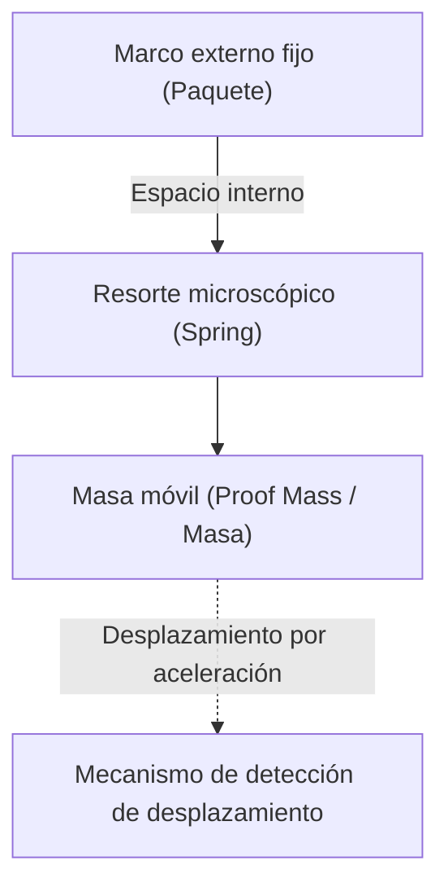

# El asombroso mundo microscópico de los acelerómetros

En la vida moderna, es difícil imaginar pasar un día sin un smartphone. Si inclinas la pantalla, el video se muestra en pantalla completa, cuenta automáticamente tus pasos, y en los juegos puedes controlar a los personajes con solo inclinar el dispositivo. Detrás de estas útiles funciones se esconde un pequeño componente electrónico llamado "acelerómetro" (Accelerometer).

En este artículo, explicaremos en detalle cómo este acelerómetro capta nuestros movimientos, basándose en qué leyes físicas y utilizando qué microestructuras (MEMS).

## ¿Qué es la aceleración? Fundamentos de física

Para comprender el mecanismo del acelerómetro, primero debemos entender con precisión la magnitud física llamada "aceleración". Como muestra la ecuación de movimiento de Newton $F = ma$ (Fuerza = masa × aceleración), cuando se aplica una fuerza a un objeto, se produce una aceleración.

Los acelerómetros calculan indirectamente la aceleración midiendo exactamente esta "fuerza aplicada al objeto (fuerza inercial)".

### La gravedad también es un tipo de aceleración

Mientras estemos en la Tierra, siempre estamos sujetos a una aceleración gravitacional (1G) de aproximadamente $9.8 \, \mathrm{m/s^2}$ hacia abajo. El acelerómetro dentro de un smartphone en reposo también percibe constantemente esta gravedad.
Cuando el smartphone se inclina, al calcular cómo se distribuye este vector de gravedad de 1G entre los 3 ejes X, Y, Z del sensor, es posible determinar con precisión la "inclinación" del dispositivo.

## La revolución de la tecnología MEMS (Sistemas Microelectromecánicos)

Los acelerómetros solían ser muy grandes y costosos, y solo se instalaban en sistemas de navegación inercial de cohetes o aviones. Sin embargo, con el avance de la tecnología de fabricación de semiconductores desde la década de 1980, nació la tecnología "MEMS" (Micro Electro Mechanical Systems).

Al utilizar la tecnología MEMS, se hizo posible integrar estructuras mecánicas microscópicas (resortes y masas) y circuitos electrónicos en una oblea de silicio. Los acelerómetros de los smartphones actuales tienen estructuras mecánicas más delgadas que un cabello humano talladas en un chip de unos pocos milímetros cuadrados.

## Microestructuras dentro del sensor: masas y resortes

Si simplificamos la estructura interna de un acelerómetro MEMS, obtendremos el siguiente modelo.

Cuando el dispositivo equipado con el sensor (como un smartphone) se mueve, el marco externo fijo también se mueve con él. Sin embargo, la "masa" interna (masa móvil) intenta permanecer en su lugar debido a la ley de la inercia. Como resultado, el "resorte" que sostiene la masa se estira o contrae, y la posición de la masa se desplaza relativamente con respecto al marco externo (desplazamiento).

Al leer esta "pequeña desviación" como una señal eléctrica, se mide la aceleración.

## El mecanismo para convertir el desplazamiento en señales eléctricas

En los acelerómetros MEMS, existen principalmente dos formas de convertir el pequeño desplazamiento (desviación) de la masa en una señal eléctrica.

### 1. Método capacitivo (Capacitive)

Actualmente, el método capacitivo es el más utilizado en smartphones y dispositivos de consumo.

En este método, se colocan electrodos microscópicos con forma de dientes de peine intercalados, tanto en el marco fijo como en la masa móvil. El espacio (hueco) entre estos dos electrodos actúa como un condensador (capacitor).

Cuando se aplica una aceleración y la masa se mueve, la distancia entre los electrodos cambia. Dado que la capacitancia (C) del condensador es inversamente proporcional a la distancia entre los electrodos, la capacitancia cambia a medida que varía la distancia. Este cambio extremadamente pequeño en la capacitancia es amplificado por un circuito de procesamiento dedicado incorporado (ASIC) y se emite como una señal digital (por ejemplo, protocolos de comunicación como I2C o SPI).

Como es resistente a los cambios de temperatura y su consumo de energía es muy bajo, es ideal para dispositivos móviles alimentados por batería.

### 2. Método piezorresistivo (Piezoresistive)

El método piezorresistivo es un método que lee el desplazamiento como un cambio en el valor de resistencia. En la viga (parte del resorte) que sostiene la masa móvil, se coloca un material (principalmente silicio dopado) que tiene un efecto piezorresistivo (un fenómeno en el que la resistencia eléctrica cambia cuando se deforma al aplicarse una fuerza).

Cuando la masa se mueve por la aceleración y la viga se flexiona, la tensión cambia el valor de resistencia de la piezorresistencia. Esto se detecta mediante un circuito de puente de Wheatstone o similar, y se lee como un cambio de voltaje.

Este método se utiliza a menudo en aplicaciones donde es necesario medir impactos muy grandes (altas fuerzas G) instantáneamente, como en muñecos para pruebas de choque y en los airbags de los automóviles.

## Aplicaciones de los acelerómetros en la sociedad moderna

Los acelerómetros no solo se utilizan en smartphones, sino que también son activos en todos los ámbitos de la sociedad.

1. **Sistemas de airbags en automóviles**: Detectan la aceleración negativa repentina (desaceleración) en el momento en que un automóvil choca, y despliegan los airbags con precisión de milisegundos. Dado que esto afecta a vidas humanas, se requiere una fiabilidad extremadamente alta.
2. **Controladores de juegos y visores de realidad virtual (VR)**: Al combinarse con giroscopios (sensores de velocidad angular), rastrean con precisión el movimiento tridimensional en el espacio.
3. **Drones (UAV)**: Monitorean constantemente la inclinación de la aeronave y ajustan la salida de los motores, logrando un control de estabilización para mantenerse suspendidos inmóviles en el aire (vuelo estacionario).
4. **Dispositivos de salud y cuidado**: Los relojes inteligentes y los rastreadores de actividad física los utilizan para contar los pasos o detectar cuando el usuario se da la vuelta mientras duerme. Recientemente, también están evolucionando como tecnologías que salvan vidas, como las funciones que detectan "caídas" en personas mayores y realizan llamadas de emergencia.

## Resumen

Detrás del hecho de que los smartphones que tenemos en nuestras manos saben "cómo están inclinados", se encuentra la cristalización de la mecánica newtoniana, la tecnología de microfabricación de semiconductores (MEMS) y los circuitos avanzados de conversión analógico-digital.
Los resortes y masas microscópicos que oscilan en el mundo micro nos apoyan hoy en nuestra vida digital. El hecho de que sensores tan avanzados se produzcan en masa a bajo costo gracias a los avances tecnológicos y lleguen a manos de personas en todo el mundo, es verdaderamente un milagro de la ingeniería moderna.
