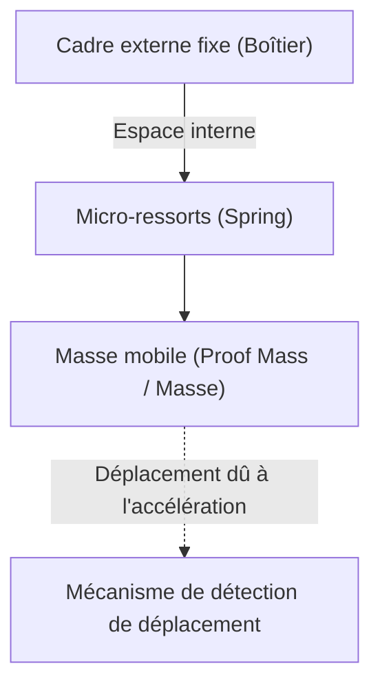

# Le monde microscopique incroyable des accéléromètres

Dans la vie moderne, il est difficile d'imaginer passer une journée sans smartphone. Inclinez l'écran sur le côté et la vidéo passe en plein écran, les pas sont comptés automatiquement et, dans les jeux, vous pouvez contrôler votre personnage en inclinant simplement l'appareil. Derrière ces fonctionnalités pratiques se cache un petit composant électronique appelé "accéléromètre" (Accelerometer).

Cet article explique en détail sur quelles lois physiques cet accéléromètre est basé et quelles microstructures (MEMS) il utilise pour capter nos mouvements.

## Qu'est-ce que l'accélération ? Les bases de la physique

Pour comprendre le fonctionnement d'un accéléromètre, il est d'abord nécessaire de bien comprendre la grandeur physique appelée "accélération". Comme l'indique l'équation du mouvement de Newton $F = ma$ (Force = masse × accélération), lorsqu'une force est appliquée à un objet, une accélération se produit.

Les accéléromètres calculent indirectement l'accélération en mesurant précisément cette "force appliquée à un objet (force d'inertie)".

### La gravité est aussi un type d'accélération

Tant que nous sommes sur Terre, nous sommes constamment soumis à une accélération gravitationnelle vers le bas d'environ $9.8 \, \mathrm{m/s^2}$ (1G). L'accéléromètre à l'intérieur d'un smartphone, même au repos, perçoit constamment cette gravité.
Lorsque le smartphone est incliné, en calculant comment ce vecteur de gravité de 1G est réparti sur les trois axes X, Y et Z du capteur, il est possible de déterminer avec précision l'"inclinaison" de l'appareil.

## La révolution de la technologie MEMS (Micro Electro Mechanical Systems)

Autrefois, les accéléromètres étaient très grands et coûteux, et ne pouvaient être installés que dans les systèmes de navigation inertielle des fusées et des avions. Cependant, grâce aux progrès des technologies de fabrication de semi-conducteurs depuis les années 1980, la technologie "MEMS (Micro Electro Mechanical Systems)" est née.

L'utilisation de la technologie MEMS a permis d'intégrer de minuscules "structures mécaniques (ressorts et masses)" et des "circuits électroniques" sur une tranche de silicium. Les accéléromètres des smartphones actuels contiennent des structures mécaniques plus fines qu'un cheveu humain, gravées dans une puce de quelques millimètres carrés.

## Microstructure interne du capteur : masses et ressorts

Si l'on simplifie la structure interne d'un accéléromètre MEMS, on obtient le modèle suivant.

Lorsque l'appareil équipé du capteur (comme un smartphone) se déplace, le cadre externe fixe se déplace avec lui. Cependant, la "masse (masse mobile)" interne tente de rester sur place en raison de la loi de l'inertie. En conséquence, les "ressorts" qui soutiennent la masse s'étirent et se contractent, et la position de la masse se décale (déplacement) par rapport au cadre externe.

L'accélération est mesurée en lisant ce "minuscule décalage" sous forme de signal électrique.

## Comment convertir le déplacement en signal électrique

Dans les accéléromètres MEMS, il existe principalement deux méthodes pour convertir le minuscule décalage (déplacement) de la masse en signal électrique.

### 1. Méthode capacitive (Capacitive)

Actuellement, la méthode capacitive est la plus utilisée dans les smartphones et les appareils grand public.

Dans cette méthode, de minuscules électrodes en forme de dents de peigne sont disposées de manière intercalée, tant du côté du cadre fixe que du côté de la masse mobile. L'espace (gap) entre ces deux électrodes agit comme un condensateur (capacité).

Lorsqu'une accélération est appliquée et que la masse se déplace, la distance entre les électrodes change. La capacité (C) du condensateur étant inversement proportionnelle à la distance entre les électrodes, la capacité change au fur et à mesure que la distance change. Ce changement de capacité extrêmement faible est amplifié par un circuit de traitement dédié intégré (ASIC) et émis sous forme de signal numérique (par exemple, des protocoles de communication tels que I2C ou SPI).

Elle se caractérise par sa résistance aux changements de température et sa très faible consommation d'énergie, ce qui la rend idéale pour les appareils mobiles alimentés par batterie.

### 2. Méthode piézorésistive (Piezoresistive)

La méthode piézorésistive est une méthode qui lit le déplacement comme un changement de la valeur de résistance. Un matériau (principalement du silicium dopé) ayant un effet piézorésistif (le phénomène par lequel la résistance électrique change lorsqu'elle est déformée par l'application d'une force) est placé sur les poutres (parties formant ressort) qui soutiennent la masse mobile.

Lorsque la masse se déplace en raison de l'accélération et que la poutre fléchit, la valeur de résistance de la piézorésistance change en raison de cette déformation. Ceci est détecté par un circuit en pont de Wheatstone, etc., et lu comme un changement de tension.

Cette méthode est souvent utilisée dans des applications où il est nécessaire de mesurer instantanément des chocs très importants (G élevés), comme les mannequins de crash test ou les airbags automobiles.

## Applications des accéléromètres dans la société moderne

Les accéléromètres ne sont pas seulement utilisés dans les smartphones, mais sont également actifs dans divers aspects de la société.

1. **Systèmes d'airbag automobile** : Ils détectent la forte accélération négative (décélération) au moment d'une collision automobile et déploient l'airbag avec une précision de l'ordre de la milliseconde. Comme la vie humaine est en jeu ici, une fiabilité extrêmement élevée est requise.
2. **Manettes de jeu et casques VR** : En les combinant avec des capteurs gyroscopiques (capteurs de vitesse angulaire), ils suivent avec précision les mouvements tridimensionnels dans l'espace.
3. **Drones (UAV)** : En surveillant constamment l'inclinaison de l'appareil et en ajustant finement la puissance du moteur, ils assurent un contrôle stable pour rester parfaitement immobiles en l'air (vol stationnaire).
4. **Appareils de santé et bien-être** : Les montres connectées et les trackers d'activité les utilisent pour compter les pas et détecter les retournements pendant le sommeil. Récemment, ils ont également évolué en tant que technologie vitale, par exemple avec des fonctionnalités qui détectent les "chutes" des personnes âgées et émettent des appels d'urgence.

## Résumé

Derrière le fait que le smartphone dans notre main sait "comment il est incliné", se trouvent la mécanique newtonienne, la technologie de microfabrication de semi-conducteurs (MEMS) et la cristallisation de circuits avancés de conversion analogique-numérique.
Des ressorts et des masses microscopiques, s'agitant dans un monde microscopique, soutiennent aujourd'hui encore notre vie numérique. Le fait que des capteurs aussi sophistiqués soient produits en masse à faible coût et parviennent entre les mains des gens du monde entier grâce aux progrès technologiques est véritablement un miracle de l'ingénierie moderne.
