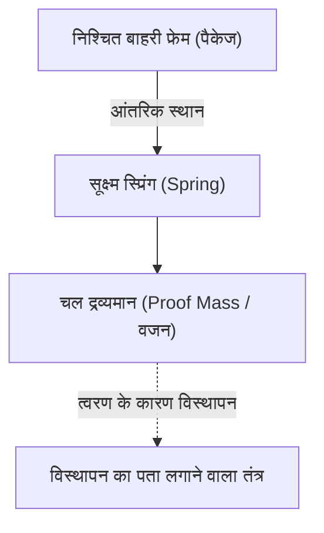
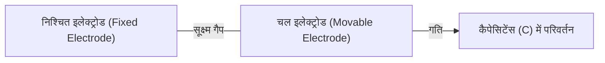

# एक्सेलेरोमीटर सेंसर की अद्भुत सूक्ष्म दुनिया

आधुनिक जीवन में, बिना स्मार्टफोन के एक दिन बिताने की कल्पना करना भी मुश्किल है। जब आप स्क्रीन को क्षैतिज रूप से झुकाते हैं तो वीडियो फुल-स्क्रीन हो जाता है, यह स्वचालित रूप से आपके कदमों की गिनती करता है, और गेम में आप केवल डिवाइस को झुकाकर पात्रों को नियंत्रित कर सकते हैं। इन सुविधाजनक विशेषताओं के पीछे एक छोटा इलेक्ट्रॉनिक घटक छिपा होता है जिसे "एक्सेलेरोमीटर (Accelerometer)" कहा जाता है।

इस लेख में, हम विस्तार से बताएंगे कि यह एक्सेलेरोमीटर भौतिकी के किन नियमों पर आधारित है और हमारी गतिविधियों को पकड़ने के लिए किस तरह की सूक्ष्म संरचनाओं (MEMS) का उपयोग करता है।

## त्वरण (Acceleration) क्या है? भौतिकी की मूल बातें

एक्सेलेरोमीटर के तंत्र को समझने के लिए, सबसे पहले "त्वरण" नामक भौतिक मात्रा को सटीक रूप से समझना आवश्यक है। जैसा कि न्यूटन का गति का समीकरण $F = ma$ (बल = द्रव्यमान × त्वरण) दर्शाता है, जब किसी वस्तु पर बल लगाया जाता है तो त्वरण उत्पन्न होता है।

एक्सेलेरोमीटर ठीक इसी "वस्तु पर लगने वाले बल (जड़त्वीय बल)" को मापकर अप्रत्यक्ष रूप से त्वरण की गणना करता है।

### गुरुत्वाकर्षण भी एक प्रकार का त्वरण है

जब तक हम पृथ्वी पर हैं, हम हमेशा लगभग $9.8 \, \mathrm{m/s^2}$ (1G) के नीचे की ओर गुरुत्वाकर्षण त्वरण का अनुभव करते हैं। एक स्थिर स्मार्टफोन के अंदर मौजूद एक्सेलेरोमीटर भी लगातार इस गुरुत्वाकर्षण को महसूस कर रहा है।
जब स्मार्टफोन को झुकाया जाता है, तो सेंसर के 3 अक्षों (X, Y, Z) में यह 1G गुरुत्वाकर्षण वेक्टर कैसे वितरित होता है, इसकी गणना करके डिवाइस के "झुकाव" का सटीक रूप से पता लगाया जा सकता है।

## MEMS (माइक्रो इलेक्ट्रो मैकेनिकल सिस्टम) तकनीक की क्रांति

अतीत में, एक्सेलेरोमीटर बहुत बड़े और महंगे होते थे, और केवल रॉकेट या विमानों के जड़त्वीय नेविगेशन सिस्टम में स्थापित किए जा सकते थे। हालाँकि, 1980 के दशक के बाद से अर्धचालक निर्माण तकनीक में प्रगति के साथ, "MEMS (Micro Electro Mechanical Systems)" तकनीक का जन्म हुआ।

MEMS तकनीक का उपयोग करके, एक सिलिकॉन वेफर पर छोटी "यांत्रिक संरचनाओं (स्प्रिंग्स और वजन)" और "इलेक्ट्रॉनिक सर्किट" को एकीकृत करना संभव हो गया है। आज के स्मार्टफोन एक्सेलेरोमीटर में, कुछ मिलीमीटर वर्ग की चिप में मानव बाल से भी पतली यांत्रिक संरचना उकेरी गई होती है।

## सेंसर के अंदर की सूक्ष्म संरचना: वजन और स्प्रिंग

यदि हम MEMS एक्सेलेरोमीटर की आंतरिक संरचना को सरल बनाएं, तो यह निम्नलिखित मॉडल जैसा दिखेगा:

जब वह उपकरण (जैसे स्मार्टफोन) जिसमें सेंसर लगा होता है, चलता है, तो निश्चित बाहरी फ्रेम भी उसके साथ चलता है। हालाँकि, आंतरिक "वजन (चल द्रव्यमान)" जड़ता के नियम के कारण उसी स्थान पर रहने की कोशिश करता है। परिणामस्वरूप, वजन का समर्थन करने वाला "स्प्रिंग" फैलता और सिकुड़ता है, और बाहरी फ्रेम के सापेक्ष वजन की स्थिति बदल जाती है (विस्थापन)।

इस "सूक्ष्म विस्थापन" को विद्युत संकेत के रूप में पढ़कर त्वरण को मापा जाता है।

## विस्थापन को विद्युत संकेत में बदलने का तंत्र

MEMS एक्सेलेरोमीटर में, वजन के सूक्ष्म विस्थापन को विद्युत संकेत में परिवर्तित करने के मुख्य रूप से दो तरीके हैं:

### 1. कैपेसिटिव विधि (Capacitive)

वर्तमान में, स्मार्टफोन और उपभोक्ता उपकरणों में सबसे व्यापक रूप से इस्तेमाल की जाने वाली विधि कैपेसिटिव विधि है।

इस विधि में, कंघी के दांतों के आकार के बहुत छोटे इलेक्ट्रोड निश्चित फ्रेम साइड और चल वजन साइड दोनों पर वैकल्पिक रूप से व्यवस्थित होते हैं। इन दो इलेक्ट्रोड के बीच का अंतर (गैप) कैपेसिटर (capacitor) के रूप में कार्य करता है।

जब त्वरण लागू होता है और वजन चलता है, तो इलेक्ट्रोड के बीच की दूरी बदल जाती है। चूँकि एक कैपेसिटर का कैपेसिटेंस (C) इलेक्ट्रोड के बीच की दूरी के व्युत्क्रमानुपाती होता है, दूरी बदलने पर कैपेसिटेंस बदल जाता है। कैपेसिटेंस में इस अत्यंत सूक्ष्म परिवर्तन को एक अंतर्निहित समर्पित प्रसंस्करण सर्किट (ASIC) द्वारा बढ़ाया जाता है और डिजिटल सिग्नल (जैसे I2C या SPI संचार प्रोटोकॉल) के रूप में आउटपुट किया जाता है।

क्योंकि यह तापमान परिवर्तन के प्रति अत्यधिक प्रतिरोधी है और बहुत कम बिजली की खपत करता है, यह बैटरी से चलने वाले मोबाइल उपकरणों के लिए आदर्श है।

### 2. पीज़ोरेसिस्टिव विधि (Piezoresistive)

पीज़ोरेसिस्टिव विधि विस्थापन को प्रतिरोध मूल्य में परिवर्तन के रूप में पढ़ती है। पीज़ोरेसिस्टिव प्रभाव (एक घटना जिसमें बल लागू होने पर और यह विकृत होने पर विद्युत प्रतिरोध बदल जाता है) वाली एक सामग्री (मुख्य रूप से डोप्ड सिलिकॉन) उस बीम (स्प्रिंग भाग) पर रखी जाती है जो चल वजन का समर्थन करती है।

जब वजन त्वरण के कारण चलता है અને बीम झुकता है, तो तनाव के कारण पीज़ोरेसिस्टिव प्रतिरोध मूल्य बदल जाता है। इसका पता व्हीटस्टोन ब्रिज सर्किट आदि का उपयोग करके लगाया जाता है, और इसे वोल्टेज में बदलाव के रूप में पढ़ा जाता है।

इस पद्धति का उपयोग अक्सर उन अनुप्रयोगों में किया जाता है जहां बहुत बड़े झटके (उच्च जी) को तुरंत मापने की आवश्यकता होती है, जैसे क्रैश परीक्षणों के लिए डमी और ऑटोमोबाइल में एयरबैग।

## आधुनिक समाज में एक्सेलेरोमीटर के अनुप्रयोग

एक्सेलेरोमीटर का उपयोग न केवल स्मार्टफोन में बल्कि समाज के हर पहलू में किया जाता है।

1. **ऑटोमोबाइल एयरबैग सिस्टम**: यह किसी कार के दुर्घटनाग्रस्त होने के क्षण में अचानक नकारात्मक त्वरण (मंदी) का पता लगाता है, और कुछ मिलीसेकंड की सटीकता के साथ एयरबैग को तैनात करता है। चूँकि इसमें मानव जीवन शामिल है, इसलिए अत्यंत उच्च विश्वसनीयता की आवश्यकता होती है।
2. **गेम कंट्रोलर और VR हेडसेट**: जाइरोस्कोप (कोणीय वेग सेंसर) के साथ मिलकर, यह अंतरिक्ष में त्रि-आयामी गतिविधियों को सटीक रूप से ट्रैक करता है।
3. **ड्रोन (UAV)**: विमान के झुकाव की लगातार निगरानी करके और मोटर आउटपुट को सूक्ष्म रूप से समायोजित करके, यह मध्य हवा में स्थिर (होवरिंग) नियंत्रण प्राप्त करता है।
4. **हेल्थकेयर डिवाइस**: स्मार्टवॉच और फिटनेस ट्रैकर का उपयोग कदमों को गिनने और सोते समय करवट बदलने का पता लगाने के लिए किया जाता है। हाल ही में, यह जीवन रक्षक तकनीक के रूप में भी विकसित हुआ है, जैसे कि बुजुर्गों में "गिरने" का पता लगाने और आपातकालीन कॉल करने का कार्य।

## निष्कर्ष

हमारे हाथों में मौजूद स्मार्टफोन यह कैसे जानता है कि "यह कैसे झुका हुआ है", इसके पीछे न्यूटोनियन यांत्रिकी, अर्धचालक सूक्ष्म निर्माण तकनीक (MEMS), और उन्नत एनालॉग-डिजिटल रूपांतरण सर्किट का क्रिस्टलीकरण है।
सूक्ष्म दुनिया में झूलने वाले छोटे स्प्रिंग्स और वजन आज भी हमारे डिजिटल जीवन का समर्थन कर रहे हैं। तकनीकी प्रगति के कारण, यह आधुनिक इंजीनियरिंग का चमत्कार है कि ऐसे उन्नत सेंसर बड़े पैमाने पर सस्ते में उत्पादित किए जाते हैं और दुनिया भर के लोगों के हाथों में पहुंच रहे हैं。
