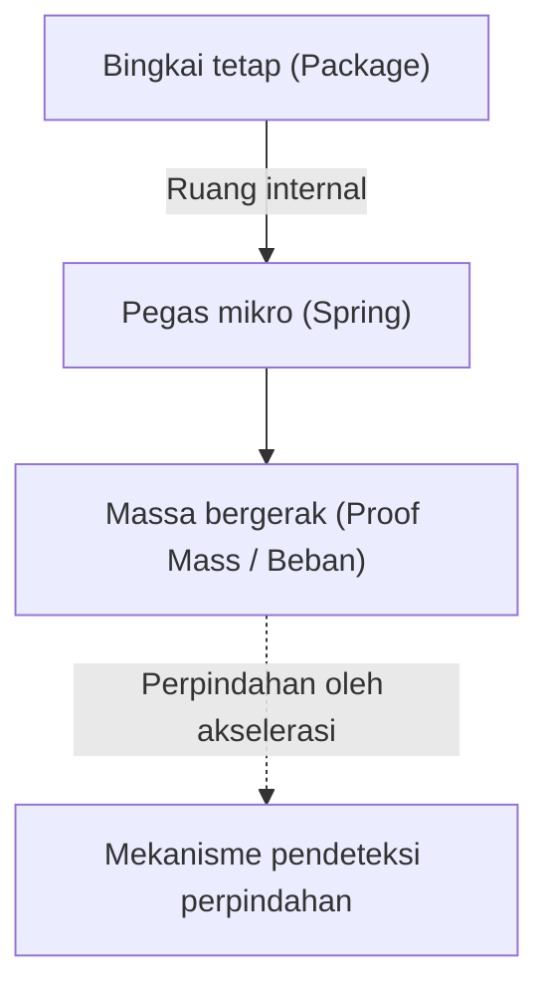

# Dunia Mikro yang Menakjubkan dari Sensor Akselerometer

Dalam kehidupan modern, sulit membayangkan melewati hari tanpa ponsel pintar. Cukup dengan memiringkan layar, video akan ditampilkan dalam layar penuh, langkah kaki dihitung secara otomatis, dan dalam permainan, kita dapat mengontrol karakter hanya dengan memiringkan perangkat. Di balik fitur-fitur praktis ini, tersembunyi komponen elektronik kecil yang disebut "Sensor Akselerometer (Accelerometer)".

Artikel ini akan menjelaskan secara rinci tentang hukum fisika apa yang mendasari sensor akselerometer ini, dan bagaimana ia menggunakan struktur mikro (MEMS) untuk menangkap pergerakan kita.

## Apa itu Akselerasi (Percepatan)? Dasar Fisika

Untuk memahami cara kerja sensor akselerometer, pertama-tama kita perlu memahami dengan tepat tentang besaran fisika yang disebut "akselerasi" atau percepatan. Seperti yang ditunjukkan oleh persamaan gerak Newton $F = ma$ (Gaya = massa × percepatan), ketika gaya diterapkan pada sebuah benda, percepatan pun terjadi.

Sensor akselerometer menghitung percepatan secara tidak langsung dengan mengukur "gaya yang diterapkan pada benda (gaya inersia)" ini.

### Gravitasi juga merupakan sejenis Akselerasi

Selama kita berada di Bumi, kita selalu menerima percepatan gravitasi ke bawah sekitar $9.8 \, \mathrm{m/s^2}$ (1G). Sensor akselerometer di dalam ponsel pintar yang sedang diam juga terus merasakan gravitasi ini.
Ketika ponsel pintar dimiringkan, dengan menghitung bagaimana vektor gravitasi 1G ini didistribusikan ke tiga sumbu X, Y, dan Z dari sensor, kita dapat menentukan "kemiringan" perangkat secara akurat.

## Revolusi Teknologi MEMS (Sistem Mikro-Elektro-Mekanik)

Di masa lalu, sensor akselerometer sangat besar dan mahal, sehingga hanya bisa dipasang pada perangkat seperti sistem navigasi inersia roket dan pesawat terbang. Namun, berkat kemajuan teknologi manufaktur semikonduktor sejak tahun 1980-an, teknologi "MEMS (Micro Electro Mechanical Systems)" pun lahir.

Dengan menggunakan teknologi MEMS, dimungkinkan untuk membuat "struktur mekanis (pegas dan beban)" yang sangat kecil dan "sirkuit elektronik" terintegrasi di atas wafer silikon. Sensor akselerometer ponsel pintar saat ini memiliki struktur mekanis yang lebih halus daripada sehelai rambut, diukir di dalam sebuah chip berukuran beberapa milimeter persegi.

## Struktur Mikro di Dalam Sensor: Beban dan Pegas

Jika kita menyederhanakan struktur internal sensor akselerometer MEMS, modelnya akan terlihat seperti ini.

Ketika perangkat yang dilengkapi sensor (seperti ponsel pintar) bergerak, bingkai tetap juga ikut bergerak. Namun, "beban (massa bergerak)" di dalamnya mencoba untuk tetap pada posisinya karena hukum inersia. Akibatnya, "pegas" yang menopang beban akan meregang dan menyusut, sehingga posisi beban bergeser (mengalami perpindahan) secara relatif terhadap bingkai tetap.

Dengan membaca "pergeseran kecil" ini sebagai sinyal listrik, sensor mengukur percepatan.

## Mekanisme Mengubah Perpindahan Menjadi Sinyal Listrik

Dalam sensor akselerometer MEMS, terdapat dua metode utama untuk mengubah pergeseran kecil (perpindahan) dari beban menjadi sinyal listrik.

### 1. Metode Kapasitif (Capacitive)

Saat ini, metode kapasitif adalah yang paling banyak digunakan dalam ponsel pintar dan perangkat konsumen.

Dalam metode ini, elektroda sangat kecil berbentuk seperti gigi sisir disusun berselang-seling baik pada sisi bingkai tetap maupun pada sisi beban yang dapat bergerak. Celah (gap) antara dua elektroda ini berfungsi sebagai kapasitor.

Ketika terjadi percepatan dan beban bergerak, jarak antara elektroda akan berubah. Kapasitansi (C) dari kapasitor berbanding terbalik dengan jarak antar elektroda, sehingga kapasitansi akan berubah seiring dengan perubahan jarak. Perubahan kapasitansi yang sangat kecil ini diperkuat oleh sirkuit pemrosesan khusus bawaan (ASIC), dan dikeluarkan sebagai sinyal digital (misalnya, melalui protokol komunikasi seperti I2C atau SPI).

Karena tahan terhadap perubahan suhu dan konsumsi dayanya sangat rendah, metode ini sangat ideal untuk perangkat seluler yang menggunakan baterai.

### 2. Metode Piezoresistif (Piezoresistive)

Metode piezoresistif membaca perpindahan sebagai perubahan nilai resistansi. Pada balok (bagian pegas) yang menopang beban bergerak, ditempatkan bahan (terutama silikon yang didoping) yang memiliki efek piezoresistif (fenomena di mana hambatan listrik berubah saat bentuknya berubah akibat gaya).

Ketika beban bergerak karena percepatan dan balok melengkung, distorsi tersebut menyebabkan nilai resistansi piezoresistor berubah. Ini dideteksi menggunakan sirkuit seperti jembatan Wheatstone dan dibaca sebagai perubahan tegangan.

Metode ini sering digunakan untuk aplikasi yang memerlukan pengukuran guncangan sangat besar (G tinggi) secara instan, seperti boneka uji tabrak atau kantong udara (airbag) mobil.

## Penerapan Sensor Akselerometer dalam Masyarakat Modern

Sensor akselerometer tidak hanya digunakan dalam ponsel pintar, tetapi juga berperan penting di berbagai aspek kehidupan masyarakat.

1. **Sistem Airbag Mobil**: Mendeteksi akselerasi negatif (deselerasi) mendadak pada saat mobil bertabrakan, dan mengembangkan airbag dengan akurasi hitungan milidetik. Karena ini menyangkut nyawa manusia, diperlukan keandalan yang sangat tinggi.
2. **Pengontrol Game dan Headset VR**: Dikombinasikan dengan sensor gyro (sensor kecepatan sudut), ini secara akurat melacak pergerakan 3D dalam ruang.
3. **Drone (UAV)**: Secara konstan memantau kemiringan perangkat dan menyesuaikan tenaga motor dengan halus, untuk mewujudkan kendali stabil yang bisa melayang diam di udara (hovering).
4. **Perangkat Kesehatan**: Digunakan juga dalam jam tangan pintar dan pelacak kebugaran untuk menghitung jumlah langkah atau mendeteksi putaran tubuh saat tidur. Baru-baru ini, teknologi ini juga berevolusi sebagai alat penyelamat hidup, seperti fitur pendeteksi "jatuh" pada lansia untuk melakukan panggilan darurat.

## Kesimpulan

Di balik kemampuan ponsel pintar di tangan kita untuk mengetahui "bagaimana kemiringannya sendiri", terdapat kristalisasi dari mekanika Newton, teknologi pemrosesan mikro semikonduktor (MEMS), dan sirkuit konversi analog-ke-digital tingkat lanjut.
Pegas dan beban yang sangat kecil yang bergetar di dunia mikro ini terus mendukung kehidupan digital kita saat ini. Fakta bahwa sensor yang begitu canggih dapat diproduksi secara massal dengan biaya rendah dan mencapai tangan orang-orang di seluruh dunia berkat kemajuan teknologi, benar-benar dapat disebut sebagai keajaiban teknik (engineering) modern.
