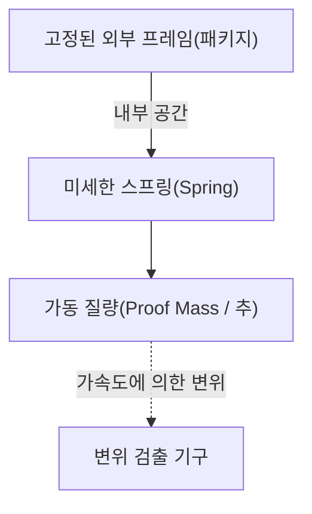

# 가속도 센서의 놀라운 미시 세계

현대 생활에서 스마트폰 없이 하루를 보내는 것은 상상하기 어려워졌습니다. 화면을 가로로 기울이면 동영상이 전체 화면으로 표시되고, 걸음 수를 자동으로 세어주며, 게임에서는 기기를 기울이는 것만으로 캐릭터를 조작할 수 있습니다. 이러한 편리한 기능 이면에는 '가속도 센서(Accelerometer)'라고 불리는 작은 전자 부품이 숨겨져 있습니다.

이 글에서는 이 가속도 센서가 어떤 물리 법칙에 기반하고, 어떤 미세 구조(MEMS)를 사용하여 우리의 움직임을 포착하는지 자세히 설명합니다.

## 가속도란 무엇인가? 물리학의 기초

가속도 센서의 원리를 이해하려면 먼저 '가속도'라는 물리량에 대해 정확히 이해할 필요가 있습니다. 뉴턴의 운동 방정식 $F = ma$(힘=질량×가속도)가 보여주듯이, 물체에 힘이 가해지면 가속도가 발생합니다.

가속도 센서는 바로 이 '물체에 가해지는 힘(관성력)'을 측정함으로써 간접적으로 가속도를 산출하고 있습니다.

### 중력도 가속도의 일종

지구상에 있는 한, 우리는 항상 아래쪽으로 약 $9.8 \, \mathrm{m/s^2}$의 중력 가속도(1G)를 받고 있습니다. 정지해 있는 스마트폰 안의 가속도 센서도 이 중력을 항상 감지하고 있습니다.
스마트폰이 기울어졌을 때, 이 1G의 중력 벡터가 센서의 X, Y, Z 3축에 대해 어떻게 분산되는지를 계산함으로써 단말기의 '기울기'를 정확하게 알아낼 수 있는 것입니다.

## MEMS(미세 전자 기계 시스템) 기술의 혁명

과거의 가속도 센서는 매우 커서 로켓이나 항공기의 관성 항법 장치 등에만 탑재할 수 있는 값비싼 물건이었습니다. 그러나 1980년대 이후 반도체 제조 기술의 발전으로 'MEMS(Micro Electro Mechanical Systems)' 기술이 탄생했습니다.

MEMS 기술을 사용함으로써 실리콘 웨이퍼 위에 극소형의 '기계적 구조(스프링이나 추)'와 '전자 회로'를 일체화하여 만드는 것이 가능해졌습니다. 현재 스마트폰의 가속도 센서는 수 밀리미터 크기의 칩 안에 머리카락 굵기보다 미세한 기계 구조가 새겨져 있습니다.

## 센서 내부의 미세 구조: 추와 스프링

MEMS 가속도 센서의 내부 구조를 단순화해서 생각하면 다음과 같은 모델이 됩니다.

센서가 탑재된 기기(스마트폰 등)가 움직이면, 고정된 외부 프레임도 함께 움직입니다. 그러나 내부의 '추(가동 질량)'는 관성의 법칙에 의해 그 자리에 머무르려고 합니다. 그 결과, 추를 지탱하고 있는 '스프링'이 수축 및 팽창하며, 외부 프레임에 대한 추의 위치가 상대적으로 어긋납니다(변위).

이 '미세한 어긋남'을 전기 신호로 읽어냄으로써 가속도를 측정합니다.

## 변위를 전기 신호로 바꾸는 원리

MEMS 가속도 센서에서 추의 미세한 어긋남(변위)을 전기적인 신호로 변환하는 방법에는 주로 다음의 2종류가 있습니다.

### 1. 정전 용량 방식(Capacitive)

현재 스마트폰이나 일반 소비자용 디바이스에서 가장 널리 사용되는 것이 정전 용량 방식입니다.

이 방식에서는 고정 프레임 측과 가동 추 측 양쪽에 빗살 모양을 한 극소형 전극이 엇갈리게 배치되어 있습니다. 이 두 전극 사이의 틈(갭)이 커패시터(축전기)로서의 역할을 합니다.

가속도가 가해져 추가 움직이면 전극 간의 거리가 변화합니다. 커패시터의 정전 용량(C)은 전극 간의 거리에 반비례하므로, 거리가 바뀜에 따라 정전 용량이 변화합니다. 이 극히 미세한 정전 용량의 변화를 내장된 전용 처리 회로(ASIC)가 증폭하여, 디지털 신호(예를 들어 I2C나 SPI 등의 통신 프로토콜)로 출력합니다.

온도 변화에 강하고 소비 전력이 매우 적다는 특징이 있기 때문에 배터리로 구동되는 모바일 기기에 최적입니다.

### 2. 압전 저항 방식(Piezoresistive)

압전 저항 방식은 변위를 저항값의 변화로 읽어내는 방식입니다. 가동 추를 지탱하는 빔(스프링 부분)에 압전 저항 효과(힘이 가해져 변형되면 전기 저항이 변화하는 현상)를 가진 재료(주로 도핑된 실리콘)가 배치되어 있습니다.

가속도에 의해 추가 움직이고 빔이 휘어지면, 그 변형에 의해 압전 저항의 저항값이 변화합니다. 이를 휘트스톤 브리지 회로 등으로 검출하여 전압의 변화로 읽어냅니다.

이 방식은 충돌 실험용 더미 인형이나 자동차의 에어백 등, 매우 큰 충격(고G)을 순식간에 측정해야 하는 용도에서 자주 사용됩니다.

## 현대 사회에서의 가속도 센서의 응용

가속도 센서는 스마트폰뿐만 아니라 사회의 모든 분야에서 활약하고 있습니다.

1. **자동차의 에어백 시스템**: 자동차가 충돌하는 순간의 급격한 마이너스 가속도(감속)를 감지하여, 수 밀리초 단위의 정밀도로 에어백을 전개시킵니다. 여기서는 인명과 직결되기 때문에 극히 높은 신뢰성이 요구됩니다.
2. **게임 컨트롤러 및 VR 헤드셋**: 자이로 센서(각속도 센서)와 조합함으로써 공간 내에서의 3차원적인 움직임을 정확하게 추적합니다.
3. **드론(UAV)**: 기체의 기울기를 항상 감시하고 모터의 출력을 미세 조정함으로써, 공중에서 딱 멈춰 있는(호버링) 안정적인 제어를 실현하고 있습니다.
4. **헬스케어 디바이스**: 스마트워치나 피트니스 트래커가 걸음 수를 세거나 수면 중의 뒤척임을 감지하는 데에도 사용되고 있습니다. 최근에는 고령자의 '낙상'을 감지하여 긴급 통보를 하는 기능 등 생명을 지키는 기술로도 진화하고 있습니다.

## 요약

우리 손 안의 스마트폰이 '자신이 어떻게 기울어져 있는지'를 아는 배경에는 뉴턴 역학, 반도체 미세 가공 기술(MEMS), 그리고 고도의 아날로그-디지털 변환 회로의 결정체가 존재하고 있습니다.
미시 세계에서 흔들리는 극소형 스프링과 추가 오늘도 우리의 디지털 라이프를 지탱해 주고 있는 것입니다. 기술의 발전으로 이렇게 고도의 센서가 저렴하게 대량 생산되어 전 세계 사람들의 손에 들어가게 된 것은 그야말로 현대 공학의 기적이라고 할 수 있을 것입니다.
