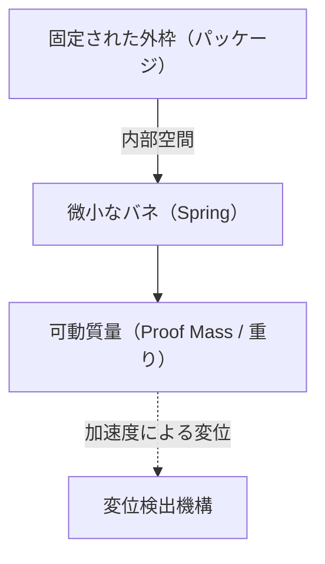

# 加速度センサーの驚くべきミクロの世界

現代の生活において、スマートフォンを持たずに一日を過ごすことは考えにくくなりました。画面を横に傾ければ動画が全画面表示になり、歩数を自動的にカウントし、ゲームでは本体を傾けるだけでキャラクターを操作できます。これらの便利な機能の裏側には、「加速度センサー（Accelerometer）」と呼ばれる小さな電子部品が隠されています。

本記事では、この加速度センサーがどのような物理法則に基づき、どのような微小構造（MEMS）を用いて私たちの動きを捉えているのかを詳細に解説します。

## 加速度とは何か？物理学の基礎

加速度センサーの仕組みを理解するためには、まず「加速度」という物理量について正確に理解する必要があります。ニュートンの運動方程式 $F = ma$（力＝質量×加速度）が示すように、物体に力が加わると加速度が生じます。

加速度センサーは、まさにこの「物体に加わる力（慣性力）」を測定することによって、間接的に加速度を算出しています。

### 重力も加速度の一種

地球上にいる限り、私たちは常に下向きに約 $9.8 \, \mathrm{m/s^2}$ の重力加速度（1G）を受けています。静止しているスマートフォンの中の加速度センサーも、この重力を常に感知しています。
スマートフォンが傾いたとき、この1Gの重力ベクトルがセンサーのX, Y, Zの3軸に対してどのように分散されるかを計算することで、端末の「傾き」を正確に割り出すことができるのです。

## MEMS（微小電気機械システム）技術の革命

かつての加速度センサーは非常に大きく、ロケットや航空機の慣性航法装置などにしか搭載できない高価なものでした。しかし、1980年代以降の半導体製造技術の進歩により、「MEMS（Micro Electro Mechanical Systems）」技術が誕生しました。

MEMS技術を用いることで、シリコンウェハー上に極小の「機械的構造（バネや重り）」と「電子回路」を一体化して作ることが可能になりました。現在のスマートフォンの加速度センサーは、数ミリ角のチップの中に、髪の毛の太さよりも細かな機械構造が彫り込まれています。

## センサー内部の微小構造：重りとバネ

MEMS加速度センサーの内部構造を単純化して考えると、以下のようなモデルになります。

センサーが搭載された機器（スマートフォンなど）が動くと、固定された外枠も一緒に動きます。しかし、内部の「重り（可動質量）」は慣性の法則によりその場に留まろうとします。その結果、重りを支えている「バネ」が伸縮し、重りの位置が外枠に対して相対的にズレます（変位）。

この「微小なズレ」を電気信号として読み取ることで、加速度を測定します。

## 変位を電気信号に変える仕組み

MEMS加速度センサーにおいて、重りの微小なズレ（変位）を電気的な信号に変換する方法には、主に以下の2種類があります。

### 1. 静電容量方式（Capacitive）

現在、スマートフォンやコンシューマー向けデバイスで最も広く使われているのが静電容量方式です。

この方式では、固定枠側と可動重り側の両方に、櫛の歯のような形状をした極小の電極が互い違いに配置されています。この2つの電極間の隙間（ギャップ）がコンデンサ（キャパシタ）としての役割を果たします。

加速度が加わり重りが動くと、電極間の距離が変化します。コンデンサの静電容量（C）は電極間の距離に反比例するため、距離が変わることで静電容量が変化します。この極めて微小な静電容量の変化を、内蔵された専用の処理回路（ASIC）が増幅し、デジタル信号（例えばI2CやSPIなどの通信プロトコル）として出力します。

温度変化に強く、消費電力が非常に少ないという特徴があるため、バッテリー駆動のモバイル機器に最適です。

### 2. ピエゾ抵抗方式（Piezoresistive）

ピエゾ抵抗方式は、変位を抵抗値の変化として読み取る方式です。可動重りを支える梁（バネの部分）に、ピエゾ抵抗効果（力が加わって変形すると電気抵抗が変化する現象）を持つ材料（主にドープされたシリコン）が配置されています。

加速度によって重りが動き、梁がたわむと、その歪みによってピエゾ抵抗の抵抗値が変化します。これをホイートストンブリッジ回路などで検出し、電圧の変化として読み取ります。

この方式は、衝突実験用のダミー人形や自動車のエアバッグなど、非常に大きな衝撃（高G）を瞬時に測定する必要がある用途でよく用いられます。

## 現代社会における加速度センサーの応用

加速度センサーはスマートフォンだけでなく、社会のあらゆる場面で活躍しています。

1. **自動車のエアバッグシステム**: 自動車が衝突した瞬間の急激なマイナスの加速度（減速）を検知し、数ミリ秒単位の精度でエアバッグを展開させます。ここでは人命に関わるため、極めて高い信頼性が求められます。
2. **ゲームコントローラーやVRヘッドセット**: ジャイロセンサー（角速度センサー）と組み合わせることで、空間内での3次元的な動きを正確にトラッキングします。
3. **ドローン（UAV）**: 機体の傾きを常に監視し、モーターの出力を微調整することで、空中でピタリと静止する（ホバリング）安定制御を実現しています。
4. **ヘルスケアデバイス**: スマートウォッチやフィットネストラッカーが歩数を数えたり、睡眠中の寝返りを検知したりするのにも使われています。最近では高齢者の「転倒」を検知して緊急通報を行う機能など、命を守る技術としても進化しています。

## まとめ

私たちの手の中にあるスマートフォンが「自分がどう傾いているか」を知る背後には、ニュートン力学、半導体微細加工技術（MEMS）、そして高度なアナログ・デジタル変換回路の結晶が存在しています。
ミクロの世界で揺れ動く極小のバネと重りが、今日も私たちのデジタルライフを支えてくれているのです。技術の進歩によって、これほどまでに高度なセンサーが安価に大量生産され、世界中の人々の手に渡っていることは、まさに現代エンジニアリングの奇跡と言えるでしょう。
