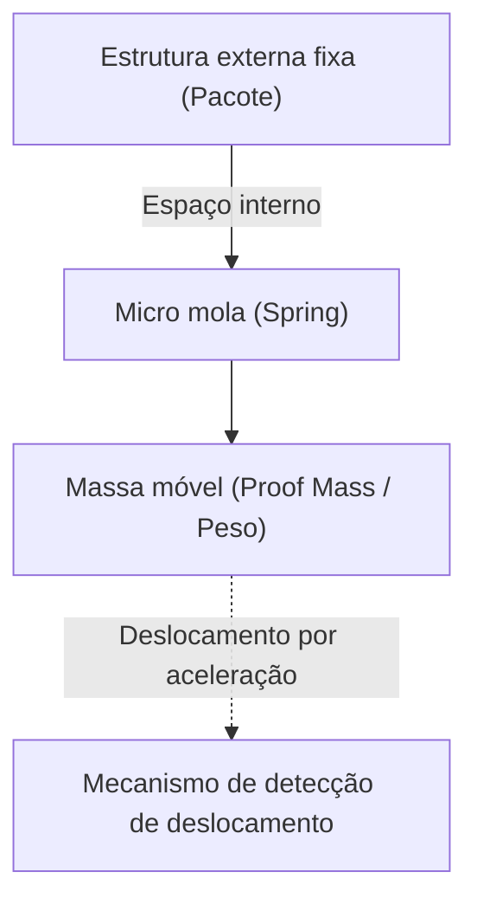

# O incrível mundo microscópico dos sensores acelerômetros

Na vida moderna, tornou-se difícil imaginar passar um dia sem um smartphone. Se você inclinar a tela para o lado, o vídeo passa a ser exibido em tela cheia, os passos são contados automaticamente, e nos jogos é possível controlar o personagem apenas inclinando o aparelho. Por trás dessas funcionalidades convenientes esconde-se um pequeno componente eletrônico chamado "Acelerômetro" (Accelerometer).

Neste artigo, explicaremos em detalhes em quais leis da física esse sensor acelerômetro se baseia e qual tipo de microestrutura (MEMS) ele utiliza para capturar nossos movimentos.

## O que é aceleração? Fundamentos da física

Para entender como o sensor acelerômetro funciona, primeiro é necessário compreender com precisão a grandeza física chamada "aceleração". Como mostra a equação de movimento de Newton $F = ma$ (Força = massa × aceleração), quando uma força é aplicada a um objeto, ocorre aceleração.

O sensor acelerômetro calcula indiretamente a aceleração medindo exatamente essa "força aplicada ao objeto (força de inércia)".

### A gravidade também é um tipo de aceleração

Enquanto estivermos na Terra, estamos constantemente submetidos a uma aceleração da gravidade (1G) voltada para baixo de cerca de $9.8 \, \mathrm{m/s^2}$. O sensor acelerômetro dentro de um smartphone em repouso também detecta essa gravidade constantemente.
Quando o smartphone é inclinado, ao calcular como esse vetor de gravidade de 1G se distribui pelos três eixos X, Y e Z do sensor, é possível determinar com precisão a "inclinação" do dispositivo.

## A revolução da tecnologia MEMS (Sistemas Microeletromecânicos)

No passado, os sensores acelerômetros eram muito grandes e caros, podendo ser instalados apenas em sistemas de navegação inercial de foguetes e aeronaves. No entanto, com os avanços na tecnologia de fabricação de semicondutores a partir da década de 1980, nasceu a tecnologia "MEMS (Micro Electro Mechanical Systems)".

O uso da tecnologia MEMS tornou possível integrar "estruturas mecânicas (molas e pesos)" extremamente pequenas e "circuitos eletrônicos" em uma pastilha de silício. Os sensores acelerômetros dos smartphones atuais possuem estruturas mecânicas mais finas que um fio de cabelo esculpidas dentro de chips de alguns milímetros quadrados.

## Microestrutura interna do sensor: pesos e molas

Ao simplificar a estrutura interna de um sensor acelerômetro MEMS, obtemos um modelo como o seguinte.

Quando o dispositivo onde o sensor está instalado (como um smartphone) se move, a estrutura externa fixa também se move junto. No entanto, o "peso (massa móvel)" interno tenta permanecer em seu lugar devido à lei da inércia. Como resultado, a "mola" que suporta o peso se expande e se contrai, e a posição do peso se desloca (deslocamento) em relação à estrutura externa.

A aceleração é medida lendo esse "micro deslocamento" como um sinal elétrico.

## Mecanismo de conversão de deslocamento em sinal elétrico

Nos sensores acelerômetros MEMS, existem principalmente dois métodos para converter o micro deslocamento do peso em um sinal elétrico.

### 1. Tipo capacitivo (Capacitive)

Atualmente, o tipo capacitivo é o mais utilizado em smartphones e dispositivos voltados para o consumidor.

Nesse método, eletrodos extremamente pequenos em forma de dentes de pente são dispostos de forma alternada, tanto do lado da estrutura fixa quanto do lado do peso móvel. O espaço (gap) entre esses dois eletrodos atua como um capacitor.

Quando a aceleração é aplicada e o peso se move, a distância entre os eletrodos muda. Como a capacitância (C) do capacitor é inversamente proporcional à distância entre os eletrodos, a mudança na distância altera a capacitância. Essa mudança extremamente pequena na capacitância é amplificada por um circuito de processamento dedicado embutido (ASIC) e gerada como um sinal digital (por exemplo, protocolos de comunicação como I2C ou SPI).

Caracteriza-se por ser resistente a mudanças de temperatura e ter um consumo de energia muito baixo, tornando-o ideal para dispositivos móveis movidos a bateria.

### 2. Tipo piezoresistivo (Piezoresistive)

O tipo piezoresistivo é um método que lê o deslocamento como uma mudança na resistência. Um material (principalmente silício dopado) com efeito piezoresistivo (um fenômeno onde a resistência elétrica muda quando deformado por uma força) é colocado na viga (parte da mola) que suporta o peso móvel.

Quando o peso se move devido à aceleração e a viga se flexiona, essa deformação altera o valor da resistência do piezoresistor. Isso é detectado por um circuito de ponte de Wheatstone ou similar, e lido como uma mudança na tensão.

Este método é frequentemente usado em aplicações onde impactos muito grandes (alto G) precisam ser medidos instantaneamente, como bonecos de testes de colisão e airbags de automóveis.

## Aplicações dos sensores acelerômetros na sociedade moderna

Os sensores acelerômetros são ativos não apenas em smartphones, mas em todos os aspectos da sociedade.

1. **Sistemas de airbag automotivos**: Eles detectam a súbita aceleração negativa (desaceleração) no momento em que um carro colide e acionam o airbag com precisão de milissegundos. Como vidas humanas estão em jogo aqui, é exigida uma confiabilidade extremamente alta.
2. **Controles de videogame e headsets VR**: Ao combiná-los com giroscópios (sensores de velocidade angular), eles rastreiam com precisão movimentos tridimensionais no espaço.
3. **Drones (UAV)**: Monitorando constantemente a inclinação da aeronave e ajustando a potência do motor, alcançam um controle estável para permanecer perfeitamente parados no ar (pairando).
4. **Dispositivos de saúde**: Smartwatches e rastreadores de fitness também os utilizam para contar passos e detectar mudanças de posição durante o sono. Recentemente, têm evoluído como uma tecnologia que salva vidas, com funções que detectam "quedas" de idosos e fazem chamadas de emergência.

## Resumo

Por trás da forma como o smartphone em nossas mãos sabe "como ele está inclinado", existe a cristalização da mecânica newtoniana, da tecnologia de microfabricação de semicondutores (MEMS) e de circuitos avançados de conversão analógico-digital.
As molas e os pesos microscópicos balançando no mundo microscópico continuam a apoiar nossa vida digital hoje. O fato de os avanços tecnológicos permitirem que sensores tão avançados sejam produzidos em massa a baixo custo e cheguem às mãos de pessoas em todo o mundo é verdadeiramente um milagre da engenharia moderna.
