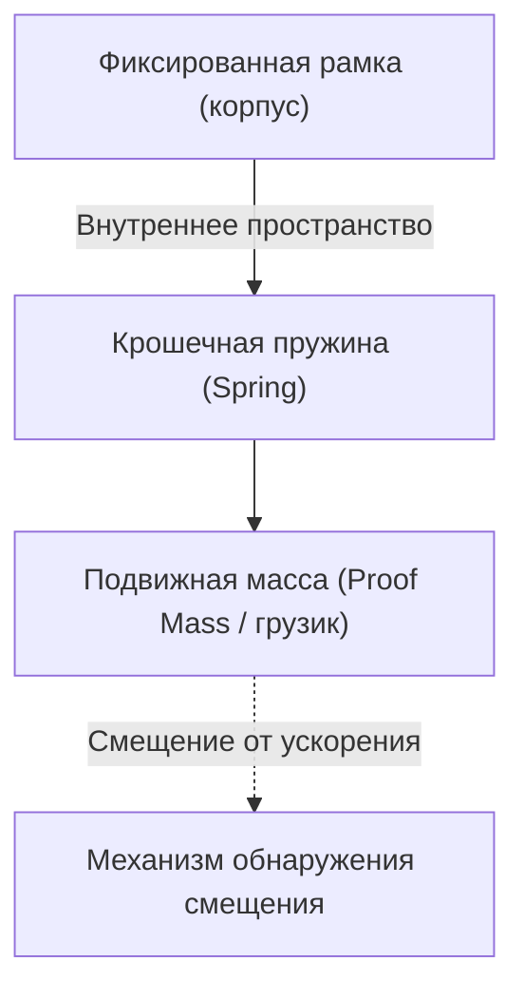
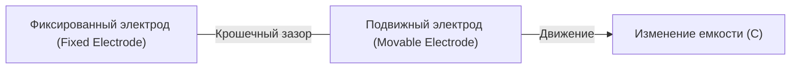

# Удивительный микромир акселерометров

В современной жизни трудно представить себе день без смартфона. Если наклонить экран горизонтально, видео развернется на весь экран, шаги считаются автоматически, а в играх можно управлять персонажем, просто наклоняя устройство. За этими удобными функциями скрывается крошечный электронный компонент, называемый «акселерометром» (Accelerometer).

В этой статье мы подробно объясним, на каких физических законах основан акселерометр и какие микроструктуры (МЭМС) он использует для фиксации наших движений.

## Что такое ускорение? Основы физики

Чтобы понять, как работает акселерометр, нужно сначала точно понять физическую величину «ускорение». Как показывает второй закон Ньютона $F = ma$ (сила = масса × ускорение), когда к объекту прикладывается сила, возникает ускорение.

Акселерометр косвенно вычисляет ускорение, измеряя именно эту «силу, действующую на объект (силу инерции)».

### Гравитация тоже вид ускорения

Пока мы находимся на Земле, мы постоянно подвергаемся ускорению свободного падения (1G), направленному вниз и составляющему примерно $9.8 \, \mathrm{m/s^2}$. Акселерометр в неподвижном смартфоне тоже постоянно ощущает эту гравитацию.
Когда смартфон наклоняется, можно точно определить «наклон» устройства, вычислив, как этот вектор гравитации 1G распределяется по трем осям датчика — X, Y и Z.

## Революция технологии МЭМС (Микроэлектромеханические системы)

В прошлом акселерометры были очень большими и дорогими, их устанавливали только в инерциальные навигационные системы ракет и самолетов. Однако с развитием технологий производства полупроводников в 1980-х годах появилась технология «МЭМС (Micro Electro Mechanical Systems)».

Технология МЭМС позволила интегрировать крошечные «механические структуры (пружины и грузики)» и «электронные схемы» на одной кремниевой пластине. В современных смартфонах в чип размером в несколько квадратных миллиметров встроены механические структуры, которые тоньше человеческого волоса.

## Микроструктура внутри датчика: грузик и пружина

Если упростить внутреннюю структуру МЭМС-акселерометра, она будет выглядеть как следующая модель:

Когда устройство с датчиком (например, смартфон) движется, фиксированная внешняя рамка движется вместе с ним. Однако внутренний «грузик (подвижная масса)» стремится остаться на месте из-за закона инерции. В результате «пружины», поддерживающие грузик, растягиваются или сжимаются, и положение грузика смещается относительно внешней рамки (смещение).

Измеряя это «крошечное смещение» в виде электрического сигнала, датчик определяет ускорение.

## Механизм преобразования смещения в электрический сигнал

В МЭМС-акселерометрах существуют два основных способа преобразования крошечного смещения грузика в электрический сигнал:

### 1. Емкостной метод (Capacitive)

В настоящее время емкостной метод наиболее широко используется в смартфонах и потребительских устройствах.

В этом методе крошечные электроды, по форме напоминающие зубья расчески, расположены в шахматном порядке как на стороне фиксированной рамки, так и на стороне подвижного грузика. Зазор (промежуток) между этими двумя электродами действует как конденсатор.

Когда из-за ускорения грузик перемещается, расстояние между электродами меняется. Поскольку емкость конденсатора (C) обратно пропорциональна расстоянию между электродами, изменение расстояния приводит к изменению емкости. Это чрезвычайно малое изменение емкости усиливается встроенной специализированной схемой обработки (ASIC) и выводится в виде цифрового сигнала (например, по протоколам связи I2C или SPI).

Этот метод отличается устойчивостью к изменениям температуры и очень низким энергопотреблением, что делает его идеальным для мобильных устройств с батарейным питанием.

### 2. Пьезорезистивный метод (Piezoresistive)

Пьезорезистивный метод считывает смещение как изменение сопротивления. На балках (пружинах), поддерживающих подвижный грузик, размещается материал (в основном легированный кремний), обладающий пьезорезистивным эффектом (явлением, при котором электрическое сопротивление меняется при деформации под действием силы).

Когда грузик движется под воздействием ускорения и балка изгибается, ее деформация изменяет сопротивление пьезорезистора. Это изменение обнаруживается с помощью таких схем, как мост Уитстона, и считывается как изменение напряжения.

Этот метод часто используется в случаях, когда необходимо мгновенно измерять очень сильные удары (высокие перегрузки G), например, в манекенах для краш-тестов или в подушках безопасности автомобилей.

## Применение акселерометров в современном обществе

Акселерометры активно используются не только в смартфонах, но и в самых разных сферах жизни общества:

1. **Системы подушек безопасности автомобилей**: Датчик фиксирует резкое отрицательное ускорение (замедление) в момент столкновения автомобиля и с миллисекундной точностью раскрывает подушку безопасности. Поскольку здесь речь идет о человеческих жизнях, требуется высочайшая надежность.
2. **Игровые контроллеры и VR-гарнитуры**: В сочетании с гироскопами (датчиками угловой скорости) они точно отслеживают трехмерные движения в пространстве.
3. **Дроны (БПЛА)**: Постоянно контролируя наклон аппарата и точно регулируя мощность двигателей, они обеспечивают стабильное зависание в воздухе.
4. **Медицинские и фитнес-устройства**: Смарт-часы и фитнес-трекеры используют их для подсчета шагов или определения поворотов во сне. В последнее время они также развиваются как технологии спасения жизней, например, благодаря функции обнаружения «падения» у пожилых людей и автоматического экстренного вызова.

## Заключение

За способностью смартфона в нашей руке понимать, «как он наклонен», стоят достижения ньютоновской механики, технологий микрообработки полупроводников (МЭМС) и передовых схем аналого-цифрового преобразования.
Крошечные пружинки и грузики, колеблющиеся в микромире, сегодня продолжают поддерживать нашу цифровую жизнь. То, что такие высокотехнологичные датчики производятся массово и дешево, попадая в руки людей по всему миру, можно по праву назвать настоящим чудом современной инженерии.
