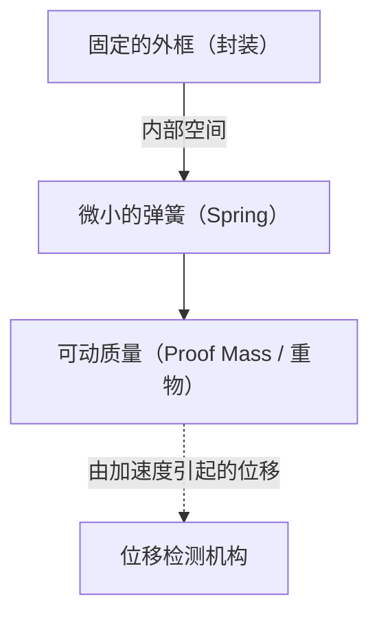

# 加速度传感器令人惊叹的微观世界

在现代生活中，很难想象度过没有智能手机的一天。将屏幕横向倾斜即可全屏播放视频，自动计算步数，在游戏中只需倾斜设备即可控制角色。这些便利功能的背后，隐藏着一种叫做“加速度传感器（Accelerometer）”的微小电子元件。

本文将详细解释这种加速度传感器基于什么物理定律，以及使用什么样的微小结构（MEMS）来捕捉我们的运动。

## 什么是加速度？物理学基础

要了解加速度传感器的原理，首先需要准确理解“加速度”这个物理量。正如牛顿的运动方程 $F = ma$（力 = 质量 × 加速度）所示，当力施加到物体上时，就会产生加速度。

加速度传感器正是通过测量这种“施加在物体上的力（惯性力）”来间接计算加速度的。

### 重力也是一种加速度

只要在地球上，我们就会一直受到约 $9.8 \, \mathrm{m/s^2}$ 向下的重力加速度（1G）。静止的智能手机中的加速度传感器也始终感知着这种重力。
当智能手机倾斜时，通过计算这个1G的重力矢量如何在传感器的X、Y、Z三个轴上分布，就可以准确地推断出设备的“倾斜度”。

## MEMS（微机电系统）技术的革命

过去的加速度传感器非常庞大，是只能安装在火箭或飞机的惯性导航系统中的昂贵设备。然而，随着1980年代以来半导体制造技术的进步，“MEMS（Micro Electro Mechanical Systems）”技术应运而生。

通过使用MEMS技术，可以在硅晶圆上将极小的“机械结构（弹簧和重物）”与“电子电路”集成在一起制造。如今智能手机的加速度传感器，在几毫米见方的芯片中，雕刻着比头发丝还要细微的机械结构。

## 传感器内部的微小结构：重物与弹簧

简化MEMS加速度传感器的内部结构，可以得到如下模型。

当搭载传感器的设备（如智能手机）移动时，固定的外框也会随之移动。然而，内部的“重物（可动质量）”由于惯性定律会试图留在原地。结果，支撑重物的“弹簧”发生伸缩，重物相对于外框的位置发生偏移（位移）。

通过将这种“微小的偏移”读取为电信号，来测量加速度。

## 将位移转化为电信号的机制

在MEMS加速度传感器中，将重物的微小偏移（位移）转换为电信号的方法主要有以下两种。

### 1. 电容式（Capacitive）

目前，智能手机和消费级设备中最广泛使用的是电容式。

在这种方式中，固定框侧和可动重物侧都交错排列着梳齿状的极小电极。这两个电极之间的间隙（Gap）起到了电容器（Capacitor）的作用。

当施加加速度导致重物移动时，电极之间的距离会发生变化。因为电容器的电容（C）与电极之间的距离成反比，所以距离的改变会导致电容发生变化。内置的专用处理电路（ASIC）会将这种极其微小的电容变化放大，并作为数字信号（例如I2C或SPI等通信协议）输出。

由于它对温度变化具有很强的抵抗力，并且功耗非常低，因此非常适合电池驱动的移动设备。

### 2. 压阻式（Piezoresistive）

压阻式是一种将位移作为电阻值变化来读取的方式。在支撑可动重物的悬臂梁（弹簧部分）上，布置了具有压阻效应（施加力使其变形时电阻会发生变化的现象）的材料（主要是掺杂的硅）。

当重物因加速度而移动且梁发生弯曲时，压阻的电阻值会因应变而发生变化。通过惠斯通电桥电路等检测出这种变化，并作为电压的变化读取出来。

这种方式常用于需要瞬间测量极大冲击（高G）的场合，例如碰撞实验用的假人或汽车安全气囊等。

## 加速度传感器在现代社会中的应用

加速度传感器不仅应用于智能手机，还活跃在社会的各个领域。

1. **汽车安全气囊系统**：检测汽车碰撞瞬间急剧的负加速度（减速），并以毫秒级的精度展开安全气囊。由于这关乎人命，因此需要极高的可靠性。
2. **游戏手柄和VR头显**：通过与陀螺仪传感器（角速度传感器）结合，可以精确追踪空间内的三维运动。
3. **无人机（UAV）**：持续监控机身的倾斜度并微调电机输出，从而实现空中悬停（Hovering）的稳定控制。
4. **医疗保健设备**：用于智能手表和健身追踪器计算步数、检测睡眠中的翻身等。最近，它还进化为一种保护生命的技术，例如检测老年人“跌倒”并进行紧急呼叫的功能。

## 总结

我们手中的智能手机之所以能知道“自身是如何倾斜的”，其背后是牛顿力学、半导体微细加工技术（MEMS）以及高级模数转换电路的结晶。
在微观世界中摇摆的微小弹簧和重物，今天也支撑着我们的数字生活。随着技术的进步，如此先进的传感器能够以低廉的价格大量生产，并送达世界各地人们的手中，这可以说是现代工程学的奇迹。
