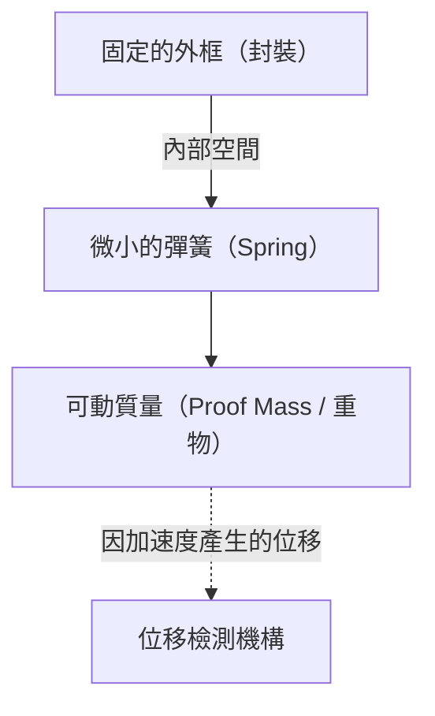

# 加速度感測器令人驚嘆的微觀世界

在現代生活中，已經很難想像一整天不帶智慧型手機能怎麼過。只要將螢幕橫向傾斜，影片就會全螢幕顯示；它會自動計算步數；在遊戲中，只需傾斜機身就能操作角色。這些便利功能背後，隱藏著被稱為「加速度感測器（Accelerometer）」的小型電子零件。

本文將詳細解說這個加速度感測器是基於什麼樣的物理法則，以及使用何種微小結構（MEMS）來捕捉我們的動作。

## 什麼是加速度？物理學基礎

為了理解加速度感測器的原理，首先必須準確理解「加速度」這個物理量。正如牛頓的運動方程式 $F = ma$（力＝質量×加速度）所示，當物體受到力時，就會產生加速度。

加速度感測器正是透過測量這個「施加在物體上的力（慣性力）」，來間接計算出加速度。

### 重力也是加速度的一種

只要在地球上，我們就會始終承受向下約 $9.8 \, \mathrm{m/s^2}$ 的重力加速度（1G）。靜止狀態下智慧型手機內的加速度感測器，也隨時感知著這個重力。
當智慧型手機傾斜時，透過計算這個1G的重力向量是如何分散到感測器的X、Y、Z三個軸上，就能準確算出裝置的「傾斜角度」。

## MEMS（微機電系統）技術的革命

過去的加速度感測器體積非常龐大，是只能搭載於火箭或飛機的慣性導航系統等設備上的昂貴物品。然而，隨著1980年代後半導體製造技術的進步，「MEMS（Micro Electro Mechanical Systems）」技術應運而生。

透過使用MEMS技術，可以將極小的「機械結構（彈簧與重物）」與「電子電路」整合製造在矽晶圓上。現在智慧型手機的加速度感測器，在幾毫米見方的晶片中，雕刻著比頭髮還要細微的機械結構。

## 感測器內部的微小結構：重物與彈簧

將MEMS加速度感測器的內部結構簡化思考，會變成以下模型。

當搭載感測器的設備（如智慧型手機）移動時，固定的外框也會跟著移動。但是，內部的「重物（可動質量）」會因為慣性定律而試圖留在原地。結果，支撐重物的「彈簧」會伸縮，重物的位置相對於外框產生偏移（位移）。

透過將這個「微小的偏移」讀取為電子訊號，就能測量出加速度。

## 將位移轉換為電子訊號的機制

在MEMS加速度感測器中，將重物的微小偏移（位移）轉換為電子訊號的方法，主要有以下兩種。

### 1. 電容式（Capacitive）

目前在智慧型手機和消費性電子產品中最廣泛使用的是電容式。

在這種方式中，固定框側和可動重物側雙方，都交錯配置著梳齒狀的極小電極。這兩個電極之間的空隙（間隙）就扮演著電容器（Capacitor）的角色。

當受到加速度而重物移動時，電極間的距離就會改變。因為電容器的電容值（C）與電極間的距離成反比，距離改變會導致電容值發生變化。內建的專用處理電路（ASIC）會將這極微小的電容值變化放大，並轉換為數位訊號（例如I2C或SPI等通訊協定）輸出。

由於具有耐溫度變化且功耗極低的特點，非常適合電池驅動的行動裝置。

### 2. 壓阻式（Piezoresistive）

壓阻式是將位移讀取為電阻值變化的方式。在支撐可動重物的樑（彈簧的部分）上，配置了具有壓阻效應（受力變形時電阻會發生變化的現象）的材料（主要是摻雜的矽）。

當加速度使重物移動，樑發生彎曲時，該變形會導致壓阻的電阻值產生變化。透過惠斯登電橋電路等來檢測這個變化，並將其讀取為電壓的變化。

這種方式常用於碰撞實驗用的假人或汽車安全氣囊等，需要瞬間測量極大衝擊（高G）的用途。

## 加速度感測器在現代社會中的應用

加速度感測器不僅在智慧型手機中，在社會的各種場景裡也都大顯身手。

1. **汽車安全氣囊系統**：檢測汽車碰撞瞬間急劇的負加速度（減速），以毫秒級的精度展開安全氣囊。因為這攸關人命，所以需要極高的可靠性。
2. **遊戲控制器與VR頭戴裝置**：與陀螺儀（角速度感測器）結合，能準確追蹤空間中的3D動作。
3. **無人機（UAV）**：持續監控機身的傾斜，並微調馬達輸出，實現能在空中完美靜止（懸停）的穩定控制。
4. **醫療保健裝置**：智慧手錶或健身追蹤器也用它來計算步數或檢測睡眠中的翻身。最近更進化為保護生命的技術，例如檢測高齡者「跌倒」並進行緊急通報的功能。

## 總結

我們手中的智慧型手機之所以能知道「自己是如何傾斜的」，其背後存在著牛頓力學、半導體微細加工技術（MEMS）以及先進的類比數位轉換電路的結晶。
在微觀世界中搖擺的極小彈簧與重物，今天也支撐著我們的數位生活。隨著技術進步，如此高階的感測器能夠廉價地大量生產，並交到世界各地人們的手中，這無疑是現代工程學的奇蹟。
