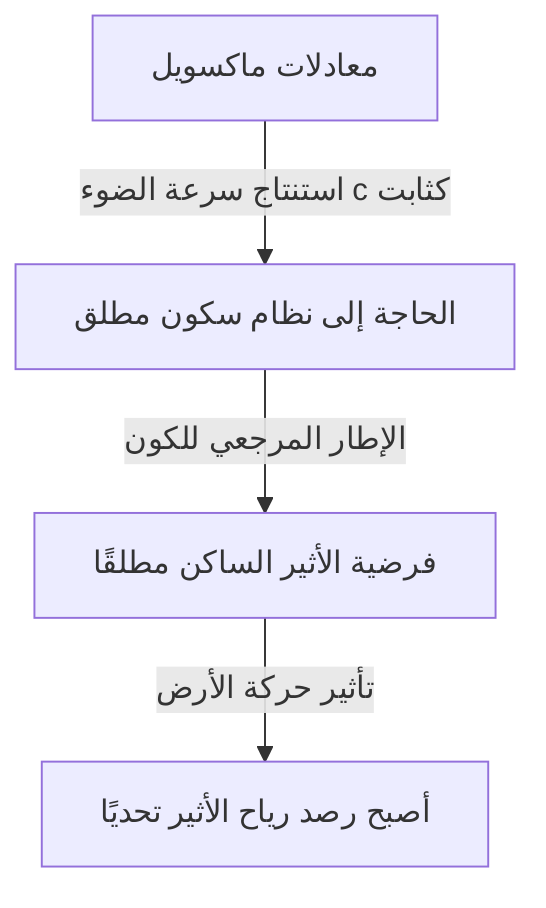

## 1. مقدمة: "الشيء" الذي كان يُعتقد أنه يملأ الكون

طوال تاريخ سعي البشرية لكشف ألغاز العالم الطبيعي، كان سؤال "كيف ينتقل الضوء عبر الفضاء؟" يسحر ويحير العديد من العباقرة، من فلاسفة اليونان القديمة إلى علماء الفيزياء في العصر الحديث.

بمراقبة الظواهر الفيزيائية اليومية، نجد أن انتقال الصوت يتطلب مادة مثل "الهواء" أو "الماء"، وانتقال أمواج البحر يتطلب وسطا هو "مياه البحر". من هذا القياس البديهي والمنطقي للغاية، ظهرت فكرة أنه إذا كان للضوء خصائص موجية، فلا بد من وجود "وسط مجهول" لنقل الضوء يملأ كل ركن من أركان الفضاء الكوني. هذا الوسط الوهمي هو ما سُمي بـ "الأثير المضيء" (Luminiferous aether).

لقد تجاوز وجود الأثير مجرد كونه فرضية، وتم قبوله كـ "حقيقة بديهية" لا شك فيها في الفيزياء حتى نهاية القرن التاسع عشر. ومع ذلك، فإن تجربة واحدة سعت للتحقق من هذه "الحقيقة البديهية" أدت في النهاية إلى قلب أسس الفيزياء، وقادت البشرية إلى نظرة جديدة للكون تُعرف بالنظرية النسبية لأينشتاين. في هذا المقال، سنستعرض بالتفصيل مسار هذا التاريخ العلمي العظيم: كيف وُلد مفهوم الأثير المضيء، وكيف تم دحضه، وما هو الإرث الذي تركه للفيزياء الحديثة.

## 2. الجدل حول طبيعة الضوء وولادة الأثير

احتدم النقاش حول ما إذا كان جوهر الضوء "جسيمًا" أم "موجة" خلال عصر الثورة العلمية في القرن السابع عشر.

اقترح إسحاق نيوتن "النظرية الجسيمية للضوء"، والتي تنص على أن الضوء عبارة عن تيار من الجسيمات الدقيقة، مستندًا إلى انتقال الضوء في خطوط مستقيمة وقوانين الانعكاس. وبفضل سلطته الساحقة، هيمنت النظرية الجسيمية على مجتمع الفيزياء طوال القرن الثامن عشر. ولكن في نفس العصر، جادل كريستيان هيغنز بأنه لتفسير ظواهر مثل حيود وانكسار الضوء، يجب اعتبار الضوء موجة، وطرح "النظرية الموجية للضوء".

مع دخول القرن التاسع عشر، ومن خلال "تجربة الشق المزدوج" لتوماس يونغ واكتمال النظرية الموجية الرياضية لأوغستان-جان فرينل، ثبت بشكل قاطع أن الضوء يمتلك خصائص موجية (التداخل والحيود). إذا كان الضوء موجة، فلا بد من وجود "وسط" ناقل للموجات في الكون بأكمله. وبما أن ضوء الشمس يصل إلى الأرض حتى عبر الفضاء الخالي، فقد اعتُبر أن الفضاء الكوني ليس فراغًا تامًا، بل ممتلئ بوسط شفاف ورقيق للغاية ولكنه صلب يُسمى "الأثير"، ينقل موجات الضوء.

### الخصائص الغريبة المطلوبة في الأثير

ومع ذلك، بافتراض وجود وسط الأثير، واجه الفيزيائيون تناقضًا خطيرًا. فقد تبين من خلال اكتشاف ظاهرة الاستقطاب أن الضوء عبارة عن موجة مستعرضة (موجة تتذبذب عموديًا على اتجاه انتشارها). وفي إطار الفيزياء في ذلك الوقت، كانت "المواد الصلبة" فقط هي القادرة على نقل الموجات المستعرضة. بينما تنقل الغازات والسوائل الموجات الطولية فقط (مثل الموجات الصوتية).

بمعنى آخر، كان يجب أن يكون الأثير "مادة صلبة شفافة عملاقة" تمتد عبر الكون بأسره. ومن أجل نقل الموجات بالسرعة الهائلة التي هي سرعة الضوء (حوالي 300 ألف كيلومتر في الثانية)، يجب أن يكون الأثير أصلب بكثير من الفولاذ ويتمتع بمرونة قوية للغاية. وفي الوقت نفسه، ونظرًا لأن الأرض والكواكب لا يبدو أنها تتعرض لأي مقاومة احتكاك من الأثير أثناء دورانها حول الشمس، فيجب أن يكون الأثير خاليًا تمامًا من الاحتكاك، وأن يمتلك خاصية رقيقة للغاية تسمح بمرور المواد عبره دون أي مقاومة.

وهكذا أُثقل الأثير بخصائص غريبة متناقضة تمامًا من الناحية الفيزيائية: "مادة صلبة أصلب من الفولاذ، ولكنها لا تبدي أي مقاومة تمامًا مثل المائع المثالي".

## 3. كهرومغناطيسية ماكسويل ونظام الراحة المطلقة للأثير

في أواخر القرن التاسع عشر، أكمل جيمس كليرك ماكسويل "معادلات ماكسويل" التي تشكل أساس الكهرومغناطيسية. لم تصف هذه المعادلات الظواهر الكهربائية والمغناطيسية بشكل مثالي فحسب، بل تضمنت أيضًا تنبؤًا مذهلاً. فعند حساب سرعة انتشار الموجات الكهرومغناطيسية، وجد أنها تتطابق تمامًا مع "سرعة الضوء" التي تم قياسها في التجارب آنذاك. وبذلك تم إثبات نظريًا أن "الضوء هو نوع من الموجات الكهرومغناطيسية".

في معادلات ماكسويل، تُستنتج سرعة الضوء $c$ كثابت يتحدد من خلال السماحية الكهربائية والنفاذية المغناطيسية للفراغ. وهنا نشأت مشكلة كبيرة. عندما نقول أن "سرعة الضوء ثابتة"، فـ "بالنسبة إلى ماذا" هي ثابتة؟

وفقًا لمبدأ النسبية في ميكانيكا نيوتن، يجب أن تتغير السرعة دائمًا اعتمادًا على حالة حركة الراصد. فسرعة الكرة المرمية من قطار متحرك ستكون "سرعة القطار + سرعة الكرة" من منظور شخص يقف على الأرض. ومع ذلك، فإن سرعة الضوء في معادلات ماكسويل لم تأخذ في الاعتبار سرعة الراصد هذه.

لحل هذه المشكلة، استعان فيزيائيو ذلك العصر بـ "بحر الأثير". افترضوا وجود فضاء يشكل مرجعًا مطلقًا تصح فيه معادلات ماكسويل، وأنه "الأثير الساكن مطلقًا" الذي يمتد في حالة سكون عبر الكون بأكمله. أي أنه تم تفسير سرعة الضوء $c$ على أنها "السرعة بالنسبة إلى الأثير الساكن سكونًا مطلقًا".

## 4. تجربة ميكلسون ومورلي: "الفشل" الأشهر في التاريخ

إذا كان الفضاء الكوني ممتلئًا بالأثير الساكن سكونًا مطلقًا، فإن الأرض التي تدور حول الشمس تندفع دائمًا عبر بحر الأثير. ومن منظور الأرض، يجب أن تهب "رياح الأثير" من الفضاء.

في عام 1887، أجرى ألبرت ميكلسون وإدوارد مورلي تجربة رائدة لالتقاط "رياح الأثير" هذه. قاموا ببناء جهاز بصري عالي الدقة يُعرف باسم "مقياس التداخل لميكلسون".

مبدأ التجربة هو كما يلي: يتم تقسيم حزمة ضوئية من مصدر ضوئي إلى اتجاهين متعامدين باستخدام مرآة نصف عاكسة (مرآة نصف شفافة). يتجه أحدهما موازيًا لاتجاه رياح الأثير، والآخر عموديًا عليه، وينعكس كلاهما من مرايا في نهايتي مساريهما ويعودان. إذا كانت رياح الأثير موجودة، تمامًا كما يتأثر الشخص الذي يسبح ذهابًا وإيابًا في نهر بتيار النهر، فيجب أن يكون هناك فرق ضئيل جدًا في وقت انتقال الضوء ذهابًا وإيابًا. وعندما يتم تراكب شعاعي الضوء العائدين، كان من المتوقع أن يُلاحظ فرق الوقت هذا كإزاحة في "أهداب التداخل".

ومع ذلك، أحدثت النتيجة صدمة كبيرة في مجتمع الفيزياء. بغض النظر عن مدى تدوير الجهاز، أو تغير الفصول مما يغير اتجاه دوران الأرض، لم تُلاحظ أي إزاحة في أهداب التداخل على الإطلاق. لم تكن رياح الأثير تهب على الإطلاق.

لقد حُفر اسم "تجربة ميكلسون ومورلي" هذه في التاريخ باعتبارها "التجربة الفاشلة الأشهر في تاريخ العلوم"، ومن المفارقات أن ذلك كان بسبب فشلها الذريع في إثبات وجود الأثير.

## 5. انكماش لورنتز والحلول المخصصة (Ad hoc)

حاول الفيزيائيون الذين أخذوا نتائج التجربة على محمل الجد إنقاذ نظرية الأثير بأي طريقة. طرح جورج فيتزجيرالد وهيندريك لورنتز فرضية مذهلة.

"هل يمكن أن يكون الجسم نفسه ينكمش قليلاً على طول اتجاه الحركة، بسبب ضغط رياح الأثير عندما يتحرك الجسم عبر الأثير؟"

وفقًا لـ "فرضية انكماش لورنتز-فيتزجيرالد"، فإن أذرع مقياس التداخل لميكلسون ومورلي تنكمش أيضًا بدقة على طول اتجاه الحركة، مما يلغي فرق الوقت في انتقال الضوء ذهابًا وإيابًا، وبالتالي يفسر سبب عدم إمكانية رصد رياح الأثير. بالإضافة إلى ذلك، قدم لورنتز مفهوم تباطؤ الزمن (الزمن المحلي) في الأنظمة المتحركة، وأكمل إطارًا رياضيًا يُعرف باسم "تحويلات لورنتز".

ومع ذلك، لم تتمكن هذه النظريات من محو الانطباع بأنها حلول "مخصصة" (ترقيعية) أضيفت لاحقًا لحماية وجود الأثير. فعلى الرغم من إثباتهم رياضيًا أن القوانين الفيزيائية غير متغيرة بالنسبة للراصد، إلا أنهم ظلوا متمسكين بوجود "أثير غير مرئي وساكن مطلقًا".

## 6. أينشتاين وتغيير النموذج الفكري: النظرية النسبية الخاصة

في عام 1905، نشر ألبرت أينشتاين، وهو موظف شاب في مكتب براءات الاختراع، ورقة بحثية تحل هذه المشكلة المعقدة جذريًا من خلال مبدأين بسيطين فقط. هذه هي "النظرية النسبية الخاصة".

توقف أينشتاين عن القلق بشأن خصائص الأثير وانطلق من فرضيات جديدة كليًا:
1. **مبدأ النسبية**: تأخذ القوانين الفيزيائية نفس الشكل تمامًا في جميع الأطر القصرية (لأي راصد يتحرك في خط مستقيم وبسرعة منتظمة). لا يوجد شيء اسمه إطار سكون مطلق.
2. **مبدأ ثبات سرعة الضوء**: سرعة الضوء في الفراغ ثابتة دائمًا (الثابت $c$) لجميع الراصدين، بغض النظر عن حالة حركة مصدر الضوء أو حالة حركة الراصد.

بقبول هذين المبدأين، نصل إلى استنتاج مذهل. فلكي تكون سرعة الضوء ثابتة دائمًا، يجب أن ينكمش "المكان" ويتباطأ "الزمان" وفقًا لحالة حركة الراصد. أصبح من الواضح أن الظاهرة التي اعتبرها لورنتز وآخرون "انكماشًا ماديًا بسبب الأثير" كانت في الواقع خاصية نسبية للزمان والمكان نفسيهما.

والأهم من ذلك هو أن نظرية أينشتاين لم تترك أي مجال على الإطلاق لمفهوم "الوسط الناقل للضوء = الأثير". الموجات الكهرومغناطيسية تنتشر ذاتيًا كخاصية للفضاء، ولا تحتاج إلى وسط. وهنا، تم القضاء نظريًا بشكل كامل على وهم "الأثير" الذي هيمن على الفيزيائيين لقرون.

## 7. "الفراغ" في الفيزياء الحديثة: شبح الأثير

تم التخلي عن الأثير كمفهوم غير ضروري، ولكن فكرة أن "المكان الفارغ (الفراغ)" هو "فارغ" حقًا قد تم دحضها أيضًا بواسطة الفيزياء الحديثة.

وفقًا لـ "نظرية المجال الكمومي" التي تدمج بين ميكانيكا الكم والنسبية الخاصة، فإن الفراغ ليس مجرد فضاء من العدم. بل هو حالة ديناميكية للغاية مليئة بـ "التقلبات الكمومية" حيث تتكون وتفنى أزواج الجسيمات والجسيمات المضادة باستمرار. توجد "مجالات (Fields)" مثل المجال الكهرومغناطيسي ومجال هيغز في كل مكان في الفضاء الكوني، وتظهر الجسيمات كحالات إثارة (تموجات) في هذه المجالات.

بالإضافة إلى ذلك، في النظرية النسبية العامة، وصف أينشتاين الزمكان نفسه بأنه كيان ديناميكي ينحني بفعل الجاذبية. وقد قال أينشتاين نفسه في سنوات لاحقة أنه بالمعنى الذي يمتلك فيه الزمكان نفسه خصائص فيزيائية، "يمكن تسميته أثيرًا بمعنًى جديد" (على الرغم من أنه يختلف تمامًا عن الأثير كوسط ساكن مطلق في القرن التاسع عشر).

وقد يمكن أيضًا اعتبار "الطاقة المظلمة" و "المادة المظلمة" اللتين تُناقشان في علم الكونيات الحديث بمثابة نسخة حديثة من الأثير، بمعنى أنهما كيانات مجهولة تملأ الفضاء الكوني وتتحكم في سلوك الكون.

## 8. الخاتمة: ما يعلمنا إياه تاريخ العلوم

تعتبر قصة الأثير المضيء مثالًا جميلًا للغاية يوضح كيف يتقدم العلم.

كان الأثير فرضية خاطئة. لكنه لم يكن فرضية "بلا معنى". فبفضل وجود مفهوم الأثير، أُجريت تجارب دقيقة لمحاولة إثباته، مما سلط الضوء على حدوده النظرية، وأدى في النهاية إلى أعظم قفزة فكرية في تاريخ البشرية: النظرية النسبية.

إن الفشل والافتراضات الخاطئة في العلم ليست بلا فائدة أبدًا. فهي بمثابة سقالات لا غنى عنها لإضاءة المناطق المجهولة. اختفى الوسط الوهمي للأثير المضيء من الفيزياء، لكن المعرفة بـ "الطبيعة الحقيقية للزمكان" التي اكتسبتها البشرية أثناء عملية استكشافه لا تزال تدعم فهمنا للكون حتى اليوم.
