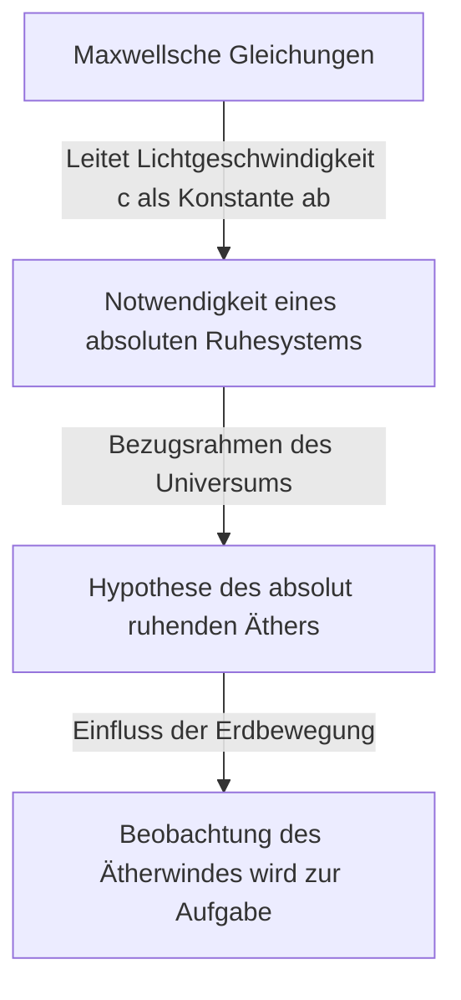

## 1. Einleitung: Das 'Etwas', das das Universum füllen sollte

In der Geschichte des menschlichen Bestrebens, die Geheimnisse der Natur zu entschlüsseln, hat die Frage "Wie breitet sich Licht im Raum aus?" unzählige Genies von den antiken griechischen Philosophen bis zu modernen Physikern fasziniert und auch sehr verwirrt.

Beobachtet man alltägliche physikalische Phänomene, ist es offensichtlich, dass die Ausbreitung von Schall ein Material wie 'Luft' oder 'Wasser' erfordert, und für Meereswellen ist das Medium 'Meerwasser' unerlässlich. Aus dieser sehr intuitiven und logischen Analogie entstand die Idee: Wenn Licht wellenartige Eigenschaften besitzt, muss es ein 'unbekanntes Medium' zur Übertragung des Lichts geben, das jeden Winkel des Weltraums ausfüllt. Dieses Phantom-Medium wurde 'Lichtäther' (Luminiferous aether) genannt.

Die Existenz des Äthers war mehr als nur eine Hypothese; sie wurde in der Physik bis zum Ende des 19. Jahrhunderts als unbestreitbarer 'gesunder Menschenverstand' akzeptiert. Ein Experiment jedoch, das versuchte, diesen 'gesunden Menschenverstand' zu verifizieren, kippte schließlich die Grundlagen der Physik und führte die Menschheit zu einer neuen Sichtweise des Universums: Einsteins Relativitätstheorie. In diesem Artikel werden wir die epische wissenschaftsgeschichtliche Reise detailliert nachzeichnen, wie das Konzept des Lichtäthers geboren wurde, wie es widerlegt wurde und welches Erbe es in der modernen Physik hinterlassen hat.

## 2. Die Debatte über die Natur des Lichts und die Geburt des Äthers

Die Debatte darüber, ob das Wesen des Lichts 'Teilchen' oder 'Welle' ist, wurde während der wissenschaftlichen Revolution im 17. Jahrhundert heftig geführt.

Isaac Newton schlug basierend auf der geradlinigen Ausbreitung des Lichts und den Gesetzen der Reflexion die 'Korpuskulartheorie des Lichts' vor, die besagte, dass Licht ein Strom winziger Teilchen ist. Aufgrund seiner überwältigenden Autorität dominierte die Teilchentheorie die physikalische Gemeinschaft das gesamte 18. Jahrhundert hindurch. Zur gleichen Zeit jedoch argumentierte Christiaan Huygens, dass Licht als Welle (Wellenbewegung) betrachtet werden sollte, um Phänomene wie Beugung und Brechung des Lichts zu erklären, und trat für die 'Wellentheorie des Lichts' ein.

Im 19. Jahrhundert wurde durch Thomas Youngs 'Doppelspaltexperiment' und die Vollendung der mathematischen Wellentheorie durch Augustin-Jean Fresnel schlüssig bewiesen, dass Licht Eigenschaften einer Welle (Interferenz und Beugung) besitzt. Wenn Licht eine Welle ist, muss es im gesamten Universum ein 'Medium' geben, das die Welle überträgt. Da das Licht der Sonne die Erde auch durch das Vakuum des Weltraums erreicht, wurde angenommen, dass der Weltraum nicht völlig leer ist, sondern mit einem transparenten, extrem dünnen, aber festen Medium namens 'Äther' gefüllt ist, das die Lichtwellen überträgt.

### Die seltsamen Eigenschaften, die vom Äther gefordert wurden

Mit der Annahme des Äthers als Medium sahen sich die Physiker jedoch mit einem gravierenden Widerspruch konfrontiert. Durch die Entdeckung des Polarisationsphänomens wurde bekannt, dass Licht eine Transversalwelle (eine Welle, die senkrecht zur Ausbreitungsrichtung schwingt) ist. Im Rahmen der damaligen Physik waren nur 'Festkörper' in der Lage, Transversalwellen zu übertragen. Gase und Flüssigkeiten konnten nur Longitudinalwellen (wie Schallwellen) übertragen.

Das bedeutet, der Äther musste ein 'riesiger, transparenter Festkörper' sein, der sich über das gesamte Universum erstreckt. Um Wellen mit der enormen Geschwindigkeit des Lichts (etwa 300.000 Kilometer pro Sekunde) zu übertragen, musste der Äther viel härter als Stahl sein und eine extrem hohe Elastizität aufweisen. Da andererseits die Erde und andere Planeten scheinbar keinen Reibungswiderstand durch den Äther erfahren, wenn sie die Sonne umkreisen, musste der Äther völlig reibungslos sein und eine extrem verdünnte Eigenschaft besitzen, die es Materie ermöglicht, ihn ohne Widerstand zu durchqueren.

Dem Äther wurden seltsame Eigenschaften aufgebürdet, die physikalisch völlig widersprüchlich erschienen: "Ein Festkörper härter als Stahl, aber ohne Widerstand wie ein perfektes Fluid."

## 3. Die Maxwellsche Elektrodynamik und das absolute Ruhesystem des Äthers

In der zweiten Hälfte des 19. Jahrhunderts vollendete James Clerk Maxwell die 'Maxwellschen Gleichungen', die zur Grundlage der Elektrodynamik wurden. Diese Gleichungen beschrieben nicht nur elektrische und magnetische Phänomene perfekt, sondern enthielten auch eine erstaunliche Vorhersage. Als er die Ausbreitungsgeschwindigkeit elektromagnetischer Wellen berechnete, stimmte diese wunderbar mit der 'Lichtgeschwindigkeit' überein, die in damaligen Experimenten gemessen worden war. Dies lieferte den theoretischen Beweis, dass 'Licht eine Art elektromagnetischer Welle ist'.

In den Maxwellschen Gleichungen wird die Lichtgeschwindigkeit $c$ als eine Konstante abgeleitet, die durch die Permittivität und Permeabilität des Vakuums bestimmt wird. Hier entstand ein großes Problem. Wenn wir sagen: "Die Lichtgeschwindigkeit ist konstant", stellt sich die Frage: "In Bezug worauf" ist sie konstant?

Gemäß dem Relativitätsprinzip der Newtonschen Mechanik sollte sich die Geschwindigkeit immer abhängig vom Bewegungszustand des Beobachters ändern. Die Geschwindigkeit eines aus einem fahrenden Zug geworfenen Balls ist für einen Beobachter auf dem Boden "Geschwindigkeit des Zuges + Geschwindigkeit des Balls". Die Lichtgeschwindigkeit in den Maxwellschen Gleichungen berücksichtigte jedoch die Geschwindigkeit eines solchen Beobachters nicht.

Um dies zu lösen, brachten die damaligen Physiker das "Äthermeer" ins Spiel. Sie glaubten, dass es einen absoluten Bezugsraum gibt, in dem die Maxwellschen Gleichungen gelten, und dass dies der "absolut ruhende Äther" sei, der ruht und sich über das gesamte Universum erstreckt. Das heißt, die Lichtgeschwindigkeit $c$ wurde als "Geschwindigkeit relativ zum absolut ruhenden Äther" interpretiert.

## 4. Das Michelson-Morley-Experiment: Das berühmteste 'Fehlschlag'-Experiment der Geschichte

Wenn der Weltraum mit einem absolut ruhenden Äther gefüllt ist, bewegt sich die Erde, die die Sonne umkreist, ständig durch das Äthermeer. Von der Erde aus gesehen sollte ein "Ätherwind" aus dem Weltraum wehen.

Im Jahr 1887 führten Albert Michelson und Edward Morley ein bahnbrechendes Experiment durch, um diesen "Ätherwind" einzufangen. Sie bauten ein extrem präzises optisches Gerät, das "Michelson-Interferometer" genannt wird.

Das Prinzip des Experiments ist wie folgt: Ein von einer Lichtquelle ausgesandtes Lichtbündel wird durch einen halbdurchlässigen Spiegel in zwei senkrecht zueinander stehende Richtungen aufgeteilt. Ein Strahl bewegt sich parallel zum Ätherwind, der andere senkrecht dazu. Beide werden von Spiegeln an den Enden ihrer Wege reflektiert und kehren zurück. Wenn ein Ätherwind existiert, sollte es, ähnlich wie bei jemandem, der in einem Fluss stromauf- und stromabwärts schwimmt und von der Strömung beeinflusst wird, einen sehr geringen Unterschied in der Zeit geben, die das Licht für die Hin- und Rückreise benötigt. Es wurde erwartet, dass bei der Überlagerung der beiden zurückkehrenden Lichtstrahlen diese Zeitdifferenz als Verschiebung von "Interferenzstreifen" beobachtet werden könnte.

Das Ergebnis versetzte die Physik jedoch in einen großen Schock. Egal, wie sehr sie das Gerät drehten oder wie sich die Richtung der Erdumlaufbahn mit den Jahreszeiten änderte, es wurde überhaupt keine Verschiebung der Interferenzstreifen beobachtet. Der Ätherwind wehte überhaupt nicht.

Dieses "Michelson-Morley-Experiment", das bei dem Versuch, die Existenz des Äthers zu beweisen, völlig fehlschlug, ist ironischerweise als das "berühmteste gescheiterte Experiment der Wissenschaftsgeschichte" in die Geschichte eingegangen.

## 5. Die Lorentz-Kontraktion und Ad-hoc-Lösungen

Physiker, die die experimentellen Ergebnisse ernst nahmen, kämpften darum, die Äthertheorie irgendwie zu retten. George FitzGerald und Hendrik Lorentz stellten eine verblüffende Hypothese auf.

"Wenn sich ein Objekt durch den Äther bewegt, schrumpft dann vielleicht das Objekt selbst durch den Druck des Ätherwindes entlang der Bewegungsrichtung leicht?"

Gemäß dieser "Lorentz-FitzGerald-Kontraktionshypothese" wurde erklärt, dass der Arm des Michelson-Morley-Interferometers genau entlang der Bewegungsrichtung schrumpfte und so den Unterschied in der Umlaufzeit des Lichts ausglich, was dazu führte, dass der Ätherwind nicht nachgewiesen werden konnte. Weiterhin führte Lorentz auch das Konzept der Zeitdilatation (Ortszeit) in einem bewegten System ein und vollendete einen mathematischen Rahmen namens "Lorentz-Transformation".

Diese Theorien konnten jedoch nicht den Eindruck einer "Ad-hoc"-Lösung (Notbehelf) ablegen, die nachträglich hinzugefügt wurde, um die Existenz des Äthers zu retten. Obwohl sie mathematisch zeigten, dass die physikalischen Gesetze für Beobachter invariant sind, klammerten sie sich immer noch hartnäckig an die Existenz des "absolut ruhenden unsichtbaren Äthers".

## 6. Einstein und der Paradigmenwechsel: Die Spezielle Relativitätstheorie

Im Jahr 1905 veröffentlichte Albert Einstein, ein junger Beamter im Patentamt, eine Arbeit, die dieses komplexe Problem ausgehend von nur zwei einfachen Prinzipien grundlegend löste. Dies ist die "Spezielle Relativitätstheorie".

Einstein hörte auf, sich über die Eigenschaften des Äthers den Kopf zu zerbrechen, und ging von völlig neuen Prämissen aus.
1. **Relativitätsprinzip**: Die physikalischen Gesetze gelten in allen Inertialsystemen (Beobachter in gleichförmig geradliniger Bewegung) in genau derselben Form. Es gibt kein absolutes Ruhesystem.
2. **Prinzip der Konstanz der Lichtgeschwindigkeit**: Die Lichtgeschwindigkeit im Vakuum ist für alle Beobachter immer konstant (Konstante $c$), unabhängig vom Bewegungszustand der Lichtquelle oder des Beobachters.

Wenn man diese beiden Prinzipien akzeptiert, wird eine überraschende Schlussfolgerung gezogen. Damit die Lichtgeschwindigkeit immer konstant ist, muss sich der "Raum" zusammenziehen und das Verstreichen der "Zeit" muss sich abhängig vom Bewegungszustand des Beobachters verlangsamen. Die Phänomene, die Lorentz und andere als "materielle Kontraktion aufgrund des Äthers" betrachteten, stellten sich tatsächlich als relative Eigenschaften von Raum und Zeit selbst heraus.

Und das Wichtigste ist, dass in Einsteins Theorie überhaupt kein Platz für das Konzept eines "lichtübertragenden Mediums = Äther" war. Elektromagnetische Wellen breiten sich als eine Eigenschaft des Raumes selbst aus und benötigen kein Medium. Damit wurde das Phantom des "Äthers", das Physiker jahrhundertelang beherrscht hatte, theoretisch vollständig begraben.

## 7. Das "Vakuum" in der modernen Physik: Der Geist des Äthers

Obwohl der Äther als unnötiges Konzept verworfen wurde, wurde auch die Vorstellung, dass der "leere Raum (Vakuum)" wirklich "leer" sei, durch die moderne Physik widerlegt.

Laut der "Quantenfeldtheorie", die Quantenmechanik und Spezielle Relativitätstheorie verschmilzt, ist das Vakuum kein Raum des bloßen Nichts. Es ist ein extrem dynamischer Zustand voller "Quantenfluktuationen", in denen Teilchen und Antiteilchen kontinuierlich erzeugt und vernichtet werden. "Felder" (Fields) wie das elektromagnetische Feld und das Higgs-Feld existieren überall im Weltraum, und Teilchen erscheinen als angeregte Zustände (Wellen) dieser Felder.

Auch in der Allgemeinen Relativitätstheorie beschrieb Einstein die Raumzeit selbst als eine dynamische Entität, die durch die Schwerkraft gekrümmt wird. Einstein selbst sagte später einmal, in dem Sinne, dass die Raumzeit selbst physikalische Eigenschaften habe, könne man sie "einen Äther in einem neuen Sinne nennen" (obwohl er sich völlig von dem Äther als absolut ruhendem Medium des 19. Jahrhunderts unterscheidet).

Auch die in der modernen Kosmologie diskutierte "Dunkle Energie" und "Dunkle Materie" könnten in dem Sinne als moderne Versionen des Äthers bezeichnet werden, als sie unbekannte Entitäten sind, die den Weltraum füllen und das Verhalten des Universums dominieren.

## 8. Fazit: Was uns die Wissenschaftsgeschichte lehrt

Die Geschichte des Lichtäthers ist ein extrem schönes Beispiel dafür, wie Wissenschaft voranschreitet.

Der Äther war eine falsche Hypothese. Er war jedoch keine "bedeutungslose" Hypothese. Gerade weil es das Konzept des Äthers gab, wurden ausgeklügelte Experimente durchgeführt, um ihn zu beweisen, theoretische Grenzen wurden aufgedeckt, und er führte schließlich zu dem größten intellektuellen Sprung in der Geschichte der Menschheit, der Relativitätstheorie.

Fehlschläge und falsche Prämissen in der Wissenschaft sind niemals umsonst. Sie dienen als unverzichtbare Trittsteine zur Erleuchtung unbekannter Gebiete. Obwohl das Phantom-Medium, der Lichtäther, aus der Physik verschwunden ist, unterstützt die Erkenntnis der "wahren Natur der Raumzeit", die die Menschheit im Verlauf ihrer Erforschung gewonnen hat, weiterhin unser Verständnis des Universums.
