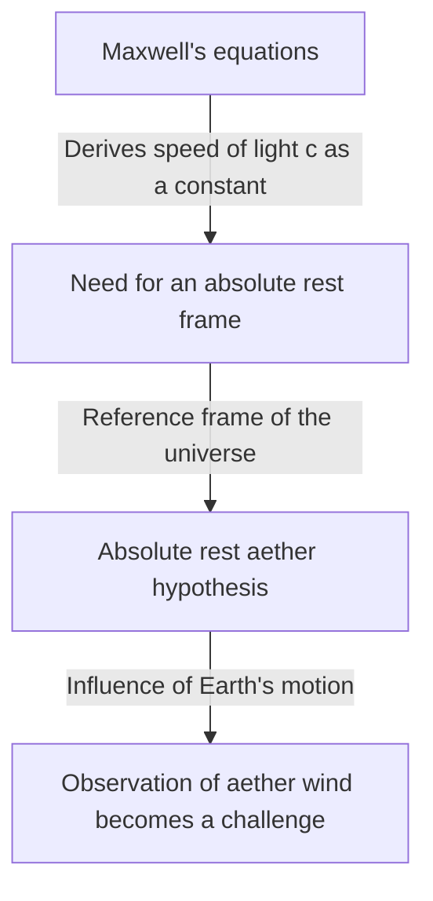

## 1. Introduction: The "Something" Believed to Fill the Universe

Throughout the history of humanity's attempts to unravel the mysteries of the natural world, the question of "how light travels through space" has fascinated and deeply troubled many geniuses, from ancient Greek philosophers to modern physicists.

Observing everyday physical phenomena, we see that media like "air" or "water" are necessary for sound to travel, and "seawater" is essential for ocean waves to propagate. From this highly intuitive and logical analogy, the idea was born that if light has wave-like properties, there must be an "unknown medium" for propagating light filling every corner of outer space. This phantom medium is what was called the "luminiferous aether".

The existence of aether was accepted not merely as a hypothesis but as an unquestionable "common sense" in physics up to the end of the 19th century. However, a single experiment that attempted to verify this "common sense" ultimately overturned the foundations of physics, guiding humanity to a new view of the universe: Einstein's theory of relativity. In this article, we will unravel in detail the grand trajectory of the history of science, exploring how the concept of luminiferous aether was born, how it was denied, and what legacy it left for modern physics.

## 2. The Debate Over the Nature of Light and the Birth of Aether

The debate over whether the true nature of light was a "particle" or a "wave" was fiercely fought during the scientific revolution of the 17th century.

Isaac Newton, based on the rectilinear propagation of light and the laws of reflection, proposed the "corpuscular theory of light," which stated that light is a flow of minute particles. Due to his overwhelming authority, the corpuscular theory dominated the physics community throughout the 18th century. However, around the same time, Christiaan Huygens argued that light should be considered a wave to explain phenomena such as diffraction and refraction, advocating the "wave theory of light."

In the 19th century, Thomas Young's "double-slit experiment" and the completion of Augustin-Jean Fresnel's mathematical wave theory decisively proved that light possesses wave-like properties (interference and diffraction). If light is a wave, there must be a "medium" to propagate the wave throughout the entire universe. Since light from the sun reaches the earth even through the vacuum of space, it was thought that space is not a complete nothingness, but is filled with a transparent, extremely rarefied, yet solid medium called "aether" that propagates light waves.

### The Bizarre Properties Required for Aether

However, assuming the medium of aether, physicists faced a serious contradiction. It had been discovered through polarization phenomena that light is a transverse wave (a wave oscillating perpendicular to the direction of propagation). In the framework of physics at the time, only "solids" could propagate transverse waves. Gases and liquids can only propagate longitudinal waves (such as sound waves).

In other words, the aether must be a "gigantic transparent solid" spreading throughout the universe. To propagate waves at the tremendous speed of light (about 300,000 kilometers per second), the aether must be far harder than steel and possess extremely strong elasticity. On the other hand, since the Earth and planets appear to experience no frictional resistance from the aether as they revolve around the Sun, the aether must also be completely frictionless, possessing an extremely rarefied nature that allows matter to pass through without resistance.

The aether was thus burdened with physically contradictory and bizarre properties: "being a solid harder than steel, yet having no resistance like a perfect fluid."

## 3. Maxwell's Electromagnetism and the Absolute Rest Frame of Aether

In the late 19th century, James Clerk Maxwell completed "Maxwell's equations," which form the foundation of electromagnetism. These equations not only perfectly described electrical and magnetic phenomena but also contained a surprising prediction. When the propagation speed of electromagnetic waves was calculated, it perfectly matched the "speed of light" measured in experiments at the time. This theoretically proved that "light is a type of electromagnetic wave."

In Maxwell's equations, the speed of light $c$ is derived as a constant determined by the permittivity and permeability of a vacuum. Here, a major problem arose. When we say "the speed of light is a constant," "relative to what" is it constant?

According to the principle of relativity in Newtonian mechanics, velocity should always change depending on the observer's state of motion. The speed of a ball thrown from a moving train is "the speed of the train + the speed of the ball" to a person on the ground. However, the speed of light in Maxwell's equations did not take into account the velocity of such observers.

To solve this, physicists of the time brought up the "sea of aether." They considered that there must be an absolute reference space where Maxwell's equations hold, and that this is the "absolute rest aether" that spreads motionless throughout the universe. In other words, the speed of light $c$ was interpreted as "the speed relative to the aether at absolute rest."

## 4. The Michelson-Morley Experiment: The Most Famous "Failure" in History

If outer space is filled with aether at absolute rest, the Earth, revolving around the Sun, is constantly plowing through the sea of aether. From the Earth's perspective, an "aether wind" should be blowing from space.

In 1887, Albert Michelson and Edward Morley conducted a groundbreaking experiment to capture this "aether wind." They constructed an extremely precise optical device called the "Michelson interferometer."

The principle of the experiment is as follows. A single beam of light emitted from a light source is split into two orthogonal directions by a half-mirror (a semi-transparent mirror). One travels parallel to the aether wind, while the other travels perpendicularly, and they reflect back from mirrors at their respective ends. If the aether wind exists, just as a person swimming back and forth across a river is affected by the river's current, there should be a very slight difference in the time it takes for the light to travel back and forth. When the two returning light beams were recombined, this time difference was expected to be observed as a shift in "interference fringes."

However, the results sent shockwaves through the physics community. No matter how much the apparatus was rotated, or how the direction of the Earth's revolution changed with the seasons, absolutely no shift in the interference fringes was observed. The aether wind was not blowing at all.

This "Michelson-Morley experiment," by completely failing to prove the existence of the aether, ironically etched its name in history as "the most famous failed experiment in the history of science."

## 5. Length Contraction and Ad-hoc Solutions

Physicists who took the experimental results seriously struggled to somehow salvage the aether theory. George FitzGerald and Hendrik Lorentz formed an astonishing hypothesis.

"When an object moves through the aether, doesn't the object itself contract slightly along the direction of motion due to the pressure of the aether wind?"

According to this "Lorentz-FitzGerald contraction hypothesis," the arm of the Michelson-Morley interferometer also contracts exactly along the direction of motion, canceling out the difference in the round-trip time of light, and as a result explaining why the aether wind could not be detected. Furthermore, Lorentz introduced the concept of time dilation in moving frames (local time) and completed a mathematical framework known as the "Lorentz transformations."

However, these theories could not shake the impression of being "ad-hoc" solutions tacked on later to protect the existence of the aether. While mathematically showing that physical laws are invariant to observers, they clung stubbornly to the existence of an "invisible aether at absolute rest."

## 6. Einstein and the Paradigm Shift: Special Relativity

In 1905, a young patent office clerk named Albert Einstein published a paper that fundamentally solved this complexly entangled problem from just two simple principles. This is the "Special Theory of Relativity."

Einstein stopped worrying about the properties of the aether and started from entirely new premises.
1. **Principle of Relativity**: The laws of physics take exactly the same form in all inertial frames (observers in uniform rectilinear motion). There is no such thing as an absolute rest frame.
2. **Principle of Invariant Speed of Light**: The speed of light in a vacuum is always constant (the constant $c$) for all observers, regardless of the state of motion of the light source or the observer.

Accepting these two principles leads to an astonishing conclusion. In order for the speed of light to always be constant, "space" must contract and the flow of "time" must slow down depending on the observer's state of motion. It became clear that the phenomenon Lorentz and others considered to be a "material contraction due to the aether" was actually a relative property of time and space themselves.

And most importantly, there was absolutely no room in Einstein's theory for the concept of an "aether = medium to propagate light." Electromagnetic waves are self-propagating as a property of space and do not require a medium. At this point, the phantom of "aether," which had dominated physicists for centuries, was completely buried theoretically.

## 7. The "Vacuum" in Modern Physics: The Ghost of Aether

The aether was discarded as an unnecessary concept, but the idea that "empty space (vacuum)" is truly "empty" has also been denied by modern physics.

According to "quantum field theory," which unifies quantum mechanics and special relativity, a vacuum is not simply a space of nothingness. It is an extremely dynamic state filled with "quantum fluctuations," where particles and antiparticles are constantly repeating pair production and annihilation. "Fields," such as electromagnetic and Higgs fields, exist everywhere in space, and particles appear as excited states (ripples) of these fields.

Furthermore, in general relativity, Einstein described spacetime itself as a dynamic entity that is bent by gravity. Einstein himself later stated that in the sense that spacetime itself has physical properties, it "could be called an aether in a new sense" (though it is completely different from the 19th-century aether as an absolute rest medium).

The "dark energy" and "dark matter" discussed in modern cosmology might also be considered modern versions of the aether in the sense that they are unknown entities filling space and governing the behavior of the universe.

## 8. Conclusion: What the History of Science Teaches Us

The story of the luminiferous aether is an extremely beautiful example showing how science progresses.

The aether was a wrong hypothesis. However, it was not a "meaningless" hypothesis. It was precisely because the concept of aether existed that elaborate experiments were conducted to prove it, theoretical limits were highlighted, and it ultimately led to the greatest intellectual leap in human history: the theory of relativity.

Failures and flawed premises in science are never in vain. They serve as essential stepping stones to illuminate uncharted territories. The phantom medium of luminiferous aether has disappeared from physics, but the insight into the "true nature of spacetime" that humanity gained in the process of its exploration continues to support our understanding of the universe today.
