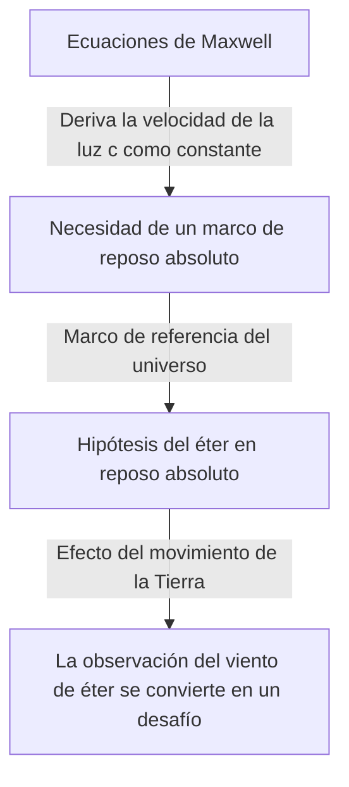

## 1. Introducción: El "algo" que se creía que llenaba el universo

En la historia de la humanidad intentando desentrañar los misterios del mundo natural, la pregunta de "cómo se transmite la luz a través del espacio" ha fascinado y también desconcertado en gran medida a numerosos genios, desde los filósofos de la antigua Grecia hasta los físicos modernos.

Al observar fenómenos físicos cotidianos, es necesario un material como "aire" o "agua" para que el sonido se transmita, y un medio como el "agua de mar" es esencial para que las olas del mar se propaguen. A partir de esta analogía extremadamente intuitiva y lógica, surgió la idea de que, si la luz tiene propiedades de onda, debe haber un "medio desconocido" que llene todos los rincones del espacio exterior para transmitir la luz. Este medio fantasma es precisamente lo que se llamó el "éter luminoso" (Luminiferous aether).

La existencia del éter, más allá de ser una simple hipótesis, fue aceptada como un "sentido común" incuestionable en la física hasta finales del siglo XIX. Sin embargo, un experimento que intentó verificar ese "sentido común", en última instancia anuló los cimientos de la física y llevó a la humanidad a una nueva visión del universo: la teoría de la relatividad de Einstein. En este artículo, desentrañaremos detalladamente la trayectoria de esta épica historia científica: cómo nació el concepto del éter luminoso, cómo fue negado y qué legado ha dejado en la física moderna.

## 2. El debate sobre la naturaleza de la luz y el nacimiento del éter

El debate sobre si la esencia de la luz es "partícula" o "onda" se libró ferozmente durante la era de la revolución científica en el siglo XVII.

Isaac Newton, basándose en la propagación rectilínea de la luz y la ley de la reflexión, propuso la "teoría corpuscular de la luz", argumentando que la luz es un flujo de partículas diminutas. Debido a su abrumadora autoridad, la teoría corpuscular dominó la comunidad física durante todo el siglo XVIII. Sin embargo, en la misma época, Christiaan Huygens argumentaba que, para explicar fenómenos como la difracción y refracción de la luz, esta debía ser considerada como una onda, proponiendo la "teoría ondulatoria de la luz".

Al entrar en el siglo XIX, con el "experimento de la doble rendija" de Thomas Young y la culminación de la teoría ondulatoria matemática de Augustin-Jean Fresnel, se demostró de manera concluyente que la luz posee propiedades de onda (interferencia y difracción). Si la luz es una onda, debe existir un "medio" que transmita la onda en todo el universo. Dado que la luz del sol llega a la Tierra incluso a través del espacio exterior en el vacío, se pensó que el espacio exterior no es una nada absoluta, sino que está lleno de un medio transparente, extremadamente tenue, pero firme, llamado "éter", que transmite las ondas de luz.

### Las extrañas propiedades exigidas al éter

Sin embargo, al asumir un medio llamado éter, los físicos se enfrentaron a una profunda contradicción. Se había descubierto, a través del fenómeno de la polarización, que la luz es una onda transversal (una onda que oscila perpendicularmente a la dirección de propagación). En el marco de la física de la época, solo los "sólidos" podían transmitir ondas transversales. Los gases y líquidos solo pueden transmitir ondas longitudinales (como las ondas sonoras).

Es decir, el éter debe ser un "sólido transparente gigante" que se extienda por todo el universo. Para transmitir ondas a la velocidad asombrosa de la luz (aproximadamente 300,000 kilómetros por segundo), el éter debe ser mucho más duro que el acero y tener una elasticidad extremadamente fuerte. Por otro lado, dado que la Tierra y los planetas no parecen sufrir ninguna resistencia por fricción del éter al orbitar alrededor del sol, el éter debe carecer por completo de fricción y poseer una propiedad extremadamente enrarecida que permita que la materia lo atraviese sin resistencia.

El éter fue cargado con una propiedad extraña y físicamente contradictoria, se mire por donde se mire: "un sólido más duro que el acero, pero sin resistencia, como un fluido perfecto".

## 3. El electromagnetismo de Maxwell y el marco de reposo absoluto del éter

En la segunda mitad del siglo XIX, James Clerk Maxwell completó las "ecuaciones de Maxwell", que son la base del electromagnetismo. Estas ecuaciones no solo describían perfectamente los fenómenos eléctricos y magnéticos, sino que también incluían una predicción sorprendente. Cuando calculó la velocidad de propagación de las ondas electromagnéticas, coincidió brillantemente con la "velocidad de la luz" que se estaba midiendo en los experimentos de la época. Esto demostró teóricamente que "la luz es un tipo de onda electromagnética".

En las ecuaciones de Maxwell, la velocidad de la luz $c$ se deriva como una constante determinada por la permitividad y permeabilidad del vacío. Aquí surgió un gran problema. Cuando se dice que "la velocidad de la luz es constante", ¿con respecto a "qué" es constante?

Según el principio de relatividad de la mecánica newtoniana, la velocidad siempre debe cambiar dependiendo del estado de movimiento del observador. La velocidad de una pelota lanzada desde un tren en movimiento, vista por una persona en el suelo, será "la velocidad del tren + la velocidad de la pelota". Sin embargo, la velocidad de la luz en las ecuaciones de Maxwell no tomaba en cuenta la velocidad de tal observador.

Para resolver esto, los físicos de la época introdujeron el "mar de éter". Pensaron que existía un espacio que servía como marco de referencia absoluto donde se cumplían las ecuaciones de Maxwell, y que este era el "éter en reposo absoluto" que se extendía inmóvil por todo el universo. En otras palabras, la velocidad de la luz $c$ se interpretó como "la velocidad relativa al éter que está en reposo absoluto".

## 4. El experimento de Michelson-Morley: El "fracaso" más famoso de la historia

Si el espacio exterior estuviera lleno de éter en reposo absoluto, la Tierra, que orbita alrededor del sol, estaría constantemente abriéndose paso a través de este mar de éter. Visto desde la Tierra, debería haber un "viento de éter" soplando desde el espacio.

En 1887, Albert Michelson y Edward Morley llevaron a cabo un experimento revolucionario para capturar este "viento de éter". Construyeron un dispositivo óptico extremadamente preciso llamado "interferómetro de Michelson".

El principio del experimento es el siguiente: un haz de luz emitido por una fuente se divide en dos direcciones ortogonales mediante un espejo semi-transparente. Una parte viaja en dirección paralela al viento de éter y la otra en dirección perpendicular, y ambas regresan después de reflejarse en los espejos ubicados en sus extremos. Si existiera el viento de éter, al igual que una persona nadando ida y vuelta en un río se ve afectada por la corriente, debería haber una ligera diferencia en el tiempo que tarda la luz en ir y volver. Se esperaba que, al superponer los dos haces de luz de regreso, esa diferencia de tiempo pudiera observarse como un desplazamiento de las "franjas de interferencia".

Sin embargo, el resultado conmocionó enormemente a la comunidad física. Por mucho que giraran el dispositivo o cambiaran de estación para alterar la dirección de la órbita de la Tierra, no se observó ningún desplazamiento en absoluto de las franjas de interferencia. El viento de éter no soplaba en absoluto.

Este "experimento de Michelson-Morley", al fracasar por completo en su intento de probar la existencia del éter, irónicamente grabó su nombre en la historia como "el experimento fallido más famoso de la historia de la ciencia".

## 5. La contracción de Lorentz y las soluciones ad hoc

Los físicos que tomaron muy en serio los resultados experimentales lucharon por salvar la teoría del éter de alguna manera. George FitzGerald y Hendrik Lorentz formularon una hipótesis sorprendente.

"Cuando un objeto se mueve a través del éter, ¿acaso la presión del viento de éter no hace que el objeto mismo se contraiga ligeramente en la dirección del movimiento?"

Según esta "hipótesis de contracción de Lorentz-FitzGerald", el brazo del interferómetro de Michelson-Morley también se contrae exactamente a lo largo de la dirección del movimiento, por lo que la diferencia en el tiempo de viaje de ida y vuelta de la luz se anula, lo que explica por qué no se puede detectar el viento de éter como resultado. Además, Lorentz introdujo el concepto de dilatación del tiempo en un marco en movimiento (tiempo local) y completó el marco matemático conocido como las "transformaciones de Lorentz".

Sin embargo, estas teorías no pudieron deshacerse de la impresión de ser soluciones "ad hoc" añadidas a posteriori para preservar la existencia del éter. A pesar de mostrar matemáticamente que las leyes de la física son invariantes para el observador, seguían aferrándose desesperadamente a la existencia de un "éter invisible y en reposo absoluto".

## 6. Einstein y el cambio de paradigma: La teoría de la relatividad especial

En 1905, Albert Einstein, un joven empleado de la oficina de patentes, publicó un artículo que resolvía fundamentalmente este complejo y enmarañado problema a partir de tan solo dos principios simples. Esta es la "teoría de la relatividad especial".

Einstein dejó de preocuparse por las propiedades del éter y partió de premisas completamente nuevas.
1. **Principio de relatividad**: En todos los marcos inerciales (observadores en movimiento rectilíneo uniforme), las leyes de la física adoptan exactamente la misma forma. No existe un marco de reposo absoluto.
2. **Principio de la constancia de la velocidad de la luz**: La velocidad de la luz en el vacío es siempre constante (constante $c$) para todos los observadores, independientemente del estado de movimiento de la fuente de luz o del observador.

Al aceptar estos dos principios, se llega a una conclusión asombrosa. Para que la velocidad de la luz sea siempre constante, el "espacio" debe contraerse y la progresión del "tiempo" debe ralentizarse dependiendo del estado de movimiento del observador. Quedó claro que el fenómeno que Lorentz y otros consideraban como una "contracción material debida al éter" era en realidad una propiedad relativa del tiempo y el espacio mismos.

Y lo más importante es que, en la teoría de Einstein, no había absolutamente ningún espacio para el concepto de un "medio que transmita la luz = éter". Las ondas electromagnéticas se autopropagan como una propiedad del espacio y no requieren un medio. Aquí, el fantasma del "éter", que había dominado a los físicos durante siglos, fue enterrado teóricamente por completo.

## 7. El "vacío" en la física moderna: El fantasma del éter

Aunque el éter fue descartado como un concepto innecesario, la idea de que un "espacio sin nada (vacío)" esté realmente "vacío" también ha sido negada por la física moderna.

Según la "teoría cuántica de campos", que unifica la mecánica cuántica y la teoría de la relatividad especial, el vacío no es simplemente un espacio de la nada. Es un estado extremadamente dinámico, lleno de "fluctuaciones cuánticas" en las que las partículas y antipartículas repiten incesantemente la creación y aniquilación de pares. "Campos" como el campo electromagnético y el campo de Higgs existen en todo el espacio exterior, y las partículas aparecen como estados excitados (ondulaciones) de esos campos.

Además, en la teoría de la relatividad general, Einstein describió que el espacio-tiempo mismo es una entidad dinámica que se curva debido a la gravedad. El propio Einstein dijo en sus años posteriores que, en el sentido de que el espacio-tiempo mismo tiene propiedades físicas, "también podría llamarse un éter en un nuevo sentido" (aunque es completamente diferente del éter como el medio de reposo absoluto del siglo XIX).

La "energía oscura" y la "materia oscura" que se discuten en la cosmología moderna también pueden decirse que son versiones modernas del éter, en el sentido de que son entidades desconocidas que llenan el espacio exterior y gobiernan el comportamiento del universo.

## 8. Conclusión: Lo que nos enseña la historia de la ciencia

La historia del éter luminoso es un ejemplo extremadamente hermoso de cómo avanza la ciencia.

El éter fue una hipótesis equivocada. Sin embargo, no fue una hipótesis "sin sentido". Precisamente porque existía el concepto de éter, se llevaron a cabo experimentos precisos para intentar demostrarlo, se revelaron sus limitaciones teóricas y, finalmente, condujo al mayor salto intelectual en la historia humana: la teoría de la relatividad.

Los fracasos y las premisas falsas en la ciencia nunca son en vano. Sirven como peldaños esenciales para iluminar territorios desconocidos. El medio fantasma del éter luminoso desapareció de la física, pero el conocimiento de la "verdadera naturaleza del espacio-tiempo" que la humanidad obtuvo en el proceso de su búsqueda continúa sustentando nuestra comprensión del universo hoy en día.
