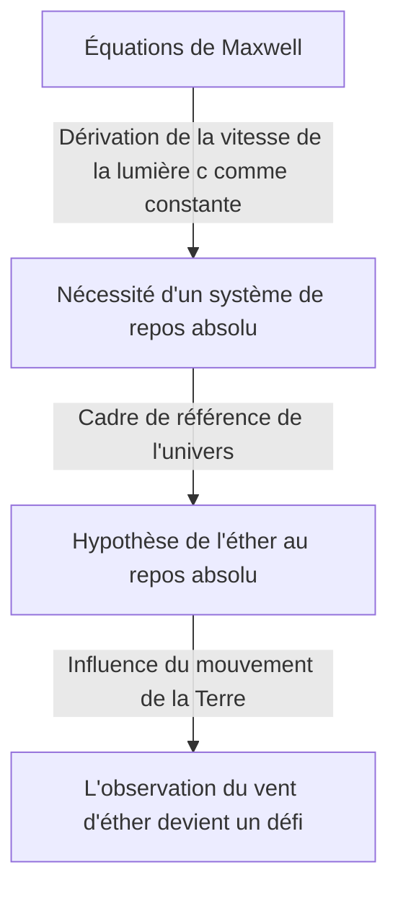

## 1. Introduction : Le "quelque chose" dont on croyait qu'il remplissait l'univers

Dans l'histoire des tentatives humaines pour percer les mystères de la nature, la question de savoir "comment la lumière se propage dans l'espace" a fasciné et profondément troublé de nombreux génies, des philosophes de la Grèce antique aux physiciens modernes.

L'observation des phénomènes physiques quotidiens montre que la transmission du son nécessite une matière telle que l'"air" ou l'"eau", et que la propagation des vagues de l'océan nécessite le milieu de l'"eau de mer". De cette analogie extrêmement intuitive et logique est née l'idée que si la lumière a la nature d'une onde, il doit y avoir un "milieu inconnu" pour transmettre la lumière qui remplit chaque recoin de l'espace. Ce milieu fantôme est ce qu'on appelait l'"éther luminifère" (Luminiferous aether).

L'existence de l'éther a été acceptée comme un "sens commun" indéniable dans la physique jusqu'à la fin du 19ème siècle, dépassant la simple hypothèse. Cependant, une expérience qui tentait de vérifier ce "sens commun" a fini par renverser les fondements de la physique, guidant l'humanité vers la nouvelle vision de l'univers d'Einstein : la théorie de la relativité. Dans cet article, nous démêlerons en détail la trajectoire épique de l'histoire de cette science : comment le concept d'éther luminifère est né, comment il a été rejeté, et quel héritage il a laissé à la physique moderne.

## 2. Le débat sur la nature de la lumière et la naissance de l'éther

Le débat sur la question de savoir si la nature de la lumière est "particule" ou "onde" a été farouchement disputé lors de la révolution scientifique du 17ème siècle.

Isaac Newton, se basant sur la propagation rectiligne de la lumière et les lois de la réflexion, a proposé la "théorie corpusculaire de la lumière", selon laquelle la lumière est un flux de minuscules particules. En raison de son autorité écrasante, la théorie corpusculaire a dominé la communauté de la physique tout au long du 18ème siècle. Cependant, à la même époque, Christiaan Huygens soutenait que la lumière devait être considérée comme une onde pour expliquer des phénomènes tels que la diffraction et la réfraction de la lumière, prônant la "théorie ondulatoire de la lumière".

Au 19ème siècle, avec l'"expérience des fentes de Young" par Thomas Young et l'achèvement de la théorie ondulatoire mathématique par Augustin-Jean Fresnel, il a été définitivement prouvé que la lumière possède des propriétés ondulatoires (interférence et diffraction). Si la lumière est une onde, un "milieu" pour transmettre l'onde doit exister dans tout l'univers. Puisque la lumière du soleil atteint la Terre même dans le vide de l'espace, l'espace n'était pas considéré comme un vide complet, mais comme rempli d'un milieu transparent, extrêmement fin mais ferme, l'"éther", qui transmet les ondes lumineuses.

### Les propriétés étranges exigées de l'éther

Cependant, en postulant le milieu de l'éther, les physiciens ont été confrontés à une contradiction profonde. Il a été révélé par la découverte du phénomène de polarisation que la lumière est une onde transversale (une onde oscillant perpendiculairement à la direction de propagation). Dans le cadre de la physique de l'époque, seul un "solide" pouvait transmettre des ondes transversales. Les gaz et les liquides ne peuvent transmettre que des ondes longitudinales (comme les ondes sonores).

En d'autres termes, l'éther devait être un "solide transparent géant" s'étendant à travers l'univers. Pour transmettre des ondes à la vitesse stupéfiante de la lumière (environ 300 000 kilomètres par seconde), l'éther devait être beaucoup plus dur que l'acier et posséder une élasticité extrêmement forte. D'un autre côté, puisque la Terre et les planètes ne semblent subir aucune résistance de frottement de la part de l'éther lorsqu'elles gravitent autour du soleil, l'éther devait être complètement sans frottement et posséder la propriété extrêmement raréfiée de laisser passer la matière sans résistance.

L'éther s'est retrouvé affublé de cette étrange propriété, logiquement contradictoire en physique : "être un solide plus dur que l'acier, mais sans résistance comme un fluide parfait".

## 3. L'électromagnétisme de Maxwell et le système de repos absolu de l'éther

À la fin du 19ème siècle, James Clerk Maxwell a achevé les "équations de Maxwell", qui constituent le fondement de l'électromagnétisme. Ces équations décrivaient non seulement parfaitement les phénomènes de l'électricité et du magnétisme, mais contenaient également une prédiction surprenante. Lorsqu'il a calculé la vitesse de propagation des ondes électromagnétiques, elle correspondait parfaitement à la "vitesse de la lumière" mesurée dans les expériences de l'époque. Cela a prouvé théoriquement que "la lumière est un type d'onde électromagnétique".

Dans les équations de Maxwell, la vitesse de la lumière $c$ est dérivée comme une constante déterminée par la permittivité et la perméabilité du vide. C'est ici qu'un problème majeur s'est posé. Quand on dit que "la vitesse de la lumière est constante", par rapport à "quoi" est-elle constante ?

Selon le principe de relativité de la mécanique newtonienne, la vitesse devrait toujours changer en fonction de l'état de mouvement de l'observateur. La vitesse d'une balle lancée depuis un train en marche sera la "vitesse du train + la vitesse de la balle" du point de vue d'une personne au sol. Cependant, la vitesse de la lumière dans les équations de Maxwell ne tenait pas compte d'une telle vitesse de l'observateur.

Les physiciens de l'époque ont invoqué la "mer d'éther" pour résoudre ce problème. Ils pensaient qu'il existait un espace de référence absolu où les équations de Maxwell étaient valables, et que c'était l'"éther au repos absolu", s'étendant au repos à travers tout l'univers. En d'autres termes, la vitesse de la lumière $c$ a été interprétée comme "la vitesse par rapport à l'éther au repos absolu".

## 4. L'expérience de Michelson-Morley : L'"échec" le plus célèbre de l'histoire

Si l'espace est rempli d'un éther au repos absolu, la Terre, en orbite autour du soleil, traverserait constamment la mer d'éther. Du point de vue de la Terre, un "vent d'éther" devrait souffler depuis l'espace.

En 1887, Albert Michelson et Edward Morley ont mené une expérience révolutionnaire pour capturer ce "vent d'éther". Ils ont construit un dispositif optique extrêmement précis appelé "interféromètre de Michelson".

Le principe de l'expérience est le suivant : un faisceau de lumière émis par une source lumineuse est divisé par un miroir semi-réfléchissant en deux directions orthogonales. L'un voyage dans une direction parallèle au vent d'éther, et l'autre dans une direction perpendiculaire, et ils sont réfléchis par des miroirs à chaque extrémité pour revenir. Si le vent d'éther existe, tout comme une personne nageant en faisant des allers-retours dans une rivière est affectée par le courant, il devrait y avoir une infime différence dans le temps d'aller-retour de la lumière. Lorsque les deux faisceaux de lumière renvoyés sont superposés, cette différence de temps devait pouvoir être observée comme un déplacement des "franges d'interférence".

Cependant, le résultat a causé un grand choc dans la communauté de la physique. Peu importe la façon dont le dispositif était tourné, ou la façon dont la direction de la révolution de la Terre changeait avec les saisons, aucun déplacement des franges d'interférence n'a été observé. Le vent d'éther ne soufflait pas du tout.

Cette "expérience de Michelson-Morley", en échouant complètement à prouver l'existence de l'éther, a ironiquement gravé son nom dans l'histoire comme "l'expérience ratée la plus célèbre de l'histoire des sciences".

## 5. Contraction de Lorentz et solutions ad hoc

Les physiciens, prenant au sérieux les résultats de l'expérience, ont lutté pour sauver la théorie de l'éther d'une manière ou d'une autre. George FitzGerald et Hendrik Lorentz ont formulé une hypothèse surprenante.

"Lorsqu'un objet se déplace dans l'éther, l'objet lui-même ne pourrait-il pas se contracter légèrement le long de la direction du mouvement en raison de la pression du vent d'éther ?"

Selon cette "hypothèse de contraction de Lorentz-FitzGerald", le bras de l'interféromètre de Michelson-Morley se contracterait également précisément le long de la direction du mouvement, annulant la différence dans le temps d'aller-retour de la lumière, ce qui expliquerait pourquoi le vent d'éther ne pouvait pas être détecté. De plus, Lorentz a introduit le concept de dilatation du temps (temps local) dans un système en mouvement et a achevé un cadre mathématique appelé "transformation de Lorentz".

Cependant, on ne pouvait effacer l'impression que ces théories étaient des solutions "ad hoc" ajoutées après coup pour préserver l'existence de l'éther. Tout en montrant mathématiquement que les lois de la physique sont invariantes pour les observateurs, ils s'accrochaient obstinément à l'existence de cet "éther invisible au repos absolu".

## 6. Einstein et le changement de paradigme : la théorie de la relativité restreinte

En 1905, un jeune employé du bureau des brevets, Albert Einstein, a publié un article qui a fondamentalement résolu ce problème complexe en partant de seulement deux principes simples. C'est la "théorie de la relativité restreinte".

Einstein a cessé de s'inquiéter des propriétés de l'éther et est parti de prémisses complètement nouvelles.
1. **Principe de relativité** : Dans tous les référentiels inertiels (observateurs en mouvement rectiligne uniforme), les lois de la physique s'appliquent exactement sous la même forme. Il n'existe pas de système au repos absolu.
2. **Principe de la constance de la vitesse de la lumière** : La vitesse de la lumière dans le vide est toujours constante (constante $c$) pour tous les observateurs, quel que soit l'état de mouvement de la source lumineuse ou de l'observateur.

Accepter ces deux principes conduit à une conclusion surprenante. Pour que la vitesse de la lumière soit toujours constante, l'"espace" doit se contracter et l'écoulement du "temps" doit ralentir en fonction de l'état de mouvement de l'observateur. Il est devenu clair que le phénomène que Lorentz et d'autres pensaient être une "contraction matérielle due à l'éther" était en fait une propriété relative de l'espace et du temps eux-mêmes.

Et plus important encore, la théorie d'Einstein ne laissait aucune place au concept de "milieu transmettant la lumière = éther". Les ondes électromagnétiques se propagent d'elles-mêmes en tant que propriété de l'espace et ne nécessitent aucun milieu. Ici, l'"éther", l'illusion qui avait dominé les physiciens pendant des siècles, a été théoriquement complètement enterré.

## 7. Le "vide" dans la physique moderne : le fantôme de l'éther

Bien que l'éther ait été rejeté comme un concept inutile, l'idée que "l'espace vide (le vide)" est véritablement "vide" a également été démentie par la physique moderne.

Selon la "théorie quantique des champs", qui fusionne la mécanique quantique et la théorie de la relativité restreinte, le vide n'est pas simplement un espace de néant. C'est un état extrêmement dynamique rempli de "fluctuations quantiques" où des particules et des antiparticules sont constamment créées et annihilées. Les "champs" (Fields) tels que le champ électromagnétique et le champ de Higgs existent partout dans l'espace, et les particules apparaissent comme des états excités (ondulations) de ces champs.

De plus, dans la théorie de la relativité générale, Einstein a décrit l'espace-temps lui-même comme une entité dynamique courbée par la gravité. Einstein lui-même a déclaré dans ses dernières années que dans le sens où l'espace-temps lui-même possède des propriétés physiques, il "pourrait être appelé un éther dans un sens nouveau" (bien que ce soit complètement différent de l'éther du 19ème siècle en tant que milieu au repos absolu).

L'"énergie noire" et la "matière noire", discutées dans la cosmologie moderne, peuvent également être considérées comme des versions modernes de l'éther, dans le sens où ce sont des entités inconnues qui remplissent l'espace et régissent le comportement de l'univers.

## 8. Conclusion : Ce que l'histoire des sciences nous apprend

L'histoire de l'éther luminifère est un exemple extrêmement beau de la façon dont la science progresse.

L'éther était une hypothèse erronée. Cependant, ce n'était pas une hypothèse "dénuée de sens". C'est parce que le concept d'éther existait que des expériences exquises ont été menées pour le prouver, que les limites théoriques ont été mises en évidence, et que cela a finalement conduit au plus grand bond intellectuel de l'histoire de l'humanité : la théorie de la relativité.

Les échecs et les prémisses erronées en science ne sont jamais vains. Ils servent de tremplins indispensables pour éclairer des territoires inconnus. Le milieu fantôme de l'éther luminifère a disparu de la physique, mais les connaissances sur "la vraie nature de l'espace-temps" que l'humanité a acquises au cours de son exploration continuent de soutenir notre compréhension de l'univers aujourd'hui.
