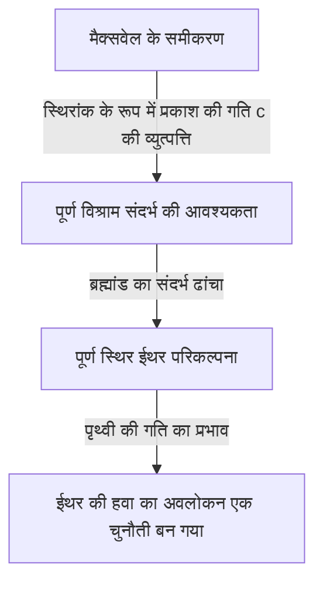

## 1. परिचय: 'वह क्या था' जिसे ब्रह्मांड को भरने वाला माना जाता था

प्रकृति के रहस्यों को उजागर करने के मानव इतिहास में, "प्रकाश अंतरिक्ष में कैसे यात्रा करता है?" इस प्रश्न ने प्राचीन यूनानी दार्शनिकों से लेकर आधुनिक भौतिकविदों तक कई प्रतिभाओं को आकर्षित किया है और उन्हें बहुत परेशान भी किया है।

रोजमर्रा की भौतिक घटनाओं को देखने पर पता चलता है कि ध्वनि के संचरण के लिए "हवा" या "पानी" जैसे पदार्थों की आवश्यकता होती है, और समुद्र की लहरों को आगे बढ़ने के लिए "समुद्री जल" नामक माध्यम आवश्यक है। इस अत्यंत सहज और तार्किक सादृश्य से यह विचार उत्पन्न हुआ कि यदि प्रकाश में तरंगों के गुण हैं, तो ब्रह्मांड के हर कोने में प्रकाश को प्रसारित करने के लिए एक "अज्ञात माध्यम" भरा होना चाहिए। इस भ्रामक माध्यम को "प्रकाशयुक्त ईथर (Luminiferous aether)" कहा गया।

ईथर के अस्तित्व को केवल एक परिकल्पना से अधिक, 19वीं सदी के अंत तक भौतिकी में एक निर्विवाद "सामान्य ज्ञान" के रूप में स्वीकार किया गया था। हालाँकि, इस "सामान्य ज्ञान" को सत्यापित करने के प्रयास में किए गए एक प्रयोग ने अंततः भौतिकी की नींव को ही पलट दिया और मानवता को आइंस्टीन के सापेक्षता के सिद्धांत के माध्यम से ब्रह्मांड के एक नए दृष्टिकोण की ओर अग्रसर किया। इस लेख में, हम विस्तार से विज्ञान के उस भव्य इतिहास का पता लगाएंगे कि कैसे प्रकाशयुक्त ईथर की अवधारणा का जन्म हुआ, इसे कैसे खारिज किया गया, और इसने आधुनिक भौतिकी में क्या विरासत छोड़ी।

## 2. प्रकाश की प्रकृति पर विवाद और ईथर का जन्म

प्रकाश की वास्तविक प्रकृति "कण" है या "तरंग", इस पर 17वीं शताब्दी की वैज्ञानिक क्रांति के दौरान तीखी बहस हुई थी।

आइजैक न्यूटन ने प्रकाश के सीधी रेखा में चलने और परावर्तन के नियमों के आधार पर "प्रकाश का कण सिद्धांत" प्रस्तावित किया, जिसमें तर्क दिया गया कि प्रकाश सूक्ष्म कणों का प्रवाह है। उनके जबरदस्त प्रभाव के कारण, कण सिद्धांत का 18वीं शताब्दी के दौरान भौतिकी की दुनिया पर दबदबा रहा। हालांकि, उसी समय, क्रिश्चियन हाइगेंस ने तर्क दिया कि विवर्तन और अपवर्तन जैसी घटनाओं को समझाने के लिए प्रकाश को तरंगों के रूप में माना जाना चाहिए, और उन्होंने "प्रकाश का तरंग सिद्धांत" प्रस्तुत किया।

19वीं शताब्दी में, थॉमस यंग के "डबल-स्लिट प्रयोग" और ऑगस्टिन-जीन फ्रेनेल के गणितीय तरंग सिद्धांत के पूर्ण होने से निश्चित रूप से यह साबित हो गया कि प्रकाश में तरंग जैसे गुण (व्यतिकरण और विवर्तन) हैं। यदि प्रकाश एक तरंग है, तो पूरे ब्रह्मांड में तरंगों को संचारित करने के लिए एक "माध्यम" का होना अनिवार्य है। चूंकि सूर्य का प्रकाश निर्वात अंतरिक्ष के माध्यम से भी पृथ्वी तक पहुंचता है, इसलिए यह माना जाता था कि अंतरिक्ष पूरी तरह से शून्य नहीं है, बल्कि प्रकाश तरंगों को संचारित करने के लिए एक पारदर्शी, अत्यंत पतले, लेकिन ठोस माध्यम "ईथर" से भरा है।

### ईथर के अजीबोगरीब गुण

हालाँकि, ईथर को माध्यम मानने से भौतिकविदों को गंभीर विरोधाभासों का सामना करना पड़ा। ध्रुवीकरण की घटना की खोज से यह स्पष्ट हो गया था कि प्रकाश एक अनुप्रस्थ तरंग (Transverse wave) है (ऐसी तरंग जो यात्रा की दिशा के लंबवत कंपन करती है)। उस समय के भौतिकी के ढांचे में, केवल "ठोस" पदार्थ ही अनुप्रस्थ तरंगों को संचारित कर सकते थे। गैसें और तरल पदार्थ केवल अनुदैर्ध्य तरंगों (Longitudinal waves, जैसे ध्वनि तरंगें) को ही संचारित कर सकते हैं।

दूसरे शब्दों में, ईथर को पूरे ब्रह्मांड में फैला एक "विशाल पारदर्शी ठोस" होना चाहिए। प्रकाश की गति (लगभग 300,000 किलोमीटर प्रति सेकंड) जैसी अत्यधिक गति से तरंगों को प्रसारित करने के लिए, ईथर को स्टील से भी अधिक कठोर होना चाहिए और इसमें अत्यंत मजबूत लोच (elasticity) होनी चाहिए। दूसरी ओर, जब पृथ्वी और ग्रह सूर्य की परिक्रमा करते हैं, तो ऐसा लगता है कि वे ईथर से किसी भी घर्षण प्रतिरोध का अनुभव नहीं करते हैं, इसलिए ईथर को पूरी तरह से घर्षण रहित होना चाहिए और इसमें एक अत्यंत विरल गुण होना चाहिए जो पदार्थों को बिना किसी प्रतिरोध के गुजरने दे।

इस प्रकार ईथर पर भौतिक दृष्टिकोण से एक अजीब और विरोधाभासी प्रकृति थोप दी गई थी: "यह स्टील से भी कठोर ठोस होना चाहिए, लेकिन एक आदर्श तरल पदार्थ की तरह प्रतिरोध-रहित होना चाहिए।"

## 3. मैक्सवेल का विद्युत चुंबकत्व और ईथर का पूर्ण विश्राम संदर्भ

19वीं सदी के उत्तरार्ध में, जेम्स क्लर्क मैक्सवेल ने "मैक्सवेल के समीकरण" पूरे किए जो विद्युत चुंबकत्व की नींव बने। इन समीकरणों ने न केवल विद्युत और चुंबकीय घटनाओं का पूरी तरह से वर्णन किया, बल्कि इनमें एक आश्चर्यजनक भविष्यवाणी भी शामिल थी। जब उन्होंने विद्युत चुम्बकीय तरंगों के प्रसार की गति की गणना की, तो यह उस समय के प्रयोगों में मापी गई "प्रकाश की गति" से पूरी तरह मेल खाती थी। इसने सैद्धांतिक रूप से यह साबित कर दिया कि "प्रकाश एक प्रकार की विद्युत चुम्बकीय तरंग है।"

मैक्सवेल के समीकरणों में, प्रकाश की गति $c$ को एक स्थिरांक के रूप में लिया गया है जो निर्वात की विद्युतशीलता (permittivity) और चुंबकशीलता (permeability) द्वारा निर्धारित होता है। यहां एक बड़ी समस्या उत्पन्न हुई। जब हम कहते हैं कि "प्रकाश की गति स्थिर है," तो यह "किसके सापेक्ष" स्थिर है?

न्यूटोनियन यांत्रिकी के सापेक्षता सिद्धांत के अनुसार, गति हमेशा पर्यवेक्षक की गति की स्थिति के आधार पर बदलनी चाहिए। चलती ट्रेन से फेंकी गई गेंद की गति जमीन पर खड़े व्यक्ति को "ट्रेन की गति + गेंद की गति" प्रतीत होगी। हालाँकि, मैक्सवेल के समीकरणों में प्रकाश की गति ने पर्यवेक्षक की गति पर विचार नहीं किया था।

इस समस्या को हल करने के लिए उस समय के भौतिकविदों ने "ईथर के समुद्र" का विचार सामने रखा। उनका मानना था कि एक पूर्ण संदर्भ स्थान मौजूद है जहाँ मैक्सवेल के समीकरण लागू होते हैं, और यह स्थान एक "पूर्ण स्थिर ईथर" है जो पूरे ब्रह्मांड में फैला हुआ है। दूसरे शब्दों में, प्रकाश की गति $c$ की व्याख्या "पूर्णतः स्थिर ईथर के सापेक्ष गति" के रूप में की गई थी।

## 4. माइकलसन-मोर्ले का प्रयोग: इतिहास की सबसे प्रसिद्ध 'विफलता'

यदि अंतरिक्ष पूरी तरह से स्थिर ईथर से भरा है, तो सूर्य की परिक्रमा करने वाली पृथ्वी लगातार ईथर के समुद्र से होकर गुजर रही है। पृथ्वी के दृष्टिकोण से, ऐसा प्रतीत होना चाहिए कि अंतरिक्ष से "ईथर की हवा" बह रही है।

1887 में, अल्बर्ट माइकलसन और एडवर्ड मोर्ले ने इस "ईथर की हवा" का पता लगाने के लिए एक अभूतपूर्व प्रयोग किया। उन्होंने "माइकलसन इंटरफेरोमीटर" नामक एक अत्यंत सटीक ऑप्टिकल उपकरण का निर्माण किया।

प्रयोग का सिद्धांत इस प्रकार है: एक प्रकाश स्रोत से निकलने वाले प्रकाश की किरण को हाफ-मिरर (अर्ध-पारदर्शी दर्पण) द्वारा दो लंबवत दिशाओं में विभाजित किया जाता है। एक किरण ईथर की हवा के समानांतर चलती है, और दूसरी इसके लंबवत चलती है। वे संबंधित दर्पणों से परावर्तित होकर वापस आती हैं। यदि ईथर की हवा मौजूद है, तो प्रकाश को वापस आने में लगने वाले समय में मामूली अंतर होना चाहिए, ठीक उसी तरह जैसे नदी में आगे-पीछे तैरने वाला व्यक्ति नदी के प्रवाह से प्रभावित होता है। यह उम्मीद की गई थी कि जब वापस आने वाली दो प्रकाश किरणों को जोड़ा जाएगा, तो समय के अंतर को "व्यतिकरण फ्रिंज" (interference fringes) में बदलाव के रूप में देखा जा सकेगा।

हालाँकि, परिणाम ने भौतिकी समुदाय को बहुत बड़ा झटका दिया। उपकरण को कितना भी घुमाया गया हो, या मौसमों के बदलने के साथ पृथ्वी की परिक्रमा की दिशा बदल गई हो, व्यतिकरण फ्रिंज में कोई बदलाव नहीं देखा गया। ईथर की हवा बिल्कुल भी नहीं चल रही थी।

यह "माइकलसन-मोर्ले प्रयोग" ईथर के अस्तित्व को साबित करने में पूरी तरह विफल रहा, लेकिन विडंबना यह है कि इसने इतिहास में अपना नाम "विज्ञान के इतिहास में सबसे प्रसिद्ध विफल प्रयोग" के रूप में दर्ज करा लिया।

## 5. लोरेंत्ज़ संकुचन और तदर्थ (Ad hoc) समाधान

प्रयोग के परिणामों को गंभीरता से लेते हुए, भौतिकविदों ने ईथर सिद्धांत को बचाने के लिए संघर्ष किया। जॉर्ज फिट्ज़गेराल्ड और हेंड्रिक लोरेंत्ज़ ने एक चौंकाने वाली परिकल्पना प्रस्तुत की।

"जब कोई वस्तु ईथर के माध्यम से चलती है, तो क्या वह ईथर की हवा के दबाव के कारण गति की दिशा में थोड़ी सिकुड़ नहीं जाती है?"

इस "लोरेंत्ज़-फिट्ज़गेराल्ड संकुचन परिकल्पना" के अनुसार, माइकलसन-मोर्ले इंटरफेरोमीटर के हाथ भी गति की दिशा में ठीक से सिकुड़ जाते हैं, जिससे प्रकाश के आने-जाने के समय का अंतर रद्द हो जाता है और परिणामस्वरूप ईथर की हवा का पता नहीं लगाया जा सकता। इसके अतिरिक्त, लोरेंत्ज़ ने चलती हुई प्रणालियों में समय के फैलाव (स्थानीय समय) की अवधारणा पेश की और "लोरेंत्ज़ परिवर्तन" नामक गणितीय ढांचा पूरा किया।

हालाँकि, इन सिद्धांतों ने इस धारणा को दूर नहीं किया कि वे केवल ईथर के अस्तित्व को बचाने के लिए बाद में जोड़े गए "तदर्थ (उस समय के लिए)" समाधान थे। जबकि उन्होंने गणितीय रूप से दिखाया कि भौतिकी के नियम पर्यवेक्षक के सापेक्ष अपरिवर्तनीय हैं, वे हठपूर्वक "पूर्णतः स्थिर, अदृश्य ईथर" के अस्तित्व से चिपके रहे।

## 6. आइंस्टीन और प्रतिमान विस्थापन (Paradigm Shift): विशेष सापेक्षता का सिद्धांत

1905 में, पेटेंट कार्यालय के एक युवा कर्मचारी अल्बर्ट आइंस्टीन ने एक पेपर प्रकाशित किया जिसने केवल दो सरल सिद्धांतों के आधार पर इस उलझी हुई समस्या को मौलिक रूप से हल कर दिया। यही "विशेष सापेक्षता का सिद्धांत" है।

आइंस्टीन ने ईथर के गुणों के बारे में चिंता करना छोड़ दिया और पूरी तरह से नए आधार से शुरुआत की।
1. **सापेक्षता का सिद्धांत**: भौतिकी के नियम सभी जड़त्वीय संदर्भ प्रणालियों (निरंतर वेग से एक सीधी रेखा में चलने वाले पर्यवेक्षक) में बिल्कुल समान रूप से लागू होते हैं। पूर्ण विश्राम का कोई संदर्भ (absolute rest frame) मौजूद नहीं है।
2. **प्रकाश की गति की स्थिरता का सिद्धांत**: निर्वात में प्रकाश की गति सभी पर्यवेक्षकों के लिए हमेशा स्थिर (स्थिरांक $c$) होती है, भले ही प्रकाश स्रोत की गति की स्थिति या पर्यवेक्षक की गति की स्थिति कुछ भी हो।

इन दोनों सिद्धांतों को स्वीकार करने पर आश्चर्यजनक निष्कर्ष निकलते हैं। प्रकाश की गति हमेशा स्थिर रहने के लिए, पर्यवेक्षक की गति की स्थिति के अनुसार "अंतरिक्ष" को सिकुड़ना चाहिए और "समय" को धीमा होना चाहिए। लोरेंत्ज़ और अन्य लोगों ने जिसे "ईथर के कारण भौतिक संकुचन" माना था, वह वास्तव में समय और स्थान की सापेक्ष प्रकृति के रूप में सामने आया।

और सबसे महत्वपूर्ण बात यह थी कि आइंस्टीन के सिद्धांत में "ईथर: प्रकाश को संचारित करने वाला माध्यम" की अवधारणा के लिए बिल्कुल कोई जगह नहीं थी। विद्युत चुम्बकीय तरंगें अंतरिक्ष के गुण के रूप में स्वतः प्रसारित होती हैं, और उन्हें किसी माध्यम की आवश्यकता नहीं होती है। इस प्रकार, कई सदियों तक भौतिकविदों पर राज करने वाले "ईथर" के भ्रम को सैद्धांतिक रूप से पूरी तरह दफन कर दिया गया।

## 7. आधुनिक भौतिकी में 'निर्वात': ईथर का भूत

ईथर को एक अनावश्यक अवधारणा के रूप में त्याग दिया गया था, लेकिन यह विचार भी कि "खाली स्थान (निर्वात)" वास्तव में "खाली" है, आधुनिक भौतिकी द्वारा खारिज कर दिया गया है।

क्वांटम यांत्रिकी और विशेष सापेक्षता को मिलाने वाले "क्वांटम क्षेत्र सिद्धांत" के अनुसार, निर्वात केवल एक शून्यता का स्थान नहीं है। यह "क्वांटम उतार-चढ़ाव" से भरा एक अत्यंत गतिशील अवस्था है, जहाँ कण और प्रतिकण (antiparticles) लगातार जोड़े में उत्पन्न और नष्ट होते रहते हैं। अंतरिक्ष में हर जगह विद्युत चुम्बकीय क्षेत्र और हिग्स क्षेत्र जैसे "क्षेत्र (Fields)" मौजूद हैं, और कण उन क्षेत्रों की उत्तेजित अवस्था (लहरों) के रूप में प्रकट होते हैं।

इसके अलावा, सामान्य सापेक्षता के सिद्धांत में, आइंस्टीन ने वर्णित किया कि स्पेसटाइम (Spacetime) स्वयं एक गतिशील इकाई है जो गुरुत्वाकर्षण से मुड़ जाती है। बाद के वर्षों में, आइंस्टीन ने स्वयं भी कहा था कि जिस अर्थ में स्पेसटाइम के भौतिक गुण होते हैं, "इसे एक नए अर्थ में ईथर भी कहा जा सकता है" (हालांकि यह 19वीं सदी के पूर्ण स्थिर माध्यम ईथर से बिल्कुल अलग है)।

आधुनिक ब्रह्मांड विज्ञान में चर्चा की जाने वाली "डार्क एनर्जी" और "डार्क मैटर" को भी ईथर का आधुनिक संस्करण कहा जा सकता है, क्योंकि वे अज्ञात संस्थाएँ हैं जो अंतरिक्ष को भरती हैं और ब्रह्मांड के व्यवहार को नियंत्रित करती हैं।

## 8. निष्कर्ष: विज्ञान का इतिहास हमें क्या सिखाता है

प्रकाशयुक्त ईथर की कहानी इस बात का अत्यंत सुंदर उदाहरण है कि विज्ञान कैसे प्रगति करता है।

ईथर एक गलत परिकल्पना थी। लेकिन यह कोई "अर्थहीन" परिकल्पना नहीं थी। यह ईथर की अवधारणा के कारण ही था कि इसे साबित करने के लिए विस्तृत प्रयोग किए गए, सैद्धांतिक सीमाएँ उजागर हुईं, और अंततः सापेक्षता के सिद्धांत का जन्म हुआ, जो मानव इतिहास की सबसे बड़ी बौद्धिक छलांगों में से एक है।

विज्ञान में असफलताएँ और गलत मान्यताएँ कभी व्यर्थ नहीं जाती हैं। वे अज्ञात क्षेत्रों को रोशन करने के लिए एक अनिवार्य आधार के रूप में काम करते हैं। हालाँकि प्रकाशयुक्त ईथर का भ्रामक माध्यम भौतिकी से गायब हो गया, लेकिन इस खोज की प्रक्रिया के माध्यम से मानवता द्वारा प्राप्त "द रियल नेचर ऑफ स्पेसटाइम (अंतरिक्ष-समय का वास्तविक स्वरूप)" का ज्ञान आज भी ब्रह्मांड की हमारी समझ का समर्थन करता है।
