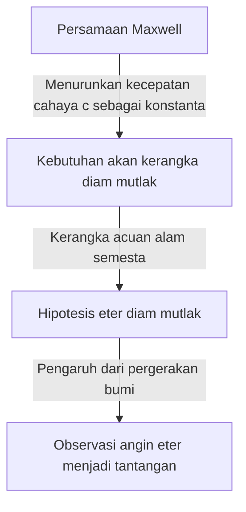

## 1. Pendahuluan: "Sesuatu" yang Diyakini Memenuhi Alam Semesta

Dalam sejarah umat manusia yang berusaha mengungkap misteri alam, pertanyaan tentang "bagaimana cahaya merambat melalui ruang" telah memikat dan juga membingungkan banyak ilmuwan jenius, dari filsuf Yunani kuno hingga fisikawan modern.

Mengamati fenomena fisika sehari-hari, "udara" atau "air" diperlukan agar suara dapat merambat, dan medium seperti "air laut" sangat penting agar gelombang laut dapat merambat. Dari analogi yang sangat intuitif dan logis ini, muncullah gagasan bahwa jika cahaya memiliki sifat gelombang, maka harus ada "medium tak dikenal" untuk merambatkan cahaya yang memenuhi setiap sudut ruang angkasa. Medium ilusi inilah yang disebut "Eter pembawa cahaya (Luminiferous aether)".

Keberadaan eter melampaui sekadar hipotesis dan diterima sebagai "akal sehat" yang tak terbantahkan dalam fisika hingga akhir abad ke-19. Namun, sebuah eksperimen yang mencoba memverifikasi "akal sehat" tersebut pada akhirnya memutarbalikkan dasar-dasar fisika dan membimbing umat manusia menuju pandangan alam semesta yang baru, yaitu teori relativitas Einstein. Artikel ini akan merunut secara rinci jejak besar sejarah sains tentang bagaimana konsep eter cahaya lahir, bagaimana itu disangkal, dan warisan apa yang ditinggalkannya bagi fisika modern.

## 2. Perdebatan Seputar Sifat Asli Cahaya dan Lahirnya Eter

Perdebatan tentang apakah sifat asli cahaya adalah "partikel" atau "gelombang" berlangsung sengit selama era Revolusi Ilmiah di abad ke-17.

Isaac Newton, berdasarkan hukum perambatan lurus dan pemantulan cahaya, mengusulkan "teori partikel cahaya" yang menyatakan bahwa cahaya adalah aliran partikel kecil. Melalui otoritasnya yang luar biasa, teori partikel mendominasi dunia fisika sepanjang abad ke-18. Namun, pada era yang sama, Christiaan Huygens berpendapat bahwa cahaya harus dianggap sebagai gelombang (fluktuasi) untuk menjelaskan fenomena seperti difraksi dan pembiasan cahaya, sehingga ia mengemukakan "teori gelombang cahaya".

Memasuki abad ke-19, "eksperimen celah ganda" oleh Thomas Young dan penyempurnaan teori gelombang matematis oleh Augustin-Jean Fresnel secara definitif membuktikan bahwa cahaya memiliki sifat sebagai gelombang (interferensi dan difraksi). Jika cahaya adalah gelombang, maka "medium" yang merambatkan gelombang harus ada di seluruh alam semesta. Karena cahaya dari matahari dapat mencapai bumi meskipun melalui ruang hampa udara, ruang angkasa dianggap bukanlah ketiadaan total, melainkan dipenuhi oleh medium yang transparan dan sangat tipis namun kokoh yang merambatkan gelombang cahaya, yaitu "eter".

### Sifat Aneh yang Diharapkan dari Eter

Namun, dengan mengasumsikan medium eter, para fisikawan menghadapi kontradiksi yang serius. Penemuan fenomena polarisasi mengungkapkan bahwa cahaya adalah gelombang transversal (gelombang yang bergetar tegak lurus terhadap arah rambatannya). Dalam kerangka fisika saat itu, hanya "benda padat" yang dapat merambatkan gelombang transversal. Gas dan cairan hanya dapat merambatkan gelombang longitudinal (seperti gelombang suara).

Dengan kata lain, eter harus berupa "benda padat transparan raksasa" yang menyebar ke seluruh alam semesta. Untuk merambatkan gelombang dengan kecepatan yang sangat luar biasa seperti kecepatan cahaya (sekitar 300.000 kilometer per detik), eter harus jauh lebih keras daripada baja dan memiliki elastisitas yang sangat kuat. Di sisi lain, karena bumi dan planet-planet tampaknya tidak mengalami hambatan gesekan apa pun dari eter saat berevolusi mengelilingi matahari, eter harus sepenuhnya tanpa gesekan dan memiliki sifat yang sangat tipis yang memungkinkan materi melewatinya tanpa hambatan.

Eter pada akhirnya dibebani dengan sifat aneh yang secara fisika sangat kontradiktif, yaitu "benda padat yang lebih keras dari baja, namun tidak memiliki hambatan layaknya fluida yang sempurna".

## 3. Elektromagnetisme Maxwell dan Kerangka Referensi Diam Mutlak Eter

Pada akhir abad ke-19, James Clerk Maxwell menyelesaikan "Persamaan Maxwell" yang menjadi dasar elektromagnetisme. Persamaan ini tidak hanya mendeskripsikan fenomena listrik dan magnetik secara sempurna, tetapi juga memuat prediksi yang mengejutkan. Ketika kecepatan rambat gelombang elektromagnetik dihitung, hasilnya sangat cocok dengan "kecepatan cahaya" yang diukur dalam eksperimen saat itu. Hal ini secara teoritis membuktikan bahwa "cahaya adalah salah satu jenis gelombang elektromagnetik".

Dalam persamaan Maxwell, kecepatan cahaya $c$ diturunkan sebagai konstanta yang ditentukan oleh permitivitas dan permeabilitas ruang hampa. Di sinilah masalah besar muncul. Ketika dikatakan "kecepatan cahaya adalah konstan", terhadap "apa" kecepatan tersebut konstan?

Menurut prinsip relativitas dalam mekanika Newton, kecepatan seharusnya selalu berubah bergantung pada kondisi pergerakan pengamat. Kecepatan bola yang dilemparkan dari kereta yang sedang melaju akan menjadi "kecepatan kereta + kecepatan bola" bila dilihat oleh orang di tanah. Namun, kecepatan cahaya dalam persamaan Maxwell tidak mempertimbangkan kecepatan pengamat seperti itu.

Untuk mengatasi hal ini, para fisikawan pada waktu itu memunculkan konsep "lautan eter". Mereka berpikir bahwa ada ruang yang menjadi standar mutlak agar persamaan Maxwell berlaku, dan bahwa itu adalah "eter diam mutlak" yang meluas dalam keadaan diam di seluruh alam semesta. Dengan kata lain, kecepatan cahaya $c$ ditafsirkan sebagai "kecepatan relatif terhadap eter yang diam mutlak".

## 4. Eksperimen Michelson-Morley: "Kegagalan" Paling Terkenal dalam Sejarah

Jika ruang angkasa dipenuhi oleh eter yang diam mutlak, maka bumi yang berevolusi mengelilingi matahari akan selalu bergerak menerjang lautan eter. Jika dilihat dari bumi, seharusnya ada "angin eter" yang berhembus dari luar angkasa.

Pada tahun 1887, Albert Michelson dan Edward Morley melakukan eksperimen terobosan untuk menangkap "angin eter" ini. Mereka membangun perangkat optik yang sangat presisi yang disebut "Interferometer Michelson".

Prinsip eksperimennya adalah sebagai berikut. Seberkas cahaya yang dipancarkan dari sumber cahaya dibagi menjadi dua arah yang saling tegak lurus oleh cermin setengah tembus pandang (half mirror). Satu sinar bergerak sejajar dengan arah angin eter, sementara yang lainnya bergerak tegak lurus, dan keduanya memantul kembali pada cermin di ujung masing-masing. Jika angin eter ada, sama seperti orang yang berenang bolak-balik melintasi sungai yang terpengaruh oleh aliran sungai, seharusnya ada sedikit perbedaan dalam waktu perjalanan bolak-balik cahaya. Ketika dua cahaya yang kembali disatukan, perbedaan waktu tersebut diharapkan dapat diamati sebagai pergeseran pada "pola interferensi".

Namun, hasilnya memberikan kejutan besar bagi dunia fisika. Tidak peduli seberapa banyak perangkat diputar, atau meskipun arah revolusi bumi berubah seiring pergantian musim, tidak ada pergeseran pola interferensi yang teramati sama sekali. Angin eter tidak berhembus sedikit pun.

Karena sepenuhnya gagal dalam membuktikan keberadaan eter, "Eksperimen Michelson-Morley" ini secara ironis mengukir namanya dalam sejarah sebagai "eksperimen gagal paling terkenal dalam sejarah sains".

## 5. Kontraksi Lorentz dan Solusi Ad Hoc

Para fisikawan yang menanggapi hasil eksperimen dengan serius berjuang untuk mencoba menyelamatkan teori eter. George FitzGerald dan Hendrik Lorentz membuat hipotesis yang mengejutkan.

"Ketika sebuah benda bergerak melalui eter, bukankah benda itu sendiri akan sedikit menyusut di sepanjang arah pergerakannya akibat tekanan dari angin eter?"

Menurut "hipotesis kontraksi Lorentz-FitzGerald" ini, lengan interferometer Michelson-Morley juga menyusut secara tepat di sepanjang arah pergerakan, sehingga perbedaan waktu bolak-balik cahaya menjadi saling meniadakan, dan sebagai akibatnya dijelaskan bahwa angin eter tidak dapat dideteksi. Lebih jauh lagi, Lorentz juga memperkenalkan konsep dilatasi waktu (waktu lokal) dalam sistem yang bergerak, dan menyelesaikan kerangka matematis yang disebut "Transformasi Lorentz".

Namun, teori-teori ini tidak dapat menghilangkan kesan bahwa itu adalah solusi "ad hoc (sementara)" yang ditambahkan belakangan untuk mempertahankan keberadaan eter. Meskipun secara matematis menunjukkan bahwa hukum fisika tidak berubah (invarian) bagi pengamat, mereka tetap bersikeras pada keberadaan "eter tak kasat mata yang diam mutlak".

## 6. Einstein dan Pergeseran Paradigma: Teori Relativitas Khusus

Pada tahun 1905, Albert Einstein, seorang pegawai muda di kantor paten, menerbitkan sebuah makalah yang menyelesaikan masalah rumit ini secara mendasar hanya dari dua prinsip sederhana. Inilah "Teori Relativitas Khusus".

Einstein berhenti mengkhawatirkan sifat-sifat eter, dan berangkat dari premis yang sama sekali baru.
1. **Prinsip Relativitas**: Dalam semua kerangka inersia (pengamat yang bergerak lurus beraturan), hukum-hukum fisika berlaku dalam bentuk yang sama persis. Tidak ada sistem diam mutlak.
2. **Prinsip Konstan Kecepatan Cahaya**: Kecepatan cahaya dalam ruang hampa selalu konstan (konstanta $c$) untuk semua pengamat, terlepas dari keadaan gerak sumber cahaya atau keadaan gerak pengamat.

Menerima dua prinsip ini akan mengarah pada kesimpulan yang menakjubkan. Agar kecepatan cahaya selalu konstan, "ruang" harus menyusut dan "waktu" harus berjalan lebih lambat sesuai dengan keadaan gerak pengamat. Fenomena yang dianggap oleh Lorentz dan kawan-kawan sebagai "kontraksi material akibat eter" ternyata merupakan sifat relatif dari ruang dan waktu itu sendiri.

Dan yang terpenting adalah, dalam teori Einstein sama sekali tidak ada ruang bagi konsep "medium yang menghantarkan cahaya = eter". Gelombang elektromagnetik menjalar dengan sendirinya sebagai sifat ruang, dan tidak membutuhkan medium. Pada titik ini, ilusi "eter" yang telah mendominasi fisikawan selama berabad-abad, secara teori telah terkubur sepenuhnya.

## 7. "Ruang Hampa" dalam Fisika Modern: Hantu Eter

Eter dibuang sebagai konsep yang tidak diperlukan, namun gagasan bahwa "ruang yang tidak berisi apa-apa (vakum)" benar-benar "kosong" juga disangkal oleh fisika modern.

Menurut "Teori Medan Kuantum", yang menggabungkan mekanika kuantum dan teori relativitas khusus, ruang hampa bukanlah sekadar ruang yang kosong. Ruang hampa adalah keadaan yang sangat dinamis, penuh dengan "fluktuasi kuantum" di mana partikel dan antipartikel terus-menerus tercipta dan saling memusnahkan (penciptaan dan pemusnahan pasangan). "Medan (Field)" seperti medan elektromagnetik dan medan Higgs ada di mana-mana di ruang angkasa, dan partikel muncul sebagai keadaan eksitasi (riak) dari medan tersebut.

Selain itu, dalam teori relativitas umum, Einstein mendeskripsikan ruang-waktu itu sendiri sebagai entitas dinamis yang melengkung oleh gravitasi. Di kemudian hari, Einstein sendiri pernah berkata bahwa dalam artian ruang-waktu itu sendiri memiliki sifat fisik, itu "bisa juga disebut eter dalam arti yang baru" (meskipun sangat berbeda dengan eter sebagai medium diam mutlak abad ke-19).

"Energi gelap (dark energy)" dan "materi gelap (dark matter)" yang dibahas dalam kosmologi modern juga mungkin dapat disebut sebagai versi modern dari eter, dalam arti entitas tak dikenal yang memenuhi ruang angkasa dan mendominasi perilaku alam semesta.

## 8. Kesimpulan: Apa yang Diajarkan oleh Sejarah Sains

Kisah eter cahaya adalah contoh yang sangat indah tentang bagaimana sains maju.

Eter adalah hipotesis yang salah. Namun, itu bukanlah hipotesis yang "tidak ada gunanya". Karena adanya konsep eter, eksperimen yang rumit dilakukan untuk membuktikannya, batasan teoritis menjadi jelas, dan pada akhirnya mengarah pada lompatan intelektual terbesar dalam sejarah umat manusia, yaitu teori relativitas.

Kegagalan atau premis yang salah dalam sains tidak pernah sia-sia. Hal tersebut menjadi batu pijakan yang sangat penting untuk menerangi wilayah yang belum diketahui. Medium ilusi yang disebut eter cahaya telah menghilang dari fisika, namun pengetahuan tentang "wujud asli ruang dan waktu" yang diperoleh umat manusia dalam proses penelusurannya, masih terus menopang pemahaman kita tentang alam semesta hingga saat ini.
