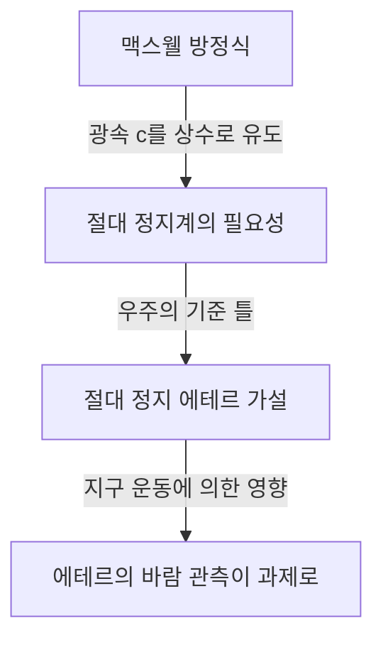

## 1. 서론: 우주를 채우고 있다고 믿어졌던 '무언가'

인류가 자연계의 수수께끼를 풀고자 해온 역사 속에서, "빛이 어떻게 공간을 전파하는가"라는 질문은 고대 그리스의 철학자부터 근대 물리학자에 이르기까지 수많은 천재들을 매료시키고 또 크게 괴롭혀 왔습니다.

일상적인 물리 현상을 관찰하면, 소리가 전달되기 위해서는 '공기'나 '물' 등의 물질이 필요하며, 바다의 파도가 전달되기 위해서는 '바닷물'이라는 매질이 불가결합니다. 이 지극히 직관적이고 논리적인 유추에서, 빛이 파동의 성질을 가진다면 빛을 전달하기 위한 '미지의 매질'이 우주 공간 구석구석까지 가득 차 있을 것이라는 생각이 탄생했습니다. 이 환상의 매질이 바로 '빛 에테르(Luminiferous aether)'라고 불린 것입니다.

에테르의 존재는 단순한 가설을 넘어 19세기 말까지의 물리학에서 의심할 여지 없는 '상식'으로 받아들여졌습니다. 그러나 그 '상식'을 검증하려 했던 한 실험이 결과적으로 물리학의 근간을 뒤엎고, 아인슈타인의 상대성이론이라는 새로운 우주관으로 인류를 이끌게 됩니다. 본 기사에서는 빛 에테르라는 개념이 어떻게 탄생하고, 어떻게 부정되었으며, 그리고 현대 물리학에 어떤 유산을 남겼는지 그 장대한 과학사의 궤적을 자세히 풀어보겠습니다.

## 2. 빛의 본질을 둘러싼 논쟁과 에테르의 탄생

빛의 본질이 '입자'인지 '파동'인지에 대한 논쟁은 17세기 과학 혁명 시대에 치열하게 벌어졌습니다.

아이작 뉴턴은 빛의 직진성이나 반사의 법칙을 근거로, 빛은 미세한 입자의 흐름이라고 하는 '빛의 입자설'을 제창했습니다. 그의 압도적인 권위로 인해 18세기 내내 입자설은 물리학계를 지배했습니다. 그러나 동시대에 크리스티안 하위헌스는 빛의 회절이나 굴절 등의 현상을 설명하기 위해서는 빛을 파동으로 보아야 한다고 주장하며 '빛의 파동설'을 주창했습니다.

19세기에 들어서 토머스 영의 '이중 슬릿 실험'이나 오귀스탱 장 프레넬의 수리적인 파동 이론의 완성으로, 빛이 파동으로서의 성질(간섭이나 회절)을 가진다는 것이 결정적으로 증명되었습니다. 빛이 파동이라면 파동을 전달하는 '매질'이 우주 전체에 존재해야만 합니다. 진공의 우주 공간에서도 태양으로부터 빛이 지구에 도달하는 이상, 우주 공간은 완전한 무(無)가 아니라 빛의 파동을 전달하는 투명하고 극히 희박하지만 확고한 매질 '에테르'로 채워져 있다고 생각되었던 것입니다.

### 에테르에 요구된 기묘한 성질

그러나 에테르라는 매질을 가정하자, 물리학자들은 심각한 모순에 직면했습니다. 빛은 횡파(진행 방향에 수직으로 진동하는 파동)라는 것이 편광 현상의 발견을 통해 밝혀졌습니다. 당시 물리학의 틀에서 횡파를 전달할 수 있는 것은 '고체'뿐이었습니다. 기체나 액체는 종파(음파 등)밖에 전달하지 못합니다.

즉, 에테르는 우주 전체에 퍼져 있는 '거대한 투명 고체'여야만 합니다. 빛의 속도(초속 약 30만 킬로미터)라는 터무니없는 속도로 파동을 전달하기 위해서, 에테르는 강철보다 훨씬 단단하고 극히 강한 탄성을 가지고 있어야 할 필요가 있습니다. 한편으로, 요컨대 지구와 행성이 태양 주위를 공전할 때 에테르로부터 아무런 마찰 저항도 받지 않는 것처럼 보이므로, 에테르는 완전히 마찰이 없고 물질을 저항 없이 통과시키는 극히 희박한 성질도 아울러 가지고 있어야만 합니다.

"강철보다 단단한 고체이면서도 완전한 유체처럼 저항이 없다"라는, 물리학적으로 어떻게 생각해도 모순되는 기묘한 성질을 에테르는 짊어지게 된 것입니다.

## 3. 맥스웰 전자기학과 에테르의 절대 정지계

19세기 후반, 제임스 클러크 맥스웰은 전자기학의 기초가 되는 '맥스웰 방정식'을 완성했습니다. 이 방정식은 전기와 자기의 현상을 완벽하게 기술할 뿐만 아니라, 놀라운 예언을 포함하고 있었습니다. 전자기파의 전파 속도를 계산한 결과, 그것이 당시 실험에서 측정되던 '빛의 속도'와 멋지게 일치했던 것입니다. 이로써 "빛은 전자기파의 일종이다"라는 것이 이론적으로 증명되었습니다.

맥스웰 방정식에서 빛의 속도 $c$ 는 진공의 유전율과 투자율에 의해 결정되는 상수로 유도됩니다. 여기서 큰 문제가 발생했습니다. "빛의 속도는 상수이다"라고 할 때, 그것은 "무엇에 대해" 일정한 것일까요?

뉴턴 역학의 상대성 원리에 따르면, 속도는 항상 관측자의 운동 상태에 의존하여 변화해야 합니다. 달리는 기차에서 던진 공의 속도는 지상에 있는 사람이 보면 "기차의 속도 + 공의 속도"가 됩니다. 그러나 맥스웰 방정식에서의 빛의 속도는 그런 관측자의 속도를 고려하지 않았습니다.

당시의 물리학자들은 이를 해결하기 위해 '에테르의 바다'를 끌어들였습니다. 맥스웰 방정식이 성립하는 절대적인 기준이 되는 공간이 존재하며, 그것이 우주 전체에 정지하여 퍼져 있는 '절대 정지 에테르'라고 생각한 것입니다. 즉, 빛의 속도 $c$ 는 "절대 정지해 있는 에테르에 대한 속도"로 해석되었습니다.

## 4. 마이컬슨-몰리의 실험: 역사상 가장 유명한 '실패'

만약 우주 공간이 절대 정지한 에테르로 가득 차 있다면, 태양 주위를 공전하는 지구는 항상 에테르의 바다 속을 돌진하고 있는 셈이 됩니다. 지구상에서 보면 우주로부터 '에테르의 바람'이 불어오고 있을 것입니다.

1887년, 앨버트 마이컬슨과 에드워드 몰리는 이 '에테르의 바람'을 포착하기 위한 획기적인 실험을 실시했습니다. 그들은 '마이컬슨 간섭계'라고 불리는 극도로 정밀한 광학 장치를 구축했습니다.

실험의 원리는 다음과 같습니다. 광원에서 방출된 하나의 빛 다발을 하프 미러(반투명 거울)로 직교하는 두 방향으로 분할합니다. 한쪽은 에테르의 바람과 평행한 방향으로, 다른 한쪽은 수직인 방향으로 나아가며, 각각의 끝에 있는 거울에서 반사되어 돌아옵니다. 만약 에테르의 바람이 존재한다면, 강을 헤엄쳐 왕복하는 사람이 강물의 흐름의 영향을 받듯이 빛이 왕복하는 시간에는 아주 미세한 차이가 발생할 것입니다. 돌아온 두 빛을 겹쳤을 때, 그 시간 차이는 '간섭무늬'의 어긋남으로 관측될 수 있을 것으로 기대되었습니다.

그러나 결과는 물리학계에 큰 충격을 주었습니다. 장치를 아무리 회전시켜도, 계절이 바뀌어 지구의 공전 방향이 바뀌어도, 간섭무늬의 어긋남은 전혀 관측되지 않았던 것입니다. 에테르의 바람은 전혀 불고 있지 않았습니다.

이 '마이컬슨-몰리의 실험'은 에테르의 존재를 증명하려다 완전히 실패함으로써, 아이러니하게도 "과학 역사상 가장 유명한 실패한 실험"으로 역사에 그 이름을 새기게 됩니다.

## 5. 로런츠 수축과 임시변통적(Ad hoc) 해결책

실험 결과를 무겁게 받아들인 물리학자들은 어떻게든 에테르 이론을 구제하고자 고심했습니다. 조지 피츠제럴드와 헨드릭 로런츠는 놀라운 가설을 세웠습니다.

"물체가 에테르 속을 운동하면, 에테르 바람의 압력에 의해 운동하는 방향을 따라 물체 자체가 약간 수축하는 것은 아닐까"

이 '로런츠-피츠제럴드 수축 가설'에 따르면, 마이컬슨-몰리의 간섭계 팔도 운동 방향을 따라 정확하게 줄어들기 때문에 빛의 왕복 시간의 차이가 상쇄되어, 결과적으로 에테르의 바람을 검출할 수 없게 된다고 설명되었습니다. 나아가 로런츠는 운동하는 계에서의 시간 지연(국소시)의 개념도 도입하여, '로런츠 변환'이라고 불리는 수학적인 틀을 완성했습니다.

그러나 이러한 이론들은 에테르의 존재를 지키기 위해 나중에 덧붙여진 '임시변통적인(Ad hoc, 그 자리를 모면하기 위한)' 해결책이라는 인상을 지울 수 없었습니다. 물리 법칙이 관측자에 대해 불변임을 수학적으로 보여주면서도, 그들은 어디까지나 '절대 정지해 있는 보이지 않는 에테르'의 존재에 매달려 있었던 것입니다.

## 6. 아인슈타인과 패러다임의 전환: 특수 상대성 이론

1905년, 특허국의 젊은 직원이던 알베르트 아인슈타인은 이 복잡하게 얽힌 문제를 단 두 가지 단순한 원리로부터 근본적으로 해결하는 논문을 발표했습니다. 이것이 바로 '특수 상대성 이론'입니다.

아인슈타인은 에테르의 성질에 대해 고민하는 것을 멈추고, 완전히 새로운 전제에서 출발했습니다.
1. **상대성 원리**: 모든 관성계(등속 직선 운동을 하는 관측자)에서 물리 법칙은 완전히 동일한 형태로 성립한다. 절대적인 정지계 따위는 존재하지 않는다.
2. **광속 불변의 원리**: 진공 중의 빛의 속도는 광원의 운동 상태나 관측자의 운동 상태에 관계없이 모든 관측자에게 항상 일정(상수 $c$)하다.

이 두 가지 원리를 받아들이면 놀라운 결론이 도출됩니다. 광속이 항상 일정하기 위해서는 관측자의 운동 상태에 따라 '공간'이 수축하고, '시간'의 흐름이 느려져야만 하는 것입니다. 로런츠 등이 '에테르에 의한 물질적인 수축'이라고 생각했던 현상은, 사실 시간과 공간 자체의 상대적인 성질임이 밝혀졌습니다.

그리고 가장 중요한 것은, 아인슈타인의 이론에는 "빛을 전달하는 매질 = 에테르"라는 개념이 들어갈 여지가 전혀 없었다는 점입니다. 전자기파는 공간의 성질로서 자기 전파하는 것이며, 매질을 필요로 하지 않습니다. 이로써 수세기에 걸쳐 물리학자들을 지배해 온 '에테르'라는 환상은 이론적으로 완전히 매장되었습니다.

## 7. 현대 물리학에서의 '진공': 에테르의 망령

에테르는 불필요한 개념으로서 버려졌지만, "아무것도 없는 공간(진공)"이 정말로 "비어 있다"라는 생각 역시 현대 물리학에 의해 부정되고 있습니다.

양자 역학과 특수 상대성 이론을 융합한 '양자장론'에 따르면, 진공이란 단순한 무(無)의 공간이 아닙니다. 그것은 입자와 반입자가 끊임없이 쌍생성·쌍소멸을 반복하는 '양자적 요동'으로 가득 찬, 지극히 역동적인 상태입니다. 전자기장이나 힉스장과 같은 '장(Field)'이 우주 공간 곳곳에 존재하며, 입자는 그 장의 들뜬 상태(파동)로 나타납니다.

또한, 일반 상대성 이론에서 아인슈타인은 시공간 자체가 중력에 의해 휘어지는 역동적인 실체라고 기술했습니다. 아인슈타인 자신도 훗날, 시공간 자체가 물리적 성질을 가진다는 의미에서 "새로운 의미의 에테르라고 부를 수도 있다"고 말한 적이 있습니다(단, 19세기의 절대 정지 매질로서의 에테르와는 완전히 다릅니다).

현대 우주론에서 논의되고 있는 '암흑 에너지(다크 에너지)'나 '암흑 물질(다크 매터)' 역시, 우주 공간에 가득 차 우주의 움직임을 지배하고 있는 미지의 존재라는 의미에서는 에테르의 현대판이라고 할 수 있을지도 모릅니다.

## 8. 결론: 과학사가 가르쳐주는 것

빛 에테르의 이야기는 과학이 어떻게 진보하는지를 보여주는 지극히 아름다운 실제 사례입니다.

에테르는 잘못된 가설이었습니다. 그러나 그것은 '무의미한' 가설이 아니었습니다. 에테르라는 개념이 있었기에 그것을 증명하려는 정교한 실험이 이루어졌고, 이론적인 한계가 부각되었으며, 최종적으로 상대성 이론이라는 인류 역사상 가장 위대한 지적 도약으로 이어졌던 것입니다.

과학에 있어서의 실패나 잘못된 전제는 결코 헛되지 않습니다. 그것은 미지의 영역을 비추기 위한 불가결한 발판이 됩니다. 빛 에테르라는 환상의 매질은 물리학에서 자취를 감추었지만, 그 탐구 과정에서 인류가 얻은 "시공간의 진정한 모습"이라는 지식은 지금도 우리의 우주에 대한 이해를 계속해서 뒷받침하고 있습니다.
