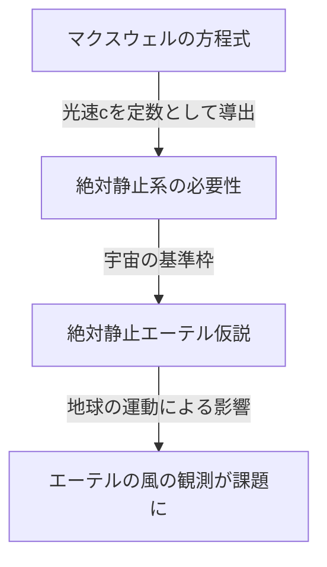

## 1. 序論：宇宙を満たすと信じられた「何か」

人類が自然界の謎を解き明かそうとしてきた歴史の中で、「光がどのようにして空間を伝わるのか」という問いは、古代ギリシャの哲学者から近代の物理学者に至るまで、数多くの天才たちを魅了し、また大いに悩ませてきました。

日常的な物理現象を観察すると、音が伝わるためには「空気」や「水」などの物質が必要であり、海の波が伝わるためには「海水」という媒質が不可欠です。この極めて直感的かつ論理的な類推から、光が波の性質を持つのであれば、光を伝えるための「未知の媒質」が宇宙空間の隅々にまで充満しているはずだという考えが生まれました。この幻の媒質こそが、「光エーテル（Luminiferous aether）」と呼ばれたものです。

エーテルの存在は、単なる仮説を超えて、19世紀末までの物理学において疑いようのない「常識」として受け入れられていました。しかし、その「常識」を検証しようとした一つの実験が、結果として物理学の根底を覆し、アインシュタインの相対性理論という新たな宇宙観へと人類を導くことになります。本記事では、光エーテルという概念がいかにして生まれ、いかにして否定され、そして現代物理学にどのような遺産を残したのか、その壮大な科学史の軌跡を詳細に紐解いていきます。

## 2. 光の本性を巡る論争とエーテルの誕生

光の本質が「粒子」なのか「波」なのかという議論は、17世紀の科学革命の時代に激しく戦わされました。

アイザック・ニュートンは、光の直進性や反射の法則を根拠に、光は微小な粒子の流れであるとする「光の粒子説」を提唱しました。彼の圧倒的な権威により、18世紀を通じて粒子説は物理学界を支配しました。しかし同時代、クリスティアーン・ホイヘンスは、光の回折や屈折などの現象を説明するためには、光を波（波動）とみなすべきだと主張し、「光の波動説」を唱えていました。

19世紀に入り、トーマス・ヤングによる「二重スリットの実験」や、オーギュスタン＝ジャン・フレネルの数理的な波動理論の完成により、光が波としての性質（干渉や回折）を持つことが決定的に証明されました。光が波であるならば、波を伝える「媒質」が宇宙全体に存在しなければなりません。真空の宇宙空間でも太陽からの光が地球に届く以上、宇宙空間は完全な無ではなく、光の波を伝える透明で極めて薄い、しかし確固たる媒質「エーテル」で満たされていると考えられたのです。

### エーテルに求められた奇妙な性質

しかし、エーテルという媒質を仮定すると、物理学者たちは深刻な矛盾に直面しました。光は横波（進行方向に対して垂直に振動する波）であることが偏光現象の発見によって判明していました。当時の物理学の枠組みにおいて、横波を伝えることができるのは「固体」のみでした。気体や液体は縦波（音波など）しか伝えられません。

つまり、エーテルは宇宙全体に広がる「巨大な透明の固体」でなければなりません。光の速度（秒速約30万キロメートル）という途方もない速さで波を伝えるためには、エーテルは鋼鉄よりもはるかに硬く、極めて強い弾性を持っている必要があります。その一方で、地球や惑星が太陽の周りを公転する際、エーテルから何の摩擦抵抗も受けていないように見えることから、エーテルは完全に摩擦がなく、物質を抵抗なく通り抜けさせる極めて希薄な性質も持ち合わせていなければなりません。

「鋼鉄よりも硬い固体でありながら、完全な流体のように抵抗がない」という、物理学的にどう考えても矛盾する奇妙な性質を、エーテルは背負わされることになったのです。

## 3. マクスウェル電磁気学とエーテルの絶対静止系

19世紀後半、ジェームズ・クラーク・マクスウェルは電磁気学の基礎となる「マクスウェルの方程式」を完成させました。この方程式は、電気と磁気の現象を完璧に記述するだけでなく、驚くべき予言を含んでいました。電磁波の伝播速度を計算したところ、それが当時の実験で測定されていた「光の速度」と見事に一致したのです。これにより、「光は電磁波の一種である」ことが理論的に証明されました。

マクスウェルの方程式において、光の速度 $c$ は真空の誘電率と透磁率によって決まる定数として導かれます。ここで大きな問題が生じました。「光の速度は定数である」というとき、それは「何に対して」一定なのでしょうか。

ニュートン力学の相対性原理によれば、速度は常に観測者の運動状態に依存して変化するはずです。走る列車から放たれたボールの速度は、地上にいる人から見れば「列車の速度＋ボールの速度」になります。しかし、マクスウェルの方程式における光の速度は、そのような観測者の速度を考慮していませんでした。

当時の物理学者たちは、これを解決するために「エーテルの海」を持ち出しました。マクスウェルの方程式が成り立つ絶対的な基準となる空間が存在し、それが宇宙全体に静止して広がっている「絶対静止エーテル」であると考えたのです。つまり、光の速度 $c$ は、「絶対静止しているエーテルに対する速度」であると解釈されました。

## 4. マイケルソン・モーリーの実験：史上最も有名な「失敗」

もし宇宙空間が絶対静止したエーテルで満たされているなら、太陽の周りを公転する地球は、常にエーテルの海の中を突き進んでいることになります。地球上から見れば、宇宙から「エーテルの風」が吹き付けているはずです。

1887年、アルバート・マイケルソンとエドワード・モーリーは、この「エーテルの風」を捉えるための画期的な実験を行いました。彼らは「マイケルソン干渉計」と呼ばれる極めて精密な光学装置を構築しました。

実験の原理は以下の通りです。光源から放たれた一つの光の束をハーフミラー（半透明の鏡）で直交する二つの方向に分割します。一方はエーテルの風と平行な方向へ、もう一方は垂直な方向へ進み、それぞれの先にある鏡で反射して戻ってきます。もしエーテルの風が存在するなら、川を泳いで往復する人が川の流れの影響を受けるように、光が往復する時間にはごくわずかな差が生じるはずです。戻ってきた二つの光を重ね合わせたとき、その時間の差は「干渉縞」のズレとして観測できると期待されました。

しかし、結果は物理学界に大きな衝撃を与えました。装置をどれだけ回転させても、季節を変えて地球の公転の向きが変わっても、干渉縞のズレは一切観測されなかったのです。エーテルの風は、まったく吹いていませんでした。

この「マイケルソン・モーリーの実験」は、エーテルの存在を証明しようとして完全に失敗したことで、皮肉にも「科学史上で最も有名な失敗した実験」として歴史にその名を刻むことになります。

## 5. ローレンツ収縮とアドホックな解決策

実験結果を重く受け止めた物理学者たちは、エーテル理論をどうにか救済しようと苦心しました。ジョージ・フィッツジェラルドやヘンドリック・ローレンツは、驚くべき仮説を立てました。

「物体がエーテルの中を運動すると、エーテルの風の圧力によって、運動の方向に沿って物体そのものがわずかに収縮するのではないか」

この「ローレンツ・フィッツジェラルド収縮仮説」によれば、マイケルソン・モーリーの干渉計の腕も、運動方向に沿って正確に縮むため、光の往復時間の差が相殺され、結果としてエーテルの風が検出できなくなると説明されました。さらにローレンツは、運動する系における時間の遅れ（局所時）の概念も導入し、「ローレンツ変換」と呼ばれる数学的な枠組みを完成させました。

しかし、これらの理論はエーテルの存在を守るために後から付け足された「アドホック（その場しのぎ）」な解決策という印象を拭えませんでした。物理法則が観測者に対して不変であることを数学的に示しながらも、彼らはあくまで「絶対静止した見えないエーテル」の存在にしがみついていたのです。

## 6. アインシュタインとパラダイムの転換：特殊相対性理論

1905年、特許局の若き職員であったアルベルト・アインシュタインは、この複雑に絡み合った問題を、たった二つのシンプルな原理から根本的に解決する論文を発表しました。これが「特殊相対性理論」です。

アインシュタインは、エーテルの性質について悩むのをやめ、全く新しい前提から出発しました。
1. **相対性原理**: すべての慣性系（等速直線運動をしている観測者）において、物理法則は全く同じ形で成り立つ。絶対的な静止系など存在しない。
2. **光速度不変の原理**: 真空中の光の速度は、光源の運動状態や観測者の運動状態にかかわらず、すべての観測者にとって常に一定（定数 $c$）である。

この二つの原理を受け入れると、驚くべき結論が導かれます。光速が常に一定であるためには、観測者の運動状態に応じて「空間」が縮み、「時間」の進み方が遅れなければならないのです。ローレンツらが「エーテルによる物質的な収縮」だと考えていた現象は、実は時間と空間そのものの相対的な性質であることが明らかになりました。

そして最も重要なことは、アインシュタインの理論には「光を伝える媒質＝エーテル」という概念が入り込む余地が全くなかったことです。電磁波は、空間の性質として自己伝播するものであり、媒質を必要としません。ここにおいて、数世紀にわたって物理学者を支配してきた「エーテル」という幻は、理論的に完全に葬り去られました。

## 7. 現代物理学における「真空」：エーテルの亡霊

エーテルは不要な概念として捨て去られましたが、「何もない空間（真空）」が本当に「空っぽ」であるという考えもまた、現代物理学によって否定されています。

量子力学と特殊相対性理論を融合させた「量子場の理論」によれば、真空とは単なる無の空間ではありません。それは、粒子と反粒子が絶えず対生成・対消滅を繰り返す「量子的な揺らぎ」に満ちた、極めてダイナミックな状態です。電磁場やヒッグス場といった「場（Field）」が宇宙空間の至る所に存在し、粒子はその場の励起状態（波立ち）として現れます。

また、一般相対性理論において、アインシュタインは時空そのものが重力によって曲がる動的な実体であると記述しました。アインシュタイン自身も後年、時空そのものが物理的性質を持つという意味において、「新しい意味でのエーテルと呼ぶこともできる」と語ったことがあります（ただし、19世紀の絶対静止媒質としてのエーテルとは全く異なります）。

現代の宇宙論で議論されている「暗黒エネルギー（ダークエネルギー）」や「暗黒物質（ダークマター）」もまた、宇宙空間に満ちて宇宙の振る舞いを支配している未知の存在という意味では、エーテルの現代版と言えるかもしれません。

## 8. 結論：科学史が教えてくれること

光エーテルの物語は、科学がどのように進歩するかを示す極めて美しい実例です。

エーテルは間違った仮説でした。しかし、それは「無意味な」仮説ではありませんでした。エーテルという概念があったからこそ、それを証明しようとする精緻な実験が行われ、理論的な限界が浮き彫りになり、最終的に相対性理論という人類史上最も偉大な知的飛躍へと繋がったのです。

科学における失敗や誤った前提は、決して無駄ではありません。それは、未知の領域を照らすための不可欠な足場となります。光エーテルという幻の媒質は、物理学から姿を消しましたが、その探求の過程で人類が得た「時空の真の姿」という知見は、今も私たちの宇宙の理解を支え続けています。
