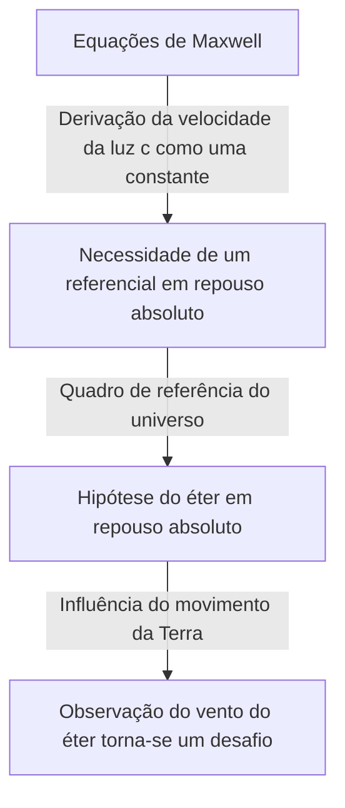

## 1. Introdução: O "Algo" Que Se Acreditava Preencher o Universo

Na história das tentativas da humanidade de desvendar os mistérios da natureza, a pergunta "Como a luz viaja através do espaço?" cativou e também confundiu muitas mentes geniais, desde os antigos filósofos gregos até os físicos modernos.

Observando os fenômenos físicos cotidianos, precisamos de substâncias como "ar" ou "água" para que o som se propague, e o meio "água do mar" é essencial para a propagação das ondas do oceano. A partir dessa analogia extremamente intuitiva e lógica, surgiu a ideia de que, se a luz tem propriedades de onda, deve haver um "meio desconhecido" para transmitir a luz preenchendo cada canto do espaço. Esse meio fantasma era chamado de "éter luminífero" (Luminiferous aether).

A existência do éter, mais do que uma mera hipótese, foi aceita como um "senso comum" inquestionável na física até o final do século XIX. No entanto, um único experimento que tentou verificar esse "senso comum" acabou virando a base da física de cabeça para baixo e levou a humanidade a uma nova visão do universo: a teoria da relatividade de Einstein. Neste artigo, desvendaremos detalhadamente a trajetória épica da história científica sobre como o conceito do éter luminífero nasceu, como foi rejeitado e que legado deixou para a física moderna.

## 2. A Disputa Sobre a Natureza da Luz e o Nascimento do Éter

O debate sobre se a essência da luz era uma "partícula" ou uma "onda" foi travado intensamente durante a época da Revolução Científica no século XVII.

Isaac Newton, baseando-se na propagação retilínea da luz e na lei da reflexão, propôs a "teoria corpuscular da luz", que afirmava que a luz é um fluxo de pequenas partículas. Devido à sua esmagadora autoridade, a teoria corpuscular dominou a comunidade física ao longo do século XVIII. No entanto, na mesma época, Christiaan Huygens argumentou que, para explicar fenômenos como a difração e a refração da luz, a luz deveria ser considerada uma onda, defendendo assim a "teoria ondulatória da luz".

No século XIX, com o "experimento de fenda dupla" de Thomas Young e a conclusão da teoria ondulatória matemática de Augustin-Jean Fresnel, foi provado conclusivamente que a luz tem propriedades de onda (interferência e difração). Se a luz é uma onda, um "meio" que a transmita deve existir em todo o universo. Como a luz do Sol atinge a Terra mesmo através do espaço sideral vazio, considerava-se que o espaço não era o nada absoluto, mas sim preenchido por um meio "éter" transparente, extremamente rarefeito, porém firme, que transmitia as ondas de luz.

### As Propriedades Bizarras Exigidas do Éter

No entanto, ao assumir o éter como um meio, os físicos enfrentaram uma contradição profunda. Foi descoberto, através dos fenômenos de polarização, que a luz é uma onda transversal (uma onda que vibra perpendicularmente à sua direção de propagação). No arcabouço da física da época, apenas "sólidos" podiam transmitir ondas transversais. Gases e líquidos só podiam transmitir ondas longitudinais (como ondas sonoras).

Em outras palavras, o éter tinha que ser um "gigantesco sólido transparente" que se estendia por todo o universo. Para transmitir ondas na velocidade formidável da luz (cerca de 300.000 quilômetros por segundo), o éter precisava ser muito mais rígido que o aço e ter uma elasticidade extremamente forte. Por outro lado, como a Terra e os planetas não parecem sofrer qualquer resistência de atrito do éter enquanto orbitam o Sol, o éter também deveria ser completamente sem atrito e ter uma propriedade extremamente rarefeita, permitindo que a matéria passasse sem resistência.

O éter foi sobrecarregado com propriedades bizarras e contraditórias em termos de física: "sólido mais rígido que o aço, mas sem resistência, como um fluido perfeito".

## 3. O Eletromagnetismo de Maxwell e o Sistema de Referência Absoluto do Éter

Na segunda metade do século XIX, James Clerk Maxwell completou as "Equações de Maxwell", que formaram a base do eletromagnetismo. Essas equações não apenas descreviam perfeitamente os fenômenos elétricos e magnéticos, mas também continham uma previsão surpreendente. Quando ele calculou a velocidade de propagação das ondas eletromagnéticas, ela correspondeu de forma impressionante à "velocidade da luz" medida em experimentos da época. Isso provou teoricamente que "a luz é um tipo de onda eletromagnética".

Nas equações de Maxwell, a velocidade da luz $c$ é derivada como uma constante determinada pela permissividade e permeabilidade do vácuo. Aqui surgiu um grande problema. Quando dizemos que "a velocidade da luz é uma constante", em relação a "o quê" ela é constante?

De acordo com o princípio da relatividade da mecânica newtoniana, a velocidade deve sempre mudar dependendo do estado de movimento do observador. A velocidade de uma bola lançada de um trem em movimento será "a velocidade do trem + a velocidade da bola" do ponto de vista de uma pessoa no chão. No entanto, a velocidade da luz nas equações de Maxwell não levou em consideração essa velocidade do observador.

Os físicos da época trouxeram o "mar de éter" para resolver isso. Eles pensavam que existia um espaço que servia como padrão absoluto onde as equações de Maxwell se mantinham verdadeiras, e que este era o "éter em repouso absoluto" se espalhando estacionariamente por todo o universo. Ou seja, a velocidade da luz $c$ era interpretada como "a velocidade em relação ao éter em repouso absoluto".

## 4. O Experimento de Michelson-Morley: O "Fracasso" Mais Famoso da História

Se o espaço sideral estivesse preenchido com éter em repouso absoluto, a Terra, orbitando o Sol, estaria constantemente avançando através do mar de éter. Visto da Terra, deveria haver um "vento de éter" soprando do espaço.

Em 1887, Albert Michelson e Edward Morley conduziram um experimento revolucionário para capturar este "vento de éter". Eles construíram um dispositivo óptico extremamente preciso chamado "interferômetro de Michelson".

O princípio do experimento era o seguinte. Um feixe de luz emitido por uma fonte de luz é dividido em duas direções ortogonais por um espelho semitransparente (half mirror). Uma viaja paralelamente ao vento do éter e a outra viaja perpendicularmente, e ambas retornam após serem refletidas pelos espelhos em suas respectivas extremidades. Se o vento do éter existisse, deveria haver uma diferença minúscula no tempo de ida e volta da luz, assim como alguém nadando para frente e para trás em um rio seria afetado pela correnteza do rio. Quando os dois feixes de luz retornassem e se sobrepusessem, esperava-se que essa diferença de tempo pudesse ser observada como um deslocamento das "franjas de interferência".

No entanto, os resultados chocaram a comunidade física. Não importa o quanto eles girassem o aparelho, ou mesmo quando a direção da órbita da Terra mudava com as estações, nenhum deslocamento nas franjas de interferência foi observado. O vento do éter não estava soprando de forma alguma.

Ao fracassar completamente em provar a existência do éter, este "experimento de Michelson-Morley" ironicamente gravou seu nome na história como "o experimento fracassado mais famoso da história da ciência".

## 5. Contração de Lorentz e Soluções Ad Hoc

Os físicos, que levaram a sério os resultados experimentais, lutaram de alguma forma para salvar a teoria do éter. George FitzGerald e Hendrik Lorentz criaram uma hipótese surpreendente.

"Quando um objeto se move através do éter, será que o próprio objeto se contrai ligeiramente ao longo da direção do movimento devido à pressão do vento do éter?"

De acordo com esta "hipótese de contração de Lorentz-FitzGerald", o braço do interferômetro de Michelson-Morley também se contrairia com precisão ao longo da direção do movimento, compensando a diferença no tempo de ida e volta da luz, e isso explicava por que o vento do éter não pôde ser detectado. Além disso, Lorentz introduziu o conceito de dilatação do tempo (tempo local) em sistemas em movimento e completou a estrutura matemática chamada "transformação de Lorentz".

No entanto, essas teorias não podiam se livrar da impressão de que eram soluções "ad hoc" (improvisadas), adicionadas retrospectivamente para proteger a existência do éter. Mesmo mostrando matematicamente que as leis da física são invariantes em relação ao observador, eles se apegavam teimosamente à existência do "éter invisível em repouso absoluto".

## 6. Einstein e a Mudança de Paradigma: A Teoria da Relatividade Restrita

Em 1905, Albert Einstein, um jovem funcionário do escritório de patentes, publicou um artigo que resolveu fundamentalmente este problema complexo a partir de apenas dois princípios simples. Esta foi a "Teoria da Relatividade Restrita".

Einstein parou de se preocupar com as propriedades do éter e partiu de premissas completamente novas.
1. **Princípio da Relatividade**: As leis da física se mantêm exatamente na mesma forma em todos os sistemas inerciais (observadores em movimento retilíneo uniforme). Não existe um sistema em repouso absoluto.
2. **Princípio da Constância da Velocidade da Luz**: A velocidade da luz no vácuo é sempre constante (constante $c$) para todos os observadores, independentemente do estado de movimento da fonte de luz ou do estado de movimento do observador.

Aceitar esses dois princípios levou a conclusões surpreendentes. Para que a velocidade da luz fosse sempre constante, o "espaço" teria que encolher e o avanço do "tempo" teria que desacelerar dependendo do estado de movimento do observador. Tornou-se claro que o fenômeno que Lorentz e outros consideravam como "contração material devido ao éter" era, na verdade, uma propriedade relativa do próprio tempo e espaço.

E, o mais importante, a teoria de Einstein não tinha espaço algum para o conceito de um "meio de transmissão de luz = éter". As ondas eletromagnéticas se autopropagam como uma propriedade do espaço e não requerem um meio. Aqui, a ilusão do "éter" que dominou os físicos por séculos foi teoricamente enterrada por completo.

## 7. O "Vácuo" na Física Moderna: O Fantasma do Éter

Embora o éter tenha sido descartado como um conceito desnecessário, a ideia de que o "espaço vazio (vácuo)" é verdadeiramente "vazio" também foi rejeitada pela física moderna.

De acordo com a "teoria quântica de campos", que fundiu a mecânica quântica com a teoria da relatividade restrita, o vácuo não é um mero espaço de nada. É um estado extremamente dinâmico, cheio de "flutuações quânticas" nas quais partículas e antipartículas repetidamente criam e aniquilam pares de forma constante. "Campos" (Fields), como o campo eletromagnético e o campo de Higgs, existem em toda parte no espaço sideral, e as partículas aparecem como estados excitados (ondulações) desses campos.

Além disso, na teoria da relatividade geral, Einstein descreveu que o próprio espaço-tempo é uma entidade dinâmica que é curvada pela gravidade. O próprio Einstein disse mais tarde que, no sentido de que o próprio espaço-tempo possui propriedades físicas, "pode ser chamado de éter em um novo sentido" (embora seja completamente diferente do éter como um meio em repouso absoluto do século XIX).

A "energia escura" (dark energy) e a "matéria escura" (dark matter) discutidas na cosmologia moderna também podem ser ditas, talvez, como as versões modernas do éter, no sentido de que são entidades desconhecidas que preenchem o espaço sideral e ditam o comportamento do universo.

## 8. Conclusão: O Que a História da Ciência Nos Ensina

A história do éter luminífero é um exemplo supremamente belo de como a ciência progride.

O éter era uma hipótese incorreta. No entanto, não foi uma hipótese "sem sentido". Precisamente por existir o conceito do éter, experimentos requintados foram conduzidos para tentar prová-lo, suas limitações teóricas foram destacadas e, finalmente, levou à teoria da relatividade, o maior salto intelectual da história humana.

Falhas e premissas errôneas na ciência nunca são em vão. Elas servem como andaimes essenciais para iluminar territórios desconhecidos. O meio fantasma do éter luminífero desapareceu da física, mas o conhecimento da "verdadeira natureza do espaço-tempo" que a humanidade obteve no processo dessa busca continua a sustentar a nossa compreensão do universo até hoje.
