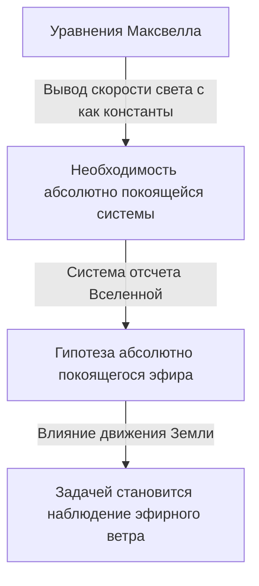

## 1. Введение: «Нечто», что, как считалось, заполняет Вселенную

В истории попыток человечества разгадать тайны природы вопрос «как свет распространяется в пространстве» очаровывал и сильно озадачивал многих гениев, от древнегреческих философов до современных физиков.

Наблюдая повседневные физические явления, мы видим, что для распространения звука необходимо такое вещество, как «воздух» или «вода», а для распространения морских волн необходима такая среда, как «морская вода». Из этой интуитивной и логичной аналогии родилась идея, что если свет имеет волновую природу, то должна существовать «неизвестная среда» для его распространения, заполняющая каждый уголок космоса. Эта призрачная среда и получила название «светоносный эфир» (Luminiferous aether).

Существование эфира было не просто гипотезой, а принималось как несомненный «здравый смысл» в физике вплоть до конца 19 века. Однако один эксперимент, призванный проверить этот «здравый смысл», в итоге перевернул основы физики и привел человечество к новому взгляду на Вселенную — теории относительности Эйнштейна. В этой статье мы подробно проследим грандиозную траекторию научной истории: как родилась концепция светоносного эфира, как она была отвергнута и какое наследие оставила современной физике.

## 2. Споры о природе света и рождение эфира

Споры о том, является ли свет «частицей» или «волной», ожесточенно велись в эпоху научной революции 17 века.

Исаак Ньютон, основываясь на прямолинейном распространении света и законах отражения, выдвинул «корпускулярную теорию света», утверждающую, что свет — это поток мельчайших частиц. Благодаря его огромному авторитету корпускулярная теория доминировала в физике на протяжении всего 18 века. Однако в то же время Христиан Гюйгенс утверждал, что для объяснения таких явлений, как дифракция и преломление света, свет следует рассматривать как волну, и выдвинул «волновую теорию света».

В начале 19 века «эксперимент с двумя щелями» Томаса Юнга и завершение математической волновой теории Огюстеном Жаном Френелем окончательно доказали, что свет обладает волновыми свойствами (интерференция и дифракция). Если свет — это волна, то во всей Вселенной должна существовать «среда», передающая эту волну. Поскольку свет от Солнца достигает Земли даже в вакууме космоса, считалось, что космическое пространство — это не абсолютное ничто, а оно заполнено прозрачной, чрезвычайно разреженной, но твердой средой, передающей световые волны — «эфиром».

### Странные свойства, требуемые от эфира

Однако, постулируя среду, называемую эфиром, физики столкнулись с серьезным противоречием. Открытие явления поляризации показало, что свет является поперечной волной (волной, колеблющейся перпендикулярно направлению распространения). В рамках физики того времени только «твердые тела» могли передавать поперечные волны. Газы и жидкости могут передавать только продольные волны (такие как звуковые волны).

Иными словами, эфир должен был быть «гигантским прозрачным твердым телом», простирающимся по всей Вселенной. Чтобы передавать волны с колоссальной скоростью света (около 300 000 километров в секунду), эфир должен был быть намного тверже стали и обладать чрезвычайно высокой упругостью. С другой стороны, поскольку Земля и планеты при вращении вокруг Солнца, казалось, не испытывали никакого сопротивления трения со стороны эфира, эфир должен был быть совершенно лишен трения и обладать крайне разреженными свойствами, позволяющими материи проходить сквозь него без сопротивления.

Таким образом, эфир оказался наделен физически противоречивыми и странными свойствами: «он тверже стали, но не имеет сопротивления, как идеальная жидкость».

## 3. Электромагнетизм Максвелла и абсолютно покоящаяся система эфира

Во второй половине 19 века Джеймс Клерк Максвелл завершил создание «уравнений Максвелла», которые стали основой электромагнетизма. Эти уравнения не только идеально описывали электрические и магнитные явления, но и содержали удивительное предсказание. Когда была рассчитана скорость распространения электромагнитных волн, она поразительно совпала со «скоростью света», измеренной в экспериментах того времени. Это теоретически доказало, что «свет — это разновидность электромагнитной волны».

В уравнениях Максвелла скорость света $c$ выводится как константа, определяемая диэлектрической и магнитной проницаемостью вакуума. Здесь возникла серьезная проблема. Когда мы говорим, что «скорость света является константой», «относительно чего» она постоянна?

Согласно принципу относительности ньютоновской механики, скорость всегда должна меняться в зависимости от состояния движения наблюдателя. Скорость мяча, брошенного из движущегося поезда, с точки зрения человека на земле, будет равна «скорости поезда + скорости мяча». Однако скорость света в уравнениях Максвелла не учитывала такую скорость наблюдателя.

Физики того времени, чтобы решить эту проблему, ввели понятие «моря эфира». Они полагали, что существует абсолютное пространство, в котором выполняются уравнения Максвелла, и это «абсолютно покоящийся эфир», неподвижно простирающийся по всей Вселенной. Таким образом, скорость света $c$ интерпретировалась как «скорость относительно абсолютно покоящегося эфира».

## 4. Эксперимент Майкельсона-Морли: самая известная «неудача» в истории

Если космическое пространство заполнено абсолютно покоящимся эфиром, то Земля, вращаясь вокруг Солнца, постоянно движется сквозь море эфира. При взгляде с Земли из космоса должен дуть «эфирный ветер».

В 1887 году Альберт Майкельсон и Эдвард Морли провели новаторский эксперимент, чтобы зафиксировать этот «эфирный ветер». Они сконструировали чрезвычайно точный оптический прибор, названный «интерферометром Майкельсона».

Принцип эксперимента таков. Пучок света, испускаемый источником, разделяется полупрозрачным зеркалом в двух взаимно перпендикулярных направлениях. Один направляется параллельно эфирному ветру, а другой — перпендикулярно, отражается от зеркал в конце каждого пути и возвращается обратно. Если эфирный ветер существует, то, подобно тому, как пловец, переплывающий реку туда и обратно, испытывает влияние течения, во времени прохождения света туда и обратно должна возникнуть очень небольшая разница. Ожидалось, что при наложении двух возвратившихся световых лучей эта разница во времени будет наблюдаться как сдвиг «интерференционных полос».

Однако результат поверг физическое сообщество в шок. Как бы ни вращали прибор и как бы ни менялось направление движения Земли со сменой сезонов, никакого сдвига интерференционных полос не наблюдалось. Эфирный ветер вообще не дул.

Этот «эксперимент Майкельсона-Морли», потерпев полную неудачу в попытке доказать существование эфира, по иронии судьбы вошел в историю как «самый известный неудачный эксперимент в истории науки».

## 5. Лоренцево сокращение и специальные решения

Восприняв результаты эксперимента всерьез, физики изо всех сил пытались спасти теорию эфира. Джордж Фицджеральд и Хендрик Лоренц выдвинули поразительную гипотезу.

«Если объект движется сквозь эфир, не сокращается ли сам объект немного вдоль направления движения из-за давления эфирного ветра?»

Согласно этой «гипотезе сокращения Лоренца-Фицджеральда», плечи интерферометра Майкельсона-Морли также точно сокращаются вдоль направления движения, тем самым компенсируя разницу во времени прохождения света туда и обратно, что объясняло невозможность обнаружения эфирного ветра. Кроме того, Лоренц ввел понятие замедления времени (местного времени) в движущейся системе и завершил математическую структуру, известную как «преобразования Лоренца».

Однако эти теории не могли избавиться от впечатления «ad hoc» (специально придуманных для данного случая) решений, добавленных задним числом для защиты существования эфира. Несмотря на математическое доказательство того, что физические законы инвариантны для наблюдателей, они все еще цеплялись за существование «абсолютно покоящегося невидимого эфира».

## 6. Эйнштейн и смена парадигмы: специальная теория относительности

В 1905 году молодой сотрудник патентного бюро Альберт Эйнштейн опубликовал статью, которая фундаментально решила эту запутанную проблему, исходя всего из двух простых принципов. Это была «специальная теория относительности».

Эйнштейн перестал беспокоиться о свойствах эфира и начал с совершенно новых предпосылок.
1. **Принцип относительности**: Во всех инерциальных системах (для наблюдателей, движущихся равномерно и прямолинейно) физические законы выполняются в совершенно одинаковой форме. Абсолютно покоящейся системы не существует.
2. **Принцип постоянства скорости света**: Скорость света в вакууме всегда постоянна (константа $c$) для всех наблюдателей, независимо от состояния движения источника света или состояния движения наблюдателя.

Принятие этих двух принципов приводит к удивительным выводам. Чтобы скорость света всегда оставалась постоянной, «пространство» должно сокращаться, а ход «времени» должен замедляться в зависимости от состояния движения наблюдателя. Стало ясно, что явление, которое Лоренц и другие считали «материальным сокращением, вызванным эфиром», на самом деле является относительным свойством самих времени и пространства.

И самое главное, в теории Эйнштейна совершенно не оставалось места для концепции «среды, передающей свет = эфира». Электромагнитные волны самораспространяются как свойство пространства и не нуждаются в среде. На этом этапе призрак «эфира», который господствовал над физиками на протяжении веков, был полностью теоретически похоронен.

## 7. «Вакуум» в современной физике: призрак эфира

Хотя эфир был отброшен как ненужная концепция, идея о том, что «пустое пространство (вакуум)» действительно является «пустым», также отвергается современной физикой.

Согласно «квантовой теории поля», объединившей квантовую механику и специальную теорию относительности, вакуум — это не просто пустое пространство. Это чрезвычайно динамичное состояние, наполненное «квантовыми флуктуациями», где частицы и античастицы постоянно рождаются и исчезают. «Поля» (Fields), такие как электромагнитное поле и поле Хиггса, существуют повсюду в космосе, и частицы появляются как возбужденные состояния (волны) этих полей.

Кроме того, в общей теории относительности Эйнштейн описал само пространство-время как динамическую сущность, искривляемую гравитацией. В более поздние годы сам Эйнштейн однажды сказал, что в том смысле, что само пространство-время обладает физическими свойствами, «его также можно назвать эфиром в новом смысле» (однако он совершенно отличается от эфира как абсолютно покоящейся среды 19 века).

«Темную энергию» и «темную материю», обсуждаемые в современной космологии, также можно считать современными версиями эфира в том смысле, что они являются неизвестными сущностями, заполняющими космическое пространство и управляющими поведением Вселенной.

## 8. Заключение: чему нас учит история науки

История светоносного эфира — это чрезвычайно красивый пример того, как развивается наука.

Эфир был ошибочной гипотезой. Но это не была «бессмысленная» гипотеза. Именно потому, что существовала концепция эфира, проводились точные эксперименты по его доказательству, выявлялись теоретические пределы, и в конечном итоге это привело к величайшему интеллектуальному скачку в истории человечества — теории относительности.

Неудачи и ложные предпосылки в науке никогда не бывают напрасными. Они служат важными ступенями для освещения неизведанных областей. Призрачная среда, светоносный эфир, исчезла из физики, но знание «истинной природы пространства-времени», полученное человечеством в процессе его поиска, продолжает поддерживать наше понимание Вселенной и сегодня.
