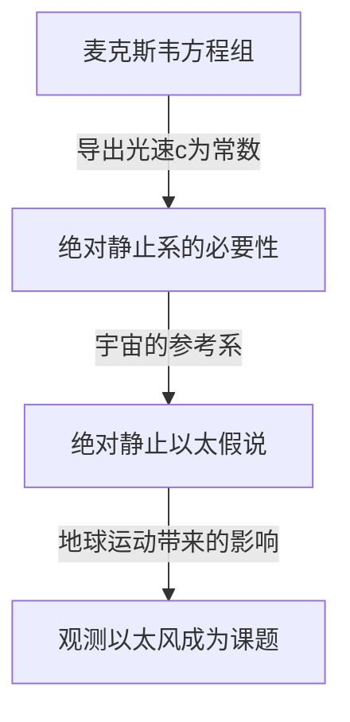

## 1. 导言：被认为充满宇宙的“某种东西”

在人类试图解开自然界奥秘的历史中，“光是如何在空间中传播的？”这个问题吸引了从古希腊哲学家到近代物理学家的众多天才，也让他们大为苦恼。

观察日常的物理现象，声音的传播需要“空气”或“水”等物质，海浪的传播则离不开“海水”这种介质。从这种极其直观且符合逻辑的类推中，产生了一个想法：如果光具有波的性质，那么传递光的“未知介质”一定充满着宇宙空间的每一个角落。这种虚幻的介质，就被称为“发光以太（Luminiferous aether）”。

以太的存在超越了单纯的假说，在19世纪末之前的物理学中被作为毋庸置疑的“常识”所接受。然而，一项试图验证这一“常识”的实验，结果却颠覆了物理学的根基，引导人类走向了爱因斯坦相对论这一全新的宇宙观。本文将详细梳理以太概念是如何诞生、如何被否定，以及它给现代物理学留下了怎样的遗产，追溯这段宏伟的科学史轨迹。

## 2. 围绕光本质的争论与以太的诞生

关于光的本质是“粒子”还是“波”的讨论，在17世纪科学革命时代展开了激烈的交锋。

艾萨克·牛顿以光的直线传播和反射定律为依据，提出了“微粒说”，认为光是微小粒子的流动。凭借其压倒性的权威，微粒说在整个18世纪统治了物理学界。但在同时代，克里斯蒂安·惠更斯主张为了解释光的衍射和折射等现象，应该将光视为波（波动），并提出了“波动说”。

进入19世纪，由于托马斯·杨的“双缝干涉实验”以及奥古斯丁-让·菲涅耳数学波动理论的完成，光具有波的性质（干涉和衍射）被决定性地证明了。如果光是波，那么传递波的“介质”必须存在于整个宇宙中。既然太阳的光能在真空的宇宙空间中到达地球，说明宇宙空间并非完全的虚无，而是被一种透明、极其稀薄却又确凿存在的介质“以太”所充满，以传递光波。

### 以太被要求具备的奇特性质

然而，在假设了以太这种介质之后，物理学家们面临着严重的矛盾。随着偏振现象的发现，人们得知光是横波（振动方向垂直于传播方向的波）。在当时的物理学框架下，只有“固体”才能传递横波。气体和液体只能传递纵波（如声波）。

也就是说，以太必须是遍布整个宇宙的“巨大透明固体”。为了以光速（每秒约30万公里）这种惊人的速度传递波，以太必须比钢铁硬得多，具有极强的弹性。另一方面，当星球和行星绕太阳公转时，似乎没有受到来自以太的任何摩擦阻力，因此以太又必须完全没有摩擦，并且极其稀薄，能让物质毫无阻力地穿过。

“既是比钢铁更硬的固体，又像完美流体一样没有阻力”，以太被迫背负了这种在物理学上无论如何思考都充满矛盾的奇特性质。

## 3. 麦克斯韦电磁学与以太的绝对静止系

19世纪后半叶，詹姆斯·克拉克·麦克斯韦完成了作为电磁学基础的“麦克斯韦方程组”。这个方程组不仅完美地描述了电磁现象，还包含了一个惊人的预言。当计算出电磁波的传播速度时，发现它与当时实验中测量到的“光速”惊人地一致。由此，理论上证明了“光是一种电磁波”。

在麦克斯韦方程组中，光速 $c$ 是作为一个由真空介电常数和磁导率决定的常数推导出来的。这里产生了一个大问题。当说“光速是常数”时，它是“相对于什么”恒定不变的呢？

根据牛顿力学的相对性原理，速度应该总是依赖于观察者的运动状态而改变。从行驶的列车上抛出的球的速度，在地面上的人看来是“列车的速度 + 球的速度”。但是，麦克斯韦方程组中的光速并没有考虑这种观察者的速度。

当时的物理学家为了解决这个问题，搬出了“以太之海”。他们认为存在一个作为麦克斯韦方程组成立绝对标准的空间，那就是在整个宇宙中静止并蔓延的“绝对静止以太”。也就是说，光速 $c$ 被解释为“相对于绝对静止的以太的速度”。

## 4. 迈克尔逊-莫雷实验：史上最著名的“失败”

如果宇宙空间充满了绝对静止的以太，那么绕太阳公转的地球，就一直在以太之海中穿梭。从地球上看，宇宙中应该有“以太风”吹过。

1887年，阿尔伯特·迈克尔逊和爱德华·莫雷为了捕捉这种“以太风”，进行了一项具有划时代意义的实验。他们构建了一种极其精密的称为“迈克尔逊干涉仪”的光学装置。

实验原理如下：从光源发出的一束光通过半透镜（半透明的镜子）被分成正交的两个方向。一束向平行于以太风的方向传播，另一束向垂直的方向传播，然后分别被前方的镜子反射回来。如果存在以太风，就像在河中来回游泳的人会受水流影响一样，光往返的时间应该会产生微小的差异。当返回的两束光重叠时，这个时间差有望作为“干涉条纹”的移动被观测到。

然而，结果给物理学界带来了巨大的冲击。无论如何旋转装置，即使改变季节使得地球公转方向发生变化，也没有观测到任何干涉条纹的移动。以太风根本就不存在。

这项“迈克尔逊-莫雷实验”试图证明以太的存在却完全失败了，具有讽刺意味的是，它也因此作为“科学史上最著名的失败实验”而被铭记在历史上。

## 5. 洛伦兹收缩与特设的解决方案

严肃对待实验结果的物理学家们绞尽脑汁试图拯救以太理论。乔治·斐兹杰惹和亨德里克·洛伦兹提出了一个惊人的假设。

“当物体在以太中运动时，由于以太风的压力，物体本身是否会沿着运动方向发生轻微的收缩呢？”

根据这个“洛伦兹-斐兹杰惹收缩假说”，迈克尔逊-莫雷干涉仪的臂也沿着运动方向精确地缩短了，因此光往返的时间差被抵消，结果就解释了为什么无法检测到以太风。此外，洛伦兹还引入了运动系中时间膨胀（局部时）的概念，完成了被称为“洛伦兹变换”的数学框架。

但是，这些理论始终无法消除一种印象，即它们是为了维护以太的存在而事后附加的“特设（ad hoc，权宜之计）”解决方案。虽然在数学上证明了物理定律对观察者是不变的，但他们仍然固执地坚持“绝对静止的看不见的以太”的存在。

## 6. 爱因斯坦与范式转换：狭义相对论

1905年，身为专利局年轻职员的阿尔伯特·爱因斯坦发表了一篇论文，仅从两个简单的原理出发，从根本上解决了这个错综复杂的问题。这就是“狭义相对论”。

爱因斯坦停止了对以太性质的纠结，从一个全新的前提开始：
1. **相对性原理**：在所有惯性系（做匀速直线运动的观察者）中，物理定律的形式完全相同。不存在绝对静止系。
2. **光速不变原理**：真空中光的传播速度，无论光源和观察者的运动状态如何，对所有观察者来说总是恒定的（常数 $c$）。

接受这两个原理，就会得出一个惊人的结论。为了使光速保持不变，必须根据观察者的运动状态，让“空间”收缩，让“时间”变慢。洛伦兹等人认为是“由以太引起的物质收缩”的现象，实际上被证明是时间和空间本身的相对性质。

而最重要的一点是，在爱因斯坦的理论中，根本没有“传递光的介质=以太”这一概念的容身之地。电磁波作为空间的一种属性，是自我传播的，不需要介质。至此，几个世纪以来统治物理学家的“以太”幻影，在理论上被彻底埋葬了。

## 7. 现代物理学中的“真空”：以太的幽灵

虽然以太作为一个多余的概念被抛弃了，但“一无所有的空间（真空）”是真的“空无一物”的想法，也被现代物理学所否定。

根据融合了量子力学和狭义相对论的“量子场论”，真空绝不仅仅是虚无的空间。它充满了粒子和反粒子不断进行对产生和对湮灭的“量子涨落”，是一种极其动态的状态。电磁场和希格斯场等“场（Field）”无处不在于宇宙空间中，而粒子则表现为这些场的激发态（涟漪）。

此外，在广义相对论中，爱因斯坦将时空本身描述为会被引力弯曲的动态实体。爱因斯坦自己也在晚年说过，在时空本身具有物理性质的意义上，“也可以称其为新意义上的以太”（但这与19世纪作为绝对静止介质的以太完全不同）。

在现代宇宙学中讨论的“暗能量（Dark Energy）”和“暗物质（Dark Matter）”，作为充满宇宙空间并支配宇宙演化的未知存在，或许也可以称作现代版的以太。

## 8. 结论：科学史给我们的启示

发光以太的故事，是展示科学如何进步的一个极其美丽的真实例子。

以太是一个错误的假说。然而，它并不是一个“毫无意义”的假说。正是因为有了以太的概念，人们才进行了精密的实验去试图证明它，进而凸显了理论上的局限性，最终促成了相对论这一人类历史上最伟大的智力飞跃。

科学中的失败和错误前提，绝不是没有用的。它们是照亮未知领域不可或缺的垫脚石。发光以太这种虚幻的介质虽然从物理学中消失了，但在探索过程中人类获得的关于“时空真实面貌”的见解，至今仍支撑着我们对宇宙的理解。
