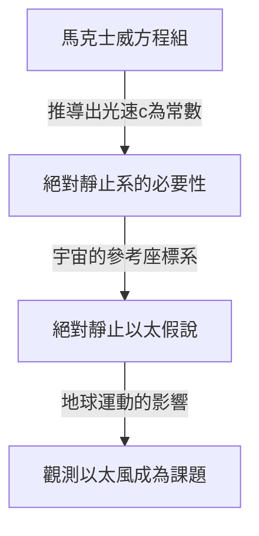

## 1. 導論：被認為充滿宇宙的「某種東西」

在人類試圖解開自然界謎團的歷史中，「光是如何在空間中傳播的」這個問題，從古希臘哲學家到近代物理學家，吸引了無數天才，也讓他們大傷腦筋。

觀察日常的物理現象，聲音的傳播需要「空氣」或「水」等物質，海浪的傳播需要「海水」這種媒質。從這種極度直觀且符合邏輯的類比出發，如果光具有波的性質，那麼宇宙空間的各個角落一定充滿了傳遞光波的「未知媒質」。這種幻影般的媒質，就被稱為「發光以太 (Luminiferous aether)」。

以太的存在超越了單純的假說，直到19世紀末，在物理學界都被視為無庸置疑的「常識」。然而，一個試圖驗證這項「常識」的實驗，結果卻顛覆了物理學的根基，將人類引向了愛因斯坦相對論這個全新的宇宙觀。本文將詳細梳理光以太這個概念是如何誕生、如何被否定，以及它為現代物理學留下了什麼樣的遺產，帶您回顧這段壯闊的科學史軌跡。

## 2. 光的本質之爭與以太的誕生

關於光的本質究竟是「粒子」還是「波」的爭論，在17世紀科學革命時期展開了激烈的交鋒。

艾薩克·牛頓以光的直線傳播和反射定律為依據，提出了「光微粒說」，認為光是微小粒子的流動。憑藉著他壓倒性的權威，微粒說在整個18世紀主導了物理學界。但在同一時期，克里斯蒂安·惠更斯主張，為了要解釋光的繞射和折射等現象，必須將光視為波 (波動)，因而提出了「光波動說」。

進入19世紀，湯瑪士·楊的「雙狹縫實驗」以及奧古斯丁-讓·菲涅耳在數學上的波動理論的完成，決定性地證明了光具有波的性質 (干涉與繞射)。既然光是波，那麼傳遞波的「媒質」就必須存在於整個宇宙中。既然來自太陽的光能夠穿越真空的宇宙空間到達地球，那麼宇宙空間就不是完全的虛無，而是充滿了一種透明、極其稀薄，但卻確實存在的傳遞光波的媒質「以太」。

### 以太被要求的奇特假定性質

然而，假設了以太這種媒質的存在，物理學家們卻面臨了嚴重的矛盾。隨著偏振現象的發現，人們明白光是一種橫波 (與前進方向垂直振動的波)。在當時物理學的框架下，只有「固體」才能傳遞橫波。氣體或液體只能傳遞縱波 (如聲波)。

也就是說，以太必須是遍布整個宇宙的「巨大透明固體」。為了能以光速 (每秒約30萬公里) 這種驚人的速度傳遞波，以太必須比鋼鐵還要堅硬，並具有極強的彈性。但另一方面，當地球和其他行星繞著太陽公轉時，似乎沒有受到來自以太的任何摩擦阻力，因此以太又必須是完全沒有摩擦力、能讓物質毫無阻礙穿過的極其稀薄的存在。

「既是比鋼鐵還要堅硬的固體，又像完美流體一樣沒有阻力」，以太被迫背負了這種在物理學上怎麼想都充滿矛盾的奇特假定性質。

## 3. 馬克士威電磁學與以太的絕對靜止系

19世紀後半，詹姆斯·克拉克·馬克士威完成了作為電磁學基礎的「馬克士威方程組」。這個方程組不僅完美地描述了電與磁的現象，還包含了一個驚人的預言。當他計算電磁波的傳播速度時，發現它與當時實驗測得的「光速」驚人地一致。這在理論上證明了「光是一種電磁波」。

在馬克士威方程組中，光速 $c$ 是由真空的電容率和磁導率所決定的常數。這時產生了一個大問題。當我們說「光速是常數」時，它是「相對於什麼」保持恆定呢？

根據牛頓力學的相對性原理，速度總是會依賴觀察者的運動狀態而改變。從行駛中的火車上丟出的球，在地面上的人看來，其速度會是「火車的速度＋球的速度」。但是，馬克士威方程組中的光速並沒有考慮這種觀察者的速度。

當時的物理學家為了要解決這個問題，搬出了「以太之海」的概念。他們認為存在一個作為馬克士威方程組成立的絕對參考空間，那就是靜止並布滿整個宇宙的「絕對靜止以太」。也就是說，光速 $c$ 被解釋為「相對於絕對靜止的以太的速度」。

## 4. 邁克生-莫立實驗：史上最著名的「失敗」

如果宇宙空間充滿了絕對靜止的以太，那麼繞著太陽公轉的地球，就等於是不斷地在以太之海中穿梭前進。從地球上來看，宇宙中應該會吹來一陣「以太風」。

1887年，阿爾伯特·邁克生和愛德華·莫立為了捕捉這陣「以太風」，進行了一項劃時代的實驗。他們建造了一台名為「邁克生干涉儀」的極度精密的各項光學儀器。

實驗原理如下：將光源發出的一束光，利用半反射鏡 (半透明鏡) 分割成互相垂直的兩個方向。一束光平行於以太風的方向前進，另一束光則垂直於以太風的方向前進，然後分別被遠處的鏡子反射回來。如果以太風存在，就像在河裡來回游泳的人會受到水流影響一樣，光來回的時間應該會產生微小的差異。當返回的兩束光疊加在一起時，這種時間差被期待能夠以「干涉條紋」的偏移被觀測到。

然而，結果卻給物理學界帶來了巨大的衝擊。無論怎麼旋轉儀器，或者改變季節讓地球的公轉方向改變，都沒有觀測到任何干涉條紋的偏移。以太風根本就不存在。

這個「邁克生-莫立實驗」因為試圖證明以太存在卻徹底失敗，諷刺地以「科學史上最著名的失敗實驗」之名名留青史。

## 5. 勞侖茲收縮與特設性解決方案

嚴肅看待這個實驗結果的物理學家們，絞盡腦汁試圖挽救以太理論。喬治·費茲傑羅和亨德里克·勞侖茲提出了一個驚人的假說。

「當物體在以太中運動時，會不會因為以太風的壓力，導致物體本身沿著運動方向發生微小的收縮呢？」

根據這個「勞侖茲-費茲傑羅收縮假說」，邁克生-莫立干涉儀的干涉臂也會沿著運動方向精確地縮短，從而抵消了光來回時間的差異，結果就解釋了為何無法探測到以太風。此外，勞侖茲還引入了運動系統中時間變慢 (局域時) 的概念，並完成了被稱為「勞侖茲轉換」的數學框架。

然而，這些理論始終給人一種為了保衛以太存在而事後追加的「特設性 (Ad hoc，臨時湊合)」解決方案的印象。儘管他們在數學上展示了物理定律對觀察者而言是不變的，但他們依然固執地死守著「絕對靜止且看不見的以太」的存在。

## 6. 愛因斯坦與典範轉移：狹義相對論

1905年，當時還是專利局年輕職員的阿爾伯特·愛因斯坦發表了一篇論文，僅僅從兩個簡單的原理出發，就從根本上解決了這個錯綜複雜的問題。這就是「狹義相對論」。

愛因斯坦不再糾結於以太的性質，而是從全新的前提展開：
1. **相對性原理**: 在所有慣性系 (作等速直線運動的觀察者) 中，物理定律都以完全相同的形式成立。不存在所謂的絕對靜止系。
2. **光速不變原理**: 真空中的光速，無論光源的運動狀態或觀察者的運動狀態如何，對所有觀察者來說都永遠是恆定的 (常數 $c$)。

接受這兩個原理，就會導出令人驚訝的結論。為了要讓光速永遠保持恆定，必須要根據觀察者的運動狀態，讓「空間」收縮、「時間」的流逝變慢。勞侖茲等人認為是「由以太造成的物質收縮」的現象，其實被證明是時間與空間本身的相對性質。

最重要的是，在愛因斯坦的理論中，完全沒有「傳遞光的媒質＝以太」這個概念存在的餘地。電磁波是作為空間的性質自我傳播的，不需要任何媒質。至此，統治了物理學界幾個世紀的「以太」這個幻影，在理論上被徹底埋葬了。

## 7. 現代物理學中的「真空」：以太的幽靈

雖然以太作為一個不必要的概念被拋棄了，但現代物理學也同樣否定了「什麼都沒有的空間 (真空)」是真的「空無一物」的想法。

根據融合了量子力學與狹義相對論的「量子場論」，真空並不僅僅是虛無的空間。它充滿了粒子與反粒子不斷進行成對產生與成對湮滅的「量子起伏」，是一個極具動態的狀態。電磁場和希格斯場等「場 (Field)」存在於宇宙空間的各個角落，而粒子則是作為這些場的激發態 (波紋) 出現的。

此外，在廣義相對論中，愛因斯坦將時空本身描述為會因為重力而彎曲的動態實體。愛因斯坦自己晚年也曾說過，在時空本身具有物理性質的這個意義上，「也可以稱之為一種新意義下的以太」(但這與19世紀作為絕對靜止媒質的以太完全不同)。

在現代宇宙學中被討論的「暗能量」或「暗物質」，作為充滿宇宙空間並主宰宇宙行為的未知存在，或許也可以說是現代版的以太吧。

## 8. 結論：科學史帶給我們的啟示

光以太的故事，是一個極其優美地展現了科學是如何進步的實例。

以太是一個錯誤的假說。但它絕對不是一個「毫無意義的」假說。正因為有以太這個概念，才會有為了證明它而進行的精密實驗，理論的局限性才得以浮現，最終引導出了相對論這個人類史上最偉大的心智飛躍。

科學上的失敗與錯誤前提，絕不是徒勞無功。它們成為了照亮未知領域不可或缺的墊腳石。光以太這個幻影媒質雖然從物理學中消失了，但在探索它的過程中所獲得的「時空真實樣貌」的見解，至今仍在支撐著我們對宇宙的理解。
