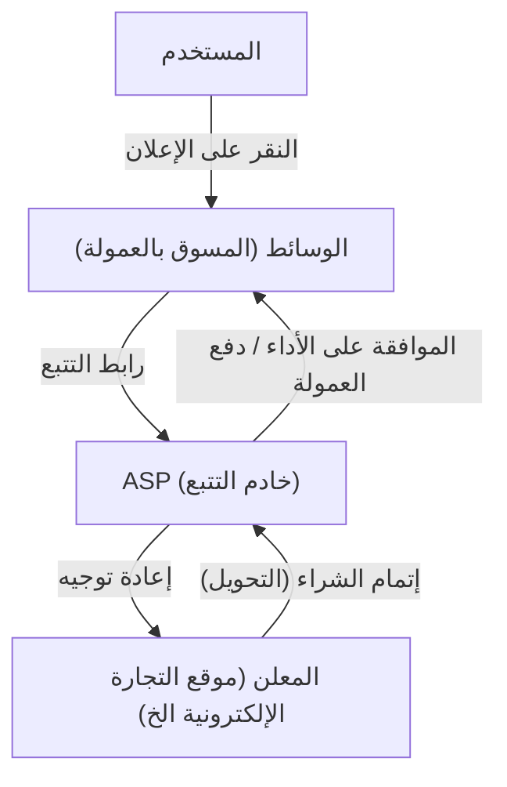
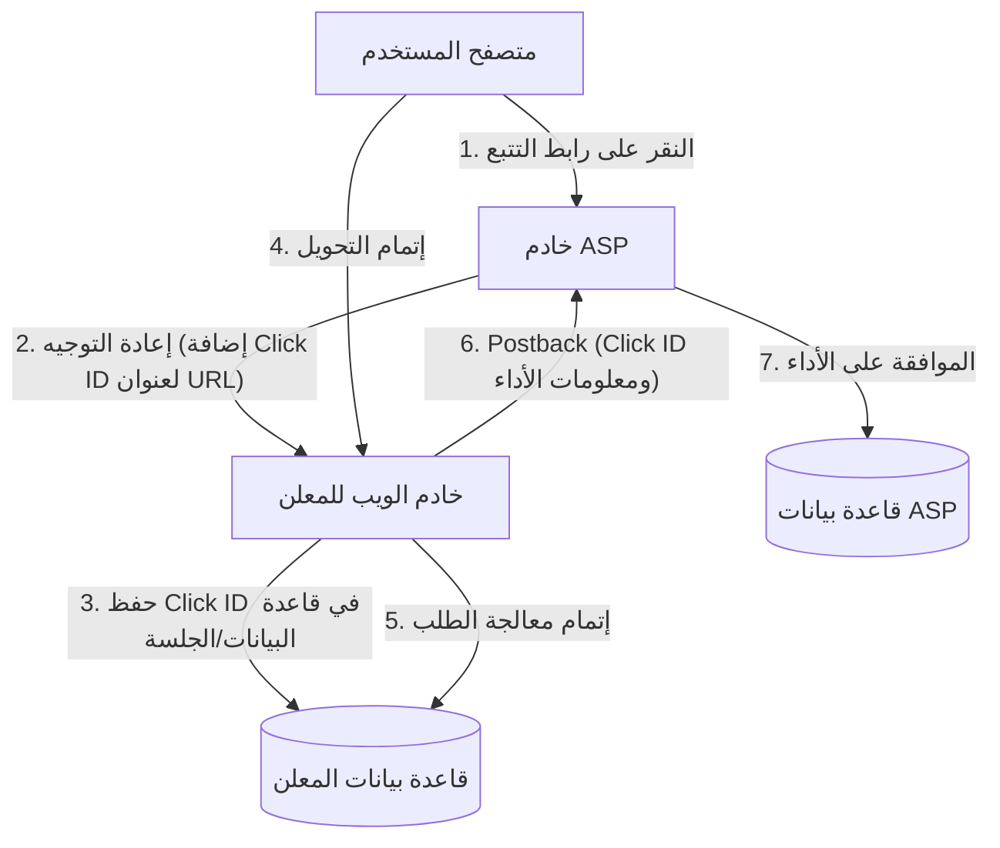

# آلية التسويق بالعمولة: الجانب التقني للتتبع والتحويل

في سوق الإعلانات على الإنترنت، تلعب إعلانات الدفع مقابل الأداء (التسويق بالعمولة) دوراً بالغ الأهمية. ونظراً لأن المعلنين (التجار) يدفعون عمولات فقط مقابل "الأداء" الفعلي مثل المبيعات أو اكتساب العملاء المحتملين، فإنها تُعرف على نطاق واسع كطريقة تسويقية فعالة من حيث التكلفة.

ومع ذلك، وخلف الكواليس، تعمل تقنيات تتبع متقدمة ومعقدة لتتبع سلوك المستخدم بدقة وتحديد أي وسائط (مسوق بالعمولة) أدت إحالتها إلى تحقيق الأداء.

في هذه المقالة، سنشرح بشكل شامل الجانب التقني للتسويق بالعمولة، بدءاً من دور شبكات التسويق بالعمولة (ASP - Affiliate Service Provider) التي تشكل جوهر نظام التسويق بالعمولة، مروراً بآلية عناوين URL الخاصة بالتتبع باستخدام إعادة التوجيه، وتقنيات التتبع من جانب العميل باستخدام ملفات تعريف الارتباط (Cookie) و التخزين المحلي (LocalStorage)، وصولاً إلى التتبع من جانب الخادم (S2S) كإجراء مضاد لميزة منع التتبع الذكي (ITP - Intelligent Tracking Prevention) التي حظيت باهتمام كبير في السنوات الأخيرة.

## 1. الصورة الشاملة لنظام التسويق بالعمولة البيئي

يتكون التسويق بالعمولة بشكل أساسي من أصحاب المصلحة الأربعة التاليين:

1. **المستخدم (المستهلك)**: يتصفح الوسائط، وينقر على الإعلانات، ويشتري المنتجات أو يشترك فيها.
2. **الوسائط (المسوق بالعمولة/الناشر)**: يعرّف بالمنتجات على موقعه الإلكتروني أو وسائل التواصل الاجتماعي الخاصة به، ويخلق حركة مرور (ترافيك).
3. **مزود خدمة التسويق بالعمولة (ASP)**: منصة تعمل كوسيط بين المعلنين والوسائط، وتقوم بإدارة التتبع، وقياس الأداء، ودفع العمولات.
4. **المعلن (التاجر)**: يقدم المنتجات أو الخدمات ويدفع تكاليف الإعلانات لـ ASP.

في هذا النظام البيئي، يعد ASP المحور التقني الأهم.

يعمل ASP كبنية بيانات ضخمة تعالج حركة المرور الهائلة في الوقت الفعلي، وتسجل بدقة تصل إلى أجزاء من الألف من الثانية "من" نقر على "أي إعلان" و"متى"، وإلى "أي أداء" أدى ذلك و"متى".

## 2. الآلية الأساسية للتتبع (من جانب العميل)

تاريخياً، اعتمد التتبع في التسويق بالعمولة بشكل كبير على تقنيات جانب العميل (المتصفح). هنا، سنقوم بتفكيك وشرح تدفق التتبع القياسي التقليدي.

### 2.1. رابط التتبع وإعادة التوجيه

روابط الإعلانات التي ينشرها المسوقون بالعمولة على مواقعهم لا تشير مباشرة إلى موقع المعلن. بل هي دائمًا "روابط تتبع (Tracking URL)" تمر عبر خادم ASP مرة واحدة.

مثال: `https://click.example-asp.com/track?aff_id=12345&campaign_id=67890`

عندما ينقر المستخدم على هذا الرابط، تحدث العملية التالية:

1. **تسجيل النقر**: يسجل خادم ASP في قاعدة البيانات عنوان IP للمستخدم، و User-Agent، والطابع الزمني، ومعرف المسوق بالعمولة (`aff_id`) ومعرف الحملة (`campaign_id`) المضمنين في عنوان URL.
2. **إنشاء معرف النقر**: يتم إنشاء "معرف النقر (Click ID)" لتعريف حدث النقر هذا بشكل فريد.
3. **تعيين ملف تعريف الارتباط (Cookie)**: يصدر ASP ملف تعريف ارتباط لنطاقه الخاص (طرف ثالث) لمتصفح المستخدم، ويحفظ فيه معرف النقر.
4. **إعادة التوجيه**: بمجرد اكتمال المعالجة، يرسل استجابة HTTP 302 (Found) أو 301 (Moved Permanently) ويعيد توجيه المستخدم إلى الصفحة المقصودة (LP) الخاصة بالمعلن. في هذا الوقت، قد يتم إرفاق معرف النقر كمعلمة (Parameter) في عنوان URL.

### 2.2. دور Cookie و LocalStorage

يتجول المستخدم الذي وصل إلى موقع المعلن داخل الموقع، ويصل في النهاية إلى "التحويل (CV - Conversion)" مثل شراء منتج أو التسجيل كعضو.

في التتبع التقليدي، يتم تضمين جافا سكريبت أو علامة صورة تسمى "علامة التحويل (CV tag)" التي يوفرها ASP في الصفحة التي يكتمل فيها التحويل (صفحة الشكر).

عند تحميل علامة التحويل، تتم المعالجة التالية:

- **قراءة Cookie**: يتم قراءة معرف النقر من ملف تعريف الارتباط الخاص بـ ASP المحفوظ في المتصفح.
- **إرسال الأداء**: يتم إرسال معرف النقر المقروء ومعلومات الأداء (مبلغ الشراء، رقم الطلب، إلخ) إلى خادم ASP.

بالإضافة إلى ذلك، استعداداً لانتهاء صلاحية أو حذف ملفات تعريف الارتباط، تُستخدم تقنية حفظ معرف النقر كنسخة احتياطية في `LocalStorage` أو `SessionStorage`، وهي واجهات برمجة تطبيقات (APIs) لتخزين الويب في HTML5، على نطاق واسع.

## 3. موجة حماية الخصوصية: تأثير ITP

على الرغم من سهولة تنفيذ التتبع من جانب العميل، إلا أنه كان يعاني من مشكلة كبيرة: "التتبع المفرط للمستخدمين عبر ملفات تعريف ارتباط الطرف الثالث".

مع تزايد المخاوف بشأن الخصوصية المتعلقة بجمع سجل سلوك المستخدمين عبر مواقع متعددة دون علمهم، بدأت شركات تطوير المتصفحات في فرض قيود صارمة على التتبع، بدءاً من **ITP (منع التتبع الذكي - Intelligent Tracking Prevention)** المدمج في متصفح Safari من Apple.

### تأثير ITP على التسويق بالعمولة

بسبب إدخال ITP، تعرضت صناعة التسويق بالعمولة لتأثيرات مدمرة كما يلي:

1. **الحظر الكامل لملفات تعريف ارتباط الطرف الثالث (Third-party Cookies)**: أصبحت ملفات تعريف الارتباط التي يصدرها ASP (ملفات تعريف الارتباط الخاصة بنطاق مختلف عن نطاق المعلن) محظورة افتراضياً. ونتيجة لذلك، لم يعد التتبع باستخدام علامات التحويل (CV tags) التقليدية يعمل.
2. **تقصير فترة صلاحية ملفات تعريف ارتباط الطرف الأول (First-party Cookies)**: حتى لو كانت ملفات تعريف الارتباط صادرة عن نطاق المعلن (First-party Cookies)، إذا تم تعيينها بواسطة JavaScript (`document.cookie`) عبر معلمات URL (مثل: `?click_id=...`)، فقد تم تقصير فترة صلاحيتها لتصل إلى 24 ساعة (أو 7 أيام) كحد أقصى.
3. **تقييد LocalStorage**: على غرار ملفات تعريف الارتباط، تم أيضاً فرض قيود صارمة على الوصول إلى التخزين مثل LocalStorage وفترة الاحتفاظ بها.

ونتيجة لذلك، أصبح من غير الممكن قياس الأداء ذو الوقت الطويل بين النقر والتحويل، مثل "قيام المستخدم بالشراء بعد عدة أيام من النقر على الإعلان"، مما أدى إلى فقدان فرص كسب العمولات للمسوقين بالعمولة وتدهور عائد الاستثمار (ROI) للمعلن.

## 4. صعود التتبع من جانب الخادم (S2S) وإعادة الإرسال (Postback)

في ظل القيود المفروضة على تخزين البيانات والاتصال من جانب العميل (المتصفح)، فإن الحل الذي تنتقل إليه صناعة التسويق بالعمولة هو **التتبع من جانب الخادم (Server-to-Server / S2S)**، والذي يُعرف أيضاً باسم **طريقة إعادة الإرسال (Postback)**.

### بنية تتبع S2S

في تتبع S2S، لا يتم الاعتماد على ملفات تعريف ارتباط المتصفح أو علامات JavaScript، بل يتواصل خادم المعلن وخادم ASP بشكل مباشر (عبر واجهة برمجة التطبيقات API).

1. **النقر وإعادة التوجيه**: كما كان من قبل، ينقر المستخدم على رابط ASP. ينشئ ASP `Click ID` فريداً ويمرره إلى موقع المعلن كمعلمة عنوان URL عند إعادة التوجيه (مثال: `https://shop.example.com/?click_id=abcde12345`).
2. **الحفظ من جانب الخادم**: يتلقى خادم الويب الخاص بالمعلن الطلب، ويستخرج `click_id` من معلمة عنوان URL، ويحفظه في جلسة الخادم (Session) أو قاعدة البيانات، أو كملف تعريف ارتباط طرف أول حقيقي باستخدام رأس HTTP (Set-Cookie) (وبالتالي يكون أقل عرضة لقيود ITP لأنه لا يمر عبر JavaScript).
3. **إعادة الإرسال (Postback) عند التحويل**: في اللحظة التي يكمل فيها المستخدم عملية الشراء وتتأكد معالجة الطلب على خادم المعلن، يتم إرسال طلب HTTP (GET أو POST) مباشرة من خادم المعلن إلى نقطة النهاية (Postback URL) المحددة من قبل ASP.

### مزايا تتبع S2S

- **لا يتأثر بـ ITP**: نظراً لإمكانية تجنب قيود المتصفح، يمكن قياس الأداء بشكل موثوق.
- **تحسين الأمان**: نظراً لعدم كشف علامات التحويل (CV tags) في جانب العميل، يصبح من الأسهل منع إرسال بيانات أداء احتيالية (الاحتيال الإعلاني - Ad Fraud).
- **تحسين دقة البيانات**: لا يحدث فشل في تحميل علامات التحويل بسبب أخطاء الشبكة أو مغادرة المستخدم للمتصفح.

### تحديات تتبع S2S

يتمثل التحدي الأكبر في "العوائق التقنية للتنفيذ". فبالمقارنة مع المهمة البسيطة المتمثلة في لصق علامة JavaScript تقليدية في HTML، يتطلب الأمر من جانب المعلن تطوير النظام (تلقي المعلمات، الحفظ في قاعدة البيانات، معالجة طلبات API من الواجهة الخلفية)، مما يزيد من تكاليف التنفيذ للمعلنين الصغار.

لذلك، تقوم منصات ASP في السنوات الأخيرة بجهود لخفض عوائق تنفيذ تتبع S2S من خلال توفير إضافات (Plugins) للمنصات الرئيسية مثل Shopify و WordPress.

## 5. تقنيات التتبع للجيل القادم

بالإضافة إلى تتبع S2S، يستمر التطور في النظام البيئي بأكمله.

### 5.1. البصمة الرقمية (Fingerprinting - التحديد البديل)
هي تقنية تحدد هوية المستخدم بشكل فريد من خلال مجموعة من بيئات متصفح المستخدم (User-Agent، دقة الشاشة، الخطوط المثبتة، عنوان IP، إلخ) دون الاعتماد على ملفات تعريف الارتباط أو المعلمات. ومع ذلك، وبسبب المخاوف من انتهاك الخصوصية، فإن المتصفحات تتخذ تدابير مضادة لهذا، ولم تعد تعتبر طريقة موثوقة.

### 5.2. غرف البيانات النظيفة (Data Clean Rooms) و Google Tag Manager من جانب الخادم
من خلال استخدام "غرف البيانات النظيفة" التي يقدمها كبار موفري المنصات، وحاويات جانب الخادم لمدير علامات Google (GTM)، يقوم المعلنون ببناء آليات لربط بيانات الطرف الأول الخاصة بهم بأمان مع ASP ومنصات الإعلان. ويتيح هذا إجراء تحليل إحالة متقدم (Attribution Analysis) مع حماية خصوصية المستخدم في نفس الوقت.

## الخلاصة

وراء كواليس التسويق بالعمولة، تتصادم التطورات التقنية مع موجة حماية الخصوصية بشدة، وتخضع آليات التتبع لتغييرات جذرية.

إن الانتقال من التتبع البسيط من جانب العميل المستند إلى ملفات تعريف الارتباط إلى التتبع من جانب الخادم (S2S) الأكثر قوة وأماناً هو مسار لا مفر منه. يجب على المعلنين، والمسوقين بالعمولة، وASP مواكبة أحدث الاتجاهات التقنية واللوائح القانونية (مثل GDPR و CCPA) بشكل دائم، وبناء أنظمة تحقق قياساً دقيقاً للأداء مع احترام خصوصية المستخدم.

سيصبح فهم البنية النظامية لإعلانات الدفع مقابل الأداء أكثر أهمية من أي وقت مضى لجميع المهندسين والمسوقين المشاركين في تسويق الويب في المستقبل.
