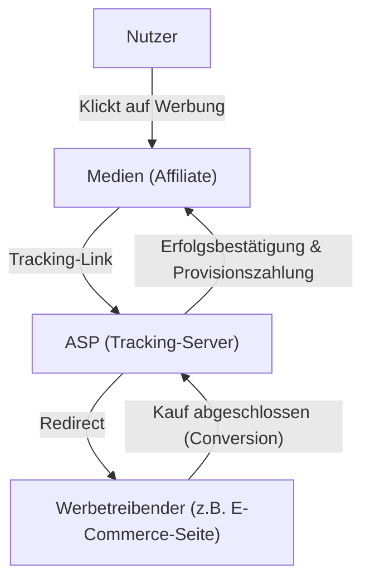
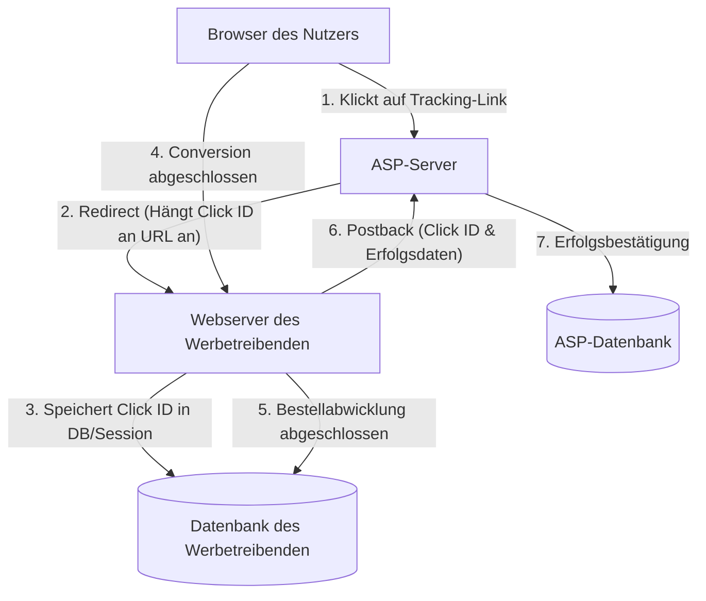

# So funktioniert Affiliate-Marketing: Die technische Seite von Tracking und Conversion

Im Internet-Werbemarkt spielt erfolgsbasierte Werbung (Affiliate-Marketing) eine äußerst wichtige Rolle. Da Werbetreibende (Merchants) nur für tatsächliche "Erfolge" wie Verkäufe oder Lead-Generierung eine Vergütung zahlen, ist dies weithin als kosteneffiziente Marketingmethode anerkannt.

Hinter den Kulissen arbeiten jedoch hochentwickelte und komplexe Tracking-Technologien, um das Nutzerverhalten genau zu verfolgen und zu bestimmen, über welche Medien (Affiliates) die Conversion erzielt wurde.

Dieser Artikel erklärt detailliert die technische Seite des Affiliate-Marketings: von der Rolle des ASP (Affiliate Service Provider), der den Kern des Affiliate-Systems bildet, über die Funktionsweise von Tracking-URLs mittels Redirects, clientseitige Tracking-Technologien mit Cookies und LocalStorage bis hin zum serverseitigen Tracking (S2S) als Maßnahme gegen das in letzter Zeit viel beachtete ITP (Intelligent Tracking Prevention).

## 1. Das Gesamtbild des Affiliate-Ökosystems

Das Affiliate-Marketing besteht hauptsächlich aus den folgenden vier Stakeholdern:

1. **Nutzer (Konsumenten)**: Betrachten Medien, klicken auf Werbung und kaufen/bestellen Produkte.
2. **Medien (Affiliates/Publisher)**: Stellen Produkte auf ihren eigenen Websites oder in sozialen Netzwerken vor und generieren Traffic.
3. **ASP (Affiliate Service Provider)**: Eine Plattform, die als Vermittler zwischen Werbetreibenden und Medien fungiert und Tracking, Leistungsmessung sowie die Verwaltung von Provisionszahlungen übernimmt.
4. **Werbetreibende (Merchants)**: Bieten Produkte oder Dienstleistungen an und zahlen Werbegebühren an den ASP.

In diesem Ökosystem ist der ASP der wichtigste technische Knotenpunkt.

Der ASP fungiert als riesige Dateninfrastruktur, die enormen Traffic in Echtzeit verarbeitet und mit Millisekunden-Präzision aufzeichnet, "wer" "welche Werbung" "wann" geklickt hat und "wann" dies zu "welchem Erfolg" geführt hat.

## 2. Grundlegender Mechanismus des Trackings (Clientseitig)

Das Tracking im Affiliate-Marketing war historisch stark auf clientseitige (Browser-)Technologien angewiesen. Hier zerlegen und erklären wir den herkömmlichen Standard-Tracking-Flow.

### 2.1. Tracking-URL und Redirect

Werbelinks, die Affiliates auf ihren Seiten platzieren, verweisen nicht direkt auf die Seite des Werbetreibenden. Es handelt sich immer um "Tracking-URLs", die zunächst über den Server des ASPs geleitet werden.

Beispiel: `https://click.example-asp.com/track?aff_id=12345&campaign_id=67890`

Wenn ein Nutzer auf diesen Link klickt, läuft folgender Prozess ab:

1. **Klick-Aufzeichnung**: Der Server des ASPs zeichnet IP-Adresse, User-Agent, Zeitstempel des zugreifenden Nutzers sowie die in der URL enthaltene Affiliate-ID (`aff_id`) und Kampagnen-ID (`campaign_id`) in der Datenbank auf.
2. **Generierung der Click ID**: Zur eindeutigen Identifizierung dieses Klick-Ereignisses wird eine "Click ID" generiert.
3. **Setzen eines Cookies**: Der ASP stellt ein Cookie seiner eigenen Domain (Third-Party-Cookie) für den Browser des Nutzers aus und speichert darin die Click ID.
4. **Redirect**: Sobald die Verarbeitung abgeschlossen ist, wird eine HTTP 302 (Found) oder 301 (Moved Permanently) Antwort gesendet und der Nutzer zur Landingpage (LP) des Werbetreibenden weitergeleitet. Zu diesem Zeitpunkt kann die Click ID auch als URL-Parameter angehängt werden.

### 2.2. Die Rolle von Cookie und LocalStorage

Nachdem der Nutzer die Seite des Werbetreibenden erreicht hat, surft er auf der Seite und führt schließlich eine "Conversion (CV)" wie den Kauf eines Produkts oder die Registrierung als Mitglied durch.

Beim herkömmlichen Tracking ist auf der Seite, auf der die Conversion abgeschlossen wird (Dankesseite), ein vom ASP bereitgestelltes JavaScript oder Bild-Tag, das sogenannte "Conversion-Tag (CV-Tag)", eingebettet.

Wenn das Conversion-Tag geladen wird, erfolgt folgende Verarbeitung:

- **Auslesen des Cookies**: Die Click ID wird aus dem im Browser gespeicherten ASP-Cookie ausgelesen.
- **Senden des Erfolgs**: Die ausgelesene Click ID und die Erfolgsdaten (Kaufbetrag, Bestellnummer usw.) werden an den Server des ASPs gesendet.

Als Vorbereitung auf den Ablauf oder das Löschen von Cookies war es zudem weit verbreitet, die Click ID als Backup in der Web Storage API von HTML5, wie `LocalStorage` oder `SessionStorage`, zu speichern.

## 3. Die Welle des Datenschutzes: Der Schock durch ITP

Clientseitiges Tracking ist zwar einfach zu implementieren, birgt jedoch ein großes Problem: das "übermäßige Tracking von Nutzern durch Third-Party-Cookies".

Aufgrund wachsender Datenschutzbedenken hinsichtlich der Sammlung von Browserverläufen über mehrere Websites hinweg ohne Wissen der Nutzer, begannen Browserhersteller starke Tracking-Beschränkungen einzuführen, allen voran **ITP (Intelligent Tracking Prevention)** im Safari-Browser von Apple.

### Die Auswirkungen von ITP auf das Affiliate-Marketing

Durch die Einführung von ITP erlitt die Affiliate-Branche folgende verheerende Auswirkungen:

1. **Vollständige Blockierung von Third-Party-Cookies**: Vom ASP ausgestellte Cookies (Cookies einer anderen Domain als der des Werbetreibenden) werden standardmäßig blockiert. Dadurch funktionierte das bisherige Tracking über CV-Tags nicht mehr.
2. **Verkürzung der Lebensdauer von First-Party-Cookies**: Selbst für Cookies, die von der Domain des Werbetreibenden ausgestellt wurden (First-Party-Cookies), wurde die Lebensdauer auf maximal 24 Stunden (oder 7 Tage) verkürzt, wenn sie über JavaScript (`document.cookie`) via URL-Parameter (z.B. `?click_id=...`) gesetzt wurden.
3. **Einschränkung des LocalStorage**: Ähnlich wie bei Cookies wurden auch der Zugriff auf und die Speicherdauer von Storage-Lösungen wie LocalStorage streng eingeschränkt.

Dies führte dazu, dass Conversions mit langen Vorlaufzeiten, wie z.B. "Nutzer klickt auf Werbung und kauft erst Tage später", nicht mehr gemessen werden konnten, was zu entgangenen Verdienstmöglichkeiten für Affiliates und einer Verschlechterung des ROI (Return on Investment) für Werbetreibende führte.

## 4. Serverseitiges Tracking (S2S) und der Aufstieg von Postback

Angesichts der Einschränkungen für die Datenspeicherung und Kommunikation auf der Clientseite (Browser) verlagert sich die Affiliate-Branche als Lösung zunehmend auf **serverseitiges Tracking (Server-to-Server / S2S)**, auch bekannt als **Postback-Methode**.

### S2S-Tracking-Architektur

Beim S2S-Tracking kommunizieren der Server des Werbetreibenden und der Server des ASPs direkt (über eine API), ohne auf Browser-Cookies oder JavaScript-Tags angewiesen zu sein.

1. **Klick und Redirect**: Wie bisher klickt der Nutzer auf den Link des ASPs. Der ASP generiert eine eindeuclease `Click ID` und übergibt sie beim Redirect als URL-Parameter an die Seite des Werbetreibenden (Beispiel: `https://shop.example.com/?click_id=abcde12345`).
2. **Serverseitige Speicherung**: Der Webserver des Werbetreibenden empfängt die Anfrage, extrahiert die `click_id` aus dem URL-Parameter und speichert sie in einer serverseitigen Session, Datenbank oder als echtes First-Party-Cookie mittels HTTP-Header (Set-Cookie). (Da kein JavaScript beteiligt ist, ist dies weniger anfällig für ITP-Einschränkungen).
3. **Postback bei Conversion**: Zu dem Zeitpunkt, an dem der Nutzer den Kauf abschließt und die Bestellverarbeitung auf dem Server des Werbetreibenden bestätigt wird, sendet der Server des Werbetreibenden direkt eine HTTP-Anfrage (GET oder POST) an den angegebenen Endpunkt (Postback URL) des ASPs.

### Vorteile des S2S-Trackings

- **Unbeeinflusst von ITP**: Da Browser-Einschränkungen umgangen werden können, ist eine zuverlässige Erfolgsmessung möglich.
- **Verbesserte Sicherheit**: Da CV-Tags nicht auf der Clientseite offengelegt werden, lässt sich die betrügerische Übermittlung von Erfolgen (Ad Fraud) leichter verhindern.
- **Höhere Datengenauigkeit**: Ladefehler von CV-Tags aufgrund von Netzwerkfehlern oder dem Verlassen des Browsers durch den Nutzer treten nicht auf.

### Herausforderungen des S2S-Trackings

Die größte Herausforderung ist die "technische Hürde bei der Einführung". Im Vergleich zur einfachen Einbettung von JavaScript-Tags in HTML erfordert es beim Werbetreibenden Systementwicklung (Parameterannahme, DB-Speicherung, API-Anfrageverarbeitung aus dem Backend), was die Implementierungskosten für kleine Werbetreibende in die Höhe treibt.

Daher haben ASPs in den letzten Jahren Initiativen ergriffen, um die Hürden für die Einführung von S2S-Tracking zu senken, indem sie Plugins für wichtige Plattformen wie Shopify und WordPress anbieten.

## 5. Tracking-Technologien der nächsten Generation

Zusätzlich zum S2S-Tracking entwickelt sich das gesamte Ökosystem weiter.

### 5.1. Fingerprinting (Alternative Identifikation)
Eine Technologie, die Nutzer eindeutig anhand einer Kombination von Browserumgebungen (User-Agent, Bildschirmauflösung, installierte Schriftarten, IP-Adresse usw.) identifiziert, ohne auf Cookies oder Parameter angewiesen zu sein. Aufgrund von Datenschutzbedenken werden jedoch auch hier auf Browserseite Gegenmaßnahmen ergriffen, sodass dies nicht mehr als zuverlässige Methode angesehen werden kann.

### 5.2. Data Clean Rooms und Server-Side GTM
Durch die Nutzung von "Data Clean Rooms", die von großen Plattformen angeboten werden, oder Server-Side Containern des Google Tag Manager (GTM) bauen Werbetreibende Mechanismen auf, um ihre First-Party-Daten sicher mit ASPs und Werbeplattformen zu verknüpfen. Dies ermöglicht eine fortschrittliche Attributionsanalyse unter Wahrung der Privatsphäre der Nutzer.

## Zusammenfassung

Hinter den Kulissen des Affiliate-Marketings prallen der technologische Fortschritt und die Welle des Datenschutzes heftig aufeinander, was zu tiefgreifenden Veränderungen bei den Tracking-Mechanismen führt.

Der Übergang vom einfachen Cookie-basierten clientseitigen Tracking zum robusteren und sichereren serverseitigen Tracking (S2S) ist mittlerweile ein unumgänglicher Weg. Werbetreibende, Affiliates und ASPs müssen sich stets über die neuesten technologischen Entwicklungen und gesetzlichen Bestimmungen (wie DSGVO und CCPA) auf dem Laufenden halten und Systeme aufbauen, die eine genaue Leistungsmessung ermöglichen und gleichzeitig die Privatsphäre der Nutzer respektieren.

Das Verständnis der Systemarchitektur erfolgsbasierter Werbung wird für alle Ingenieure und Vermarkter im Webmarketing-Bereich in Zukunft immer wichtiger werden.
