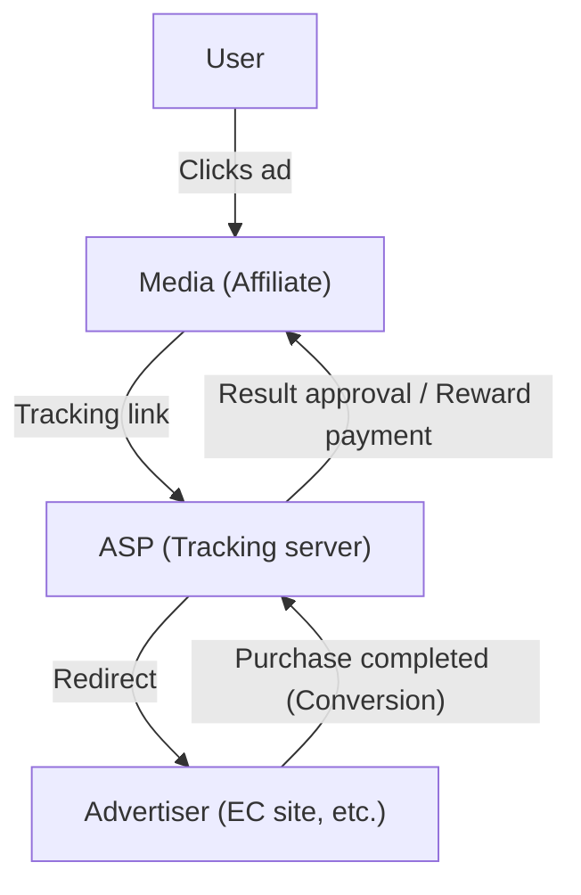
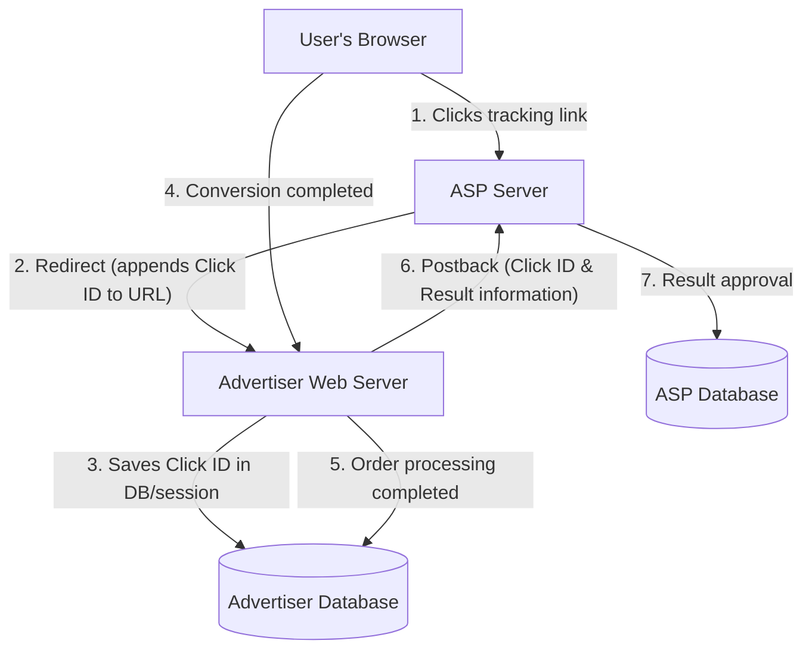

# The Mechanism of Affiliate Marketing: The Technical Backend of Tracking and Conversion

Performance-based advertising (affiliate marketing) plays an extremely important role in the internet advertising market. Because advertisers (merchants) only pay remuneration for "results" such as actual sales or lead generation, it is widely recognized as a highly cost-effective marketing method.

However, behind the scenes, highly sophisticated and complex tracking technologies are running to accurately track user behavior and determine which media (affiliate) referral generated the result.

This article thoroughly explains the technical backend of affiliate marketing, from the role of an ASP (Affiliate Service Provider) at the core of the affiliate system, to the mechanism of tracking URLs using redirects, client-side tracking technologies using cookies and LocalStorage, and server-side tracking (S2S) as a countermeasure to ITP (Intelligent Tracking Prevention), which has been gaining attention in recent years.

## 1. The Overall Picture of the Affiliate Ecosystem

The affiliate marketing ecosystem consists primarily of the following four stakeholders:

1. **Users (Consumers)**: Browse media and click on ads to purchase or sign up for products.
2. **Media (Affiliates/Publishers)**: Introduce products on their own websites and SNS to generate traffic.
3. **ASP (Affiliate Service Provider)**: A platform that mediates between advertisers and media, managing tracking, performance measurement, and reward payments.
4. **Advertisers (Merchants)**: Provide products and services, and pay advertising fees to ASPs.

In this ecosystem, the ASP serves as the central technical hub.

The ASP functions as a massive data foundation, processing enormous amounts of traffic in real-time, recording "who" clicked "which ad" and "when," and linking it to "when" and "what result" with millisecond precision.

## 2. Basic Mechanism of Tracking (Client-Side)

Affiliate tracking has historically relied heavily on client-side (browser) technology. Here, we break down and explain the traditional standard tracking flow.

### 2.1. Tracking URLs and Redirects

The ad links affiliates place on their sites do not point directly to the advertiser's site. They always function as a "tracking URL" that passes through the ASP's server first.

Example: `https://click.example-asp.com/track?aff_id=12345&campaign_id=67890`

When a user clicks this link, the following process occurs:

1. **Recording the Click**: The ASP's server records the accessing user's IP address, User-Agent, timestamp, as well as the affiliate ID (`aff_id`) and campaign ID (`campaign_id`) included in the URL into its database.
2. **Generating a Click ID**: A "Click ID" is generated to uniquely identify this click event.
3. **Assigning a Cookie**: The ASP issues a cookie from its own domain (third-party) to the user's browser and stores the Click ID in it.
4. **Redirect**: Once the processing is completed, it simultaneously returns an HTTP 302 (Found) or 301 (Moved Permanently) response, redirecting the user to the advertiser's landing page (LP). At this time, the Click ID may also be appended as a URL parameter.

### 2.2. The Role of Cookies and LocalStorage

Users who reach the advertiser's site navigate through it, ultimately leading to a "conversion (CV)" such as a product purchase or membership registration.

In traditional tracking, a JavaScript or image tag provided by the ASP, called a "conversion tag (CV tag)," is embedded on the page where the conversion is completed (the thank you page).

When the conversion tag loads, the following processes occur:

- **Reading the Cookie**: The Click ID is read from the ASP's cookie stored in the browser.
- **Sending the Result**: The read Click ID and result information (purchase amount, order number, etc.) are sent to the ASP's server.

Furthermore, to prepare for cookie expiration or deletion, the method of backing up the Click ID in `LocalStorage` or `SessionStorage`, which are HTML5 Web Storage APIs, has also been widely used.

## 3. The Wave of Privacy Protection: The Impact of ITP

While client-side tracking is easy to implement, it faced a major problem: "excessive user tracking via third-party cookies."

Due to growing privacy concerns over behavior histories being collected across multiple sites without the users' knowledge, browser vendors began introducing strict tracking limitations, spearheaded by **ITP (Intelligent Tracking Prevention)** built into Apple's Safari browser.

### The Impact of ITP on Affiliates

With the introduction of ITP, the affiliate industry suffered devastating impacts as follows:

1. **Complete Blockade of Third-Party Cookies**: Cookies issued by ASPs (cookies from a domain different from the advertiser's domain) began to be blocked by default. Consequently, traditional tracking using CV tags stopped working.
2. **Shortened Expiration of First-Party Cookies**: Even for cookies issued from the advertiser's domain (first-party cookies), if set via JavaScript (`document.cookie`) through URL parameters (e.g., `?click_id=...`), their expiration was shortened to a maximum of 24 hours (or 7 days).
3. **LocalStorage Restrictions**: Similar to cookies, access to and storage periods for storage mechanisms like LocalStorage also became strictly limited.

As a result, long lead-time results such as "a user purchasing several days after clicking an ad" could no longer be measured, leading to a loss of reward opportunities for affiliates and a deterioration of ROI (Return on Investment) for advertisers.

## 4. The Rise of Server-Side Tracking (S2S) and Postbacks

As data storage and communication on the client-side (browser) face restrictions, the affiliate industry is shifting towards **Server-to-Server (S2S) tracking**, also known as the **Postback method**, as a solution.

### The Architecture of S2S Tracking

In S2S tracking, the advertiser's server and the ASP's server communicate directly (via API), without relying on browser cookies or JavaScript tags.

1. **Click and Redirect**: Just like before, the user clicks the ASP's link. The ASP generates a unique `Click ID` and passes it to the advertiser's site as a URL parameter upon redirect (e.g., `https://shop.example.com/?click_id=abcde12345`).
2. **Server-Side Saving**: Upon receiving the request, the advertiser's web server extracts the `click_id` from the URL parameter and saves it in a server-side session, database, or as a true first-party cookie using an HTTP header (Set-Cookie) (thus being less susceptible to ITP restrictions since it does not involve JavaScript).
3. **Postback on Conversion**: At the exact timing when the user completes the purchase and the order processing is confirmed on the advertiser's server, an HTTP request (GET or POST) is sent directly from the advertiser's server to a designated endpoint of the ASP (Postback URL).

### Benefits of S2S Tracking

- **Unaffected by ITP**: By bypassing browser restrictions, reliable result measurement is possible.
- **Improved Security**: Since CV tags are not exposed on the client side, it becomes easier to prevent the transmission of fraudulent results (ad fraud).
- **Enhanced Data Accuracy**: Missed CV tag loadings due to network errors or user browser exits no longer occur.

### Challenges of S2S Tracking

The biggest challenge is the "technical hurdle of implementation." Compared to the task of merely pasting a traditional JavaScript tag into HTML, it requires system development on the advertiser's side (receiving parameters, DB saving, backend API request processing), meaning implementation costs become higher for small-scale advertisers.

Therefore, in recent years, ASPs have been making efforts to lower the barrier for adopting S2S tracking by providing plugins for major platforms like Shopify and WordPress.

## 5. Next-Generation Tracking Technologies

In addition to S2S tracking, further evolution continues across the entire ecosystem.

### 5.1. Fingerprinting (Alternative Identification)
This is a technology that uniquely identifies a user based on a combination of their browser environment (User-Agent, screen resolution, installed fonts, IP address, etc.) without relying on cookies or parameters. However, countermeasures are also advancing on the browser side from the perspective of privacy infringement, and it is ceasing to be a reliable method.

### 5.2. Data Clean Rooms and Server-Side GTM
By utilizing "data clean rooms" provided by major platformers or the server-side container of Google Tag Manager (GTM), advertisers are building systems to securely link their first-party data with ASPs and ad platforms. This enables sophisticated attribution analysis while protecting user privacy.

## Conclusion

Behind the scenes of affiliate marketing, the evolution of technology and the wave of privacy protection are clashing intensely, and tracking mechanisms are undergoing dramatic changes.

The transition from simple cookie-based client-side tracking to more robust and secure server-side tracking (S2S) is now an unavoidable path. Advertisers, affiliates, and ASPs must constantly catch up with the latest technological trends and legal regulations (such as GDPR and CCPA) and build systems that realize accurate result measurement while respecting user privacy.

Understanding the system architecture of performance-based advertising will become increasingly important for all engineers and marketers involved in web marketing.
