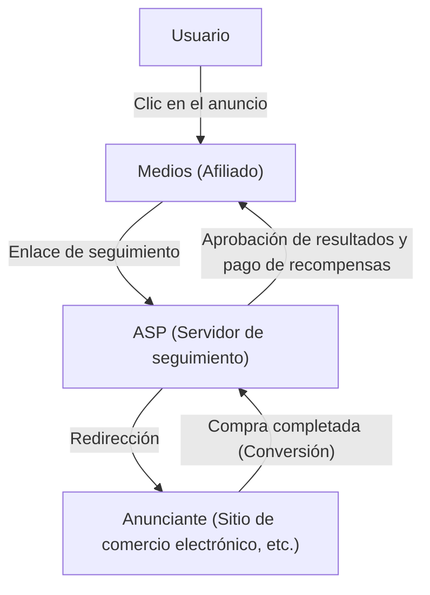
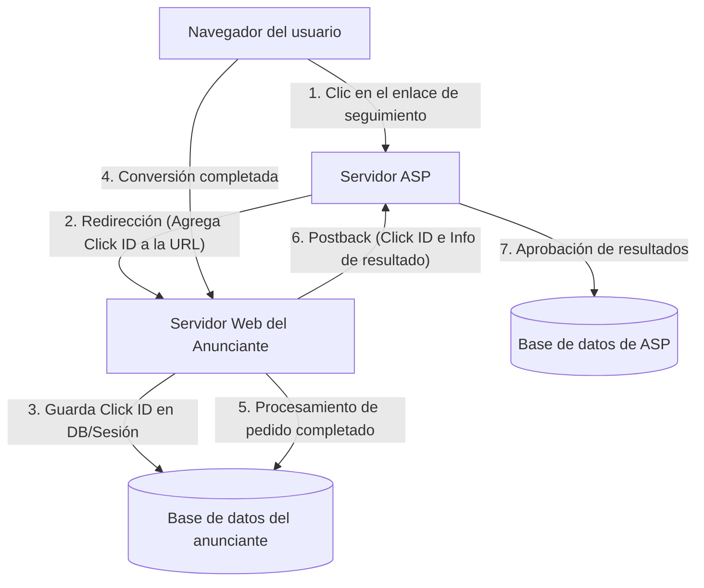

# Mecanismo del marketing de afiliación: El trasfondo técnico del seguimiento y la conversión

En el mercado de la publicidad en Internet, la publicidad basada en resultados (marketing de afiliación) desempeña un papel extremadamente importante. Dado que los anunciantes (comerciantes) solo pagan recompensas por "resultados" como ventas reales o la adquisición de clientes potenciales, es ampliamente reconocida como una estrategia de marketing muy rentable.

Sin embargo, detrás de esto, opera una tecnología de seguimiento (tracking) altamente sofisticada y compleja para rastrear con precisión el comportamiento del usuario y determinar qué introducción de medios (afiliados) generó el resultado.

En este artículo, explicaremos exhaustivamente el trasfondo técnico del sistema de afiliación, desde el papel de los ASP (Proveedores de Servicios de Afiliación) que son el núcleo del sistema, el mecanismo de las URL de seguimiento mediante redireccionamientos, la tecnología de seguimiento en el lado del cliente utilizando Cookies y LocalStorage, hasta el seguimiento en el lado del servidor (S2S) como medida contra la ITP (Prevención de Seguimiento Inteligente) que ha estado atrayendo atención recientemente.

## 1. El panorama general del ecosistema de afiliación

El marketing de afiliación se compone principalmente de las siguientes cuatro partes interesadas:

1. **Usuarios (Consumidores)**: Navegan por los medios, hacen clic en los anuncios y compran o se registran en productos.
2. **Medios (Afiliados/Editores)**: Presentan productos en sus propios sitios web y redes sociales, generando tráfico.
3. **ASP (Proveedores de Servicios de Afiliación)**: Plataformas que intermedian entre los anunciantes y los medios, gestionando el seguimiento, la medición de resultados y el pago de recompensas.
4. **Anunciantes (Comerciantes)**: Proporcionan productos o servicios y pagan gastos de publicidad al ASP.

En este ecosistema, el ASP es el núcleo técnico más importante.

El ASP funciona como una base de datos gigante que procesa un tráfico masivo en tiempo real y registra con precisión de milisegundos "quién" hizo clic en "qué anuncio" y "cuándo", y "cuándo" se vinculó con "qué resultado".

## 2. Mecanismo básico de seguimiento (Lado del cliente)

El seguimiento de afiliados ha dependido históricamente en gran medida de la tecnología del lado del cliente (navegador). Aquí, desglosaremos y explicaremos el flujo de seguimiento estándar convencional.

### 2.1. URL de seguimiento y redirección

Los enlaces publicitarios que los afiliados publican en sus sitios no apuntan directamente al sitio del anunciante. Siempre son "URL de seguimiento" que pasan a través del servidor del ASP una vez.

Ejemplo: `https://click.example-asp.com/track?aff_id=12345&campaign_id=67890`

Cuando un usuario hace clic en este enlace, ocurre el siguiente proceso:

1. **Registro de clics**: El servidor del ASP registra en su base de datos la dirección IP del usuario que accedió, el User-Agent, la marca de tiempo, así como el ID de afiliado (`aff_id`) y el ID de campaña (`campaign_id`) incluidos en la URL.
2. **Generación del ID de clic**: Se genera un "ID de clic (Click ID)" para identificar de forma única este evento de clic.
3. **Asignación de Cookie**: El ASP emite una Cookie de su propio dominio (terceros) al navegador del usuario y guarda el ID de clic en ella.
4. **Redirección**: Al mismo tiempo que se completa el proceso, se devuelve una respuesta HTTP 302 (Found) o 301 (Moved Permanently), redirigiendo al usuario a la página de destino (LP) del anunciante. En este momento, también se puede agregar el ID de clic como parámetro en la URL.

### 2.2. El papel de las Cookies y LocalStorage

Los usuarios que llegan al sitio del anunciante navegan por él y, finalmente, llegan a una "conversión (CV)", como la compra de un producto o el registro como miembro.

En el seguimiento convencional, se incrustan JavaScript o etiquetas de imagen llamadas "etiquetas de conversión (Etiquetas CV)" proporcionadas por el ASP en la página de finalización de la conversión (página de agradecimiento).

Cuando se carga la etiqueta de conversión, se lleva a cabo el siguiente proceso:

- **Lectura de Cookies**: Lee el ID de clic desde la Cookie del ASP almacenada en el navegador.
- **Envío de resultados**: Envía el ID de clic leído y la información de los resultados (monto de la compra, número de pedido, etc.) al servidor del ASP.

Además, en preparación para la expiración o eliminación de las Cookies, el método de guardar el ID de clic como respaldo en `LocalStorage` o `SessionStorage`, que son la API de Web Storage de HTML5, se ha utilizado ampliamente.

## 3. La ola de protección de la privacidad: El impacto de ITP

El seguimiento en el lado del cliente, aunque fácil de implementar, tenía un problema importante: "el seguimiento excesivo del usuario mediante Cookies de terceros".

A medida que aumentaba la preocupación por la privacidad debido a la recopilación del historial de comportamiento en múltiples sitios sin el conocimiento de los usuarios, cada proveedor de navegadores comenzó a introducir fuertes restricciones de seguimiento, empezando por la **ITP (Prevención de Seguimiento Inteligente)** instalada en el navegador Safari de Apple.

### El impacto de ITP en los afiliados

Con la introducción de la ITP, la industria de afiliados sufrió impactos devastadores como los siguientes:

1. **Bloqueo total de las Cookies de terceros**: Las Cookies emitidas por los ASP (Cookies de un dominio diferente al del anunciante) pasaron a ser bloqueadas de forma predeterminada. Como resultado, el seguimiento convencional mediante etiquetas CV dejó de funcionar.
2. **Acortamiento del vencimiento de las Cookies de origen**: Incluso en el caso de las Cookies emitidas desde el dominio del anunciante (Cookies de origen), si se establecían mediante JavaScript (`document.cookie`) a través de los parámetros de la URL (por ejemplo, `?click_id=...`), su período de validez se redujo a un máximo de 24 horas (o 7 días).
3. **Restricción de LocalStorage**: Al igual que con las Cookies, el acceso y el período de retención del almacenamiento, como LocalStorage, también estuvieron estrictamente limitados.

Debido a esto, se hizo imposible medir resultados con un tiempo de entrega largo, como "el usuario hace clic en el anuncio y compra varios días después", lo que llevó a la pérdida de oportunidades de ingresos para los afiliados y al deterioro del ROI (retorno de la inversión) para los anunciantes.

## 4. Seguimiento en el lado del servidor (S2S) y el auge del Postback

Mientras se restringe el almacenamiento de datos y la comunicación en el lado del cliente (navegador), la industria de la afiliación está avanzando hacia el **seguimiento en el lado del servidor (Server-to-Server / S2S)**, también conocido como el **método Postback**, como solución.

### Arquitectura de seguimiento S2S

En el seguimiento S2S, el servidor del anunciante y el servidor del ASP se comunican directamente (a través de una API), sin depender de las Cookies del navegador ni de las etiquetas de JavaScript.

1. **Clic y redirección**: Como antes, el usuario hace clic en el enlace del ASP. El ASP genera un `Click ID` único y lo pasa al sitio del anunciante como un parámetro de URL durante la redirección (Ejemplo: `https://shop.example.com/?click_id=abcde12345`).
2. **Almacenamiento en el lado del servidor**: El servidor web del anunciante recibe la solicitud, extrae el `click_id` de los parámetros de la URL y lo almacena como una verdadera Cookie de origen utilizando los encabezados HTTP (Set-Cookie), la sesión del lado del servidor o la base de datos (es menos susceptible a las restricciones de ITP porque no pasa por JavaScript).
3. **Postback en el momento de la conversión**: Cuando el usuario completa la compra y se confirma el procesamiento del pedido en el servidor del anunciante, se envía directamente una solicitud HTTP (GET o POST) desde el servidor del anunciante al endpoint designado (Postback URL) del ASP.

### Ventajas del seguimiento S2S

- **No le afecta la ITP**: Al evitar las restricciones del navegador, es posible una medición de resultados confiable.
- **Mejora en la seguridad**: Dado que la etiqueta CV no se expone en el lado del cliente, es más fácil prevenir la transmisión de resultados fraudulentos (fraude publicitario).
- **Mejora de la precisión de los datos**: No hay omisiones en la carga de la etiqueta CV debido a errores de red o abandono del navegador por parte del usuario.

### Desafíos del seguimiento S2S

El mayor desafío es el "obstáculo técnico de la implementación". En comparación con la tarea convencional de simplemente pegar etiquetas JavaScript en HTML, se requiere el desarrollo del sistema por parte del anunciante (recepción de parámetros, almacenamiento en base de datos, procesamiento de solicitudes API desde el backend), por lo que el coste de implementación es alto para los pequeños anunciantes.

Por lo tanto, en los últimos años, los ASP están trabajando para reducir el obstáculo para introducir el seguimiento S2S al proporcionar complementos para las principales plataformas como Shopify y WordPress.

## 5. Tecnología de seguimiento de próxima generación

Además del seguimiento S2S, todo el ecosistema continúa evolucionando aún más.

### 5.1. Huella digital (Identificación alternativa)
Es una tecnología que identifica de forma única a un usuario a partir de una combinación del entorno del navegador del usuario (User-Agent, resolución de pantalla, fuentes instaladas, dirección IP, etc.) sin depender de Cookies ni parámetros. Sin embargo, las medidas se están promoviendo en el lado de los navegadores desde la perspectiva de la invasión de la privacidad, y cada vez es menos probable que sea un método seguro.

### 5.2. Data Clean Room y GTM en el lado del servidor
Al utilizar las "Data Clean Room" proporcionadas por los principales plataformas y los contenedores del lado del servidor de Google Tag Manager (GTM), los anunciantes están construyendo un mecanismo para vincular de forma segura sus datos propios con los ASP y las plataformas publicitarias. Esto permite un análisis de atribución avanzado mientras se protege la privacidad del usuario.

## Resumen

Detrás del marketing de afiliación, la evolución de la tecnología y la ola de protección de la privacidad están chocando ferozmente, y el mecanismo de seguimiento está experimentando cambios drásticos.

La transición del simple seguimiento en el lado del cliente basado en Cookies a un seguimiento en el lado del servidor (S2S) más sólido y seguro es ahora un camino inevitable. Los anunciantes, los afiliados y los ASP deben ponerse al día constantemente con las últimas tendencias tecnológicas y las regulaciones legales (como GDPR y CCPA) para construir sistemas que proporcionen mediciones de resultados precisas mientras respetan la privacidad del usuario.

Comprender la arquitectura del sistema de publicidad basada en resultados será cada vez más importante para todos los ingenieros y especialistas en marketing involucrados en el marketing web en el futuro.
